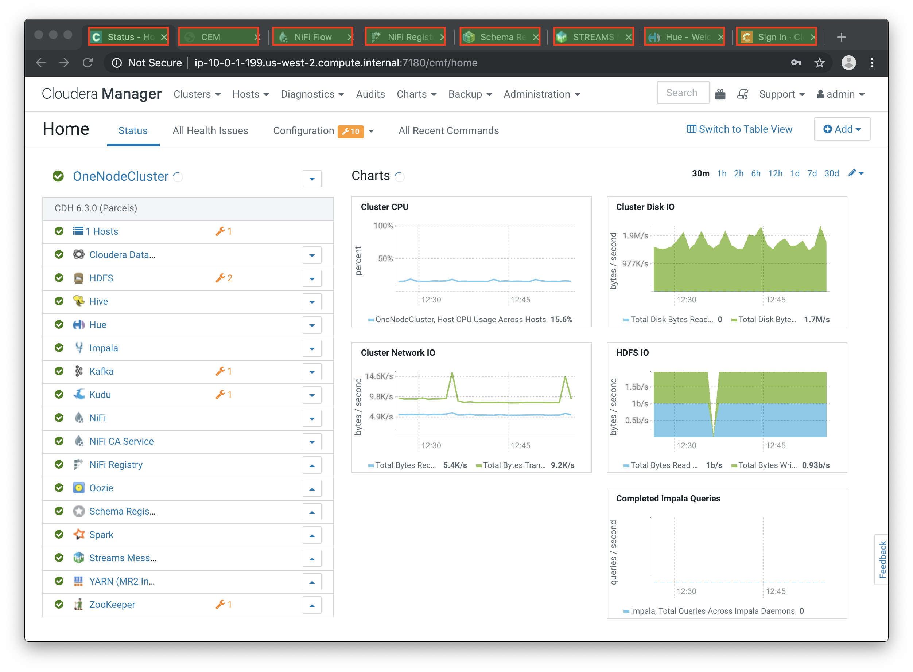

= CDF Workshop

== Introduction

In this hands-on workshop, you will build a full OT to IT workflow for an **IoT Predictive Maintenance** use case. Below is the architecture diagram, showing all the components you will setup over the lab exercises. While the diagram divides the components according to their location (factory, regional or datacenter level) in this workshop all such components will reside in one single host.

image::images/iot-architecture.png[width=800]

=== Before you start

* Everything is Case-Sensitive. 
* Check all your connections and spellings
* If you hit any problems like, for example, *MiNiFi Not Sending Messages*, check for clues in the <<troubleshooting>> section below.

=== Pre-requisites

* Laptop with a supported OS (Windows 7 not supported).
* A modern browser like Google Chrome or Firefox (IE not supported).

=== Connecting to your cluster

You instructor will give access to a registration link where you can request a cluster. You should have 2 addresses for you one-node cluster: the public DNS name and the public IP address. With those addresses you can test the following connectivity to your cluster:

. Ensure you can connect to the following service using your browser:
+
[%autowidth,options="header"]
|===
|Service|URL|Credentials
|Cloudera Manager|http://<public_dns>:7180/|`admin/admin`
|Edge Flow Manager|http://<public_dns>:10080/efm/ui/|
|NiFi|http://<public_dns>:8080/nifi/|
|NiFi Registry|http://<public_dns>:18080/nifi-registry/|
|Schema Registry|http://<public_dns>:7788/|
|SMM|http://<public_dns>:9991/|
|Hue|http://<public_dns>:8888/|`admin/admin`
|CDSW|http://cdsw.<public_IP>.nip.io/|`admin/supersecret1`
|===
. Login into *Cloudera Manager* and familiarize yourself with the services installed
. Login into *Hue*. As you are the first user to login into Hue, you are granted admin privileges. At this point, you won't need to do anything on Hue, but by logging in, CDH has created your HDFS user and folder, which you will need for the next lab.

Below a screenshot of Chrome open with 8 tabs, one for each service.

=== (Optional) SSH access

This access is not required for the workshop labs. You can skip this section.

SSH access is only required if you need to troubleshoot issues or want to poke around your clusters. The procedure to connect via SSH depends on the type of computer you're using:

==== SSH into the cluster from the Web UI

From the registration link, you can click on the link at the right side to connect to the cluster from a web based SSH client with the credential centos/supersecret1.

==== SSH into the cluster from Linux/Macos

From the registration link, download the PEM key required to access to your cluster with SSH. Run the following command:

----
chmod 400 workshop.pem
ssh -i workshop.pem centos@you-ip-address
----

==== SSH into the cluster from Windows

From the registration link, download the PEM key required to access to your cluster with SSH. We will use link:https://www.putty.org/[PuTTY] to connect to the cluster. However, Putty doesn't accept PEM key. Follow these instructions to convert your PEM key into a PPK key and connect to the cluster

Convert your key with *PuTTYgen*:

. Use PuTTYgen to convert .PEM file to .PPK file.
. Start PuTTYgen and select “Load”
. Select your .PEM file.
. Putty will convert the .PEM format to .PPK format.
. Select “Save Private Key” A passphrase is not required but can be used if additional security is required.

Connect with *PuTTY*:

. Launch PuTTY and enter the host IP address.
. Navigate to Connection/SSH/Auth
. Click “Browse” and select the .PPK file you exported from PuTTYgen.
. Click “Open.”

== Labs

Time to start working and see some interesting stuff!
Pick your lab and let's get started!

* link:streaming.adoc[From Edge to Streams Processing]
* link:spark_analytics.adoc[Spark and Fast Analytics with Kudu]
* link:datascience.adoc[CDSW Experiments and Models]

== Resources
  
* link:https://medium.freecodecamp.org/building-an-iiot-system-using-apache-nifi-mqtt-and-raspberry-pi-ce1d6ed565bc[Original blog by Abdelkrim Hadjidj]

* This workshop is based on the following work by Fabio Ghirardello:
** https://github.com/fabiog1901/IoT-predictive-maintenance
** https://github.com/fabiog1901/OneNodeCDHCluster

* link:https://www.cloudera.com/documentation.html[Cloudera Documentation]

[[troubleshooting, Troubleshooting]]
== Troubleshooting

==== General

* *Everything is Case-Sensitive*.
* Check all your connections and spellings

==== MiNiFi Not Sending Messages

* Make sure you pick HTTP, not RAW, in Cloud Connection to NiFi
* Make sure there are *no spaces before or after* Destination ID, URL, Names, Topics, Brokers, etc...
* Make sure there are *no spaces anywhere*!
* Everything is *Case-Sensitive*. For example, the bucket name in NiFi Registry is `IoT`, not `iot`.
* Check /opt/cloudera/cem/minifi/logs/minifi-app.log if you can't find an issue
* You must have HDFS User Created via HUE, Go there First

==== CEM doesn't pick up new NARs

. Delete the agent manifest manually using the EFM API:

. Verify each class has the same agent manifest ID:
+
[source]
----
http://hostname:10080/efm/api/agent-classes
[{"name":"iot1","agentManifests":["agent-manifest-id"]},{"name":"iot4","agentManifests":["agent-manifest-id"]}]
----

. Confirm the manifest doesn't have the NAR you installed
+
[source]
----
http://hostname:10080/efm/api/agent-manifests?class=iot4
[{"identifier":"agent-manifest-id","agentType":"minifi-java","version":"1","buildInfo":{"timestamp":1556628651811,"compiler":"JDK 8"},"bundles":[{"group":"default","artifact":"system","version":"unversioned","componentManifest":{"controllerServices":[],"processors":
----

. Call the API endpoint:
+
[source]
----
http://hostname:10080/efm/swagger/
----

. Hit the `DELETE - Delete the agent manifest specified by id` button, and in the id field, enter `agent-manifest-id

