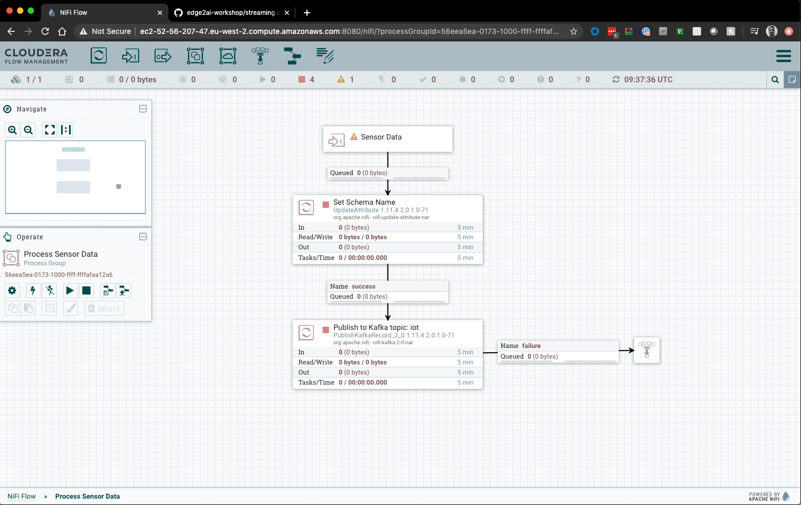

= EDGE2AI Workshop

== Introduction

In this workshop, you will build a full OT to IT workflow for an **IoT Predictive Maintenance** use case. Below is the architecture diagram, showing all the components you will setup over the next 8 lab exercises. While the diagram divides the components according to their location (factory, regional or datacenter level) in this workshop all such components will reside in one single host.

image::images/iot.jpg[width=800]

===== Labs summary:

* *<<lab_1>>* - On the Gateway host, run a simulator to send IoT sensors data to the MQTT broker.
* *<<lab_2>>* - On the Gateway host, configure and start **MiNiFi**, which will read from the MQTT broker, filter and forward to the **NiFi** cluster.
* *<<lab_3>>* - Create the MiNiFi flow on the Edge Flow Manager and publish it for the MiNiFi agent to start sending data to the NiFi cluster.
* *<<lab_4>>* - On Schema Registry, register the schema describing the data generated by the IoT sensors.
* *<<lab_5>>* - On the NiFi cluster, prepare the data and send it to the **Kafka** cluster.
* *<<lab_6>>* - On the *Streams Messaging Manager (SMM)* Web UI, monitor the Kafka cluster and confirm data is being ingested correctly.
* *<<lab_7>>* - On the CDH cluster, process each record using **Spark Streaming**, calling the **Model endpoint** and save results to **Kudu**.
* *<<lab_8>>* - On the CDH cluster, pull reports on upcoming predicted machine failures using **Impala** and **Hue**.
* *<<lab_9>>* - On the **CDSW** cluster, train your model with the **Experiment** feature.
* *<<lab_10>>* - On the **CDSW** cluster, deploy the model into production with the **Model** feature.

===== Pre-requisites

* Laptop with a supported OS (Windows 7 not supported).
* Ability to SSH into remote hosts from Windows or Mac. For Windows machines, install Putty or even better link:https://docs.microsoft.com/en-us/windows-server/administration/openssh/openssh_install_firstuse[install OpenSSH for PowerShell].
* A modern browser like Google Chrome (IE not supported).

===== Connecting to your cluster

You should have 2 addresses for you one-node cluster: the public DNS name and the public IP address. With those addresses you can test the following connectivity to your cluster:

. Ensure you can SSH into the cluster (using either the DNS name or IP address)
. Ensure you can connect to the following service using your browser:
+
[%autowidth,options="header"]
|===
|Service|URL|Credentials
|Cloudera Manager|http://<public_dns>:7180/|admin/admin
|Edge Flow Manager|http://<public_dns>:10080/efm/ui/|
|NiFi|http://<public_dns>:8080/nifi/|
|NiFi Registry|http://<public_dns>:18080/nifi-registry/|
|Schema Registry|http://<public_dns>:7788/|
|SMM|http://<public_dns>:9991/|
|Hue|http://<public_dns>:8888/|
|CDSW|http://cdsw.<public_IP>.nip.io/|admin/supersecret1
|===
. Login into *Cloudera Manager* and familiarize yourself with the services installed
. Login into *Hue*. As you are the first user to login into Hue, you are granted admin privileges. At this point, you won't need to do anything on Hue, but by logging in, CDH has created your HDFS user and folder, which you will need for the next lab.
. When you log into *CDSW* for the first time, click on "*Sign Up for a New Account*" and create your own account.

Ensure you remember the username and password, as you will use these throughout this workshop.

Below a screenshot of Chrome open with 8 tabs, one for each service.

image::images/browser.png[width=800]

[[lab_1, Lab 1]]
== Lab 1 - Gateway host: setup machine sensors simulator and MQTT broker

In this lab you will run a simple Python script that simulates IoT sensor data from some hypothetical machines, and send the data to a MQTT broker (link:https://mosquitto.org/[mosquitto]). The gateway host is connected to many and different type of sensors, but they generally all share the same transport protocol, `mqtt`.

. SSH into the VM, then install required libs and start the MQTT broker:
+
[source,shell]
----
sudo su -
yum install -y mosquitto
pip install paho-mqtt
systemctl enable mosquitto
systemctl start mosquitto
----

. Now clone this repo, then run the simulator to send sensor data to the MQTT broker:
+
[source,shell]
----
cd ~
git clone https://github.com/asdaraujo/edge2ai-workshop.git
mv edge2ai-workshop/mqtt.* ~
python mqtt.iot_simulator.py mqtt.iot.config
----

. You should see an output similar to the below:
+
[source,shell]
----
iot: {"sensor_id": 48, "sensor_ts": 1556758787735011, "sensor_0": 2, "sensor_1": 14, "sensor_2": 5, "sensor_3": 43, "sensor_4": 34, "sensor_5": 97, "sensor_6": 29, "sensor_7": 121, "sensor_8": 5, "sensor_9": 2, "sensor_10": 5}
iot: {"sensor_id": 24, "sensor_ts": 1556758797738580, "sensor_0": 1, "sensor_1": 9, "sensor_2": 5, "sensor_3": 46, "sensor_4": 39, "sensor_5": 87, "sensor_6": 51, "sensor_7": 142, "sensor_8": 47, "sensor_9": 4, "sensor_10": 8}
iot: {"sensor_id": 70, "sensor_ts": 1556758807751841, "sensor_0": 2, "sensor_1": 1, "sensor_2": 1, "sensor_3": 48, "sensor_4": 8, "sensor_5": 70, "sensor_6": 15, "sensor_7": 103, "sensor_8": 22, "sensor_9": 1, "sensor_10": 2}
----

. You can stop the simulator now, with Ctrl+C.

[[lab_2, Lab 2]]
== Lab 2 - Gateway host: configure and run MiNiFi

MiNiFi is installed in the gateway host. In this lab you will configure and run MiNiFi to read from the MQTT broker and forward to the NiFi cluster, but it's only in the next lab that you will provide the flow to execute.

. Download the NiFi MQTT Processor to read from the broker:
+
[source,shell]
----
cd ~
wget http://central.maven.org/maven2/org/apache/nifi/nifi-mqtt-nar/1.8.0/nifi-mqtt-nar-1.8.0.nar -P /opt/cloudera/cem/minifi/lib
chown root:root /opt/cloudera/cem/minifi/lib/nifi-mqtt-nar-1.8.0.nar
chmod 660 /opt/cloudera/cem/minifi/lib/nifi-mqtt-nar-1.8.0.nar
----

. You can now start the MiNiFi agent:
+
[source,shell]
----
systemctl start minifi
----

. You might want to check the logs to confirm all is good:
+
[source,shell]
----
cat /opt/cloudera/cem/minifi/logs/minifi-app.log
----
+
If the MQTT Processors loaded successfully you should see them listed in the "Processor Type" section of the log:
+
[source,shell]
----
  === Processor Type ===
  ...
  org.apache.nifi.processors.mqtt.ConsumeMQTT
    org.apache.nifi:nifi-mqtt-nar:1.8.0 || ./work/nar/extensions/nifi-mqtt-nar-1.8.0.nar-unpacked
  ...
  org.apache.nifi.processors.mqtt.PublishMQTT
    org.apache.nifi:nifi-mqtt-nar:1.8.0 || ./work/nar/extensions/nifi-mqtt-nar-1.8.0.nar-unpacked
  ...
----

[[lab_3, Lab3]]
== Lab 3 - Configuring Edge Flow Management

Cloudera Edge Flow Management gives you a visual overview of all MiNiFi agents in your environment, and allows you to update the flow configuration for each one, with versioning control thanks to the **NiFi Registry** integration. In this lab, you will create the MiNiFi flow and publish it for the MiNiFi agent to pick it up.

. Open the EFM Web UI at http://<public_dns>:10080/efm/ui/. Ensure you see your minifi agent's heartbeat messages in the **Events Monitor**.
+
image::images/cem_heartbeats.png[width=800]

. You can then select the **Flow Designer** tab (image:images/flow_designer_icon.png[width=30]). To build a dataflow, select the desired class (`iot-1`) from the table and click OPEN.  Alternatively, you can double-click on the desired class.

. Add a _ConsumeMQTT_ Processor to the canvas, double-click it and configure it with below settings:
+
[source]
----
Broker URI: tcp://edge2ai-1.dim.local:1883
Client ID: minifi-iot
Topic Filter: iot/#
Max Queue Size: 60
----
+
image::images/add_consumer_mqtt.png[width=800]

. Add a _Remote Process Group_ (RPG) to the canvas and configure it as follows:
+
[source]
----
URL = http://edge2ai-1.dim.local:8080/nifi
----
+
image::images/add_rpg.png[width=800]

. At this point you need to connect the ConsumerMQTT processor to the RPG. For this you first need the ID of the NiFi entry port in the RPG. Open the NiFi Web UI at `http://<public_dns>:8080/nifi/` and add an _Input Port_ to the canvas. Call it something like "from Gateway". Double-click the _Input Port_ and copy the ID of the input port, as you will soon need it.
+
image::images/add_input_port.png[width=800]

. To terminate the NiFI _Input Port_ you can, for now, add a _Funnel_ to the canvas and setup a connection from the Input Port to it.
+
image::images/add_funnel.png[width=600]

. Right-click on the Input Port and start it

. Back to the Flow Designer, connect the ConsumeMQTT processor to the RPG. The connection requires an ID and you can paste here the ID you copied from the Input Port.
+
image::images/connect_to_rpg.png[width=800]

. The Flow is now complete, but before publishing it, create the Bucket in the _NiFi Registry_ so that all versions of your flows are stored for review and audit. Open the NiFi Registry at `http://<public_dns>:18080/nifi-registry`, click on the spanner icon on the top-right corner on and create a bucket called `IoT`.
+
image::images/create_bucket.png[width=800]

. You can now publish the flow for the MiNiFi agent to automatically pick up.
+
image::images/publish_flow.png[width=800]

. If successful, you will see the Flow details in the NiFi Registry.
+
image::images/flow_in_nifi_registry.png[width=800]

. At this point, you can test the edge flow up until NiFi. Start the simulator again and confirm you can see the messages queued in NiFi.
+
[source]
----
python mqtt.iot_simulator.py mqtt.iot.config
----
+
image::images/running_simulator.png[width=800]
+
image::images/queued_events.png[width=300]

[[lab_4, Lab 4]]
== Lab 4 - Registering our schema in Schema Registry

The data produced by the temperature sensors is described by the schema in file `link:https://raw.githubusercontent.com/asdaraujo/edge2ai-workshop/master/sensor.avsc[sensor.avsc]`. In this lab we will register this schema in Schema Registry so that our flows in NiFi can refer to schema using an unified service. This will also allow us to evolve the schema in the future, if needed, keeping older versions under version control, so that existing flows and flowfiles will continue to work.

. Download the following file to your local computer:
+
[source]
----
https://raw.githubusercontent.com/asdaraujo/edge2ai-workshop/master/sensor.avsc
----

. In the Schema Registry Web UI, click the `+` sign to register a new schema with the following properties:
+
[source]
----
Name: SensorReading
Description: Schema for the data generated by the IoT sensors
Type: Avro schema provider
Schema Group: Kafka
Compatibility: Backward
Evolve: checked
----

. Select your local copy of the `sensor.avsc` file for the *Schema Text* field and save the schema
+
image::images/register_schema.png[width=800]

[[lab_5, Lab 5]]
== Lab 5 - Configuring the NiFi flow and pushing data to Kafka

In this lab, you will create a NiFi flow to receive the data from all gateways and push it to **Kafka**.

=== Creating a Process Group

Before we start building our flow, let's create a Process Group to help organizing the flows in the NiFi canvas and also to enable flow version control.

. Open the NiFi Web UI, create a new Process Group and name it something like *Process Sensor Data*.
+
image::images/create_pgroup.png[width=800]

. We want to be able to version control the flows we will add to the Process Group. In order to do that, we first need to connect NiFi to the *NiFi Registry*. On the NiFi global menu, click on "Controller Services", navigate to the "Registry Clients" tab and add a Registry client with the following URL:
+
----
Name: NiFi Registry
URL: http://edge2ai-1.dim.local:18080
----
+
image::images/global_controller_settings.png[width=800]
+
image::images/add_registry_client.png[width=800]

. On the *NiFi Registry* Web UI, add another bucket for storing the Sensor flow we're about to build'. Call it `SensorFlows`:
+
image::images/sensor_flows_bucket.png[width=800]

. Back on the *NiFi* Web UI, to enable version control for the Process Group, right-click on it and select *Version > Start version control* and enter the details below. Once you complete, a image:images/version_control_tick.png[width=20] will appear on the Process Group, indicating that version control is now enabled for it.
+
[source]
----
Registry: NiFi Registry
Bucket: SensorFlows
Flow Name: SensorProcessGroup
----

. Let's also enable processors in this Process Group to use schemas stored in Schema Registry. Right-click on the Process Group, select *Configure* and navigate to the *Controller Services* tab. Click the *`+`* icon, add a *HortonworksSchemaRegistry* service and configure it with the following URL:
+
[source]
----
URL: http://edge2ai-1.dim.local:7788/api/v1
----
+
image::images/added_hwx_sr_service.png[width=800]

. Still on the *Controller Services* screen, let's add two additional services to handle the reading and writing of JSON records. Add the following two services:
** *`JsonTreeReader`*, with the following properties:
+
[source]
----
Schema Access Strategy: Use 'Schema Name' Property
Schema Registry: HortonworksSchemaRegistry
Schema Name: SensorReading
Schema Version: 1
----

** *`JsonRecordSetWriter`*, with the following properties:
+
[source]
----
Schema Write Strategy: HWX Content-Encoded Schema Reference
Schema Access Strategy: Inherit Record Schema
Schema Registry: HortonworksSchemaRegistry
----

. Start all the 3 services you just created (click on the _lightning bolt_ icons)
+
image::images/controller_services.png[width=800]

=== Creating the flow

. Double-click on the newly created process group to expand it.

. Inside the process group, add a new _Input Port_ and name it "Sensor Data"

. Add a _PublishKafkaRecord_2.0_ processor and configure it as follows:
+
[source]
----
Kafka Brokers: edge2ai-1.dim.local:9092
Topic Name: iot
Record Reader: JsonTreeReader
Record Writer: JsonRecordSetWriter
Use Transactions: false
----

. Connect the Input Port to the PublishKafkaRecord processor.

. Add a new _Funnel_ to the canvas and connect the PublishKafkaRecord processor to it. When the "Create connection" dialog appears, select "*success*" and click "Add".
+
image::images/add_kafka_success_connection.png[width=600]

. Double-click the PublishKafkaRecord processor, navigate to the *Settings* tab and  check "*failure*" under the *Automatically Terminate Relationships* section to terminate here records that were not successfully sent to Kafka.
+
image::images/terminate_failure.png[width=800]

. Start the PublishKafkaRecord processor and the Input Port. Your canvas should now look like the one below:
+

. The only thing that remains to be configured now is to finally connect the "*from Gateway*" Input Port to the flow in the "*Processor Sensor Data*" group. To do that, first go back to the root canvas by clicking on the *NiFi Flow* link on the status bar.
+
image::images/breadcrumbs.png[width=400]

. Connect the Input Port to the *Process Sensor Data* Process Group by dragging the destination of the current connection from the funnel to the Process Group. When prompted, ensure the "To input" fields is set to the *Sensor data* Input Port.
+
image::images/connect_input.png[width=800]
+
image::images/to_input.png[width=800]

. Refresh the screen (`Ctrl+R` on Linux/Windows; `Cmd+R` on Mac) and you should see that the records that were queued on the "*from Gateway*" Input Port disappeared. They flowed into the *Process Sensor Data* flow. If you expand the Process Group you will see those records on the "success" output queue after they were processed by the KafkaPublishRecord processor.
+
image::images/kafka_success.png[width=800]
+
At this point, the messages are already in the Kafka topic. You can add more processors as needed to process, split, duplicate or re-route your FlowFiles to all other destinations and processors.

. To complete this Lab, let's commit and version the work we've just done. Go back to the NiFi root canvas, clicking on the "Nifi Flow" breadcrumb. Right-click on the *Process Sensor Data* Process Group and select *Version > Commit local changes*. Enter a descriptive comment and save.

[[lab_6, Lab 6]]
== Lab 6 - Use SMM to confirm that the data is flowing correctly

Now that our NiFi flow is pushing data to Kafka, it would be good to have a confirmation that everything is running as expected. In this lab you will use Streams Messaging Manager (SMM) to check and monitor Kafka.

. Start the simulator again and confirm you can see the messages queued in NiFi. Leave it running.
+
[source]
----
python mqtt.iot_simulator.py mqtt.iot.config
----

. Go to the Stream Messaging Manager (SMM) Web UI and familiarize yourself with the options there.
+
image::images/smm.png[width=800]

. Notice the filters at the top of the screen. Click on the *Topics* filter and select only the *`iot`*. All the internal `__smm*` topics should now be hidden.

. You are able to see all the *producers* and *consumers* that are writing to and reading from the `iot` topic, respectively. Since we haven't implemented any consumers yet, the consumer list should be empty.

. Click on the topic to explore its details. You can see more details, metrics and the break down per partition.
+
image::images/producers.png[width=800]

. Click on the *EXPLORE* link to visualize the data in a particular partition. Confirm that there's data in the Kafka topic and it looks like the JSON produced by the sensor simulator.
+
image::images/explore_partition.png[width=800]

[[lab_7, Lab 7]]
== Lab 7 - Use Spark to call the CDSW model endpoint and save to Kudu

Spark Streaming is a processing framework for (near) real-time data. In this lab, you will use Spark to consume Kafka messages which contains the IoT data from the machine, and call the model API endpoint to predict whether, with those IoT values the machine sent, the machine is likely to break. Then save the results to Kudu for fast analytics.

. First, create the Kudu table. Login into Hue, and in the Impala Query, run this statement:
+
[source,sql]
----
CREATE TABLE sensors
(
 sensor_id INT,
 sensor_ts TIMESTAMP, 
 sensor_0 DOUBLE,
 sensor_1 DOUBLE,
 sensor_2 DOUBLE,
 sensor_3 DOUBLE,
 sensor_4 DOUBLE,
 sensor_5 DOUBLE,
 sensor_6 DOUBLE,
 sensor_7 DOUBLE,
 sensor_8 DOUBLE,
 sensor_9 DOUBLE,
 sensor_10 DOUBLE,
 sensor_11 DOUBLE,
 is_healthy INT,
 PRIMARY KEY (sensor_ID, sensor_ts)
)
PARTITION BY HASH PARTITIONS 16
STORED AS KUDU
TBLPROPERTIES ('kudu.num_tablet_replicas' = '1');
----
+
image::images/image28.png[width=800]

. To configure and run the Spark Streaming job, you will need a CDSW Access Key to connect to the model endpoint that has been deployed there. To get the Access Key, go to the CDSW Web UI and click on *Models > Iot Prediction Model > Settings*. Copy the Access Key.
+
image::images/model_access_key.png[width=800]

. Open a second Terminal and SSH into the VM. The first is running the sensor data simulator, so you can't use it.
+
[source,shell]
----
sudo su -
ACCESS_KEY=<put here your cdsw model access key>
PUBLIC_IP=$(curl https://api.ipify.org/)
mv ~/edge2ai-workshop/spark.iot.py ~
sed -i "s/YourHostname/$(hostname -f)/" spark.iot.py
sed -i "s/YourCDSWDomain/cdsw.$PUBLIC_IP.nip.io/" spark.iot.py
sed -i "s/YourAccessKey/$ACCESS_KEY/" spark.iot.py
wget http://central.maven.org/maven2/org/apache/kudu/kudu-spark2_2.11/1.9.0/kudu-spark2_2.11-1.9.0.jar

wget https://raw.githubusercontent.com/swordsmanliu/SparkStreamingHbase/master/lib/spark-core_2.11-1.5.2.logging.jar

rm -rf ~/.m2 ~/.ivy2/
spark-submit \
  --master local[2] \
  --jars kudu-spark2_2.11-1.9.0.jar,spark-core_2.11-1.5.2.logging.jar \
  --packages org.apache.spark:spark-streaming-kafka_2.11:1.6.3 \
  spark.iot.py
----
+

. Spark Streaming will flood your screen with log messages, however, at a 5 seconds interval, you should be able to spot a table: these are the messages that were consumed from Kafka and processed by Spark. You can configure Spark for a smaller time window, however, for this exercise 5 seconds is sufficient.
+
image::images/image20.png[width=800]

[[lab_8, Lab 8]]
== Lab 8 - Fast analytics on fast data with Kudu and Impala

In this lab, you will run some SQL queries using the Impala engine. You can run a report to inform you which machines are likely to break in the near future.

. Login into Hue, and run the following statement in the Impala Query:
+
[source,sql]
----
select sensor_id, sensor_ts from sensors where is_healthy = 0;
----

. Run a few times a SQL statement to count all rows in the table to confirm the latest inserts are always picked up by Impala. This allows you to build real-time reports for fast action.
+
image::images/image5.png[width=800]

[[lab_9, Lab 9]]
== Lab 7 - CDSW: Train the model

In this and the following lab, you will wear the hat of a Data Scientist. You will write the model code, train it several times and finally deploy the model to Production. All within 30 minutes!

=== Configure CDSW

. Open CDSW Web UI and click on *sign up for a new account*. As you're the first user to login into CDSW, you are granted admin privileges.
+
image::images/image2.png[width=800]

. Navigate to the CDSW **Admin** page to fine tune the environment:
.. in the **Engines** tab, add in _Engines Profiles_ a new engine (docker image) with 2 vCPUs and 4 GB RAM, while deleting the default engine.
.. add the following in _Environmental Variables_:
+
[source]
----
HADOOP_CONF_DIR=/etc/hadoop/conf/
----
+
image::images/image16.png[width=800]

=== Create the project

. Return to the main page and click on **New Project**, using this GitHub project as the source: `https://github.com/asdaraujo/edge2ai-workshop`
+
image::images/image8.png[width=800]

. Now that your project has been created, click on **Open Workbench** and start a Python3 Session
+
image::images/image19.png[width=800]

. Once the Engine is ready, run the following command to install some required libraries:
+
[source]
----
!pip3 install --upgrade pip scikit-learn
----

. The project comes with a historical dataset. Copy this dataset into HDFS:
+
[source]
----
!hdfs dfs -put data/historical_iot.txt /user/$HADOOP_USER_NAME
----
+
image::images/image22.png[width=800]

. You're now ready to run the Experiment to train the model on your historical data.

. You can stop the Engine at this point.

=== Examine `cdsw.iot_exp.py`

Open the file `cdsw.iot_exp.py`. This is a python program that builds a model to predict machine failure (the likelihood that this machine is going to fail). There is a dataset available on hdfs with customer data, including a failure indicator field.

The program is going to build a failure prediction model using the Random Forest algorithm. Random forests are ensembles of decision trees. Random forests are one of the most successful machine learning models for classification and regression. They combine many decision trees in order to reduce the risk of overfitting. Like decision trees, random forests handle categorical features, extend to the multiclass classification setting, do not require feature scaling, and are able to capture non-linearities and feature interactions.

`spark.mllib` supports random forests for binary and multiclass classification and for regression, using both continuous and categorical features. `spark.mllib` implements random forests using the existing decision tree implementation. Please see the decision tree guide for more information on trees.

The Random Forest algorithm expects a couple of parameters:

* *numTrees*: Number of trees in the forest.
+
Increasing the number of trees will decrease the variance in predictions, improving the model’s test-time accuracy. Training time increases roughly linearly in the number of trees.

* *maxDepth*: Maximum depth of each tree in the forest.
+
Increasing the depth makes the model more expressive and powerful. However, deep trees take longer to train and are also more prone to overfitting. In general, it is acceptable to train deeper trees when using random forests than when using a single decision tree. One tree is more likely to overfit than a random forest (because of the variance reduction from averaging multiple trees in the forest).

In the `cdsw.iot_exp.py` program, these parameters can be passed to the program at runtime, to these python variables:

[source,python]
----
param_numTrees = int(sys.argv[1])
param_maxDepth = int(sys.argv[2])
----

Also note the quality indicator for the Random Forest model, are written back to the Data Science Workbench repository:

[source,python]
----
cdsw.track_metric("auroc", auroc)
cdsw.track_metric("ap", ap)
----

These indicators will show up later in the **Experiments** dashboard.

=== Run the experiment for the first time

. Now, run the experiment using the following parameters:
+
[source,python]
----
numTrees = 20 numDepth = 20
----

. From the menu, select `Run -> Run Experiments...`. Now, in the background, the Data Science Workbench environment will spin up a new docker container, where this program will run.
+
image::images/image23.png[width=800]

. Go back to the **Projects** page in CDSW, and hit the **Experiments** button.

. If the Status indicates ‘Running’, you have to wait till the run is completed. In case the status is ‘Build Failed’ or ‘Failed’, check the log information. This is accessible by clicking on the run number of your experiments. There you can find the session log, as well as the build information.
+
image::images/image15.png[width=800]

. In case your status indicates ‘Success’, you should be able to see the auroc (Area Under the Curve) model quality indicator. It might be that this value is hidden by the CDSW user interface. In that case, click on the ‘3 metrics’ links, and select the auroc field. It might be needed to de-select some other fields, since the interface can only show 3 metrics at the same time.
+
image::images/image12.png[width=800]

. In this example, `~0.8478`. Not bad, but maybe there are better hyper parameter values available.

=== Re-run the experiment several times

. Go back to the Workbench and run the experiment 2 more times and try different values for NumTrees and NumDepth. Try the following values:

[source,python]
----
NumTrees NumDepth
15       25
25       20
----

. When all runs have completed successfully, check which parameters had the best quality (best predictive value). This is represented by the highest ‘area under the curve’, auroc metric.
+
image::images/image27.png[width=800]

=== Save the best model to your environment

. Select the run number with the best predictive value, in this case, experiment 2. In the Overview screen of the experiment, you can see that the model in spark format, is captured in the file `iot_model.pkl`. Select this file and hit the **Add to Project** button. This will copy the model to your project directory.
+
image::images/image13.png[width=800]
+
image::images/image1.png[width=800]

[[lab_10, Lab 10]]
== Lab 8 - CDSW: Deploy the model

=== Examine the program `cdsw.iot_model.py`

. Open the project you created in the previous lab, and examine the file in the Workbench. This PySpark program uses the pickle.load mechanism to deploy models. The model it refers to the `iot_modelf.pkl` file, was saved in the previous lab from the experiment with the best predictive model.
+
There is a predict definition which is the function that calls the model, using features, and will return a result variable.

. Before deploying the model, try it out in the Workbench: launch a Python3 engine and run the code in file `cdsw.iot_model.py`. Then call the `predict()` method from the prompt:
+
[source,python]
----
predict({"feature": "0, 65, 0, 137, 21.95, 83, 19.42, 111, 9.4, 6, 3.43, 4"})
----
+
image::images/image18.png[width=800]

. The functions returns successfully, so we know we can now deploy the model. You can now stop the engine.

=== Deploy the model

. From the projects page of your project, select the **Models** button. Select **New Model** and populate specify the following configuration:
+
[source, python]
----
Name:          IoT Prediction Model
Description:   IoT Prediction Model
File:          cdsw.iot_model.py
Function:      predict
Example Input: {"feature": "0, 65, 0, 137, 21.95, 83, 19.42, 111, 9.4, 6, 3.43, 4"}
Kernel:        Python 3
Engine:        2 vCPU / 4 GB Memory
Replicas:      1
----
+
image:images/image6.png[width=800]

. If all parameters are set, you can hit the **Deploy Model** button. Wait till the model is deployed. This will take several minutes.

=== STEP 3: Test the deployed model

. After several minutes, your model should get to the **Deployed** state. Now, click on the Model Name link, to go to the Model Overview page. From the that page, hit the **Test** button to check if the model is working.

. The green color with success is telling that our REST call to the model is technically working. And if you examine the response: `{"result": 1}`, it returns a 1, which mean that machine with these features is likely to stay healthy.
+
image::images/image11.png[width=800]

. Now, lets change the input parameters and call the predict function again. Put the following values in the Input field:
+
[source,python]
----
{
  "feature": "0, 95, 0, 88, 26.62, 75, 21.05, 115, 8.65, 5, 3.32, 3"
}
----

. With these input parameters, the model returns 0, which means that the machine is likely to break. Take a note of the **AccessKey** as you will need this for lab 7.

== Resources
  
* link:https://medium.freecodecamp.org/building-an-iiot-system-using-apache-nifi-mqtt-and-raspberry-pi-ce1d6ed565bc[Original blog by Abdelkrim Hadjidj]
 * link:https://www.cloudera.com/documentation.html[Cloudera Documentation]

== Troubleshooting

* *CEM doesn't pick up new NARs*
+
--
. Delete the agent manifest manually using the EFM API:

. Verify each class has the same agent manifest ID:
+
[source]
----
http://hostname:10080/efm/api/agent-classes
[{"name":"iot1","agentManifests":["agent-manifest-id"]},{"name":"iot4","agentManifests":["agent-manifest-id"]}]
----

. Confirm the manifest doesn't have the NAR you installed
+
[source]
----
http://hostname:10080/efm/api/agent-manifests?class=iot4
[{"identifier":"agent-manifest-id","agentType":"minifi-java","version":"1","buildInfo":{"timestamp":1556628651811,"compiler":"JDK 8"},"bundles":[{"group":"default","artifact":"system","version":"unversioned","componentManifest":{"controllerServices":[],"processors":
----

. Call the API endpoint:
+
[source]
----
http://hostname:10080/efm/swagger/
----

. Hit the `DELETE - Delete the agent manifest specified by id` button, and in the id field, enter `agent-manifest-id`
--

