= CDSW Experiments and Models

Although this workshop doesn't involve CDF components, we have made it available to explain how the CDSW model endpoint used in other workshops is implemented.

In this workshop you will run Experiments in CDSW, choose the model that yielded the best experiment results and deploy that model in production.

== Labs summary

* *Lab 1* - CDSW: Train the model.
* *Lab 2* - Deploy the Model.

[[lab_1, Lab 1]]
== Lab 1 - CDSW: Train the model

In this and the following lab, you will wear the hat of a Data Scientist. You will write the model code, train it several times and finally deploy the model to Production. All within 30 minutes!

=== STEP 1: Configure CDSW

. Open CDSW Web UI and log in as `admin`, if you haven't yet done so.

. Navigate to the CDSW **Admin** page to fine tune the environment:
.. In the **Engines** tab, add in _Engines Profiles_ a new engine (docker image) with 2 vCPUs and 4 GB RAM, while deleting the default engine.
.. Check if the following variable already exists under _Environmental Variables_. If not, add it:
+
[source]
----
HADOOP_CONF_DIR=/etc/hadoop/conf/
----
+
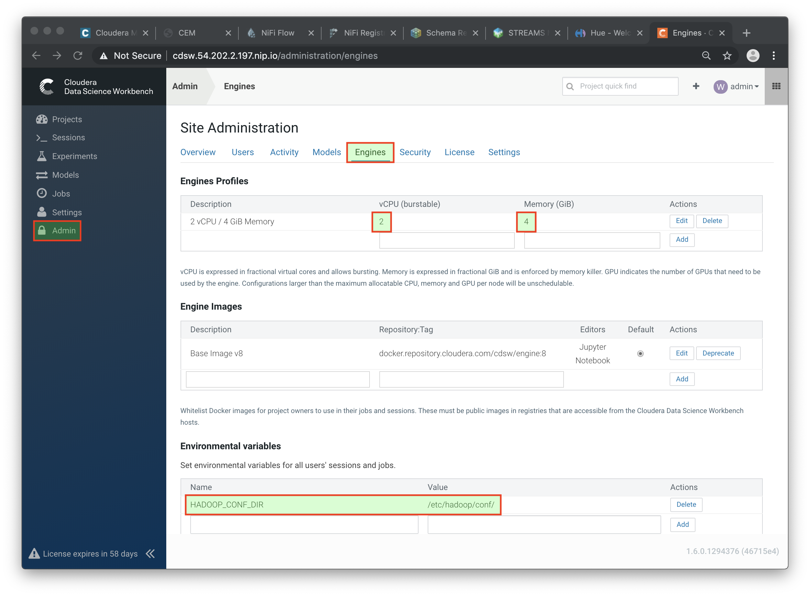

=== STEP 2: Create the project

    . Return to the main page and click on *New Project*, using this GitHub project as the source: `https://github.com/cloudera-labs/edge2ai-workshop`
+
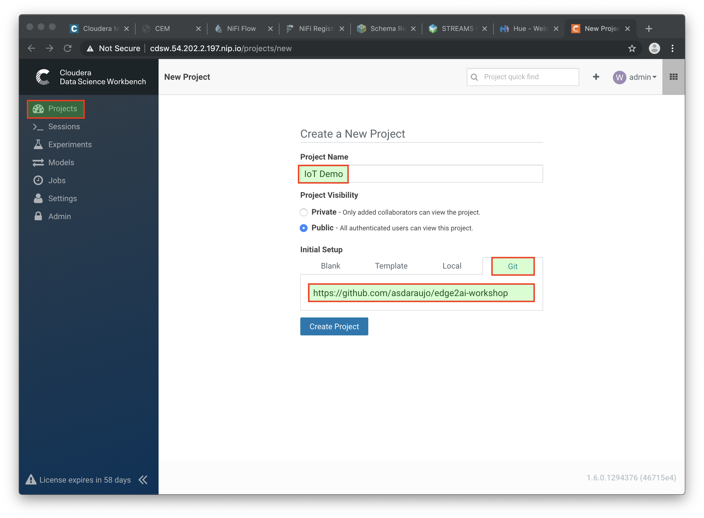

. Now that your project has been created, click on *Open Workbench* and start a Python3 session:
+
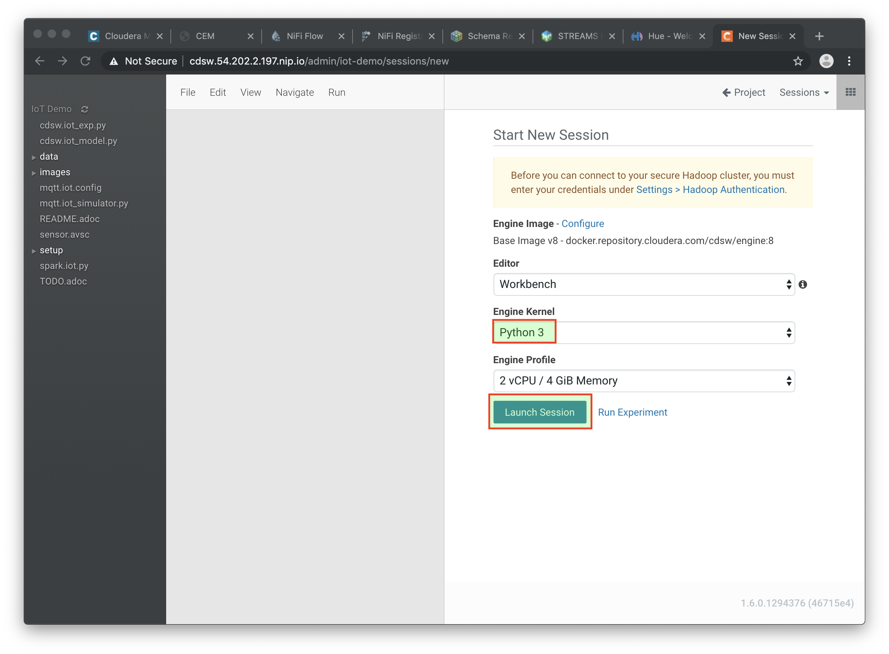

. Once the Engine is ready, run the following command to install some required libraries:
+
[source]
----
!pip3 install --upgrade pip scikit-learn
----

. The project comes with a historical dataset. Copy this dataset into HDFS:
+
[source]
----
!hdfs dfs -put -f data/historical_iot.txt /user/$HADOOP_USER_NAME
----
+
image::images/session_prep.png[width=800]

. You're now ready to run the Experiment to train the model on your historical data.

. You can stop the Engine at this point.

=== STEP 3: Examine `cdsw.iot_exp.py`

Open the file `cdsw.iot_exp.py`. This is a python program that builds a model to predict machine failure (the likelihood that this machine is going to fail). There is a dataset available on hdfs with customer data, including a failure indicator field.

The program is going to build a failure prediction model using the Random Forest algorithm. Random forests are ensembles of decision trees. Random forests are one of the most successful machine learning models for classification and regression. They combine many decision trees in order to reduce the risk of overfitting. Like decision trees, random forests handle categorical features, extend to the multiclass classification setting, do not require feature scaling, and are able to capture non-linearities and feature interactions.

`spark.mllib` supports random forests for binary and multiclass classification and for regression, using both continuous and categorical features. `spark.mllib` implements random forests using the existing decision tree implementation. Please see the decision tree guide for more information on trees.

The Random Forest algorithm expects a couple of parameters:

* *numTrees*: Number of trees in the forest.
+
Increasing the number of trees will decrease the variance in predictions, improving the model’s test-time accuracy. Training time increases roughly linearly in the number of trees.

* *maxDepth*: Maximum depth of each tree in the forest.
+
Increasing the depth makes the model more expressive and powerful. However, deep trees take longer to train and are also more prone to overfitting. In general, it is acceptable to train deeper trees when using random forests than when using a single decision tree. One tree is more likely to overfit than a random forest (because of the variance reduction from averaging multiple trees in the forest).

In the `cdsw.iot_exp.py` program, these parameters can be passed to the program at runtime, to these python variables:

[source,python]
----
param_numTrees = int(sys.argv[1])
param_maxDepth = int(sys.argv[2])
----

Also note the quality indicator for the Random Forest model, are written back to the Data Science Workbench repository:

[source,python]
----
cdsw.track_metric("auroc", auroc)
cdsw.track_metric("ap", ap)
----

These indicators will show up later in the **Experiments** dashboard.

=== STEP 4: Run the experiment for the first time

. Now, run the experiment using the following parameters:
+
[source,python]
----
numTrees = 20 numDepth = 20
----

. From the menu, select `Run -> Run Experiments...`. Now, in the background, the Data Science Workbench environment will spin up a new docker container, where this program will run.
+
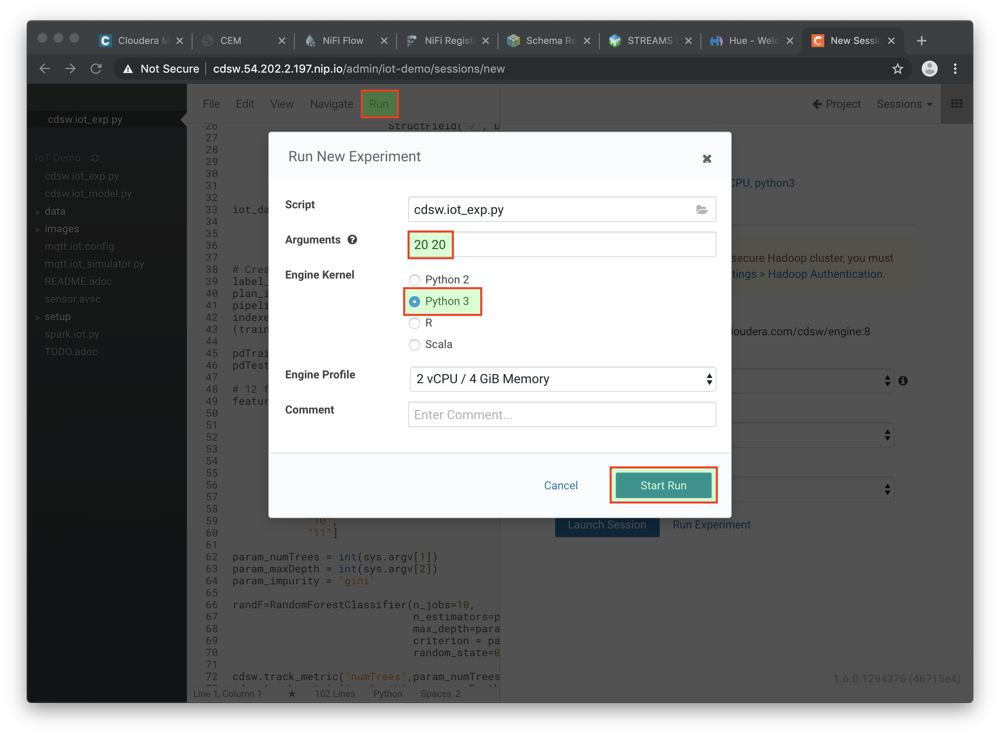

. Go back to the **Projects** page in CDSW, and hit the **Experiments** button.

. If the Status indicates `Running`, you have to wait till the run is completed. In case the status is `Build Failed` or `Failed`   , check the log information. This is accessible by clicking on the run number of your experiments. There you can find the session log, as well as the build information.
+
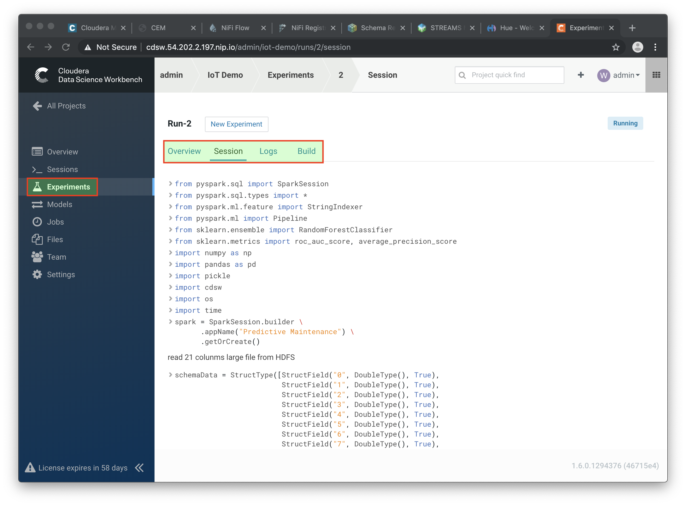

. In case your status indicates `Success`, you should be able to see the *auroc* (Area Under the Curve) model quality indicator. It might be that this value is hidden by the CDSW user interface. In that case, click on the ‘3 metrics’ links, and select the auroc field. It might be needed to de-select some other fields, since the interface can only show 3 metrics at the same time.
+
image::images/exp_metrics.png[width=800]

. In this example, `~0.8383`. Not bad, but maybe there are better hyper parameter values available.

=== STEP 5: Re-run the experiment several times

. Go back to the Workbench and run the experiment 2 more times and try different values for NumTrees and NumDepth. Try the following values:
+
[source,python]
----
NumTrees NumDepth
15       25
25       20
----

. When all runs have completed successfully, check which parameters had the best quality (best predictive value). This is represented by the highest _area under the curve_: `auroc` metric.
+
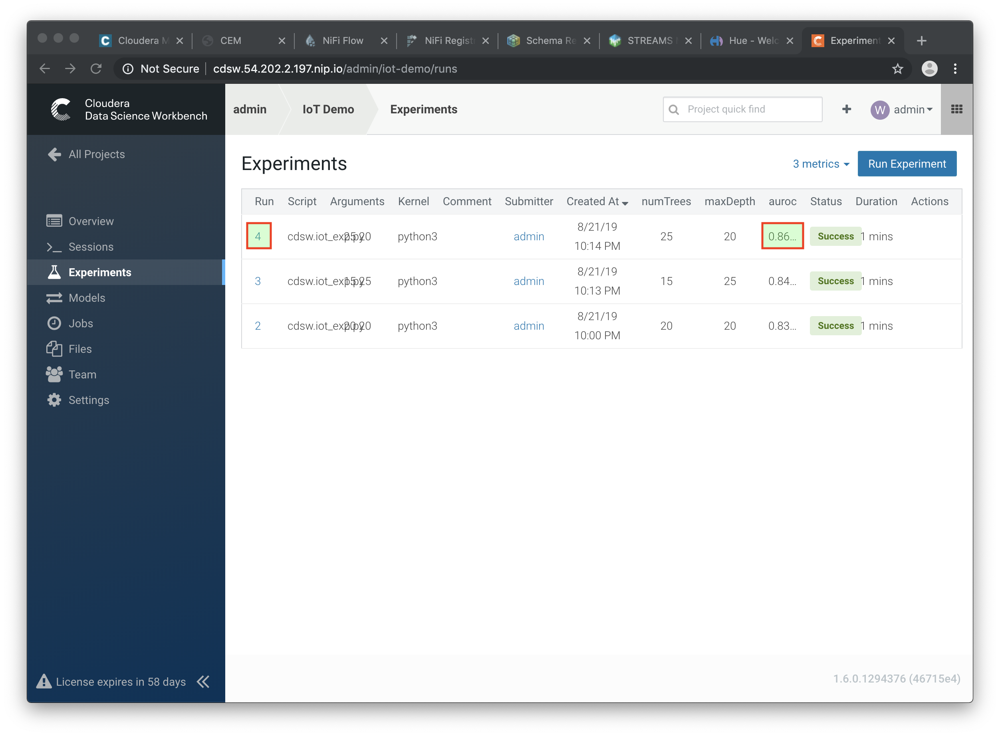

=== STEP 6: Save the best model to your environment

. Select the run number with the best predictive value (in the example above, experiment *4*).

. In the *Overview* screen of the experiment, you can see that the model, in Pickle format (`.pkl`), is captured in the file `iot_model.pkl`. Select this file and hit the **Add to Project** button. This will copy the model to your project directory.
+
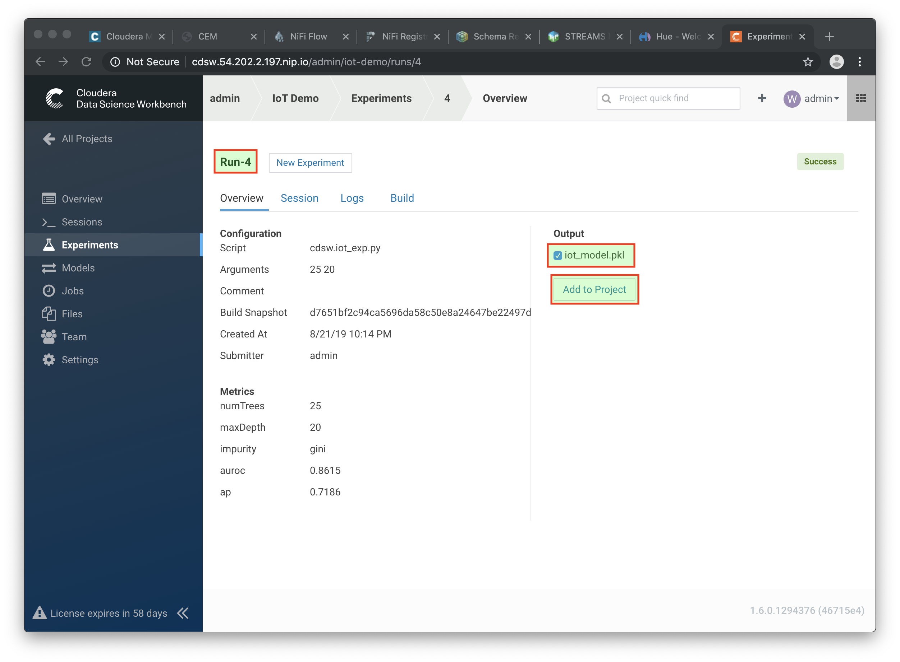
+
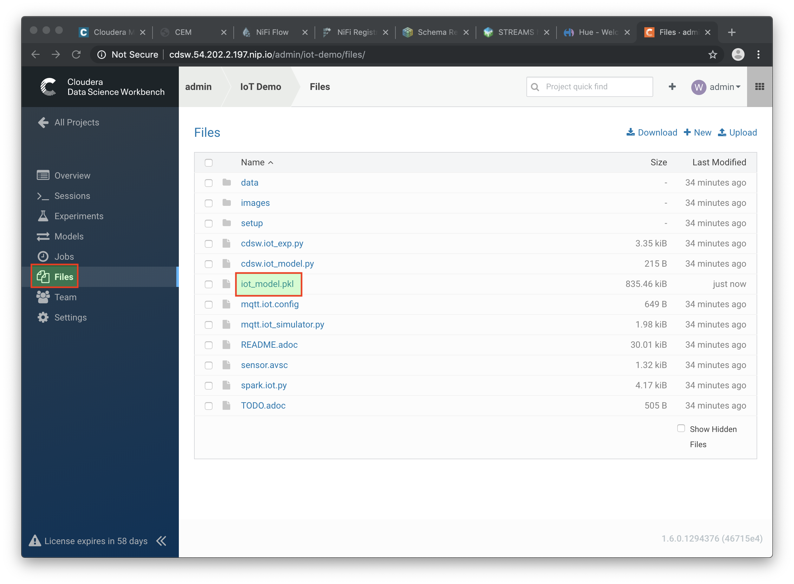

[[lab_2, Lab 2]]
== Lab 2 - CDSW: Deploy the model

=== STEP 1: Examine the program `cdsw.iot_model.py`

. Open the project you created in the previous lab and examine the file in the Workbench. This PySpark program uses the `pickle.load` mechanism to deploy models. The model is loaded from the `iot_modelf.pkl` file, which was saved in the previous lab from the experiment with the best predictive model.
+
There program also contains the `predict` definition, which is the function that calls the model, passing the features as parameters, and will return a result variable.

. Before deploying the model, try it out in the Workbench: launch a Python3 engine and run the code in file `cdsw.iot_model.py`. Then call the `predict()` method from the prompt:
+
[source,python]
----
predict({"feature": "0, 65, 0, 137, 21.95, 83, 19.42, 111, 9.4, 6, 3.43, 4"})
----
+
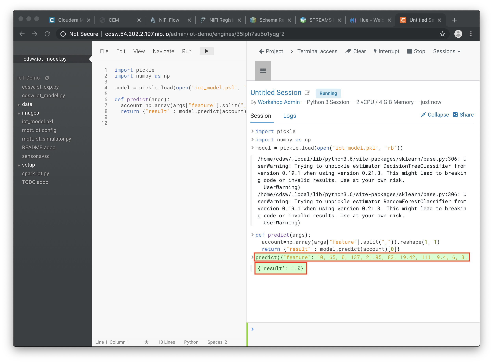

. The functions returns successfully, so we know we can now deploy the model. You can now stop the engine.

=== STEP 2: Deploy the model

. From the main page of your project, select the *Models* button. Select *New Model* and specify the following configuration:
+
[source, python]
----
Name:          IoT Prediction Model
Description:   IoT Prediction Model
File:          cdsw.iot_model.py
Function:      predict
Example Input: {"feature": "0, 65, 0, 137, 21.95, 83, 19.42, 111, 9.4, 6, 3.43, 4"}
Kernel:        Python 3
Engine:        2 vCPU / 4 GB Memory
Replicas:      1
----
+
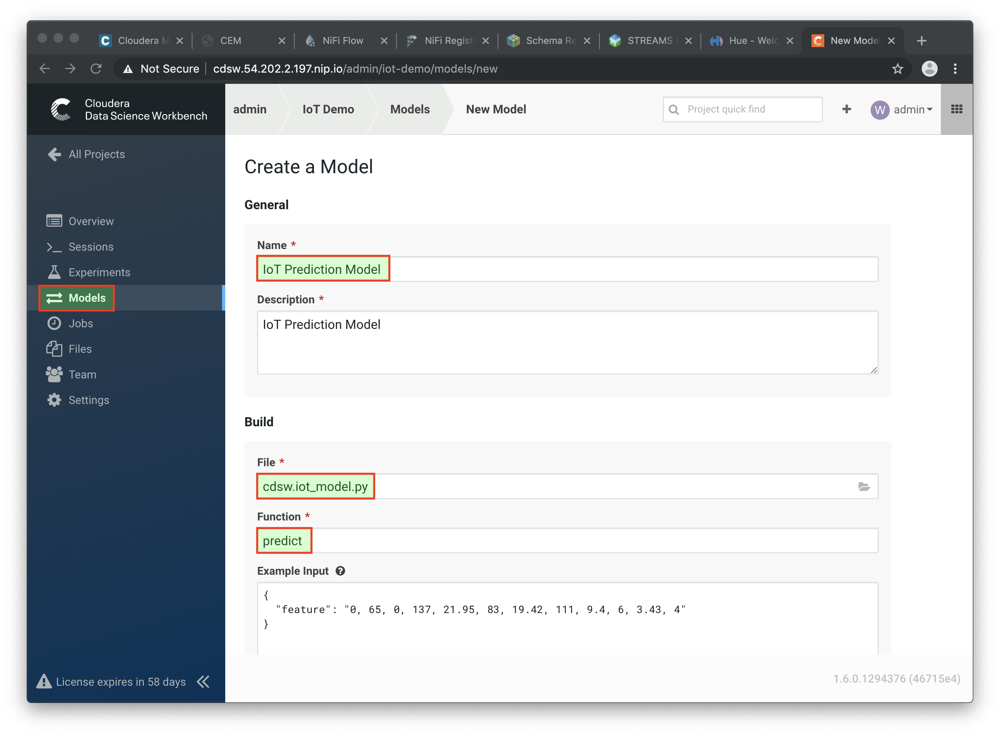

. After all parameters are set, click on the *Deploy Model* button. Wait till the model is deployed. This can take several minutes.

=== STEP 3: Test the deployed model

. When your model status change to `Deployed`, click on the model name link to go to the Model's *Overview* page. From the that page, click on the *Test* button to check if the model is working.

. The green circle with the `success` status indicates that our REST call to the model is working. The `1` in the response `{"result": 1}`, means that the machine from where these temperature readings were collected is _unlikely_ to experience a failure.
+
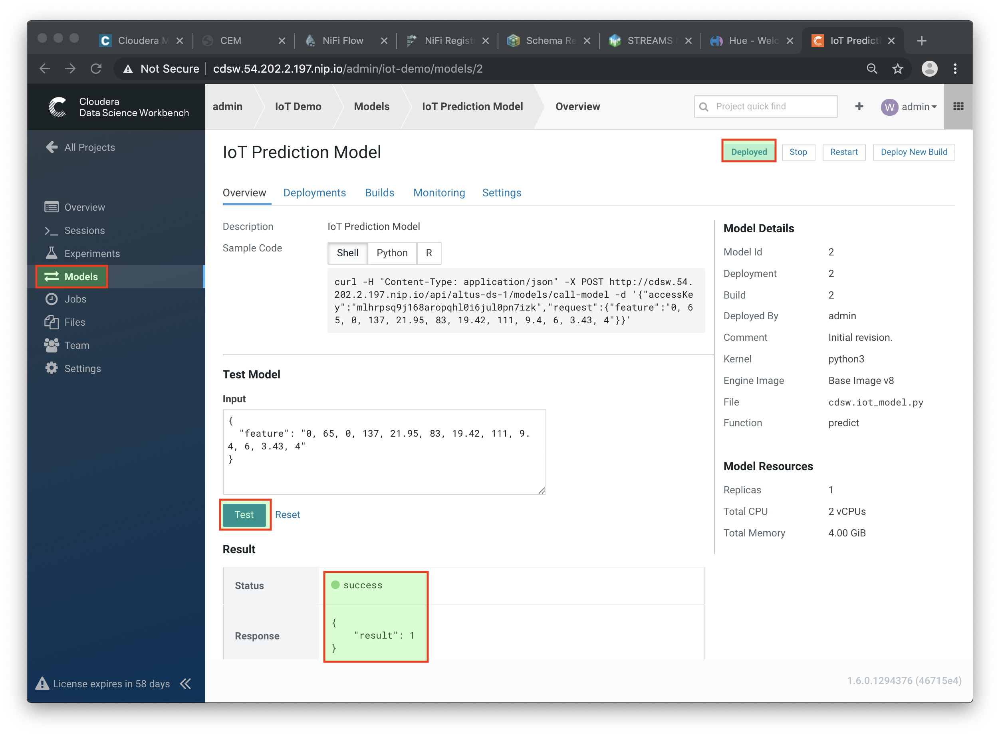

. Now, lets change the input parameters and call the predict function again. Put the following values in the Input field:
+
[source,python]
----
{
  "feature": "0, 95, 0, 88, 26.62, 75, 21.05, 115, 8.65, 5, 3.32, 3"
}
----

. With these input parameters, the model returns `0`, which means that the machine is likely to break.

