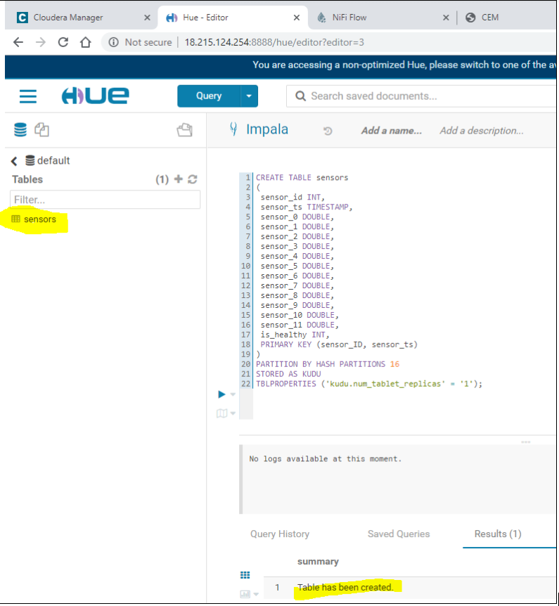
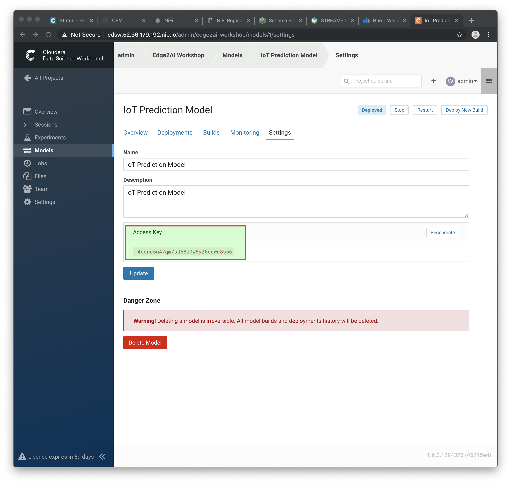

= Spark and Fast Analytics with Kudu

In this workshop you'll use a Spark job to read data from Kafka and write it to a Kudu table and then use Kudu to perform fast analytics on that data.

== Prerequisites

This workshop requires that you already have sensor data being produced to a Kafka topic, as implemented in the workshop link:streaming.adoc[From Edge to Streams Processing]. Please complete that workshop before starting this one.

You should also stop the `PutKudu` NiFi processor from that workshop to make it easier to verify your results here.

== Labs summary

* *Lab 1* - Use Spark to call the CDSW model endpoint and save to Kudu.
* *Lab 2* - Fast analytics on fast data with Kudu and Impala.

[[lab_1, Lab 1]]
== Lab 1 - Use Spark to call a CDSW model endpoint and save to Kudu

Spark Streaming is a processing framework for (near) real-time data. In this lab, you will use Spark to consume Kafka messages which contains the IoT data from the machine, and call a CDSW model API endpoint to predict whether, with those IoT values the machine sent, the machine is likely to break. You'll then save the results to Kudu for fast analytics.

==== Create the Kudu table

NOTE: If you already created this table in a previous workshop, please skip the table creation here.

. Go to the Hue Web UI and login. The first user to login to a Hue installation is automatically created and granted admin privileges in Hue.

. The Hue UI should open with the Impala Query Editor by default. If it doesn't, you can always find it by clicking on *Query button > Editor -> Impala*:
+
image::images/impala_editor.png[width=800]

. First, create the Kudu table. Login into Hue, and in the Impala Query, run this statement:
+
[source,sql]
----
CREATE TABLE sensors
(
 sensor_id INT,
 sensor_ts TIMESTAMP, 
 sensor_0 DOUBLE,
 sensor_1 DOUBLE,
 sensor_2 DOUBLE,
 sensor_3 DOUBLE,
 sensor_4 DOUBLE,
 sensor_5 DOUBLE,
 sensor_6 DOUBLE,
 sensor_7 DOUBLE,
 sensor_8 DOUBLE,
 sensor_9 DOUBLE,
 sensor_10 DOUBLE,
 sensor_11 DOUBLE,
 is_healthy INT,
 PRIMARY KEY (sensor_ID, sensor_ts)
)
PARTITION BY HASH PARTITIONS 16
STORED AS KUDU
TBLPROPERTIES ('kudu.num_tablet_replicas' = '1');
----
+

==== CDSW Access Key

. To configure and run the Spark Streaming job, you will need a CDSW Access Key to connect to the model endpoint that has been deployed there. To get the Access Key, go to the CDSW Web UI and click on *Models > Iot Prediction Model > Settings*. Copy the Access Key.
+

==== Running the Spark job

. Open a Terminal and SSH into the VM. The first is running the sensor data simulator, so you can't use it.
+
[source,shell]
----
ACCESS_KEY=<put here your cdsw model access key>

cd ~
wget https://repo.maven.apache.org/maven2/org/apache/kudu/kudu-spark2_2.11/1.9.0/kudu-spark2_2.11-1.9.0.jar
wget https://raw.githubusercontent.com/swordsmanliu/SparkStreamingHbase/master/lib/spark-core_2.11-1.5.2.logging.jar

rm -rf ~/.m2 ~/.ivy2/
spark-submit \
  --master local[2] \
  --jars kudu-spark2_2.11-1.9.0.jar,spark-core_2.11-1.5.2.logging.jar \
  --packages org.apache.spark:spark-streaming-kafka_2.11:1.6.3 \
  /opt/demo/spark.iot.py $ACCESS_KEY
----
+

. Spark Streaming will flood your screen with log messages, however, at a 5 seconds interval, you should be able to spot a table: these are the messages that were consumed from Kafka and processed by Spark. You can configure Spark for a smaller time window, however, for this exercise 5 seconds is sufficient.
+
image::images/spark_job_output.png[width=800]

[[lab_2, Lab 2]]
== Lab 2 - Fast analytics on fast data with Kudu and Impala

In this lab, you will run some SQL queries using the Impala engine. You can run a report to inform you which machines are likely to break in the near future.

. Login into Hue and run the following queries in the Impala Query Editor:
+
[source,sql]
----
SELECT sensor_id, sensor_ts
FROM sensors
WHERE is_healthy = 0;
----
+
[source,sql]
----
SELECT is_healthy, count(*) as occurrences
FROM sensors
GROUP BY is_healthy;
----

. Run a few times the SQL statements and verify that the number of occurrences are increasing as the data is ingested by either NiFi or the Spark job. This allows you to build real-time reports for fast action.
+
image::images/table_select.png[width=800]
