= Querying streams with SQL

NOTE: This lab assumes that the link:streaming.adoc[From Edge to Streams Processing] lab has been completed. If you haven't done so, please ask your instructor to set your cluster state for you so that you can perform the steps in this lab (or you can do this yourself by SSH'ing to your cluster host and running the script `/tmp/resources/reset-to-lab.sh`)

In this workshop you will use SQL Stream Builder to query and manipulate data streams using SQL language. SQL Stream Builder is a powerful service that enables you to create Flink jobs without having to write Java/Scala code.

== Labs summary

* *Lab 1* - Create a Data Source
* *Lab 2* - Create a Source Virtual Table for a topic with JSON messages
* *Lab 3* - Create a Source Virtual Table for a topic with AVRO messages
* *Lab 4* - Run a simple query
* *Lab 5* - Computing and storing agregation results

== Introduction

In this lab, and the subsequent ones, we will use the `iot_enriched` topic created and populated in previous labs and contains a datastream of computer performance data points.

So let's start with a straightforward goal: to query the contents of the `iot_enriched` topic using SQL to examine the data that is being streamed.

Albeit simple, this task will show the ease of use and power of SQL Stream Builder (SSB).

[[lab_1, Lab 1]]
== Lab 1 - Create a Data Source

Before we can start querying data from Kafka topics we need to register the Kafka clusters as _data sources_ in SSB.

. On the Cloudera Manager console, click on the Cloudera logo at the top-left corner to ensure you are at the home page and then click on the *SQL Stream Builder* service.

. Click on the *SQLStreamBuilder Console* link to open the SSB UI.

. On the logon screen, authenticate with user `admin` and password `supersecret1`.

. You will notice that SSB already has a Kafka cluster registered as a data source, named `CDP Kafka`. This source is created automatically for SSB when it is installed on a cluster that also has a Kafka service:
+
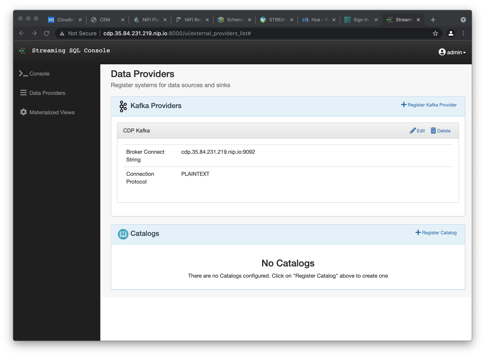

. You can use this screen to add other external Kafka clusters as data sources to SSB. In this lab we'll add a second data using a different host name and will enable Schema Registry integration for it.

. Click on *Register Kafka Provider* and in the *Add Kafka Provider* window, enter the details for our new data source and click *Save changes*.
+
[source,yaml]
----
Name:                           edge2ai-kafka
Brokers:                        edge2ai-1.dim.local:9092
Connection protocol:            PLAINTEXT
Use Schema Registry:            Yes
Schema Registry URL:            http://edge2ai-1.dim.local:7788/api/v1
Schema Registry Authentication: None
----
+
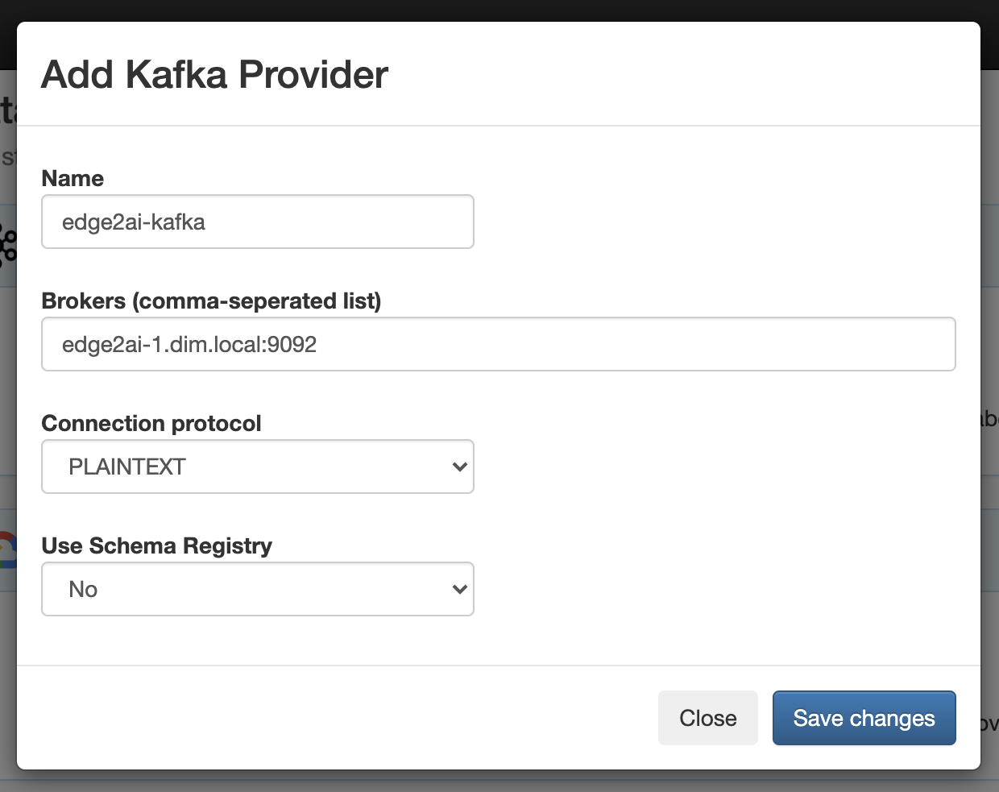

[[lab_2, Lab 2]]
== Lab 2 - Create a Source Virtual Table for a topic with JSON messages

Now we can _map_ the `iot_enriched` topic to a _virtual table_ that we can reference in our query. _Virtual Tables_ on SSB are a way to associate a Kafka topic with a schema so that we can use that as a table in our queries. There are two types of virtual tables in SSB: _Source_ and _Sink_.

We will use a Source Virtual Table now to read from the topic. Later we will look into Sink Virtual Tables to write data to Kafka.

. To create our first Source Virtual Table, click on *Console* (on the left bar) *> Virtual Tables > Source Virtual Table > Add Source > Apache Kafka*.
+
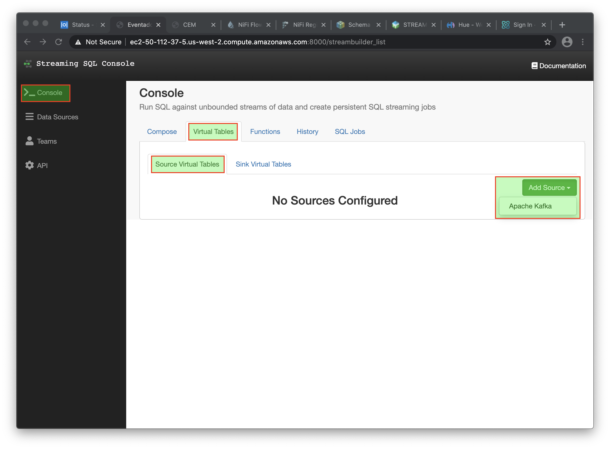

. On the *Kafka Source* window, enter the following information:
+
[source,yaml]
----
Virtual table name: iot_enriched_source
Kafka Cluster:      edge2ai-kafka
Topic Name:         iot_enriched
Data Format:        JSON
----
+
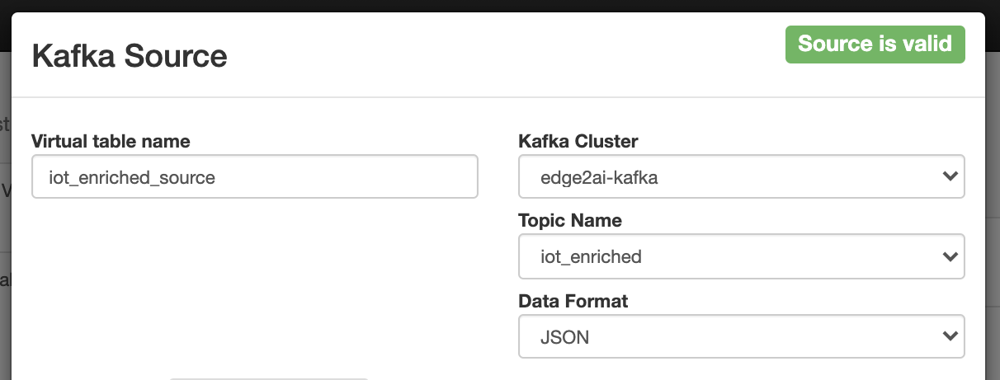

. Ensure the *Schema* tab is selected. Scroll to the bottom of the tab and click *Detect Schema*. SSB will take a sample of the data flowing through the topic and will infer the schema used to parse the content. Alternatively you could also specify the schema in this tab.
+
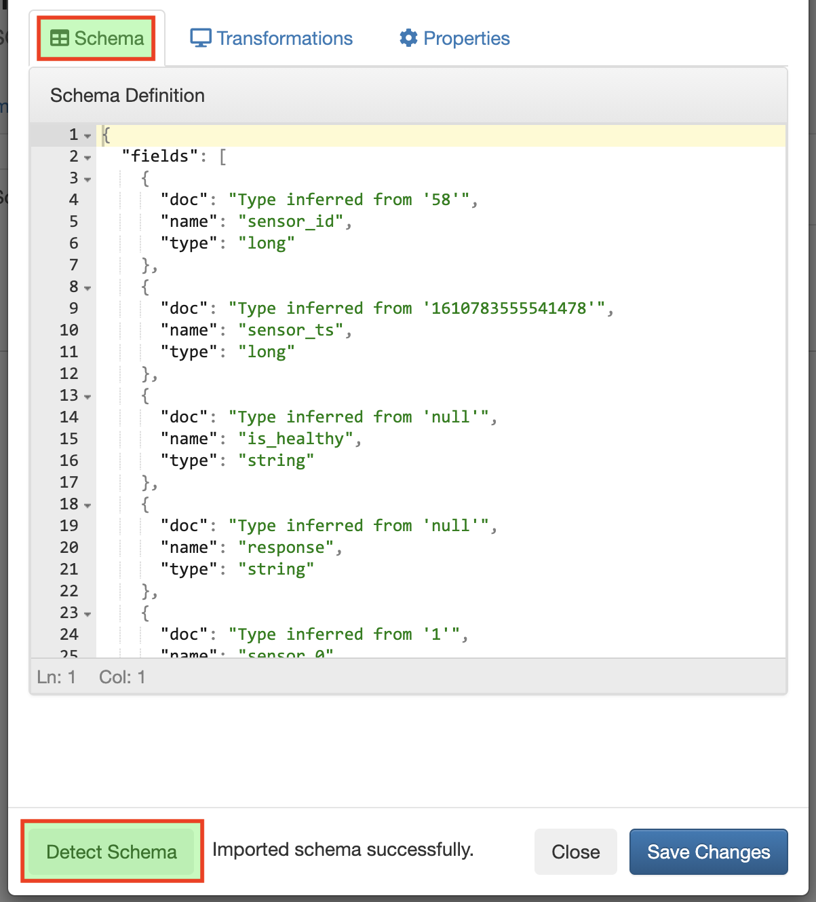

. If we need to manipulate the source data to fix, cleanse or convert some values, we can define transformations for the data source to perform those changes. These transformations are defined in Javascript.
+
The serialized record read from Kafka is provided to the Javascript code in the `record` variable. The last command of the transformation must return the serialized content of the modified record.
+
The data in the `iot_enriched` topic has a timestamp expressed in microseconds. Let's say we need the value in milliseconds. Let's write a transformation to perform that conversion for us at the source.
+
Click on the *Transformations* tab and enter the following code in the *Code* field:
+
[source,javascript]
----
// parse the JSON record
var parsedVal = JSON.parse(record);
// Convert sensor_ts from micro to milliseconds
parsedVal['sensor_ts'] = Math.round(parsedVal['sensor_ts']/1000);
// serialize output as JSON
JSON.stringify(parsedVal);
----
+
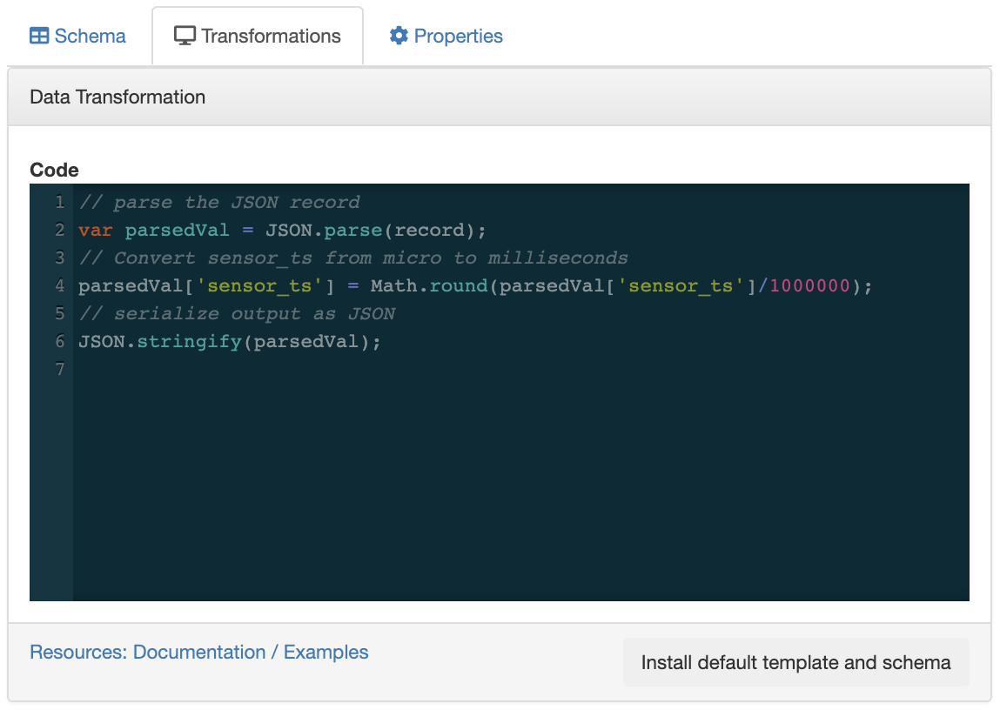

. Click on the *Properties* tab, enter the following value for the *Consumer Group* property and click *Save changes*.
+
[source,yaml]
----
Consumer Group: ssb-iot-1
----
+
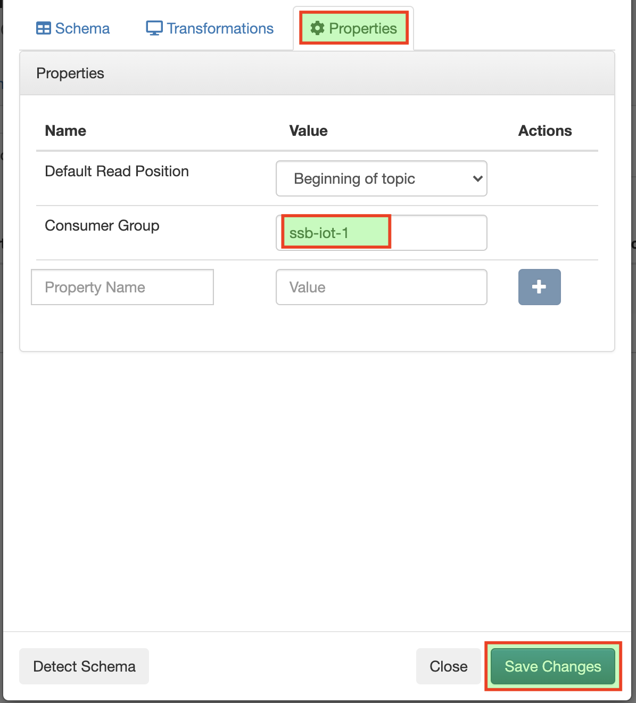
+
NOTE: Setting the *Consumer Group* properties for a virtual table will ensure that if you stop a query and restart it later, the second query execute will continue to read the data from the point where the first query stopped, without skipping data. *However*, if _multiple queries_ use the same virtual table, setting this property will effectively distribute the data across the queries so that each record is only read by a single query. If you want to share a virtual table with multiple distinct queries, ensure that the Consumer Group property is unset.

[[lab_3, Lab 3]]
== Lab 3 - Create a Source Virtual Table for a topic with AVRO messages

SQL Stream Builder is integrated with Schema Registry. For Kafka topics containing Avro messages, instead of specifying the schema directly on the virtual table we can, it will fetch the schema for the topic directly from Schema Registry.

The schema name in Schema Registry _must be the same as the topic name_.

In this lab we will register a schema for the topic `iot_enriched_avro` and create a virtual table source that uses it.

. Go to the following URL, which contains the schema definition for the data in the `iot_enriched_avro` topic. Select and copy the contents of the page.
+
`link:https://raw.githubusercontent.com/cloudera-labs/edge2ai-workshop/master/sensor.avsc[https://raw.githubusercontent.com/cloudera-labs/edge2ai-workshop/master/sensor.avsc, window="_blank"]`

. In the Schema Registry Web UI, click the `+` sign to register a new schema.

. Click on a blank area in the *Schema Text* field and paste the contents you copied.

. Complete the schema creation by filling the following properties and save the schema.
+
[source]
----
Name:          iot_enriched_avro
Description:   Schema for the data in the iot_enriched_avro topic
Type:          Avro schema provider
Schema Group:  Kafka
Compatibility: Backward
Evolve:        checked
----

. Back on the SQL Stream Builder page, click on *Console* (on the left bar) *> Virtual Tables > Source Virtual Table > Add Source > Apache Kafka*.
+

. On the *Kafka Source* window, enter the following information:
+
[source,yaml]
----
Virtual table name: iot_enriched_avro_source
Kafka Cluster:      edge2ai-kafka
Topic Name:         iot_enriched_avro
Data Format:        AVRO
----
+
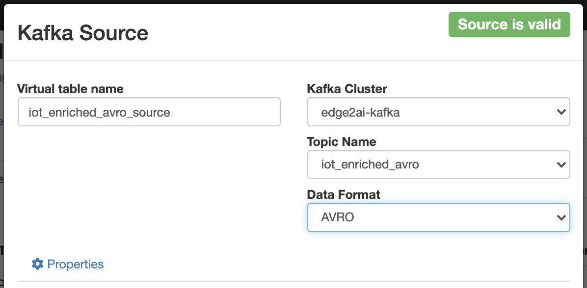

. Click on the *Properties* tab, enter the following value for the *Consumer Group* property and click *Save changes*.
+
[source,yaml]
----
Default Read Position: End of Topic
Consumer Group:        ssb-iot-avro-1
----

NOTE: We are setting the "Default Read Position" to "End of Topic" to skip any data that's already been writte to the topic. This will happen only on the first time this virtual table is read by SSH. Once that happens the offset of the last message read will be recorded for the specified consumer group so that the following read will continue from the last read offset.
[[lab_4, Lab 4]]
== Lab 4 - Run a simple query

We have now all that we need to run our first query in SSB. We want to simply query the raw contents of topic to ensure that the everything is working correctly before we proceed to do more complex things.

If your environment is healthy and all the steps from previous labs were completed correctly you should be able to visualize the data with the steps below.

. On the SSB UI, click on *Console* (on the left bar) *> Compose > SQL* and type the following query:
+
[source,sql]
----
select *
from iot_enriched_source
----
+
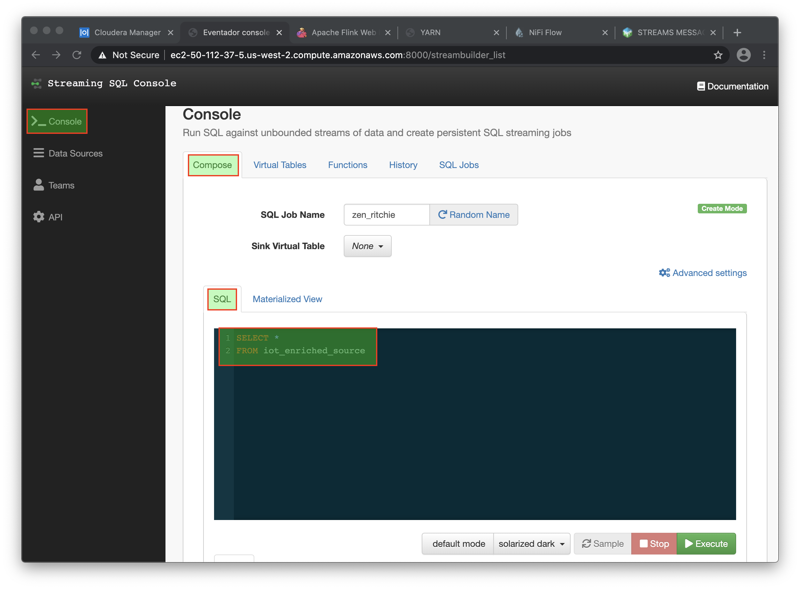

. Set a *SQL Job Name* for your job or use the random name provided.

. Do *not* add a Sink Virtual Table.

. Click *Execute*

. Scroll to the bottom of the page and you will see the log messages generated by your query execution.
+
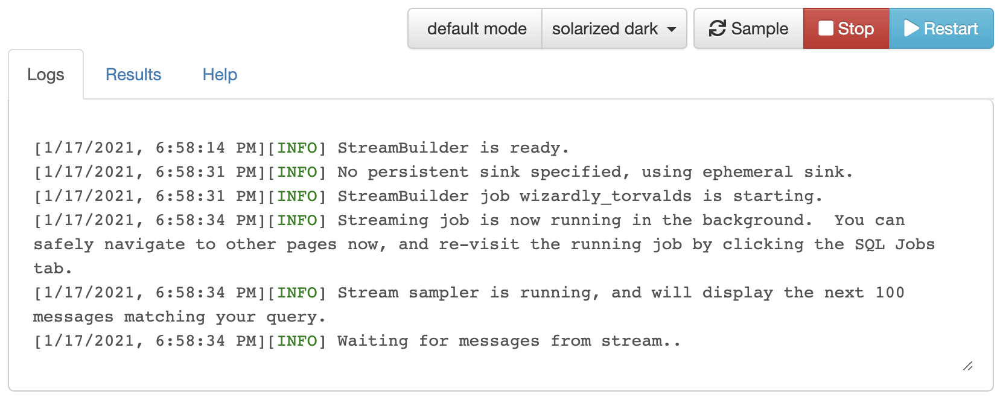

. After a few seconds the SQL Console will start showing the results of the query coming from the `iot_enriched` topic.
+
The data displayed on the screen is only a sample of the data returned by the query, not the full data.
+
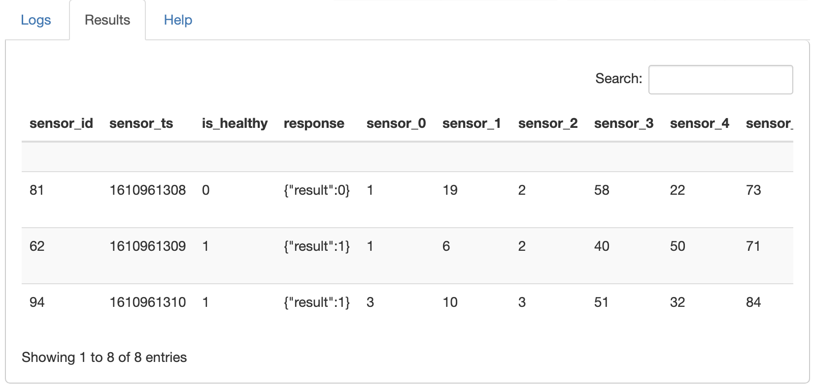
+
Note that the values of the column `sensor_ts` now show in milliseconds instead of microseconds, thanks to the transformation we created for the `iot_enriched_source` virtual table.

. Try querying the AVRO virtual source table as well and verify that the data can be consumed correctly:
+
[source,sql]
----
select *
from iot_enriched_avro_source
----

. Make sure to stop your queries to release all resources once you finish this lab. You can double-check that all queries/jobs have been stopped by clicking on the *SQL Jobs* tab. If any jobs are still running, you can stop them from that page.

[[lab_5, Lab 5]]
== Lab 5 - Computing and storing aggregation results

We want to start computing window aggregates for our incoming data stream and make the aggregation results available for downstream applications. SQL Stream Builder's Sink Virtual Tables give us the ability to publish/store streaming data to several different services (Kafka, AWS S3, Google GCS, Elastic Search and generic webhooks). In this lab we'll use a Kafka sink to publish the results of our aggregation to another Kafka topic.

. Let's first create a topic (`sensor6_stats`) where to publish our aggregation results:
.. Navigate to the SMM UI (*Cloudera Manager > SMM* service *>
Streams Messaging Manager Web UI*).
.. On the SMM UI, click the *Topics* tab (image:images/topics_icon.png[width=25]).
.. Click the *Add New* button.
.. Enter the following details for the topic and click *Save* when ready:
... Topic name: `sensor6_stats`
... Partitions: `10`
... Availability: `Low`
... Cleanup Policy: `delete`

. To create the Sink Virtual Table, click on *Console* (on the left bar) *> Virtual Tables > Sink Virtual Table > Add Source > Apache Kafka*.
+
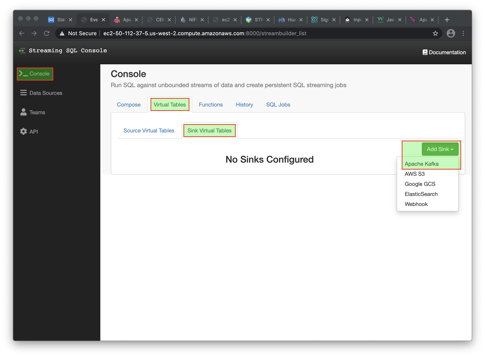

. On the *Kafka Sink* window, enter the following information and click *Save changes*:
+
[source,yaml]
----
Virtual table name: sensor6_stats_sink
Kafka Cluster:      edge2ai-kafka
Topic Name:         sensor6_stats
----
+
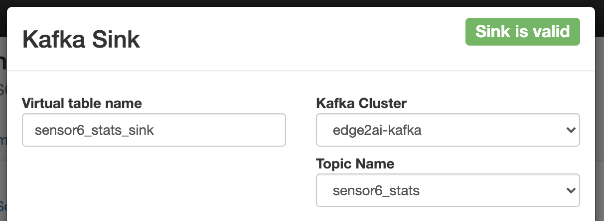

. On the SSB UI, click on *Console* (on the left bar) *> Compose > SQL* and type the query shown below.
+
This query will compute aggregates over 30-seconds windows that slide forward every second. For a specific sensor value in the record (`sensor_6`) it computes the following aggregations for each window:
+
--
* Number of events received
* Sum of the `sensor_6` value for all the events
* Average of the `sensor_6` value across all the events
* Min and max values of the `sensor_6` field
* Number of events for which the `sensor_6` value exceeds `70`
--
+
[source,sql]
----
SELECT
  sensor_id as device_id,
  HOP_END(sensor_ts, INTERVAL '1' SECOND, INTERVAL '30' SECOND) as windowEnd,
  count(*) as sensorCount,
  sum(sensor_6) as sensorSum,
  avg(cast(sensor_6 as float)) as sensorAverage,
  min(sensor_6) as sensorMin,
  max(sensor_6) as sensorMax,
  sum(case when sensor_6 > 70 then 1 else 0 end) as sensorGreaterThan60
FROM iot_enriched_source
GROUP BY
  sensor_id,
  HOP(sensor_ts, INTERVAL '1' SECOND, INTERVAL '30' SECOND)
----
+
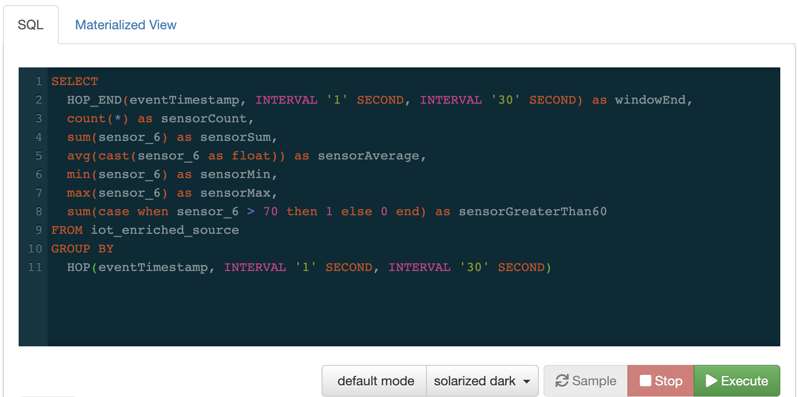

. Enter `Sensor6Stats` for the *SQL Job Name* field.

. On the *Sink Virtual Table* field, click on the *None* drop-down and select the Virtual Sink Table that you created previously (`sensor6_stats_sink`)
+
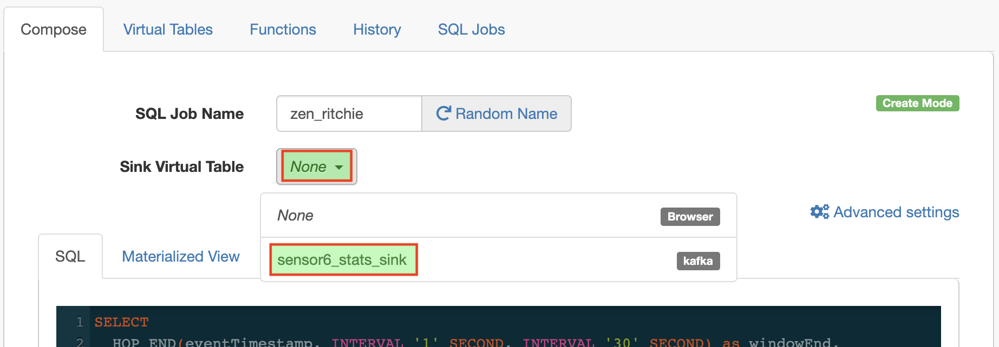

. Click *Execute*.

. Scroll to the bottom of the page and you will see the log messages generated by your query execution.
+

. After a few seconds the SQL Console will start showing the results of your aggregation query.
+
Note that the data displayed on the screen is only a sample of the data returned by the query, not the full data.
+
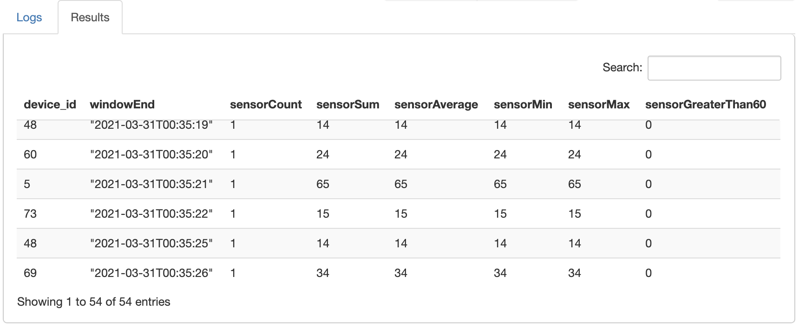

. Check the job execution details and logs by clicking on *Console* (on the left bar) *> SQL Jobs* tab. Explore the options on this screen:
+
--
.. Click on the `Sensor6Stats` job.
.. Click on the *Details* tab to see job details.
.. Click on the *Log* tab to see log messages generated by the job execution.
--
+
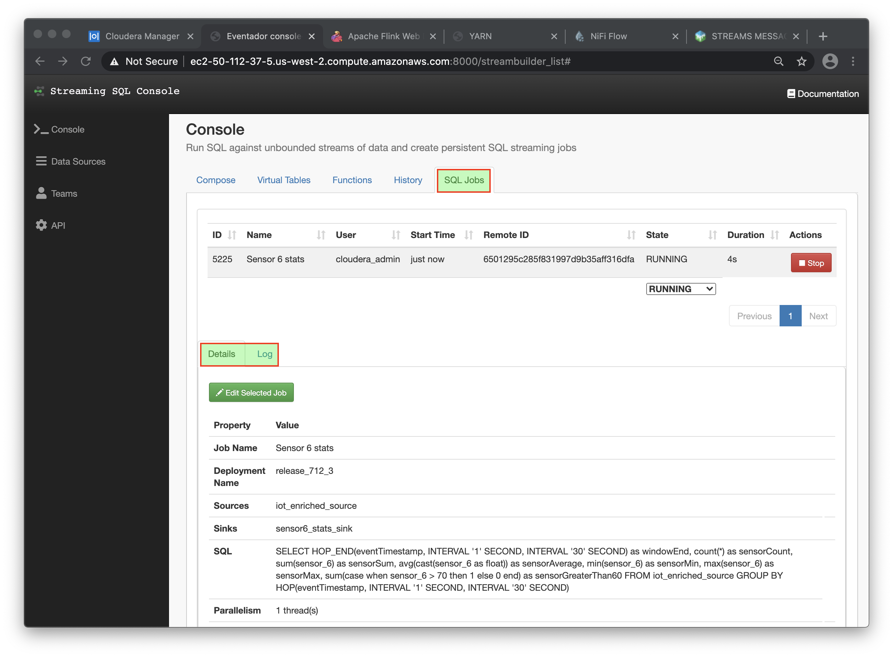

. Click on the *Flink Dashboard* link to open the job's page on the dashboard. Navigate the dashboard pages to explore details and metrics of the job execution.
+
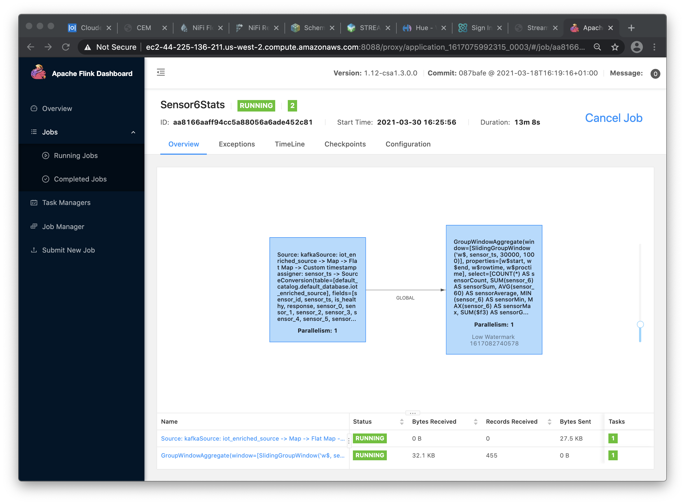

. Let's query the `sensor6_stats` table to examine the data that is being written to it. First we need to define a Source Virtual Table associated with the `sensor6_stats` topic.
+
--
.. Click on *Console* (on the left bar) *> Virtual Tables > Source Virtual Table > Add Source > Apache Kafka*.
.. On the *Kafka Source* window, enter the following information and click *Save changes*:
+
[source,yaml]
----
Virtual table name: sensor6_stats_source
Kafka Cluster:      edge2ai-kafka
Topic Name:         sensor6_stats
Data Format:        JSON
----
--
.. Click on *Detect Schema* and wait for the schema to be updated.
.. Click *Save changes*.

. Click on *Console* (on the left bar) to refresh the screen and clear the SQL Compose field, which may still show the running aggregation job.
+
Note that the job will continue to run in the background and you can continue to monitor it through the *Job Logs* page.

. Enter the following query in the SQL field and execute it:
+
[source,sql]
----
SELECT *
FROM sensor6_stats_source
----

. After a few seconds you should see the contents of the `sensor6_stats` topic displayed on the screen:
+
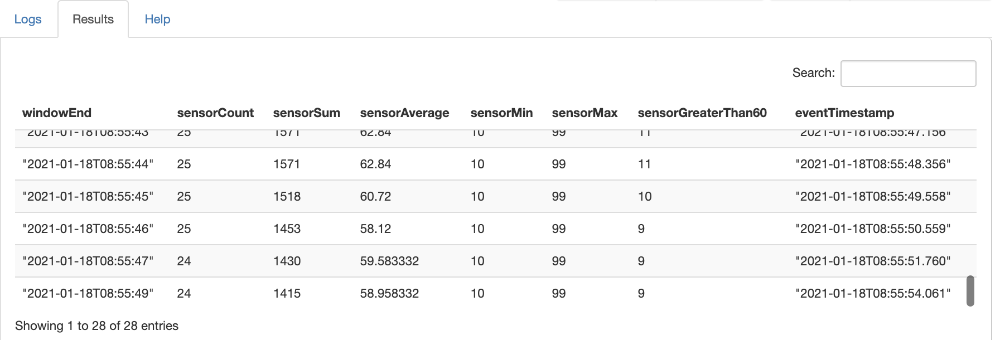

. You will need to leave the `Sensor6Stats` job running to use it in the next lab. Make sure you stop all other jobs to release cluster resources.
+
image::images/ssb-jobs-running.png[width=800]

[[lab_6, Lab 6]]
== Lab 6 - Materialized Views

SQL Stream Builder can also take keyed snapshots of the data stream and make that available through a REST interface in the form of Materialized Views.
In this lab we'll create and query Materialized Views (MV).

We will define MVs on top of the query we created in the previous lab. Make sure that query is running before executing the steps below.

. On the *Console_ > SQL Jobs* tab, verify that the `Sensor6Stats` job is running. Select the job and click on the *Edit Selected Job* button.
+
image::images/ssb-edit-job.png[width=800]

. Select the *Materialized View* tab for that job and set the following values for the MV properties:
+
[source,python]
----
Primary Key:           device_id
Retention:             300
Recreate on Job Start: Yes
Ignore NULLs:          Yes
----
+
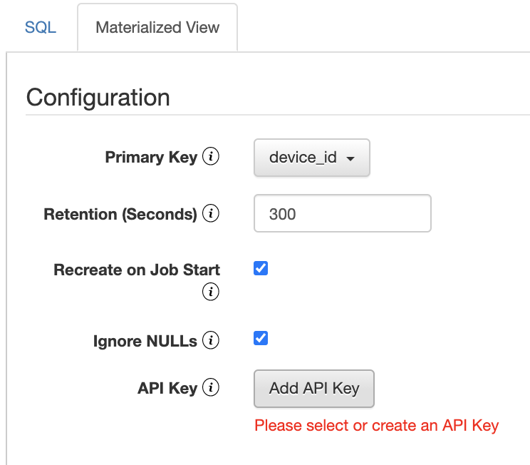

. To create a MV we need to have an API Key. The API key is the information given to clients so that they can access the MVs. If you have multiple MVs and want them to be accessed by different clients you can have multiple API keys to control access.
+
If you have already created an API Key in SSB you can select it from the drop-down list. Otherwise, create one on the spot by clicking on the *Add API Key* button shown above. Use `ssb-lab` as the Key Name.

. Click *Apply Configuration*. This will enable the *Add Query* button below.

. Click *Add Query* to create a new MV. We want to create a view that shows all the devices for which `sensor6` has had at least 1 reading above 60 in the last recorded 30 second window. For this, enter the following parameters in the MV Query Configuration page:
+
[source,python]
----
URL Pattern:   above60
Query Builder: <click "Select All" to add all columns>
Filters:       sensorGreatThan60  greater  0
----
+
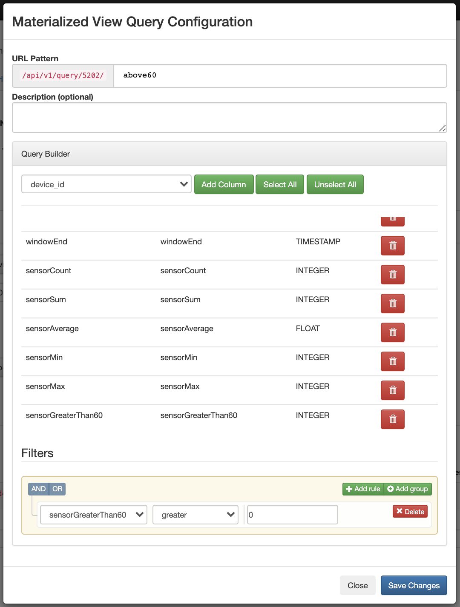

. Click *Save Changes*.
. Copy the new MV URL that's shown on the screen and open it in a new browser tab (or simply click on the URL link). You will see the content of the MV current snapshot.
+
If you refresh the page a few times you will notice that the MV snapshot is updated as new data points are coming through the stream.
+
SSB keeps the last state of the data for each value of the defined primary key.
+
image::images/ssb-mv-contents.png[width=800]

==== Materialized View with parameters
The MV we created above takes no filter parameters; it always returns the full content of the MV when you call the REST endpoint.
It is possible, though, to specify parameters for a MV so that you can filter the contents at query time.

Below we will create a new MV that allows filtering by specifying a range for the `sensorAverage` column.

. Click the *Add Query* button to create a new MV, enter the following parameter and click *Save Changes*.
+
[source,python]
----
URL Pattern:   above60withRange/{lowerTemp}/{upperTemp}
Query Builder: <click "Select All" to add all columns>
Filters:       sensorGreatThan60  greater           0
               AND
               sensorAverage      greater or equal  {lowerTemp}
               AND
               sensorAverage      less or equal     {upperTemp}
----
+
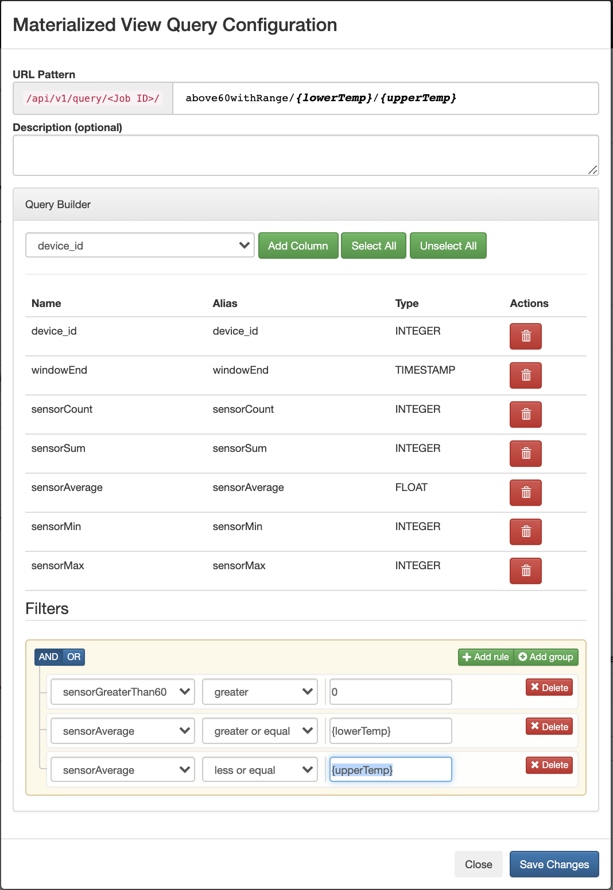

. You will notice that the new URL for this MV has placeholders for the `{lowerTemp}` and `{upperTemp}` parameters:
+
image::images/ssb-mv-parameters.png[width=800]

. Copy the MV URL to a text editor and replace the placeholders with actual values for those parameters.
+
The example below shows a filter for `sensorAverage` values between 80 and 85, inclusive:
+
[source]
----
.../above60withRange/50/70?key=...
----

. After replacing the values, open the URL on your web browser to retrieve the filtered data.
+
Try changing the value range to verify that the filter is working as expected.

. Once you have finished the lab, click on the *SQL Jobs* tab and stop all your jobs to release cluster resources.

== Conclusion

We have now taken data from one topic, calculated aggregated results and written these to another topic.
IIn order to validate that this was successful we have selected the result with an independent select query.
Finally, we created Materialized Views for one of our jobs and queried those views through their REST endpoints.

