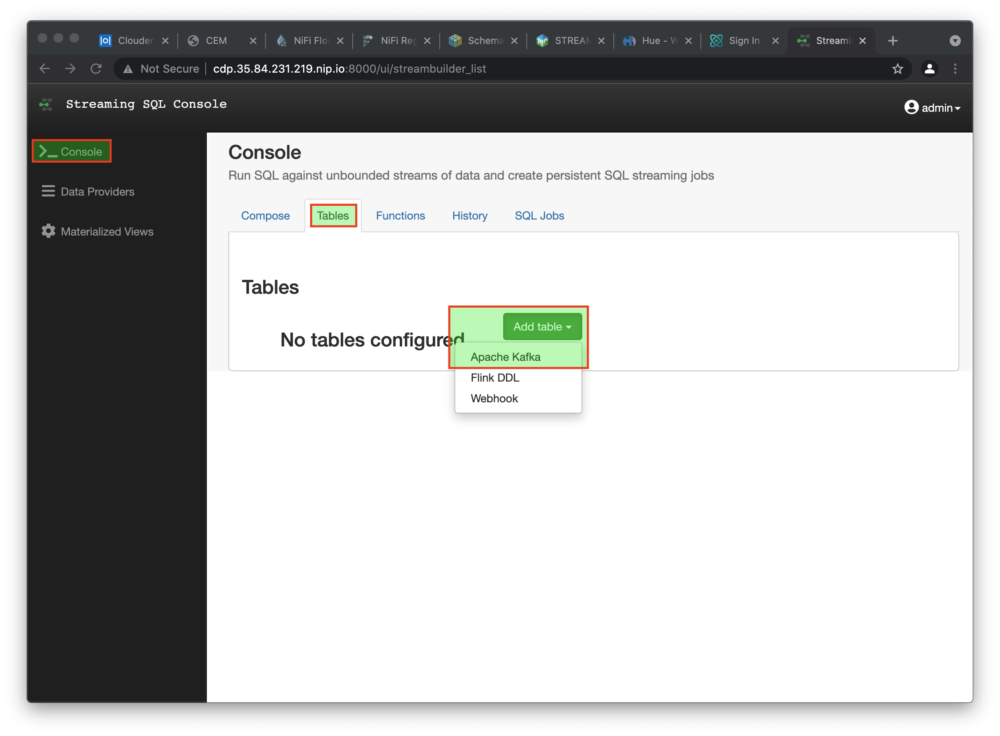
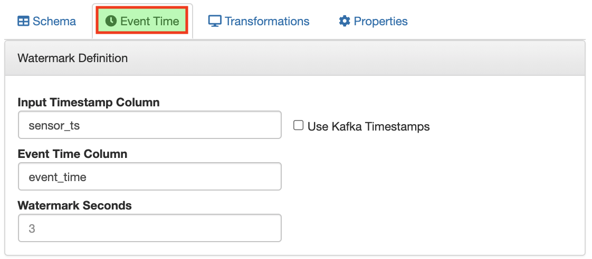
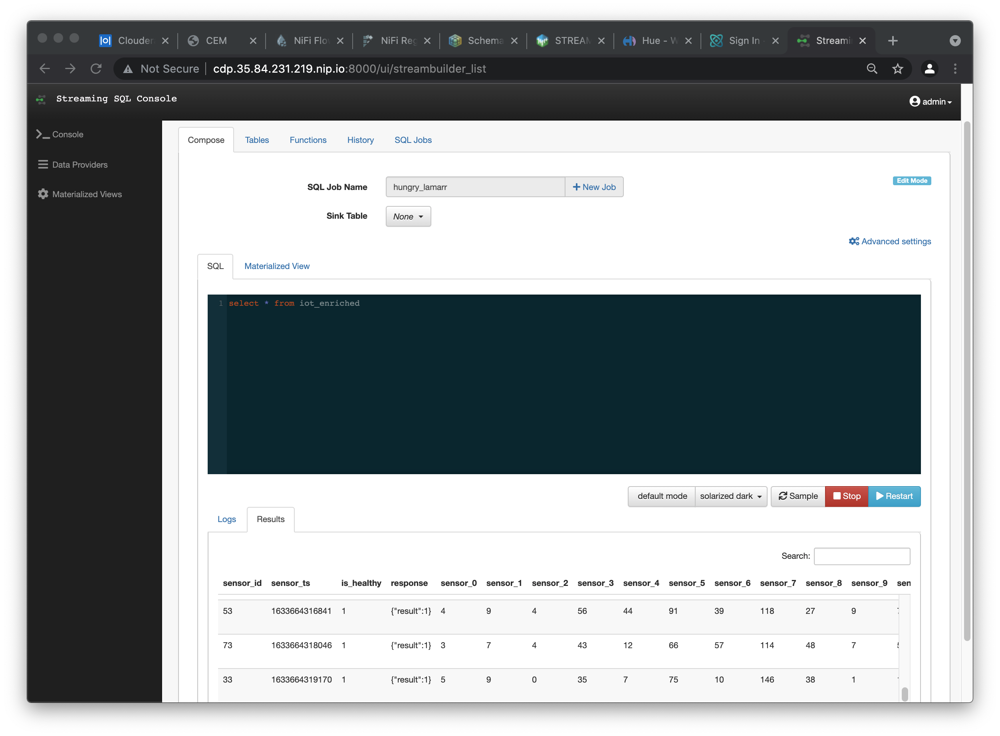
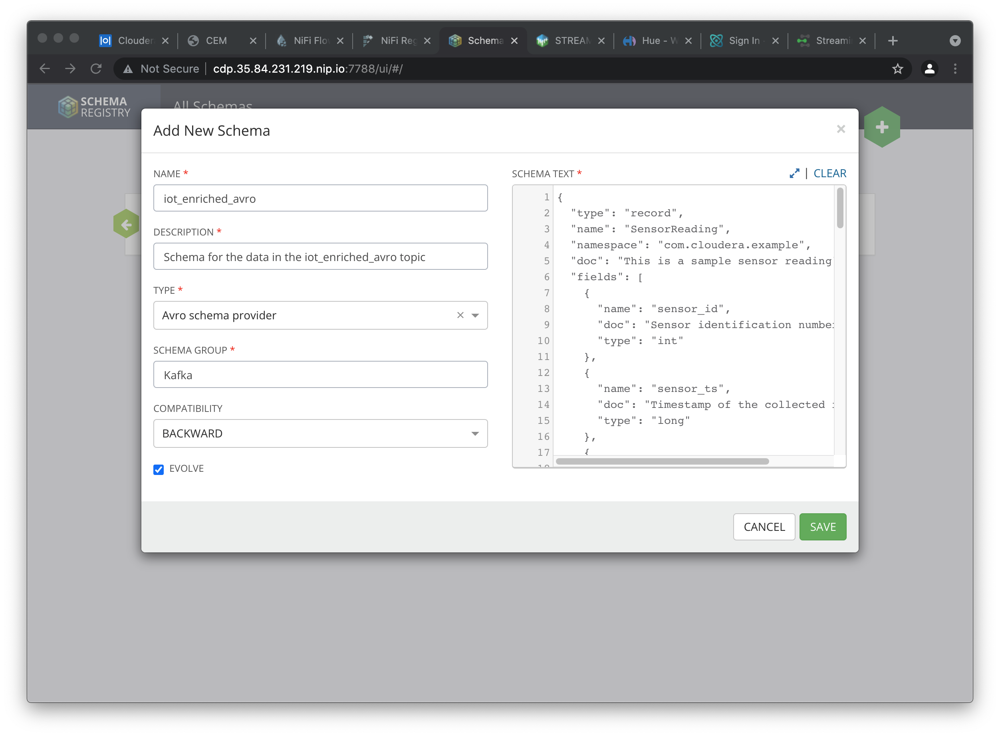
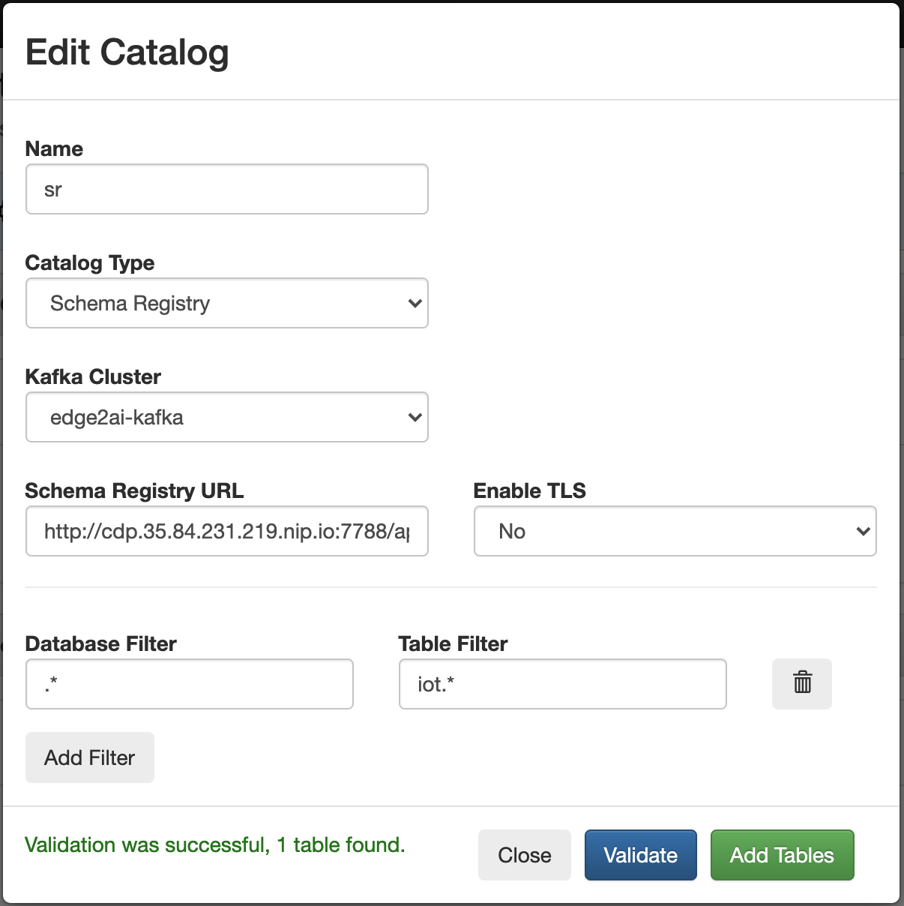
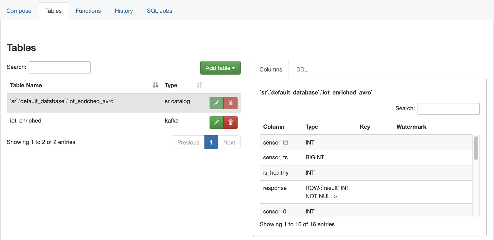

= Querying streams with SQL

In this workshop you will use SQL Stream Builder to query and manipulate data streams using SQL language. SQL Stream Builder is a powerful service that enables you to create Flink jobs without having to write Java/Scala code.

== Labs summary

* *Lab 1* - Create a Data Provider
* *Lab 2* - Create a Table for a topic with JSON messages
* *Lab 3* - Integrate SQL Stream Builder with Schema Registry
* *Lab 4* - Computing and storing agregation results
* *Lab 5* - Materialized Views

== Preparation

The labs in this workshop assume that the link:streaming.adoc[From Edge to Streams Processing] workshop has been completed.

If you haven't completed that workshop, please SSH to your cluster host and run the following command to prepare the environment:

NOTE: The command below will undo everything done in the cluster in previous workshops.

[source,shell]
----
/tmp/resources/reset-to-lab.sh
----

== Introduction

In these labs we will use the `iot_enriched` topic created and populated in previous labs and contains a datastream of computer performance data points.

So let's start with a straightforward goal: to query the contents of the `iot_enriched` topic using SQL to examine the data that is being streamed.

Albeit simple, this task will show the ease of use and power of SQL Stream Builder (SSB).

[[lab_1, Lab 1]]
== Lab 1 - Create a Data Provider

Before we can start querying data from Kafka topics we need to register the Kafka clusters as _data sources_ in SSB.

. On the Cloudera Manager console, click on the Cloudera logo at the top-left corner to ensure you are at the home page and then click on the *SQL Stream Builder* service.

. Click on the *SQLStreamBuilder Console* link to open the SSB UI.

. On the logon screen, authenticate with user `admin` and password `supersecret1`.

. You will notice that SSB already has a Kafka cluster registered as a data provider, named `CDP Kafka`. This provider is created automatically for SSB when it is installed on a cluster that also has a Kafka service:
+
image::images/ssb-register-kafka-provider.png[width=800]

. You can use this screen to add other external Kafka clusters as data providers to SSB. In this lab we'll add a second data provider using a different host name, just to show how simple it is.

. Click on *Register Kafka Provider* and in the *Add Kafka Provider* window, enter the details for our new data source and click *Save changes*.
+
[source,yaml]
----
Name:                           edge2ai-kafka
Brokers:                        edge2ai-1.dim.local:9092
Connection protocol:            PLAINTEXT
----
+
image::images/ssb-add-kafka-provider.png[width=400]

[[lab_2, Lab 2]]
== Lab 2 - Create a Table for a topic with JSON messages

Now we can _map_ the `iot_enriched` topic to a _table_ in SQL Stream Builder.
_Tables_ in SSB are a way to associate a Kafka topic with a schema so that we can use it in our SQL queries.

. To create our first Table, click on *Console* (on the left bar) *> Tables > Add table > Apache Kafka*.
+

. On the *Kafka* window, enter the following information:
+
[source,yaml]
----
Virtual table name: iot_enriched
Kafka Cluster:      edge2ai-kafka
Topic Name:         iot_enriched
Data Format:        JSON
----
+
image::images/ssb-kafka-source.png[width=400]

. Ensure the *Schema* tab is selected. Scroll to the bottom of the tab and click *Detect Schema*. SSB will take a sample of the data flowing through the topic and will infer the schema used to parse the content. Alternatively you could also specify the schema in this tab.
+
image::images/ssb-detect-schema.png[width=400]

. If we need to manipulate the source data to fix, cleanse or convert some values, we can define transformations for the table. Transformations are defined in Javascript code.
+
The serialized record read from Kafka is provided to the Javascript code in the `record` variable. The last command of the transformation code must return the serialized content of the modified record.
+
The data in the `iot_enriched` topic has a timestamp expressed in microseconds. We want to have this field converted to milliseconds. Let's write a transformation to perform that conversion for us.
+
Click on the *Transformations* tab and enter the following code in the *Code* field:
+
[source,javascript]
----
// parse the JSON record
var parsedVal = JSON.parse(record.value);
// Convert sensor_ts from micro to milliseconds
parsedVal['sensor_ts'] = Math.round(parsedVal['sensor_ts']/1000);
// serialize output as JSON
JSON.stringify(parsedVal);
----
+
image::images/ssb-source-transformations.png[width=400]

. Now that we have converted the `sensor_ts` field to milliseconds, we can tell SSB to use it as a source for the event time, which is the time that will be used for defining aggregation windows for our queries.
+
To do this, click on the *Event Time* tab and configure the following properties:
+
[source]
----
Input Timestamp Column: sensor_ts
Event Time Column:      event_time
Watermark Seconds:      3
----
+

+
This will add the `event_time` column to the table. This column has a `TIMESTAMP ROWTIME` data type and is derived from the value of the `sensor_ts` column.

. Click on the *Properties* tab, enter the following value for the *Consumer Group* property and click *Save changes*.
+
[source,yaml]
----
Consumer Group: ssb-iot-1
----
+
image::images/ssb-source-properties.png[width=400]
+
NOTE: Setting the *Consumer Group* properties for a virtual table will ensure that if you stop a query and restart it later, the second query execute will continue to read the data from the point where the first query stopped, without skipping data. *However*, if _multiple queries_ use the same virtual table, setting this property will effectively distribute the data across the queries so that each record is only read by a single query. If you want to share a virtual table with multiple distinct queries, ensure that the Consumer Group property is unset.

. Let's query the newly created table to ensure things are working correctly. Click on *>_Console > Compose > SQL* and type the following query:
+
[source,sql]
----
SELECT *
FROM iot_enriched
----

. Click on *Execute*. After a few seconds you should see the data from the topic displayed on the *Results* panel:

. Click *Stop* to stop the job and release all the cluster resources used by the query.
You can double-check that all queries/jobs have been stopped by clicking on the *SQL Jobs* tab.
If any jobs are still running, you can stop them from that page.

[[lab_3, Lab 3]]
== Lab 3 - Integrate SQL Stream Builder with Schema Registry

The SQL Stream Builder's integration with Schema Registry automatically exposes the schemas stored in the registry as tables in SSB.
The schema names in Schema Registry _must match the corresponding topic names_ in Kafka.

In this lab we will register Schema Registry as a catalog in SSB so that we can automatically read the contents of the `iot_enriched_avro` topic, which is stored in AVRO format.

. Go to the following URL, which contains the schema definition for the data in the `iot_enriched_avro` topic. Select and copy the contents of the page.
+
`link:https://raw.githubusercontent.com/cloudera-labs/edge2ai-workshop/master/sensor.avsc[https://raw.githubusercontent.com/cloudera-labs/edge2ai-workshop/master/sensor.avsc, window="_blank"]`

. In the Schema Registry Web UI, click the `+` sign to register a new schema.

. Click on a blank area in the *Schema Text* field and paste the contents you copied.

. Complete the schema creation by filling the following properties and save the schema.
+
[source]
----
Name:          iot_enriched_avro
Description:   Schema for the data in the iot_enriched_avro topic
Type:          Avro schema provider
Schema Group:  Kafka
Compatibility: Backward
Evolve:        checked
----

. Back on the SQL Stream Builder page, click on *Data Providers* (on the left bar) *> (+) Register Catalog*.

. In the *Add Catalog* screen, enter the following details:
+
[source]
----
Name:                sr
Catalog Type:        Schema Registry
Kafka Cluster:       edge2ai-kafka
Schema Registry URL: http://cdp.35.84.231.219.nip.io:7788/api/v1
Enable TLS:          No
----

. Click on the *Add Filter* button and enter the following configuration for the filter:
+
[source]
----
Database Filter: .*
Table Filter:    iot.*
----

. Click on *Validate*. If the configuration is correct you should see the message "Validation was successful, 1 table found."

. Click on *Add Tables*.

. On the *Tables* screen you should see now the list of tables that were imported from Schemar Registry.

. Query the imported table to ensure it is working correctly. Click on *>_Console > Compose > SQL* and type the following query:
+
[source,sql]
----
SELECT *
FROM `sr`.`default_database`.`iot_enriched_avro`
----

. Click on *Execute*. After a few seconds you should see the data from the topic displayed on the *Results* panel.

. Click *Stop* to stop the job and release all the cluster resources used by the query.
You can double-check that all queries/jobs have been stopped by clicking on the *SQL Jobs* tab.
If any jobs are still running, you can stop them from that page.

[[lab_4, Lab 4]]
== Lab 4 - Computing and storing aggregation results

Now that we have already run a few basic queries and confirmed that our tables are working correctly,
we want to start computing aggregates for our incoming data stream and make the results available
for downstream applications.

SQL Stream Builder's Tables give us the ability to publish/store streaming data to several different services (Kafka, AWS S3, Google GCS, Kudu, HBase, etc...).

In this lab we'll use another Kafka table to publish the results of our aggregation to another Kafka topic.

. Let's first create a topic (`sensor6_stats`) where to publish our aggregation results:
.. Navigate to the SMM UI (*Cloudera Manager > SMM* service *>
Streams Messaging Manager Web UI*).
.. On the SMM UI, click the *Topics* tab (image:images/topics_icon.png[width=25]).
.. Click the *Add New* button.
.. Enter the following details for the topic and click *Save* when ready:
... Topic name: `sensor6_stats`
... Partitions: `10`
... Availability: `Low`
... Cleanup Policy: `delete`

. To create the Table, click on *Console* (on the left bar) *> Tables > Add table > Apache Kafka*.
+

. On the *Kafka Sink* window, enter the following information and click *Save changes*:
+
[source,yaml]
----
Virtual table name: sensor6_stats_sink
Kafka Cluster:      edge2ai-kafka
Topic Name:         sensor6_stats
Dynamic Schema:     Enabled
----
+
image::images/ssb-kafka-sink.png[width=400]

. On the SSB UI, click on *Console* (on the left bar) *> Compose > SQL* and type the query shown below.
+
This query will compute aggregates over 30-seconds windows that slide forward every second. For a specific sensor value in the record (`sensor_6`) it computes the following aggregations for each window:
+
--
* Number of events received
* Sum of the `sensor_6` value for all the events
* Average of the `sensor_6` value across all the events
* Min and max values of the `sensor_6` field
* Number of events for which the `sensor_6` value exceeds `70`
--
+
[source,sql]
----
SELECT
  sensor_id as device_id,
  HOP_END(event_time, INTERVAL '1' SECOND, INTERVAL '30' SECOND) as windowEnd,
  count(*) as sensorCount,
  sum(sensor_6) as sensorSum,
  avg(cast(sensor_6 as float)) as sensorAverage,
  min(sensor_6) as sensorMin,
  max(sensor_6) as sensorMax,
  sum(case when sensor_6 > 70 then 1 else 0 end) as sensorGreaterThan60
FROM iot_enriched
GROUP BY
  sensor_id,
  HOP(event_time, INTERVAL '1' SECOND, INTERVAL '30' SECOND)
----
+
image::images/ssb-sql-aggregation.png[width=800]

. Enter `Sensor6Stats` for the *SQL Job Name* field.

. On the *Sink Virtual Table* field, click on the *None* drop-down and select the Virtual Sink Table that you created previously (`sensor6_stats_sink`)
+
image::images/ssb-select-sink.png[width=800]

. Click *Execute*.

. Scroll to the bottom of the page and you will see the log messages generated by your query execution.
+
image::images/ssb-sql-execution.png[width=800]

. After a few seconds the SQL Console will start showing the results of your aggregation query.
+
Note that the data displayed on the screen is only a sample of the data returned by the query, not the full data.
+
image::images/ssb-sql-aggr-results.png[width=800]

. Check the job execution details and logs by clicking on *Console* (on the left bar) *> SQL Jobs* tab. Explore the options on this screen:
+
--
.. Click on the `Sensor6Stats` job.
.. Click on the *Details* tab to see job details.
.. Click on the *Log* tab to see log messages generated by the job execution.
--
+
image::images/ssb-job-details.png[width=800]

. Click on the *Flink Dashboard* link to open the job's page on the dashboard. Navigate the dashboard pages to explore details and metrics of the job execution.
+
image::images/ssb-job-dashboard.png[width=800]

. Let's query the `sensor6_stats` topic to examine the data that is being written to it.
Since we were using a table with a *dynamic schema* to write the data to that topic, we cannot use it for reads. We need to define a new Table associated with the `sensor6_stats` topic with a schema for reads.
+
--
.. Click on *Console* (on the left bar) *> Tables > Add table > Apache Kafka*.
.. On the *Kafka Source* window, enter the following information and click *Save changes*:
+
[source,yaml]
----
Virtual table name: sensor6_stats
Kafka Cluster:      edge2ai-kafka
Topic Name:         sensor6_stats
Data Format:        JSON
----
--
.. Click on *Detect Schema* and wait for the schema to be updated.
.. Click *Save changes*.

. Click on *Console* (on the left bar) to refresh the screen and clear the SQL Compose field, which may still show the running aggregation job.
+
Note that the job will continue to run in the background. You can monitor and manage it through the *SQL Jobs* page.

. Enter the following query in the SQL field and execute it:
+
[source,sql]
----
SELECT *
FROM sensor6_stats
----

. After a few seconds you should see the contents of the `sensor6_stats` topic displayed on the screen:
+
image::images/ssb-stats-results.png[width=800]

. You will need to leave the `Sensor6Stats` job running to use it in the next lab. Make sure you stop all other jobs to release cluster resources.
+
image::images/ssb-jobs-running.png[width=800]

[[lab_5, Lab 5]]
== Lab 5 - Materialized Views

SQL Stream Builder can also take keyed snapshots of the data stream and make that available through a REST interface in the form of Materialized Views.
In this lab we'll create and query Materialized Views (MV).

We will define MVs on top of the query we created in the previous lab. Make sure that query is running before executing the steps below.

. On the *Console_ > SQL Jobs* tab, verify that the `Sensor6Stats` job is running. Select the job and click on the *Edit Selected Job* button.
+
image::images/ssb-edit-job.png[width=800]

. Select the *Materialized View* tab for that job and set the following values for the MV properties:
+
[source,python]
----
Primary Key:           device_id
Retention:             300
Recreate on Job Start: Yes
Ignore NULLs:          Yes
----
+
image::images/ssb-mv-config1.png[width=300]

. To create a MV we need to have an API Key. The API key is the information given to clients so that they can access the MVs. If you have multiple MVs and want them to be accessed by different clients you can have multiple API keys to control access.
+
If you have already created an API Key in SSB you can select it from the drop-down list. Otherwise, create one on the spot by clicking on the *Add API Key* button shown above. Use `ssb-lab` as the Key Name.

. Click *Apply Configuration*. This will enable the *Add Query* button in the *Materialized View Queries* section.

. Click *Add Query* to create a new MV. We want to create a view that shows all the devices for which `sensor6` has had at least 1 reading above 60 in the last recorded 30 second window. For this, enter the following parameters in the MV Query Configuration page:
+
[source,python]
----
URL Pattern:   above60
Query Builder: <click "Select All" to add all columns>
Filters:       sensorGreatThan60  greater  0
----
+
image::images/ssb-mv-config2.png[width=400]

. Click *Save Changes*.
. Copy the new MV URL that's shown on the screen and open it in a new browser tab (or simply click on the URL link). You will see the content of the MV current snapshot.
+
If you refresh the page a few times you will notice that the MV snapshot is updated as new data points are coming through the stream.
+
SSB keeps the last state of the data for each value of the defined primary key.
+
image::images/ssb-mv-contents.png[width=800]

==== Materialized View with parameters
The MV we created above takes no filter parameters; it always returns the full content of the MV when you call the REST endpoint.
It is possible, though, to specify parameters for a MV so that you can filter the contents at query time.

Below we will create a new MV that allows filtering by specifying a range for the `sensorAverage` column.

. Click the *Add Query* button to create a new MV, enter the following parameter and click *Save Changes*.
+
[source,python]
----
URL Pattern:   above60withRange/{lowerTemp}/{upperTemp}
Query Builder: <click "Select All" to add all columns>
Filters:       sensorGreatThan60  greater           0
               AND
               sensorAverage      greater or equal  {lowerTemp}
               AND
               sensorAverage      less or equal     {upperTemp}
----
+
image::images/ssb-mv-config3.png[width=400]

. You will notice that the new URL for this MV has placeholders for the `{lowerTemp}` and `{upperTemp}` parameters:
+
image::images/ssb-mv-parameters.png[width=800]

. Copy the MV URL to a text editor and replace the placeholders with actual values for those parameters.
+
The example below shows a filter for `sensorAverage` values between 80 and 85, inclusive:
+
[source]
----
.../above60withRange/50/70?key=...
----

. After replacing the values, open the URL on your web browser to retrieve the filtered data.
+
Try changing the value range to verify that the filter is working as expected.

. Once you have finished the lab, click on the *SQL Jobs* tab and stop all your jobs to release cluster resources.

== Conclusion

We have now taken data from one topic, calculated aggregated results and written these to another topic.
IIn order to validate that this was successful we have selected the result with an independent select query.
Finally, we created Materialized Views for one of our jobs and queried those views through their REST endpoints.

