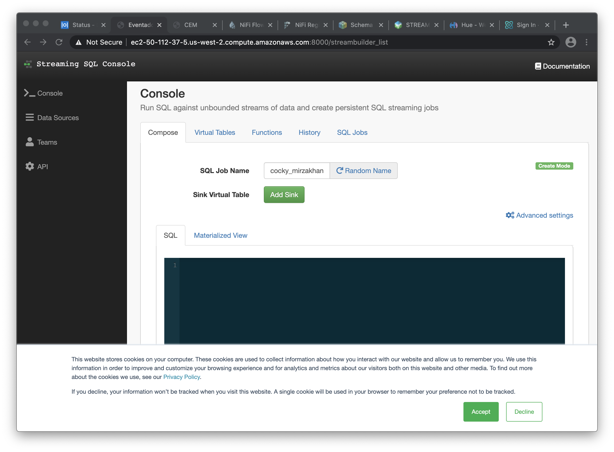
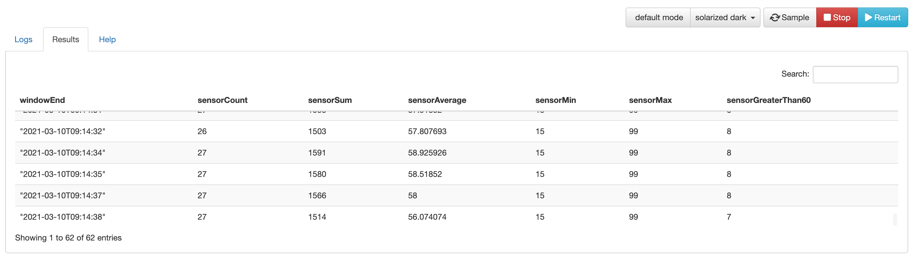

= Querying streams with SQL

NOTE: This lab assumes that the link:streaming.adoc[From Edge to Streams Processing] lab has been completed. If you haven't done so, please ask your instructor to set your cluster state for you so that you can perform the steps in this lab (or you can do this yourself by SSH'ing to your cluster host and running the script `/tmp/resources/reset-to-lab.sh`)

In this workshop you will use SQL Stream Builder to query and manipulate data streams using SQL language. SQL Stream Builder is a powerful service that enables you to create Flink jobs without having to write Java/Scala code.

== Labs summary

* *Lab 1* - Create a Data Source
* *Lab 2* - Create a Source Virtual Table
* *Lab 3* - Run a simple query
* *Lab 4* - Computing and storing agregation results

== Introduction

In this lab, and the subsequent ones, we will use the `iot` topic created and populated in previous labs and contains a datastream of computer performance data points.

So let's start with a straightforward goal: to query the contents of the `iot` topic using SQL to examine the data that is being streamed.

Albeit simple, this task will show the ease of use and power of SQL Stream Builder (SSB).

[[lab_1, Lab 1]]
== Lab 1 - Create a Data Source

Before we can start querying data from Kafka topics we need to register the Kafka clusters as _data sources_ in SSB.

. On the Cloudera Manager console, click on the Cloudera logo at the top-left corner to ensure you are at the home page and then click on the *SQL Stream Builder* service.

. Click on the *SQLStreamBuilder Console* link to open the SSB UI.
.. On the first access you will be prompted to accept the use of cookies on this page. Click *Accept* to dismiss that message.
+

. To register our Kafka cluster, click *Data Sources > Register Kafka Provider*:
+
image::images/ssb-register-kafka-provider.png[width=800]

. In the *Add Kafka Provider* window, enter the details of our Kafka cluster and click *Save changes*.
+
[source,yaml]
----
Name:                edge2ai-kafka
Brokers:             edge2ai-1.dim.local:9092
Connection protocol: PLAINTEXT
Use Schema Registry: No
----
+
image::images/ssb-add-kafka-provider.png[width=400]

[[lab_2, Lab 2]]
== Lab 2 - Create a Source Virtual Table

Now we can _map_ the `iot` topic to a _virtual table_ that we can reference in our query. _Virtual Tables_ on SSB are a way to associate a Kafka topic with a schema so that we can use that as a table in our queries. There are two types of virtual tables in SSB: _Source_ and _Sink_.

We will use a Source Virtual Table now to read from the topic. Later we will look into Sink Virtual Tables to write data to Kafka.

. To create our first Source Virtual Table, click on *Console* (on the left bar) *> Virtual Tables > Source Virtual Table > Add Source > Apache Kafka*.
+
image::images/ssb-add-source-virtual-table.png[width=800]

. On the *Kafka Source* window, enter the following information:
+
[source,yaml]
----
Virtual table name: iot_source
Kafka Cluster:      edge2ai-kafka
Topic Name:         iot
Data Format:        JSON
----
+
image::images/ssb-kafka-source.png[width=400]

. Ensure the *Schema* tab is selected. Scroll to the bottom of the tab and click *Detect Schema*. SSB will take a sample of the data flowing through the topic and will infer the schema used to parse the content. Alternatively you could also specify the schema in this tab.
+
image::images/ssb-detect-schema.png[width=400]

. If we need to manipulate the source data to fix, cleanse or convert some values, we can define transformations for the data source to perform those changes. These transformations are defined in Javascript.
+
The serialized record read from Kafka is provided to the Javascript code in the `record` variable. The last command of the transformation must return the serialized content of the modified record.
+
The data in the `iot` topic has a timestamp expressed in microseconds. Let's say we need the value in seconds. Let's write a transformation to perform that conversion for us at the source.
+
Click on the *Transformations* tab and enter the following code in the *Code* field:
+
[source,javascript]
----
// parse the JSON record
var parsedVal = JSON.parse(record);
// Convert sensor_ts from micro to milliseconds
parsedVal['sensor_ts'] = Math.round(parsedVal['sensor_ts']/1000000);
// serialize output as JSON
JSON.stringify(parsedVal);
----
+
image::images/ssb-source-transformations.png[width=400]

. Click on the *Properties* tab, enter the following value for the *Consumer Group* property and click *Save changes*.
+
[source,yaml]
----
Consumer Group: ssb-iot-1
----
+
image::images/ssb-source-properties.png[width=400]
+
NOTE: Setting the *Consumer Group* properties for a virtual table will ensure that if you stop a query and restart it later, the second query execute will continue to read the data from the point where the first query stopped, without skipping data. *However*, if _multiple queries_ use the same virtual table, setting this property will effectively distribute the data across the queries so that each record is only read by a single query. If you want to share a virtual table with multiple distinct queries, ensure that the Consumer Group property is unset.

[[lab_3, Lab 3]]
== Lab 3 - Run a simple query

We have now all that we need to run our first query in SSB. We want to simply query the raw contents of topic to ensure that the everything is working correctly before we proceed to do more complex things.

If your environment is healthy and all the steps from previous labs were completed correctly you should be able to visualize the data with the steps below.

. On the SSB UI, click on *Console* (on the left bar) *> Compose > SQL* and type the following query:
+
[source,sql]
----
select *
from iot_source
----
+
image::images/ssb-compose-sql.png[width=800]

. Set a *SQL Job Name* for your job or use the random name provided.

. Do *not* add a Sink Virtual Table.

. Click *Execute*

. Scroll to the bottom of the page and you will see the log messages generated by your query execution.
+
image::images/ssb-sql-execution.png[width=800]

. After a few seconds the SQL Console will start showing the results of the query coming from the `iot` topic.
+
The data displayed on the screen is only a sample of the data returned by the query, not the full data.
+
image::images/ssb-sql-results.png[width=800]
+
Note that the values of the column `sensor_ts` now show in seconds instead of microseconds, thanks to the transformation we created for the `iot_source` virtual table.

[[lab_4, Lab 4]]
== Lab 4 - Computing and storing agregation results

We want to start computing window aggregates for our incoming data stream and make the aggregation results available for downstream applications. SQL Stream Builder's Sink Virtual Tables give us the ability to publish/store streaming data to several different services (Kafka, AWS S3, Google GCS, Elastic Search and generic webhooks). In this lab we'll use a Kafka sink to publish the results of our aggregation to another Kafka topic.

. Let's first create a topic (`sensor6_stats`) where to publish our aggregation results:
.. Navigate to the SMM UI (*Cloudera Manager > SMM* service *>
Streams Messaging Manager Web UI*).
.. On the SMM UI, click the *Topics* tab (image:images/topics_icon.png[width=25]).
.. Click the *Add New* button.
.. Enter the following details for the topic and click *Save* when ready:
... Topic name: `sensor6_stats`
... Partitions: `10`
... Availability: `Low`
... Cleanup Policy: `delete`

. To create the Sink Virtual Table, click on *Console* (on the left bar) *> Virtual Tables > Sink Virtual Table > Add Source > Apache Kafka*.
+
image::images/ssb-add-sink-virtual-table.png[width=800]

. On the *Kafka Sink* window, enter the following information and click *Save changes*:
+
[source,yaml]
----
Virtual table name: sensor6_stats_sink
Kafka Cluster:      edge2ai-kafka
Topic Name:         sensor6_stats
----
+
image::images/ssb-kafka-sink.png[width=400]

. On the SSB UI, click on *Console* (on the left bar) *> Compose > SQL* and type the query shown below.
+
This query will compute aggregates over 30-seconds windows that slide forward every second. For a specific sensor value in the record (`sensor_6`) it computes the following aggregations for each window:
+
--
* Number of events received
* Sum of the `sensor_6` value for all the events
* Average of the `sensor_6` value across all the events
* Min and max values of the `sensor_6` field
* Number of events for which the `sensor_6` value exceeds `70`
--
+
[source,sql]
----
SELECT
  HOP_END(eventTimestamp, INTERVAL '1' SECOND, INTERVAL '30' SECOND) as windowEnd,
  count(*) as sensorCount,
  sum(sensor_6) as sensorSum,
  avg(cast(sensor_6 as float)) as sensorAverage,
  min(sensor_6) as sensorMin,
  max(sensor_6) as sensorMax,
  sum(case when sensor_6 > 70 then 1 else 0 end) as sensorGreaterThan60
FROM iot_source
GROUP BY
  HOP(eventTimestamp, INTERVAL '1' SECOND, INTERVAL '30' SECOND)
----
+
image::images/ssb-sql-aggregation.png[width=800]

. Enter `Sensor 6 stats` for the *SQL Job Name* field.

. On the *Sink Virtual Table* field, click on the *None* drop-down and select the Virtual Sink Table that you created previously (`sensor6_stats`)
+
image::images/ssb-select-sink.png[width=800]

. Click *Execute*. After a few seconds you should see the sampled output of the query in the *Results* tab.

. Scroll to the bottom of the page and you will see the log messages generated by your query execution.
+
image::images/ssb-sql-execution.png[width=800]

. After a few seconds the SQL Console will start showing the results of the query coming from the `iot` topic.
+
The data displayed on the screen is only a sample of the data returned by the query, not the full data.
+

. Check the job execution details and logs by clicking on *Console* (on the left bar) *> SQL Jobs* tab. Explore the options on this screen:
+
--
.. Click on the `Sensor 6 stats` job
.. Click on the *Details* tab to see job details.
.. Click on the *Log* tab to see log messages generated by the job execution.
--
+
image::images/ssb-job-details.png[width=800]

. Let's query the `sensor6_stats` table to examine the data that is being written to it. First we need to define a Source Virtual Table associated with the `sensor6_stats` topic.
+
--
.. Click on *Console* (on the left bar) *> Virtual Tables > Source Virtual Table > Add Source > Apache Kafka*.
.. On the *Kafka Source* window, enter the following information and click *Save changes*:
+
[source,yaml]
----
Virtual table name: sensor6_stats_source
Kafka Cluster:      edge2ai-kafka
Topic Name:         sensor6_stats
Data Format:        JSON
----
--
.. Click on *Detect Schema* and wait for the schema to be updated.
.. Click *Save changes*.

. Click on *Console* (on the left bar) to refresh the screen and clear the SQL Compose field, which may still show the running aggregation job.
+
Note that the job will continue to run in the background and you can continue to monitor it through the *Job Logs* page.

. Enter the following query in the SQL field and execute it:
+
[source,sql]
----
SELECT *
FROM sensor6_stats_source
----

. After a few seconds you should see the contents of the `sensor6_stats` topic displayed on the screen:
+
image::images/ssb-stats-results.png[width=800]
