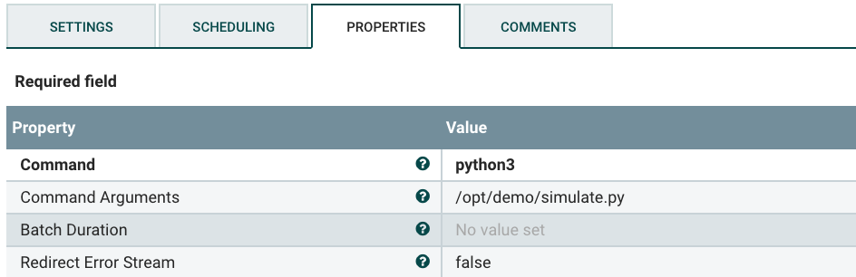

= From Edge to Streams Processing

In this workshop you'll implement a data pipeline, using MiNiFi and NiFi to ingest data from an IoT device into Kafka and then consume data from Kafka and write it to Kudu tables.

== Labs summary

* *Lab 1* - On the Apache NiFi, run a simulator to send IoT sensors data to the MQTT broker.
* *Lab 2* - Create the MiNiFi flow on the Edge Flow Manager and publish it for the MiNiFi agent to start sending data to the NiFi cluster.
* *Lab 3* - On Schema Registry, register the schema describing the data generated by the IoT sensors.
* *Lab 4* - On the NiFi cluster, prepare the data and send it to the **Kafka** cluster.
* *Lab 5* - On the *Streams Messaging Manager (SMM)* Web UI, monitor the Kafka cluster and confirm data is being ingested correctly.
* *Lab 6* - Enable Kafka Replication with *Streams Replication Manager (SRM)*
* *Lab 7* - Use the Edge Flow Manager to update existing edge flows and perform additional processing on the edge
* *Lab 8* - Use NiFi to process each record, calling the **Model endpoint** and save results to **Kudu**.
* *Lab 9* - Check the data on Kudu.

[[lab_1, Lab 1]]
== Lab 1 - Apache NiFi: setup machine sensors simulator 

In this lab you will run a simple Python script that simulates IoT sensor data from some hypothetical machines, and send the data to a MQTT broker (link:https://mosquitto.org/[mosquitto]). The MQTT broker plays the role of a gateway that is connected to many and different type of sensors through the "mqtt" protocol. Your cluster comes with an embedded MQTT broker that the simulation script publishes to. For convenience, we will use NiFi to run the script rather than Shell commands.

. Go to Apache NiFi and add a Processor (ExecuteProcess) to the canvas.
+
image::images/simulate1.png[width=800]

. Right-click the processor, select *Configure* (or, alternatively, just double-click the processor). On the *PROPERTIES* tab, set the properties shown below to run our Python simulate script.
+
[source]
----
Command:           python3
Command Arguments: /opt/demo/simulate.py
----
+

. In the *SCHEDULING* tab, set to *Run Schedule: 1 sec*
+
Alternatively, you could set that to other time intervals: 1 sec, 30 sec, 1 min, etc...
+
image::images/runSimulator1or30.png[width=500]

. In the *SETTINGS* tab, check the "*success*" relationship in the *AUTOMATICALLY TERMINATED RELATIONSHIPS* section. Click *Apply*.
+
image::images/nifiTerminateRelationships.png[width=600]

. You can then right-click to *Start* this simulator runner.
+
image::images/nifiDemoStart.png[width=400]

. Right-click and select *Stop* after a few seconds and look at the *provenance*. You'll see that it has run a number of times and produced results.
+
image::images/NiFiViewDataProvenance.png[width=400]
+
image::images/NiFiDataProvenance.png[width=800]

[[lab_2, Lab2]]
== Lab 2 - Configuring Edge Flow Management

Cloudera Edge Flow Management gives you a visual overview of all MiNiFi agents in your environment, and allows you to update the flow configuration for each one, with versioning control thanks to the **NiFi Registry** integration. In this lab, you will create the MiNiFi flow and publish it for the MiNiFi agent to pick it up.

. Open the EFM Web UI at http://<public_dns>:10080/efm/ui/. Ensure you see your minifi agent's heartbeat messages in the **Events Monitor**. Click on the info icon on a heartbeat record to see the details of the heartbeat.
+
image::images/cem_heartbeats.png[width=800]

. You can then select the **Flow Designer** tab (image:images/flow_designer_icon.png[width=30]). To build a dataflow, select the desired class (`iot-1`) from the table and click *OPEN*.  Alternatively, you can double-click on the desired class.

. Add a _ConsumeMQTT_ Processor to the canvas, by dragging the processor icon to the canvas, selecting the _ConsumeMQTT_ processor type and clicking on the *Add* button. Once the processor is on the canvas, double-click it and configure it with below settings:
+
[source]
----
Broker URI:     tcp://edge2ai-1.dim.local:1883
Client ID:      minifi-iot
Topic Filter:   iot/#
Max Queue Size: 60
----
+
image::images/add_consumer_mqtt.png[width=800]
+
And ensure you scroll down on the properties page to set the *Topic Filter* and *Max Queue Size*:
+
image::images/add_consumer_mqtt_2.png[width=800]

. Add a _Remote Process Group_ (RPG) to the canvas and configure it as follows:
+
[source]
----
URL:                http://edge2ai-1.dim.local:8080/nifi
Transport Protocol: HTTP
----
+
image::images/add_rpg.png[width=800]

. At this point you need to connect the ConsumerMQTT processor to the RPG. For this, you first need to add an Input Port to the remote NiFi server. Open the NiFi Web UI at `\http://<public_dns>:8080/nifi/` and drag the _Input Port_ to the canvas. Call it something like "from Gateway".
+
image::images/add_input_port.png[width=800]

. To terminate the NiFI _Input Port_ let's, for now, add a _Funnel_ to the canvas...
+
image::images/add_funnel.png[width=600]

. ... and setup a connection from the Input Port to it. To setup a connection, hover the mouse over the Input Port until an arrow symbol is shown in the center. Click on the arrow, drag it and drop it on the Funnel to connect the two elements.
+
image::images/connecting.png[width=800]

. Right-click on the Input Port and start it. Alternatively, click on the Input Port to select it and then press the start ("play") button on the Operate panel:
+
image::images/operate_panel.png[width=300]

. You will need the ID of the _Input Port_ to complete the connection of the _ConsumeMQTT_ processor to the RPG (NiFi). Double-click on the _Input Port_ and copy its ID.
+
image::images/input_port_id.png[width=800]

. Back to the Flow Designer, connect the ConsumeMQTT processor to the RPG. The connection requires an ID and you can paste here the ID you copied from the Input Port. *Make sure that there are NO SPACES*!
+
image::images/connect_to_rpg.png[width=800]
+
Double-click the connection to check the configuration:
+
image::images/efmSetCloudConfiguration.png[width=400]

. The Flow is now complete, but before publishing it, create the Bucket in the _NiFi Registry_ so that all versions of your flows are stored for review and audit. Open the NiFi Registry at `\http://<public_dns>:18080/nifi-registry`, click on the wrench/spanner icon (image:images/spanner_icon.png[width=20]) on the top-right corner on and create a bucket called `IoT` (*ATTENTION*: the bucket name is *CASE-SENSITIVE*).
+
image::images/create_bucket.png[width=800]

. You can now publish the flow for the MiNiFi agent to automatically pick up. Click *Publish*, add a descriptive comment for your changes and click *Apply*.
+
image::images/publish_flow.png[width=800]
+
image::images/cem_first_version.png[width=800]

. Go back to the *NiFi Registry* Web UI and click on the *NiFi Registry* name, next to the Cloudera logo. If the flow publishing was successful, you should see the flow's version details in the NiFi Registry.
+
image::images/flow_in_nifi_registry.png[width=800]

. At this point, you can test the edge flow up until NiFi. Start the NiFi simulator (ExecuteProcess processor) again and confirm you can see the messages queued in NiFi.
+
image::images/queued_events.png[width=300]

. You can stop the simulator (Stop the NiFi processor) once you confirm that the flow is working correctly.

[[lab_3, Lab 3]]
== Lab 3 - Registering our schema in Schema Registry

The data produced by the temperature sensors is described by the schema in file `link:https://raw.githubusercontent.com/asdaraujo/edge2ai-workshop/master/sensor.avsc[sensor.avsc]`. In this lab we will register this schema in Schema Registry so that our flows in NiFi can refer to schema using an unified service. This will also allow us to evolve the schema in the future, if needed, keeping older versions under version control, so that existing flows and flowfiles will continue to work.

. Go to the following URL, which contains the schema definition we'll use for this lab. Select all contents of the page and copy it.
+
`link:https://raw.githubusercontent.com/asdaraujo/edge2ai-workshop/master/sensor.avsc[https://raw.githubusercontent.com/asdaraujo/edge2ai-workshop/master/sensor.avsc, window="_blank"]`

. In the Schema Registry Web UI, click the `+` sign to register a new schema.

. Click on a blank area in the *Schema Text* field and paste the contents you copied.

. Complete the schema creation by filling the following properties and save the schema.
+
[source]
----
Name:          SensorReading
Description:   Schema for the data generated by the IoT sensors
Type:          Avro schema provider
Schema Group:  Kafka
Compatibility: Backward
Evolve:        checked
----
+
image::images/register_schema.png[width=800]

[[lab_4, Lab 4]]
== Lab 4 - Configuring the NiFi flow and pushing data to Kafka

In this lab, you will create a NiFi flow to receive the data from all gateways and push it to **Kafka**.

=== Creating a Process Group

Before we start building our flow, let's create a Process Group to help organizing the flows in the NiFi canvas and also to enable flow version control.

. Open the NiFi Web UI, create a new Process Group and name it something like *Process Sensor Data*.
+
image::images/create_pgroup.png[width=800]

. We want to be able to version control the flows we will add to the Process Group. In order to do that, we first need to connect NiFi to the *NiFi Registry*. On the NiFi global menu, click on "Controller Settings", navigate to the "Registry Clients" tab and add a Registry client with the following URL:
+
----
Name: NiFi Registry
URL:  http://edge2ai-1.dim.local:18080
----
+
image::images/global_controller_settings.png[width=800]
+
image::images/add_registry_client.png[width=800]

. On the *NiFi Registry* Web UI, add another bucket for storing the Sensor flow we're about to build'. Call it `SensorFlows`:
+
image::images/sensor_flows_bucket.png[width=800]

. Back on the *NiFi* Web UI, to enable version control for the Process Group, right-click on it and select *Version > Start version control* and enter the details below. Once you complete, a image:images/version_control_tick.png[width=20] will appear on the Process Group, indicating that version control is now enabled for it.
+
[source]
----
Registry:  NiFi Registry
Bucket:    SensorFlows
Flow Name: SensorProcessGroup
----

. Let's also enable processors in this Process Group to use schemas stored in Schema Registry. Right-click on the Process Group, select *Configure* and navigate to the *Controller Services* tab. Click the *`+`* icon and add a *HortonworksSchemaRegistry* service. After the service is added, click on the service's _cog_ icon (image:images/cog_icon.png[width=20]), go to the *Properties* tab and configure it with the following *Schema Registry URL* and click *Apply*.
+
[source]
----
URL: http://edge2ai-1.dim.local:7788/api/v1
----
+
image::images/added_hwx_sr_service.png[width=800]

. Click on the _lightning bolt_ icon (image:images/enable_icon.png[width=20]) to *enable* the *HortonworksSchemaRegistry* Controller Service.

. Still on the *Controller Services* screen, let's add two additional services to handle the reading and writing of JSON records. Click on the image:images/plus_button.png[width=25] button and add the following two services:
** *`JsonTreeReader`*, with the following properties:
+
[source]
----
Schema Access Strategy: Use 'Schema Name' Property
Schema Registry:        HortonworksSchemaRegistry
Schema Name:            ${schema.name} -> already set by default!
----

** *`JsonRecordSetWriter`*, with the following properties:
+
[source]
----
Schema Write Strategy:  HWX Schema Reference Attributes
Schema Access Strategy: Use 'Schema Name' Property
Schema Registry:        HortonworksSchemaRegistry
----

. Enable the *JsonTreeReader* and the *JsonRecordSetWriter* Controller Services you just created, by clicking on their respective _lightning bolt_ icons (image:images/enable_icon.png[width=20]).
+
image::images/controller_services.png[width=800]

=== Creating the flow

. Double-click on the newly created process group to expand it.

. Inside the process group, add a new _Input Port_ and name it "Sensor Data"

. We need to tell NiFi which schema should be used to read and write the Sensor data. For this we'll use an _UpdateAttribute_ processor to add an attribute to the FlowFile indicating the schema name.
+
Add an _UpdateAttribute_ processor by dragging the processor icon to the canvas:
+
image::images/add_updateattribute.png[width=800]

. Double-click the _UpdateAttribute_ processor and configure it as follows:
.. In the _SETTINGS_ tab:
+
[source]
----
Name: Set Schema Name
----
.. In the _PROPERTIES_ tab:
** Click on the image:images/plus_button.png[width=25] button and add the following property:
+
[source]
----
Property Name:  schema.name
Property Value: SensorReading
----
.. Click *Apply*

. Connect the *Sensor Data* input port to the *Set Schema Name* processor.

. Add a _PublishKafkaRecord_2.0_ processor and configure it as follows:
+
*SETTINGS* tab:
+
[source]
----
Name:                                  Publish to Kafka topic: iot
----
+
*PROPERTIES* tab:
+
[source]
----
Kafka Brokers:                         edge2ai-1.dim.local:9092
Topic Name:                            iot
Record Reader:                         JsonTreeReader
Record Writer:                         JsonRecordSetWriter
Use Transactions:                      false
Attributes to Send as Headers (Regex): schema.*
----
+
NOTE: Make sure you use the PublishKafkaRecord_2.0 processor and *not* the PublishKafka_2.0 one

. While still in the _PROPERTIES_ tab of the _PublishKafkaRecord_2.0_ processor, click on the image:images/plus_button.png[width=25] button and add the following property:
+
[source]
----
Property Name:  client.id
Property Value: nifi-sensor-data
----
+
Later, this will help us clearly identify who is producing data into the Kafka topic.

. Connect the *Set Schema Name* processor to the *Publish to Kafka topic: iot* processor.

. Add a new _Funnel_ to the canvas and connect the PublishKafkaRecord processor to it. When the "Create connection" dialog appears, select "*failure*" and click *Add*.
+
image::images/add_kafka_failure_connection.png[width=600]

. Double-click on the *Publish to Kafka topic: iot* processor, go to the *SETTINGS* tab, check the "*success*" relationship in the *AUTOMATICALLY TERMINATED RELATIONSHIPS* section. Click *Apply*.
+
image::images/terminate_publishkafka_relationship.png[width=600]

. Start the input port and the two processors. Your canvas should now look like the one below:
+
image::images/publishKafka_flow.png[width=800]

. The only thing that remains to be configured now is to finally connect the "*from Gateway*" Input Port to the flow in the "*Processor Sensor Data*" group. To do that, first go back to the root canvas by clicking on the *NiFi Flow* link on the status bar.
+
image::images/breadcrumbs.png[width=400]

. Connect the Input Port to the *Process Sensor Data* Process Group by dragging the destination of the current connection from the funnel to the Process Group. When prompted, ensure the "To input" fields is set to the *Sensor data* Input Port.
+
image::images/connect_input.png[width=800]
+
image::images/to_input.png[width=800]

. Refresh the screen (`Ctrl+R` on Linux/Windows; `Cmd+R` on Mac) and you should see that the records that were queued on the "*from Gateway*" Input Port disappeared. They flowed into the *Process Sensor Data* flow. If you expand the Process Group you should see that those records were processed by the _PublishKafkaRecord_ processor and there should be no records queued on the "failure" output queue.
+
image::images/kafka_success.png[width=800]
+
At this point, the messages are already in the Kafka topic. You can add more processors as needed to process, split, duplicate or re-route your FlowFiles to all other destinations and processors.

. To complete this Lab, let's commit and version the work we've just done. Go back to the NiFi root canvas, clicking on the "Nifi Flow" breadcrumb. Right-click on the *Process Sensor Data* Process Group and select *Version > Commit local changes*. Enter a descriptive comment and save.

[[lab_5, Lab 5]]
== Lab 5 - Use SMM to confirm that the data is flowing correctly

Now that our NiFi flow is pushing data to Kafka, it would be good to have a confirmation that everything is running as expected. In this lab you will use Streams Messaging Manager (SMM) to check and monitor Kafka.

. Start the *NiFi ExecuteProcess* simulator again and confirm you can see the messages queued in NiFi. Leave it running.

. Go to the Stream Messaging Manager (SMM) Web UI and familiarize yourself with the options there. Notice the filters (blue boxes) at the top of the screen.
+
image::images/smm.png[width=800]

. Click on the *Producers* filter and select only the *`nifi-sensor-data`* producer. This will hide all the irrelevant topics and show only the ones that producer is writing to.

. If you filter by *Topic* instead and select the `iot` topic, you'll be able to see all the *producers* and *consumers* that are writing to and reading from it, respectively. Since we haven't implemented any consumers yet, the consumer list should be empty.

. Click on the topic to explore its details. You can see more details, metrics and the break down per partition. Click on one of the partitions and you'll see additional information and which producers and consumers interact with that partition.
+
image::images/producers.png[width=800]

. Click on the *EXPLORE* link to visualize the data in a particular partition. Confirm that there's data in the Kafka topic and it looks like the JSON produced by the sensor simulator.
+
image::images/explore_partition.png[width=800]

. Check the data from the partition. You'll notice something odd. These are readings from temperature sensors and we don't expect any of the sensors to measure temperatures greater than 150 degrees in the conditions they are used. It seems, though, that `sensor_0` and `sensor_1` are intermittently producing noise and some of the measurements have very high values for these measurements. . We'll eliminate with these problematic measurements to avoid problems later in an upcoming CEM lab.

+
image::images/troubled_sensors.png[width=800]

. Stop the *NiFi ExecuteProcess* simulator again.

. To prepare for the SRM lab, create a new Kafka topic `global_iot` using SMM. Click on `topics` in the left menu, then `Add New` button, and add the following properties:

+
[source]
----
Topic Name:                            global_iot
Partitions:                            5
Availability:                          1
Cleanup Policy:                        delete
----
+
image::images/add_topic.png[width=800]

[[lab_6, Lab 6]]
== Lab 6 - Enable Kafka Replication with Streams Replication Manager (SRM)

In this lab, we will work with another group to implement Kafka replication since we need two clusters. Each group will pick an alias for its cluster. For instance, group 1 Kafka cluster is NYC cluster and group 2 Kafka cluster is Paris Cluster.

There several ways for enabling messages replication with SRM. In this lab, we will enable Active-Active replication where message produced in NYC are replicated to Paris, and messages produced in Paris are replicated to NYC. While one SRM cluster can replicate both ways, we will implement a best practice which consists of Remote Reads and Local Writes. Hence, SRM in NYC will replicate messages from Paris to NYC and vise versa.

Follow the below steps to enable message replication from Paris to NYC. These steps should be implemented in the NYC cluster.

. Go to Cloudera Manager, SRM service then configuration tab. You can see that SRM is already configured with two clusters (local, remote) which are actually the same local cluster.
+
image::images/srm_default.png[width=800]
. Change SRM configuration by replacing local by nyc and remote by paris as follows. Replace the host name in the second configuration line of configs by the host name of the Paris cluster. Finally, set paris->nyc.enabled to true.
+
image::images/srm_updated.png[width=800]
. Using the search tab, search for 'local' and change the following properties like below:
+
[source]
----
streams.replication.manager.driver.target.cluster:        nyc
streams.replication.manager.service.target.cluster:       nyc
----
+
. Save the changes and restart the SRM service by clicking on Actions then restart
+
image::images/srm_restart.png[width=800]
. Now SRM is configured and ready to replicate messages from Paris to NYC. The last step to do is to whitelist the topics that we want to replicate. SRM supports Regex for whitelisting/blacklisting to selectively replicate topics with a particular pattern. In our case, we would like to replicate only topics that start with the keyword *global*. To do so, ssh into the cluster and run the following command
+
[source]
----
sudo /opt/cloudera/parcels/STREAMS_REPLICATION_MANAGER/bin/srm-control topics --source paris --target nyc --add global_.*
----
+
. Go to SMM and check that the replication is configured. Search for all iot topics. You should see a new topic called paris.global_iot. For now, this topics is empty because we didn't produce anything yet in Paris.
. To check if the replication is working, you will need the help of the other group. Start producing data in global_iot Kafka topic in cluster Paris. The easiest way to do it is to go to NiFi, enter the "Process Sensor Data" process group, copy and past the PublishKafkaRecord processor.
. Double click on the new PublishKafka processor to open the configuration, change topic property to global_iot and the name property to "Publish to Kafka topic: iot"
. Connect "the Set Schema Name" processor to the Kafka processor and start it. You will have dual ingest of events to both iot and global_iot topics. Your flow now looks like the following.
+
image::images/dual_ingest.png[width=800]
. Go to SMM and check the content of the paris.global_iot topic. You should see events getting replicated from the other cluster. After some time, you can see metrics associated with the replicated topic increasing.
+
image::images/replication.png[width=800]
. Navigate to the replication menu of SMM, and look to throughput and latency metrics to make sure that everything is working as expected.
+
image::images/monitor_replication.png[width=800]

Now that this lab is done for Paris -> NYC replication, the other group can implement the same steps in the other cluster by inverting the clusters in the configurations.

[[lab_7, Lab 7]]
== Lab 7 - Update the edge flows to perform additional processing on the data

In the previous lab we noticed that some of the sensors were sending erroneous measurements intermittently. If we let these measurements to be processed by our data flow we might have problems with the quality of our flow output and we want to avoid that.

We could use our *Process Sensor Data* flow in NiFi to filter out those problematic measurements. However, if their volume is large we could be wasting network bandwidth and causing additional overhead in NiFi to process the bogus data. What we'd like to do instead is to push additional logic to the edge to identify and filter those problems in place and avoiding sending them to NiFi in the first place.

We've noticed that the problem always happen with the temperatures in measurements `sensor_0` and `sensor_1`, only. If any of these two temperatures are *greater than 500* we *must discard* the entire sensor reading. If both of these temperatures are in the normal range (< 500) we can guarantee that all temperatures reported are correct and can be sent to NiFi.

. Go to the CEM Web UI and add a new processor to the canvas. In the Filter box of the dialog that appears, type "JsonPath". Select the _EvaluateJSONPath_ processor and click *Add*.

. Double-click on the new processor and configure it with the following properties:
+
[source,python]
----
Processor Name: Extract sensor_0 and sensor1 values
Destination:    flowfile-attribute
----
+
image::images/EvaluateJsonPath.png[width=800]

. Click on the *Add Property* button and enter the following properties:
+
[%autowidth,cols="1a,1a",options="header"]
|===
|Property Name|Property Value
|`sensor_0`|`$.sensor_0`
|`sensor_1`|`$.sensor_1`
|===
+
image::images/extract_attributes.png[width=800]

. Click *Apply* to save the processor configuration.

. Drag one more new processor to the canvas. In the Filter box of the dialog that appears, type "Route". Select the _RouteOnAttribute_ processor and click *Add*.
+
image::images/route_on_attribute.png[width=800]

. Double-click on the new processor and configure it with the following properties:
+
[source,python]
----
Processor Name: Filter Errors
Route Strategy: Route to Property name
----

. Click on the *Add Property* button and enter the following properties:
+
[%autowidth,cols="1a,1a",options="header"]
|===
|Property Name|Property Value
|`error`|`${sensor_0:ge(500):or(${sensor_1:ge(500)})}`
|===
+
image::images/route_on_attribute_config.png[width=800]

. Click *Apply* to save the processor configuration.

. Reconnect the _ConsumeMQTT_ processor to the _Extract sensor_0 and sensor1 values_ processor:
.. Click on the existing connection between _ConsumeMQTT_ and the _RPG_ to select it.
.. Drag the destination end of the connection to the _Extract sensor_0 and sensor1 values_ processor.
+
image::images/reconnect_consume_mqtt.png[width=800]

. Connect the _Extract sensor_0 and sensor1 values_ to the _Filter errors_ processor. When the *Create Connection* dialog appear, select "*matched*" and click *Create*.
+
image::images/connect_extract_to_route.png[width-800]

+
image::images/create_connection.png[width=800]

. Double-click the _Extract sensor_0 and sensor1 values_ and check the following values in the *AUTOMATICALLY TERMINATED RELATIONSHIPS* section and click *Apply*:
** failure
** unmatched
** sensor_0
** sensor_1

+
image::images/terminations.png[width=800]

. Before creating the last connection, you will need (again) the ID of the NiFi _Input Port_. Go to the NiFi Web UI , double-click on the "*from Gateway*" _Input Port_ and copy its ID.
+
image::images/input_port_id.png[width=800]

. Back on the CEM Web UI, connect the _Filter errors_ processor to the RPG:
+
image::images/connect_filter_ro_rpg.png[width=800]

. In the *Create Connection* dialog, check the "*unmatched*" checkbox and enter the copied input port ID, and click on *Create*:
+
image::images/create_last_connection.png[width=800]

. To ignore the errors, double-click on the _Filter errors_ processor, check the *error* checkbox under the *AUTOMATICALLY TERMINATED RELATIONSHIPS* section and click *Apply*:
+
image::images/terminate_errors.png[width=800]

. Finally, click on *ACTIONS > Publish...* on the CEM canvas, enter a descriptive comment like "Added filtering of erroneous readings" and click *Publish*.

. Start the simulator again.

. Go to the NiFi Web UI and confirm that the data is flowing without errors within the *Process Sensor Data* process group. Refresh a few times and check that the numbers are changing.

. Use the *EXPLORE* feature on the SMM Web UI to confirm that the bogus readings have been filtered out.

. Stop the simulator once you have verified the data.

[[lab_8, Lab 8]]
== Lab 8 - Use NiFi to call the CDSW model endpoint and save to Kudu

In this lab, you will use NiFi to consume the Kafka messages containing the IoT data we ingested in the previous lab, call a CDSW model API endpoint to predict whether the machine where the readings came from is likely to break or not.

In preparation for the workshop we trained and deployed a Machine Learning model on the Cloudera Data Science Workbench (CDSW) running on your cluster. The model API can take a feature vector with the reading for the 12 temperature readings provided by the sensor and predict, based on that vector, if the machine is likely to break or not.

=== Add new Controller Services

When the sensor data was sent to Kafka using the _PublishKafkaRecord_ processor, we chose to attach the schema information in the header of Kafka messages. Now, instead of hard-coding which schema we should use to read the message, we can leverage that metadata to dynamically load the correct schema for each message.

To do this, though, we need to configure a different _JsonTreeReader_ that will use the schema properties in the header, instead of the `${schema.name}` attribute, as we did before.

We'll also add a new _RestLookupService_ controller service to perform the calls to the CDSW model API endpoint.

. If you're not in the *Process Sensor Data* process group, double-click on it to expand it. On the *Operate* panel (left-hand side), click on the _cog_ icon (image:images/cog_icon.png[width=25]) to access the *Process Sensor Data* process group's configuration page.
+
image::images/operate_panel_cog.png[width=300]

. Click on the _plus_ button (image:images/plus_button.png[width=25]), add a new *JsonTreeReader*, configure it as shown below and click *Apply* when you're done:
+
On the *SETTINGS* tab:
+
[source]
----
Name: JsonTreeReader - With schema identifier
----
+
On the *PROPERTIES* tab:
+
[source]
----
Schema Access Strategy: HWX Schema Reference Attributes
Schema Registry:        HortonworksSchemaRegistry
----

. Click on the _lightning bolt_ icon (image:images/enable_icon.png[width=20]) to *enable* the *JsonTreeReader - With schema identifier* controller service.

. Click again on the _plus_ button (image:images/plus_button.png[width=25]), add a *RestLookupService* controller service, configure it as shown below and click *Apply* when you're done:
+
On the *PROPERTIES* tab:
+
[source]
----
URL:           http://cdsw.<YOUR_CLUSTER_PUBLIC_IP>.nip.io/api/altus-ds-1/models/call-model
Record Reader: JsonTreeReader
Record Path:   /response
----
+
NOTE: `<YOUR_CLUSTER_PUBLIC_IP>` above must be replaced with your cluster's public IP, *not* DNS name. The final URL should look something like this: `\http://cdsw.12.34.56.78.nip.io/api/altus-ds-1/models/call-model`

. Click on the _lightning bolt_ icon (image:images/enable_icon.png[width=20]) to *enable* the *RestLookupService* controller service.
+
image::images/additional_controller_services.png[width=800]

. Close the *Process Sensor Data Configuration* page.

=== Create the flow

We'll now create the flow to read the sensor data from Kafka, execute a model prediction for each of them and write the results to Kudu. At the end of this section you flow should look like the one below:

image::images/from_kafka_to_kudu_flow.png[width=800]

==== ConsumeKafkaRecord_2_0 processor

. We'll add a new flow to the same canvas we were using before (inside the *Process Sensor Data* Process Group). Click on an empty area of the canvas and drag it to the side to give you more space to add new processors.

. Add a *ConsumeKafkaRecord_2_0* processor to the canvas and configure it as shown below:
+
*SETTINGS* tab:
+
[source]
----
Name: Consume Kafka iot messages
----
+
*PROPERTIES* tab:
+
[source]
----
Kafka Brokers:                        edge2ai-1.dim.local:9092
Topic Name(s):                        iot
Topic Name Format:                    names
Record Reader:                        JsonTreeReader - With schema identifier
Record Writer:                        JsonRecordSetWriter
Honor Transactions:                   false
Group ID:                             iot-sensor-consumer
Offset Reset:                         latest
Headers to Add as Attributes (Regex): schema.*
----

. Add a new _Funnel_ to the canvas and connect the *Consume Kafka iot messages* to it. When prompted, check the *parse.failure* relationship for this connection:
+
image:images/parse_failure_relationship.png[width=500]

==== LookupRecord processor

. Add a *LookupRecord* processor to the canvas and configure it as shown below:
+
*SETTINGS* tab:
+
[source]
----
Name: Predict machine health
----
+
*PROPERTIES* tab:
+
[source]
----
Record Reader:          JsonTreeReader - With schema identifier
Record Writer:          JsonRecordSetWriter
Lookup Service:         RestLookupService
Result RecordPath:      /response
Routing Strategy:       Route to 'success'
Record Result Contents: Insert Entire Record
----

. Add 3 more user-defined properties by clicking on the _plus_ button (image:images/plus_button.png[width=25]) for each of them:
+
[source]
----
mime.type:      toString('application/json', 'UTF-8')
request.body:   concat('{"accessKey":"', '${cdsw.access.key}', '","request":{"feature":"', /sensor_0, ', ', /sensor_1, ', ', /sensor_2, ', ', /sensor_3, ', ', /sensor_4, ', ', /sensor_5, ', ', /sensor_6, ', ', /sensor_7, ', ', /sensor_8, ', ', /sensor_9, ', ', /sensor_10, ', ', /sensor_11, '"}}')
request.method: toString('post', 'UTF-8')
----

. Click *Apply* to save the changes to the *Predict machine health* processor.

. Connect the *Consume Kafka iot messages* processor to the *Predict machine health* one. When prompted, check the *success* relationship for this connection.

. Connect the *Predict machine health* to the same _Funnel_ you had created above. When prompted, check the *failure* relationship for this connection.

==== UpdateRecord processor

. Add a *UpdateRecord* processor to the canvas and configure it as shown below:
+
*SETTINGS* tab:
+
[source]
----
Name: Update health flag
----
+
*PROPERTIES* tab:
+
[source]
----
Record Reader:              JsonTreeReader - With schema identifier
Record Writer:              JsonRecordSetWriter
Replacement Value Strategy: Record Path Value
----

. Add one more user-defined propertie by clicking on the _plus_ button (image:images/plus_button.png[width=25]):
+
[source]
----
/is_healthy: /response/result
----

. Connect the *Predict machine health* processor to the *Update health flag* one. When prompted, check the *success* relationship for this connection.

. Connect the *Update health flag* to the same _Funnel_ you had created above. When prompted, check the *failure* relationship for this connection.

==== PutKudu processor

. Add a *PutKudu* processor to the canvas and configure it as shown below:
+
*SETTINGS* tab:
+
[source]
----
Name: Write to Kudu
----
+
*PROPERTIES* tab:
+
[source]
----
Kudu Masters:     edge2ai-1.dim.local:7051
Table Name:       impala::default.sensors
Record Reader:    JsonTreeReader - With schema identifier
----

. Connect the *Update health flag* processor to the *Write to Kudu* one. When prompted, check the *success* relationship for this connection.

. Connect the *Write to Kudu* to the same _Funnel_ you had created above. When prompted, check the *failure* relationship for this connection.

. Double-click on the *Write to Kudu* processor, go to the *SETTINGS* tab, check the "*success*" relationship in the *AUTOMATICALLY TERMINATED RELATIONSHIPS* section. Click *Apply*.

==== CDSW Access Key

When we added the *Predict machine health* above, you may have noticed that one of the properties (`request.body`) makes a reference to a variable called `cdsw.access.key`. This is an application key required to authenticate with the CDSW Model API when requesting predictions. So, we need to provide the key to the _LookupRecord_ processor by setting a variable with its value.

. To get the Access Key, go to the CDSW Web UI and click on *Models > Iot Prediction Model > Settings*. Copy the Access Key.
+
image::images/model_access_key.png[width=800]

. Go back to the NiFi Web UI, right-click on an empty area of the *Process Sensor Data* canvas, and click on *Variables*.

. Click on the _plus_ button (image:images/plus_button.png[width=25]) and add the following variable:
+
[source]
----
Variable Name:  cdsw.access.key
Variable Value: <key copied from CDSW>
----
+
image::images/access_key_variable.png[width=800]

. Click *Apply*

==== Create the Kudu table

NOTE: If you already created this table in a previous workshop, please skip the table creation here.

. Go to the Hue Web UI and login. The first user to login to a Hue installation is automatically created and granted admin privileges in Hue.

. The Hue UI should open with the Impala Query Editor by default. If it doesn't, you can always find it by clicking on *Query button > Editor -> Impala*:
+
image::images/impala_editor.png[width=800]

. First, create the Kudu table. Login into Hue, and in the Impala Query, run this statement:
+
[source,sql]
----
CREATE TABLE sensors
(
 sensor_id INT,
 sensor_ts TIMESTAMP,
 sensor_0 DOUBLE,
 sensor_1 DOUBLE,
 sensor_2 DOUBLE,
 sensor_3 DOUBLE,
 sensor_4 DOUBLE,
 sensor_5 DOUBLE,
 sensor_6 DOUBLE,
 sensor_7 DOUBLE,
 sensor_8 DOUBLE,
 sensor_9 DOUBLE,
 sensor_10 DOUBLE,
 sensor_11 DOUBLE,
 is_healthy INT,
 PRIMARY KEY (sensor_ID, sensor_ts)
)
PARTITION BY HASH PARTITIONS 16
STORED AS KUDU
TBLPROPERTIES ('kudu.num_tablet_replicas' = '1');
----
+
image::images/create_table.png[width=800]

==== Running the flow

We're ready now to run and test our flow. Follow the steps below:

. Start all the processors in your flow.

. Refresh your NiFi page and you should see messages passing through your flow. The failure queues should have no records queued up.
+
image::images/kudu_success.png[width=800]

[[lab_9, Lab 9]]
== Lab 9 - Check the data on Kudu

In this lab, you will run some SQL queries using the Impala engine and verify that the Kudu table is being updated as expected.

. Login into Hue and run the following queries in the Impala Query Editor:
+
[source,sql]
----
SELECT count(*)
FROM sensors;
----
+
[source,sql]
----
SELECT *
FROM sensors
ORDER by sensor_ts DESC
LIMIT 100;
----

. Run the queries a few times \and verify that the number of sensor readings are increasing as the data is ingested into the Kudu table. This allows you to build real-time reports for fast action.
+
image::images/table_select.png[width=800]

