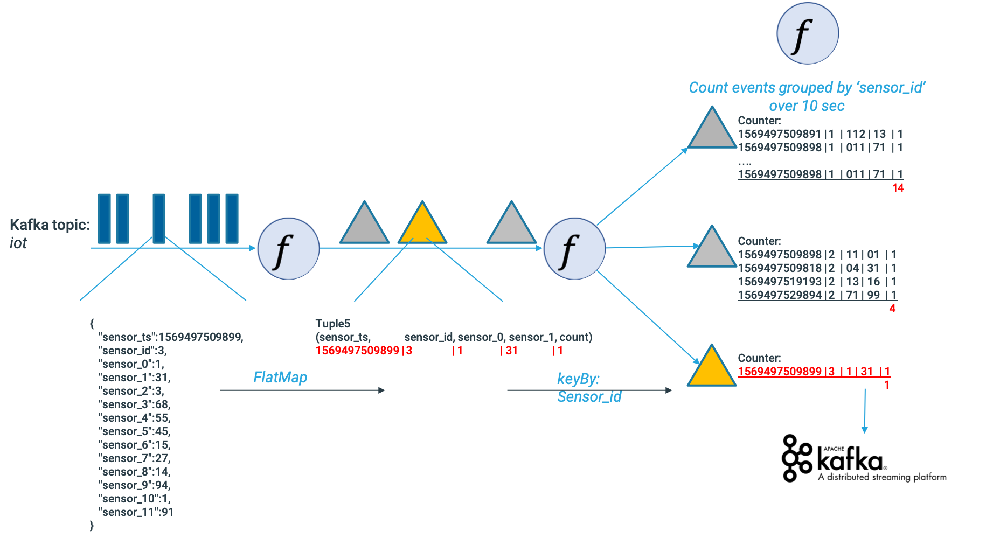
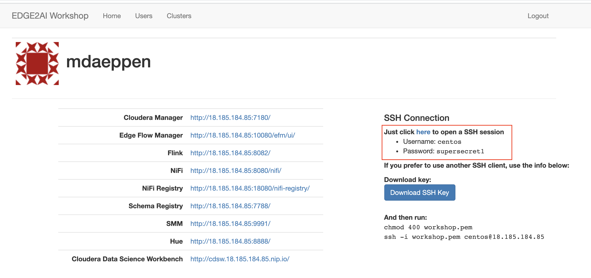
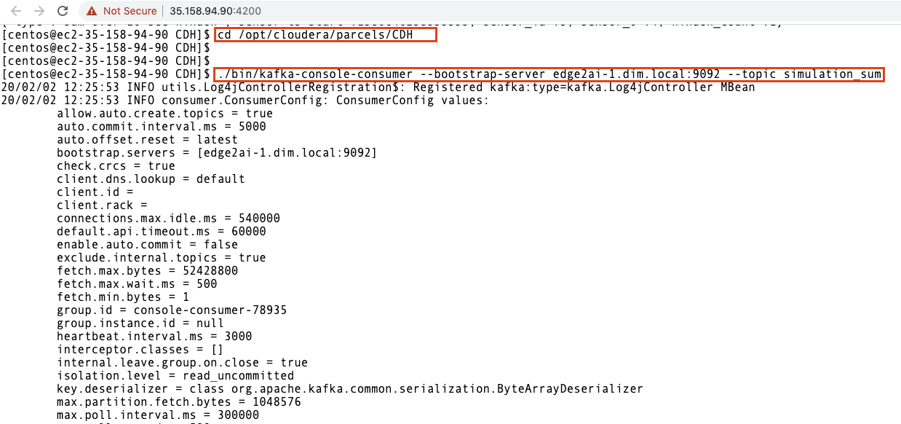
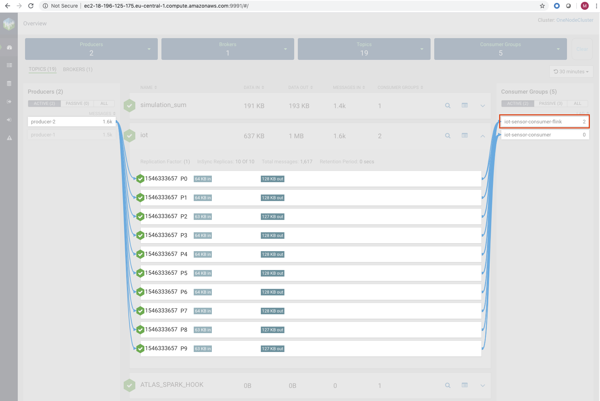
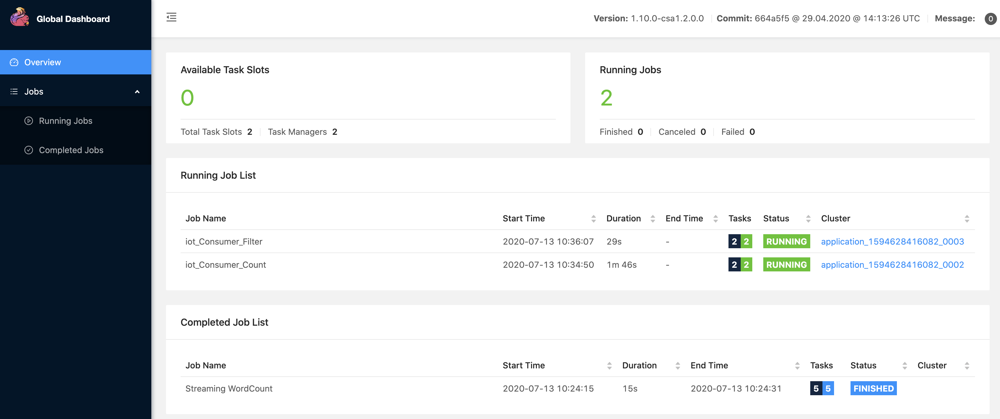

= Streams Processing with Apache Flink

In this workshop is build on top of the "edge2AI Workshop" (pre-condition) and add enhanced features in stream processing.

== Labs summary

* *Lab 1* - Count by sensor_id
* *Lab 2* - Filtering on sensor_0 value

[[lab_1, Lab 1]]
== Lab 1 - Apache Flink - Count by sensor_id

. Let's use the #iot stream form the sensors from the previous lab
+
.. *Dataflow:*
+

+
.. Open two SSH connections to your environment
+

+
let's have look at the code:
+
Local Execution Environment
+
[source,java]
----
// get iot stream from kafka - topic "iot"
    DataStream<String> iotStream = env.addSource(
        new FlinkKafkaConsumer<>("iot", new SimpleStringSchema(), properties));
----
+
Collection Data Sources
+
[source,java]
----
// split and sum on 'sensor_id'
    DataStream<Tuple5<Long, Integer, Integer, Integer, Integer>> aggStream = iotStream
     .flatMap(new trxJSONDeserializer())
     .keyBy(1) // = sensor_id
     .window(TumblingProcessingTimeWindows.of(Time.seconds(10)))
     .sum(4) ;
----
+
Iterator Data Sink
+
----
// write the aggregated data stream to a Kafka sink
        FlinkKafkaProducer<Tuple5<Long, Integer, Integer, Integer, Integer>> myProducer = new FlinkKafkaProducer<Tuple5<Long, Integer, Integer, Integer, Integer>>(
                topic, new serializeSum2String(), propertiesProducer);

        aggStream.addSink(myProducer);
----
+
. Let's run the application

+
use the first SSH connection to run the Flink application
+
[source,shell]
----
cd /opt/cloudera/parcels/FLINK
sudo wget https://github.com/zBrainiac/streaming-flink/releases/download/0.3.1/streaming-flink-0.3.1.0.jar -P /opt/cloudera/parcels/FLINK/lib/flink/examples/streaming
./bin/flink run -m yarn-cluster -c consumer.IoTUC1CountEventsPerSensorId -ynm IoTUC1CountEventsPerSensorId lib/flink/examples/streaming/streaming-flink-0.3.1.0.jar edge2ai-1.dim.local:9092
----
+
. Let's see how the application works
+
.. use the second SSH connection to see the result
+
[source,shell]
----
$ cd /opt/cloudera/parcels/CDH
$ ./bin/kafka-console-consumer --bootstrap-server edge2ai-1.dim.local:9092 --topic result_iot_uc1_Count_EventsPerSensorId
----
+
SSH connection
+

+
.. SMM view:
+

+
.. YARN & FLINK UI view:
+
Flink UI provide more details and monitoring of the job's
+

[[lab_2, Lab 2]]
== Lab 2 - Filtering on sensor_0 value
. Let’s use the #iot stream form the sensors from the previous lab
+
.. *Dataflow:*
+
image::images/iot_streamingFlinkDataflowFilter.png[width=800]
Collection Data Sources
+
[source,java]
----
// split on 'sensor_id' & filter on sensor_0
DataStream<Tuple5<Long, Integer, Integer, Integer, Integer>> aggStream = iotStream
   .flatMap(new trxJSONDeserializer())
   .keyBy(1) // sensor_id
   .sum(4)
   .filter(new FilterFunction<Tuple5<Long, Integer, Integer, Integer, Integer>>()
       @Override
          public boolean filter(Tuple5<Long, Integer, Integer, Integer, Integer> value) throws Exception {
               return value.f2 >= 50 ;
          }
  });
----
+
. Let's run the application
+
use the new SSH connection to run the Flink application
+
[source,shell]
----
cd /opt/cloudera/parcels/FLINK
./bin/flink run -m yarn-cluster -c consumer.IoTUC2CountEventsPerSensorIdFilter -ynm IoTUC2CountEventsPerSensorIdFilter lib/flink/examples/streaming/streaming-flink-0.3.1.0.jar edge2ai-1.dim.local:9092
----
+
. Let's see how the application works
+
.. use the second SSH connection to see the result
+
[source,shell]
----
$ cd /opt/cloudera/parcels/CDH
$ ./bin/kafka-console-consumer --bootstrap-server edge2ai-1.dim.local:9092 --topic result_iot_Consumer_Filter
----