= From Edge to Streams Processing

In this workshop you'll implement a data pipeline, using NiFi to ingest data from an IoT device into Kafka and then consume data from Kafka and write it to Kudu tables.

== Labs summary

* *Lab 1* - On the Apache NiFi, run a simulator to send IoT sensors data to the MQTT broker.
* *Lab 2* - On Schema Registry, register the schema describing the data generated by the IoT sensors.
* *Lab 3* - On the NiFi cluster, prepare the data and send it to the *Kafka* cluster.
* *Lab 4* - On the *Streams Messaging Manager (SMM)* Web UI, monitor the Kafka cluster and confirm data is being ingested correctly.
* *Lab 5* - Use NiFi to consume each record from *Kafka* and save results to *Kudu*.
* *Lab 6* - Check the data on Kudu.
* *Lab 7* - Apache Flink- your friend for streaming use cases

[[lab_1, Lab 1]]
== Lab 1 - Apache NiFi: setup machine sensors simulator

predictionIn this lab you will run a simple Python script that simulates IoT sensor data from some hypothetical machines, and send the data to a MQTT broker (link:https://mosquitto.org/[mosquitto]). The gateway host is connected to many and different type of sensors, but they generally all share the same transport protocol, "mqtt".

. Go to Apache NiFi and add a Processor (ExecuteProcess) to the canvas.
+
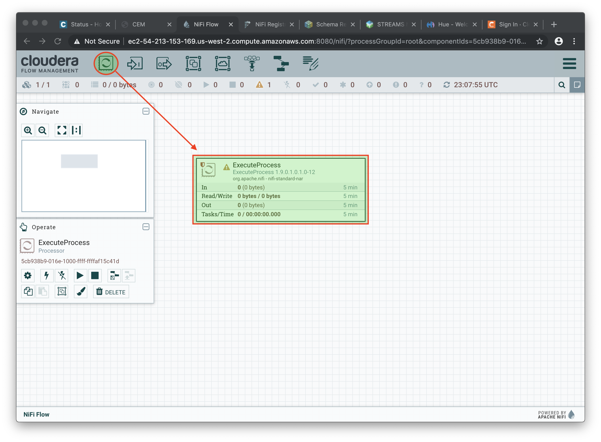

. Right-click the processor, select *Configure* (or, alternatively, just double-click the processor). On the *PROPERTIES* tab, set the properties shown below to run our Python simulate script.
+
[source]
----
Command:           python3
Command Arguments: /opt/demo/simulate.py
----
+
image::images/simulate2.png[width=500]

. In the *SCHEDULING* tab, set to *Run Schedule: 1 sec*
+
Alternatively, you could set that to other time intervals: 1 sec, 30 sec, 1 min, etc...
+
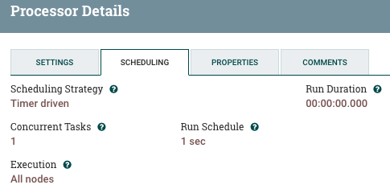

. In the *SETTINGS* tab, check the "*success*" relationship in the *AUTOMATICALLY TERMINATED RELATIONSHIPS* section. Click *Apply*.
+
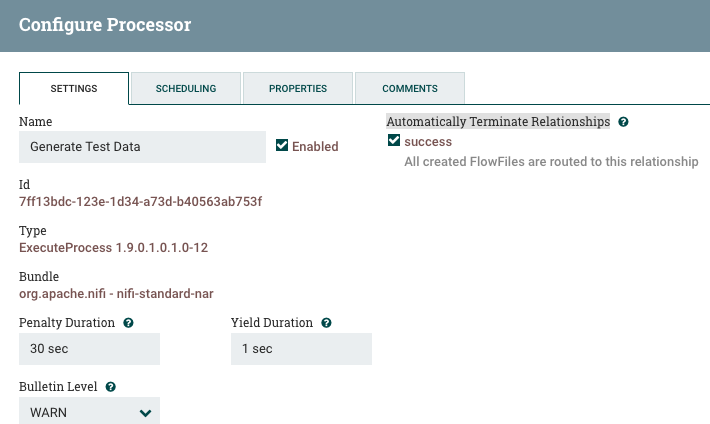

. You can then right-click to *Start* this simulator runner.
+
image::images/nifiDemoStart.png[width=400]

. Right-click and select *Stop* after a few seconds and look at the *provenance*. You'll see that it has run a number of times and produced results.
+
image::images/NiFiViewDataProvenance.png[width=400]
+
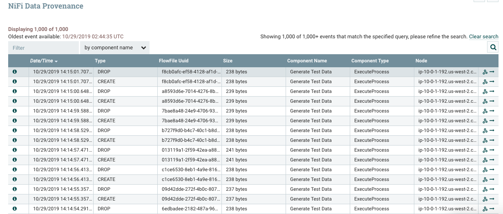

[[lab_2, Lab 2]]
== Lab 2 - Registering our schema in Schema Registry

The data produced by the temperature sensors is described by the schema in file `link:https://raw.githubusercontent.com/zBrainiac/edge2ai-workshop/master/sensor_enhanced.avsc[sensor.avsc]`. In this lab we will register this schema in Schema Registry so that our flows in NiFi can refer to schema using an unified service. This will also allow us to evolve the schema in the future, if needed, keeping older versions under version control, so that existing flows and flowfiles will continue to work.

. Go the following URL, which contains the schema definition we'll use for this lab. Select all contents of the page and copy it.
+
`link:https://raw.githubusercontent.com/zBrainiac/edge2ai-workshop/master/sensor_enhanced.avsc[https://raw.githubusercontent.com/zBrainiac/edge2ai-workshop/master/sensor_enhanced.avsc, window="_blank"]`

. In the Schema Registry Web UI, click the `+` sign to register a new schema.

. Click on a blank area in the *Schema Text* field and paste the contents you copied.

. Complete the schema creation by filling the following properties:
+
[source]
----
Name:          SensorReading
Description:   Schema for the data generated by the IoT sensors
Type:          Avro schema provider
Schema Group:  Kafka
Compatibility: Backward
Evolve:        checked
----
+
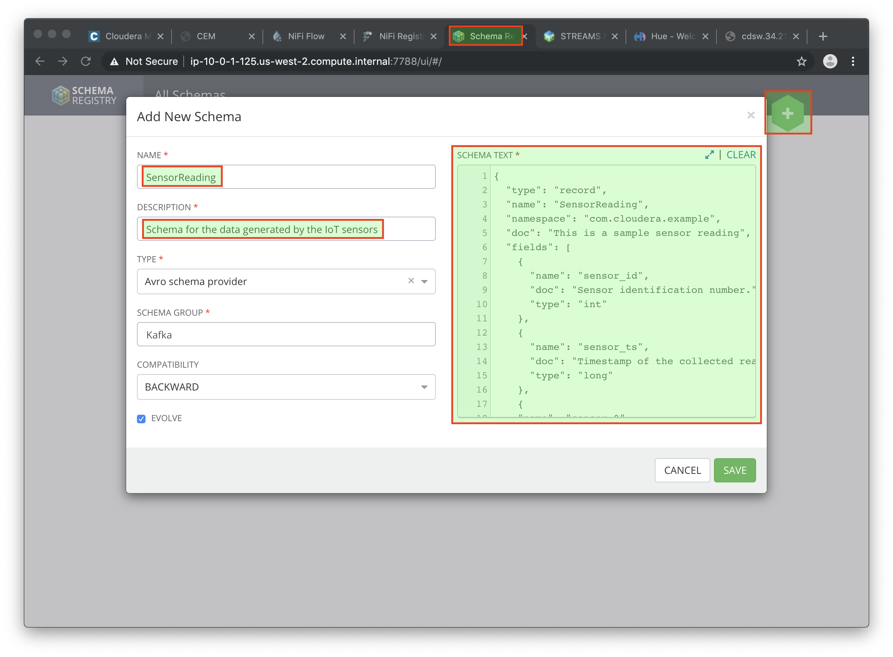

. Save the schema

[[lab_3, Lab 3]]
== Lab 3 - Configuring the NiFi flow and pushing data to Kafka

In this lab, you will create a NiFi flow to receive the data from mqtt gateways and push it to **Kafka**.

=== Creating a Process Group

Before we start building our flow, let's create a Process Group to help organizing the flows in the NiFi canvas and also to enable flow version control.

. Open the NiFi Web UI, create a new Process Group and name it something like *Process Sensor Data*.
+
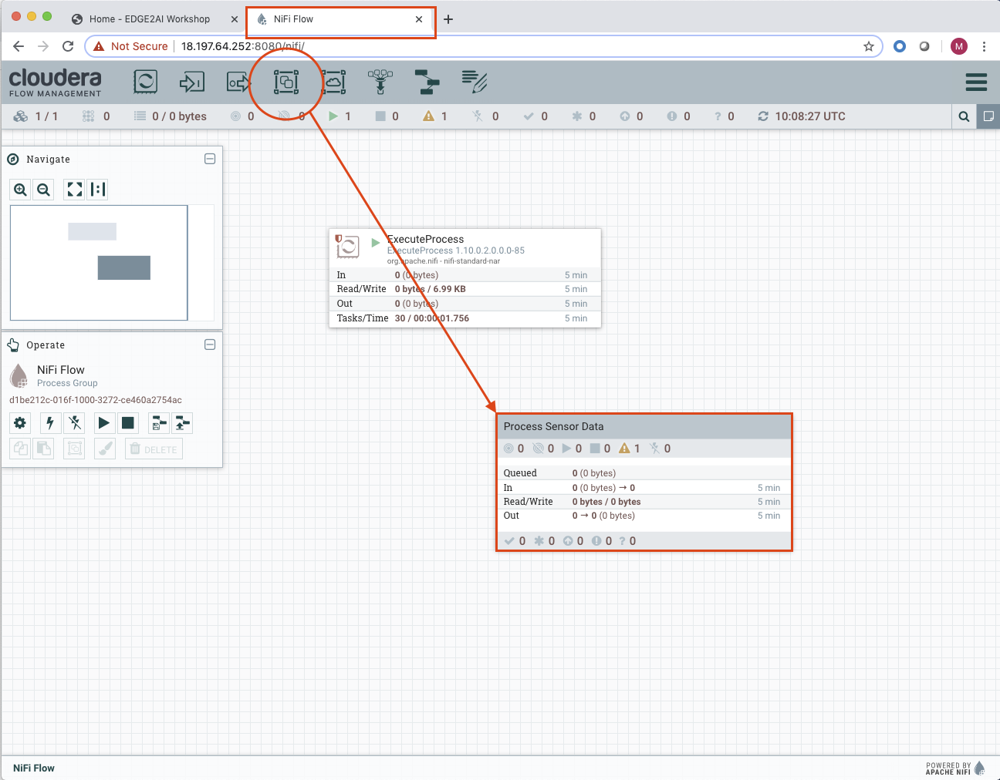

. We want to be able to version control the flows we will add to the Process Group. In order to do that, we first need to connect NiFi to the *NiFi Registry*. On the NiFi global menu, click on "Controller Settings", navigate to the "Registry Clients" tab and add a Registry client with the following URL:
+
----
Name: NiFi Registry
URL:  http://edge2ai-1.dim.local:18080
----
+
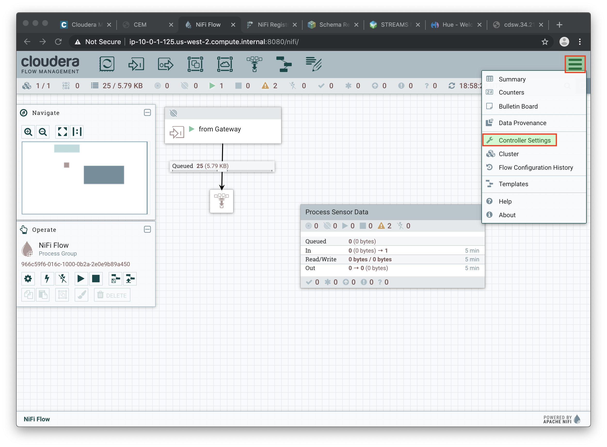
+
image::images/add_registry_client.png[width=800]

. On the *NiFi Registry* Web UI, add another bucket for storing the Sensor flow we're about to build'. Call it `SensorFlows`:
+
image::images/sensor_flows_bucket.png[width=800]

. Back on the *NiFi* Web UI, to enable version control for the Process Group, right-click on it and select *Version > Start version control* and enter the details below. Once you complete, a image:images/version_control_tick.png[width=20] will appear on the Process Group, indicating that version control is now enabled for it.
+
[source]
----
Registry:  NiFi Registry
Bucket:    SensorFlows
Flow Name: SensorProcessGroup
----

. Let's also enable processors in this Process Group to use schemas stored in Schema Registry. Right-click on the Process Group, select *Configure* and navigate to the *Controller Services* tab. Click the *`+`* icon and add a *HortonworksSchemaRegistry* service. After the service is added, click on the service's _cog_ icon (), go to the *Properties* tab and configure it with the following *Schema Registry URL* and click *Apply*.
+
[source]
----
URL: http://edge2ai-1.dim.local:7788/api/v1
----
+
image::images/added_hwx_sr_service.png[width=800]

. Click on the _lightning bolt_ icon () to *enable* the *HortonworksSchemaRegistry* Controller Service.

. Still on the *Controller Services* screen, let's add two additional services to handle the reading and writing of JSON records. Click on the image:images/plus_button.png[width=25] button and add the following two services:
** *`JsonTreeReader`*, with the following properties:
+
[source]
----
Schema Access Strategy: Use 'Schema Name' Property
Schema Registry:        HortonworksSchemaRegistry
Schema Name:            ${schema.name} -> already set by default!
----

** *`JsonRecordSetWriter`*, with the following properties:
+
[source]
----
Schema Write Strategy:  HWX Schema Reference Attributes
Schema Access Strategy: Inherit Record Schema
Schema Registry:        HortonworksSchemaRegistry
----

. Enable the *JsonTreeReader* and the *JsonRecordSetWriter* Controller Services you just created, by clicking on their respective _lightning bolt_ icons ().
+
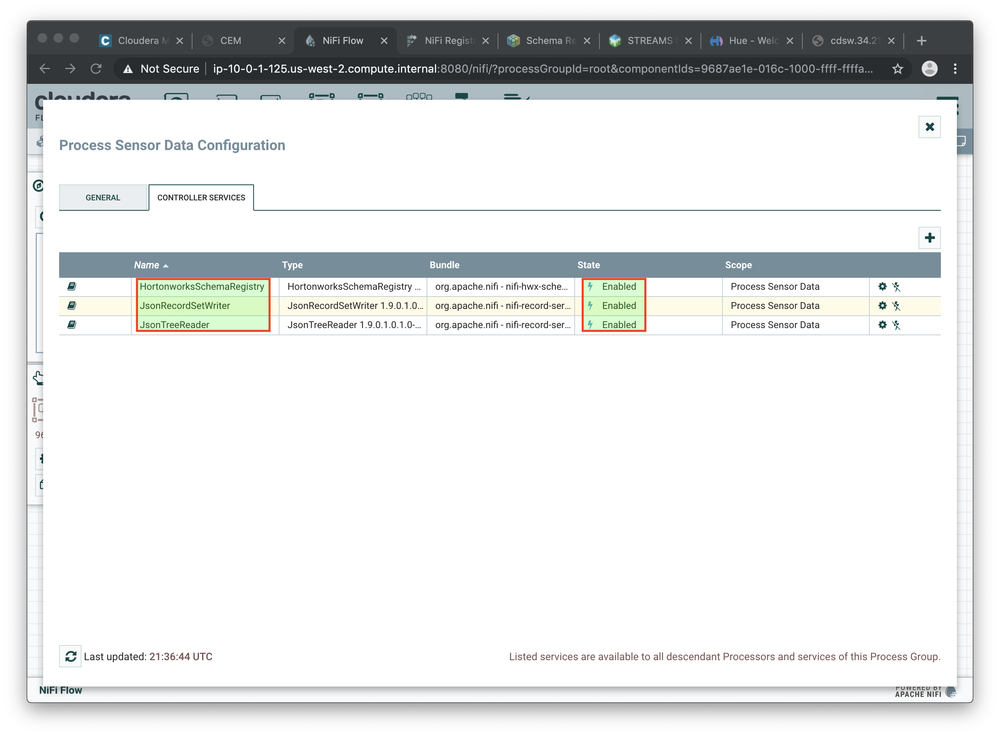

=== Creating the flow

. Double-click on the newly created process group to expand it.

. Inside the process group, add a new _ConsumeMQTT_  processor.
+
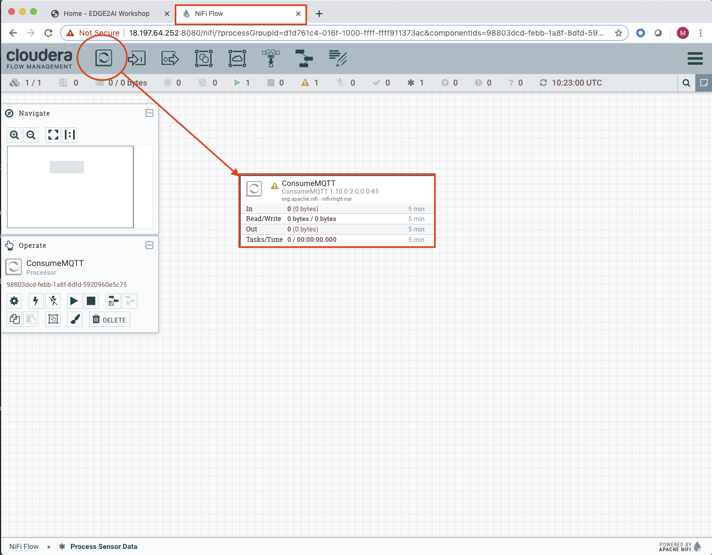

+
*PROPERTIES* tab:
+
[source]
----
Broker URI:                            tcp://edge2ai-1.dim.local:1883
Client ID:                             sensor-iot
Topic Filter:                          iot/#
Max Queue Size:                        60
----

. We need to tell NiFi which schema should be used to read and write the Sensor data. For this we'll use an _UpdateAttribute_ processor to add an attribute to the FlowFile indicating the schema name.
+
Add an _UpdateAttribute_ processor by dragging the processor icon to the canvas:
+
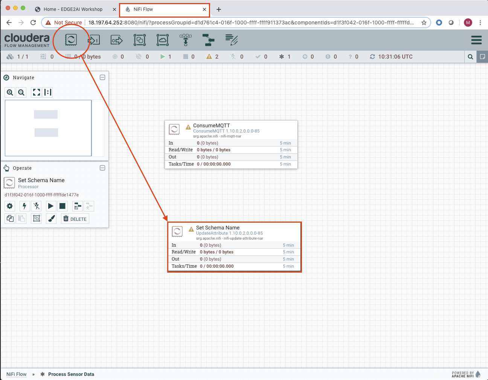

. Double-click the _UpdateAttribute_ processor and configure it as follows:
.. In the _SETTINGS_ tab:
+
[source]
----
Name: Set Schema Name
----
.. In the _PROPERTIES_ tab:
** Click on the image:images/plus_button.png[width=25] button and add the following property:
+
[source]
----
Property Name:  schema.name
Property Value: SensorReading
----
.. Click *Apply*

. Connect the *Consume mqtt* input port to the *Set Schema Name* processor.

. Add a _PublishKafkaRecord_2.0_ processor and configure it as follows:
+
*SETTINGS* tab:
+
[source]
----
Name:                                  Publish to Kafka topic: iot
----
+
*PROPERTIES* tab:
+
[source]
----
Kafka Brokers:                         edge2ai-1.dim.local:9092
Topic Name:                            iot
Record Reader:                         JsonTreeReader
Record Writer:                         JsonRecordSetWriter
Use Transactions:                      false
Attributes to Send as Headers (Regex): schema.*
----
+
NOTE: Make sure you use the PublishKafkaRecord_2.0 processor and *not* the PublishKafka_2.0 one

. While still in the _PROPERTIES_ tab of the _PublishKafkaRecord_2.0_ processor, click on the image:images/plus_button.png[width=25] button and add the following property:
+
[source]
----
Property Name:  client.id
Property Value: nifi-sensor-data
----
+
Later, this will help us clearly identify who is producing data into the Kafka topic.

. Connect the *Set Schema Name* processor to the *Publish to Kafka topic: iot* processor.

. Add a new _Funnel_ to the canvas and connect the PublishKafkaRecord processor to it. When the "Create connection" dialog appears, select "*failure*" and click *Add*.
+
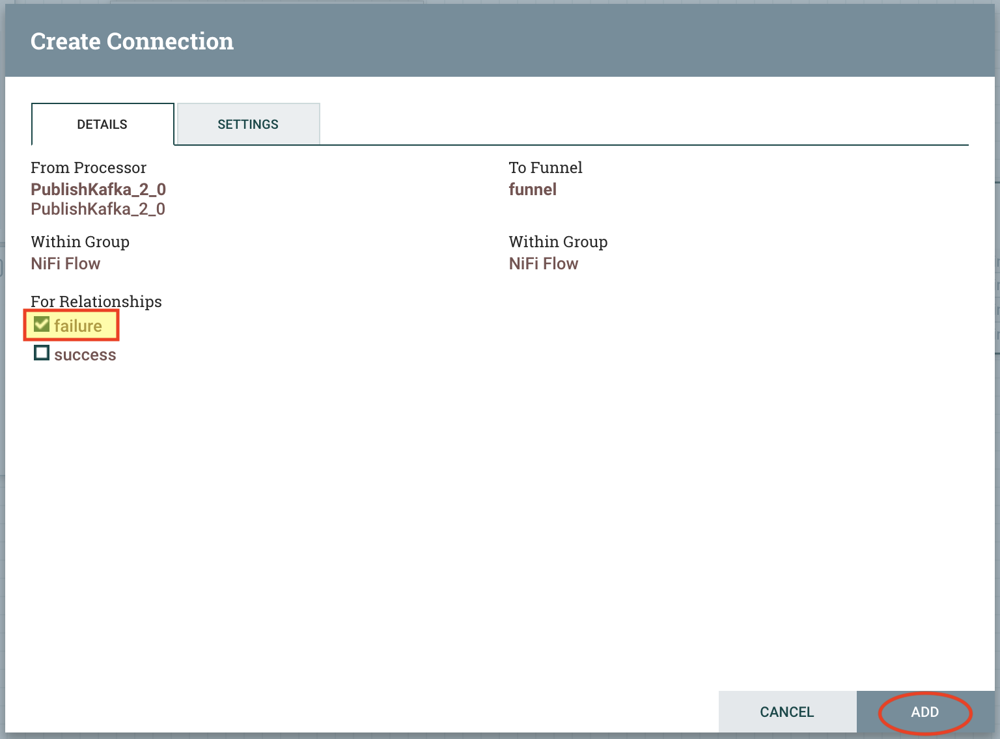

. Double-click on the *Publish to Kafka topic: iot* processor, go to the *SETTINGS* tab, check the "*success*" relationship in the *AUTOMATICALLY TERMINATED RELATIONSHIPS* section. Click *Apply*.
+
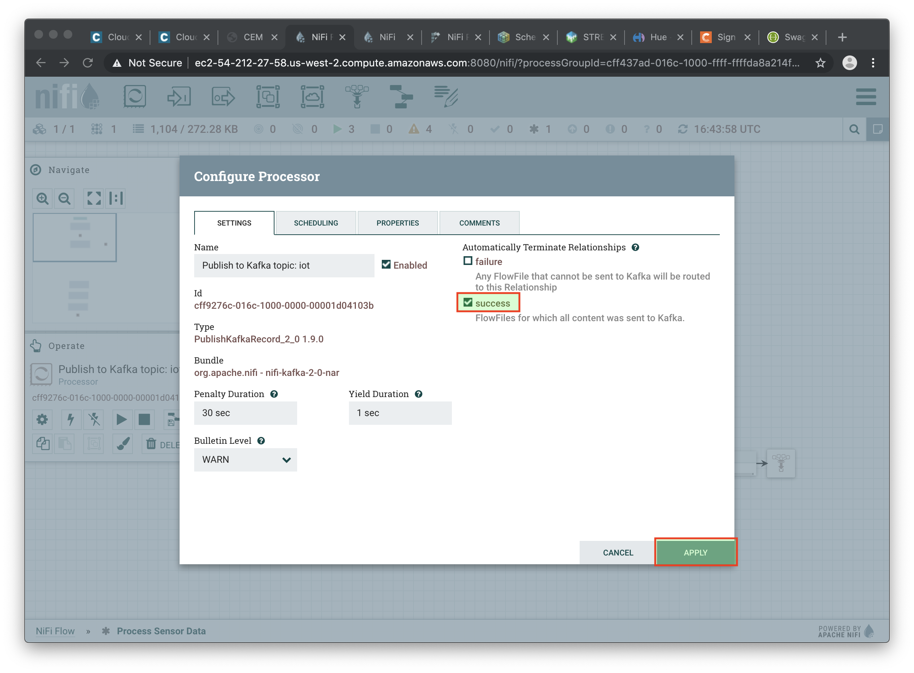

. Start all three processors. Your canvas should now look like the one below:
+
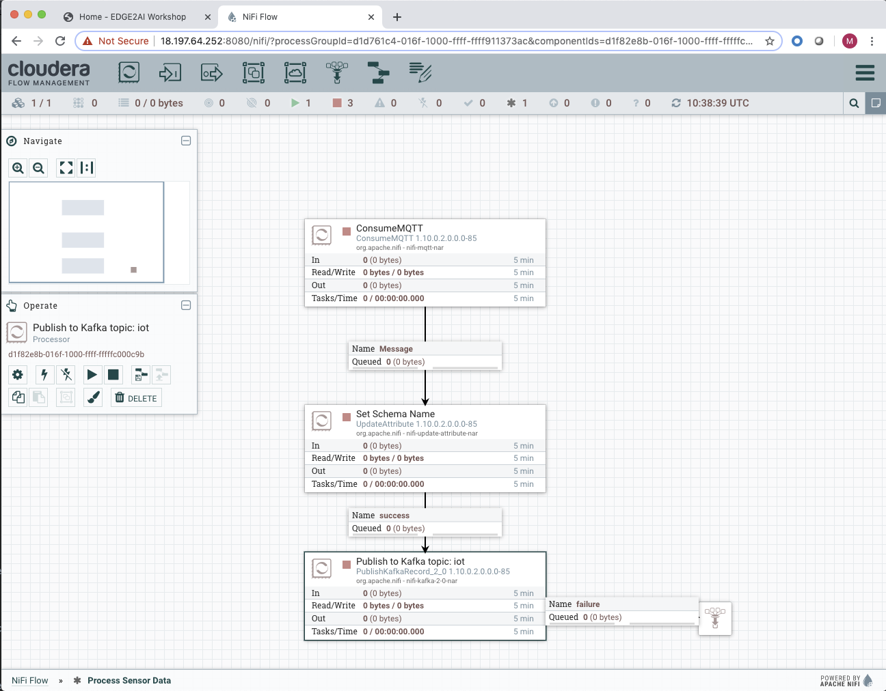

. Refresh the screen (`Ctrl+R` on Linux/Windows; `Cmd+R` on Mac) and you should see that the records were processed by the _PublishKafkaRecord_ processor and there should be no records queued on the "failure" output queue.
+
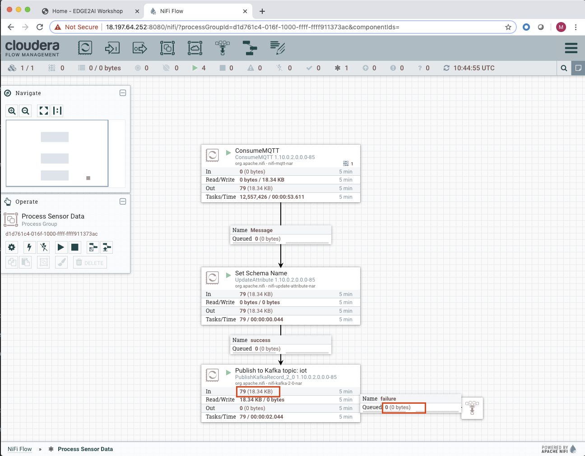
+
At this point, the messages are already in the Kafka topic. You can add more processors as needed to process, split, duplicate or re-route your FlowFiles to all other destinations and processors.

. To complete this Lab, let's commit and version the work we've just done. Go back to the NiFi root canvas, clicking on the "Nifi Flow" breadcrumb. Right-click on the *Process Sensor Data* Process Group and select *Version > Commit local changes*. Enter a descriptive comment and save.

[[lab_4, Lab 4]]
== Lab 4 - Use SMM to confirm that the data is flowing correctly

Now that our NiFi flow is pushing data to Kafka, it would be good to have a confirmation that everything is running as expected. In this lab you will use Streams Messaging Manager (SMM) to check and monitor Kafka.

. Start the *NiFi ExecuteProcess* simulator again and confirm you can see the messages queued in NiFi. Leave it running.

. Go to the Stream Messaging Manager (SMM) Web UI and familiarize yourself with the options there. Notice the filters (blue boxes) at the top of the screen.
+
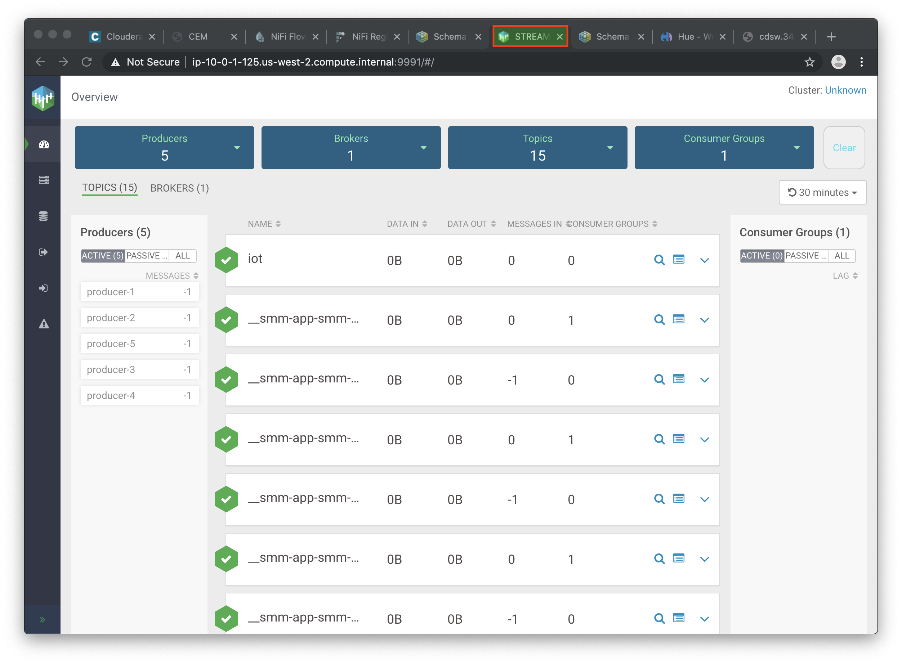

. Click on the *Producers* filter and select only the *`nifi-sensor-data`* producer. This will hide all the irrelevant topics and show only the ones that producer is writing to.

. If you filter by *Topic* instead and select the `iot` topic, you'll be able to see all the *producers* and *consumers* that are writing to and reading from it, respectively. Since we haven't implemented any consumers yet, the consumer list should be empty.

. Click on the topic to explore its details. You can see more details, metrics and the break down per partition. Click on one of the partitions and you'll see additional information and which producers and consumers interact with that partition.
+
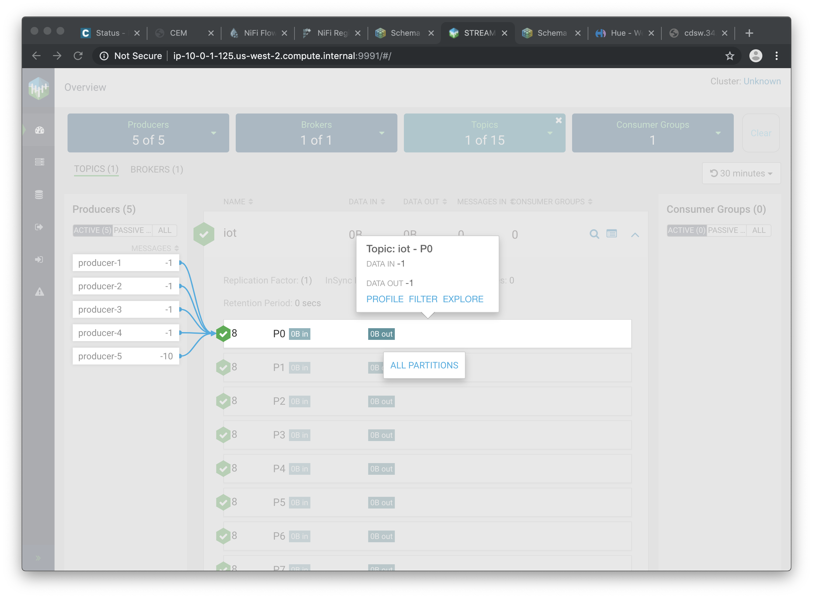

. Click on the *EXPLORE* link to visualize the data in a particular partition. Confirm that there's data in the Kafka topic and it looks like the JSON produced by the sensor simulator.
+
image::images/explore_partition.png[width=800]

. Check the data from the partition. You'll notice something odd. These are readings from temperature sensors and we don't expect any of the sensors to measure temperatures greater than 150 degrees in the conditions they are used. It seems, though, that `sensor_0` and `sensor_1` are intermittently producing noise and some of the measurements have very high values for these measurements.
+
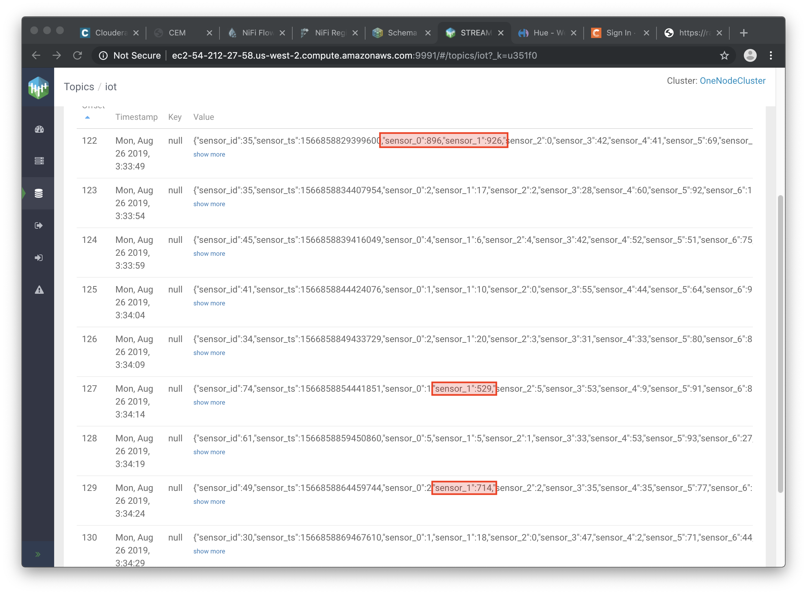

. Stop the *NiFi ExecuteProcess* simulator again.

. In the next Lab we'll eliminate with these problematic measurements to avoid problems later in our data flow.

[[lab_5, Lab 5]]
== Lab 5 - Use NiFi to consume each record from *Kafka* and save results to *Kudu*.

In this lab, you will use NiFi to consume the Kafka messages containing the IoT data we ingested in the previous lab.

=== Add new Controller Services

When the sensor data was sent to Kafka using the _PublishKafkaRecord_ processor, we chose to attach the schema information in the header of Kafka messages. Now, instead of hard-coding which schema we should use to read the message, we can leverage that metadata to dynamically load the correct schema for each message.

To do this, though, we need to configure a different _JsonTreeReader_ that will use the schema properties in the header, instead of the `${schema.name}` attribute, as we did before.

. If you're not in the *Process Sensor Data* process group, double-click on it to expand it. On the *Operate* panel (left-hand side), click on the _cog_ icon () to access the *Process Sensor Data* process group's configuration page.
+
image::images/operate_panel_cog.png[width=300]

. Click on the _plus_ button (image:images/plus_button.png[width=25]), add a new *JsonTreeReader*, configure it as shown below and click *Apply* when you're done:
+
On the *SETTINGS* tab:
+
[source]
----
Name: JsonTreeReader - With schema identifier
----
+
On the *PROPERTIES* tab:
+
[source]
----
Schema Access Strategy: HWX Schema Reference Attributes
Schema Registry:        HortonworksSchemaRegistry
----

. Click on the _lightning bolt_ icon () to *enable* the *JsonTreeReader - With schema identifier* controller service.

+
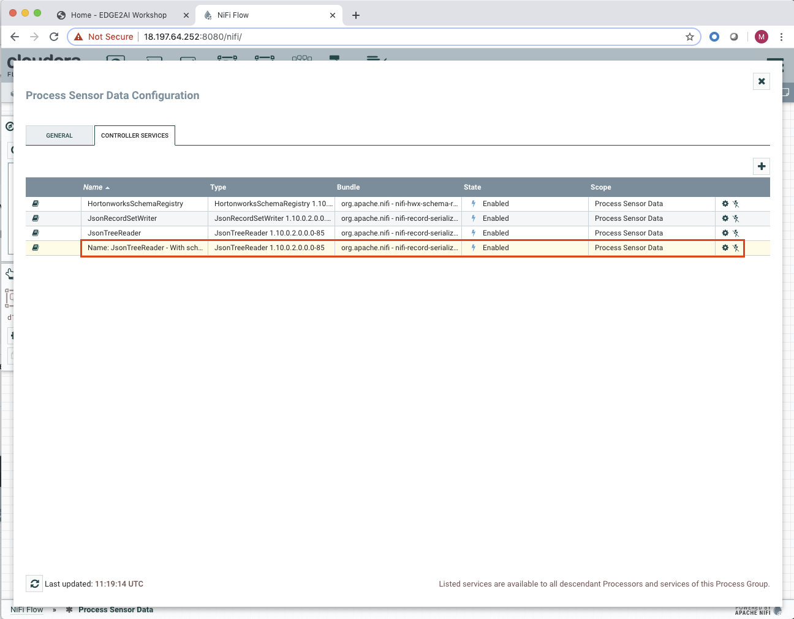

. Close the *Process Sensor Data Configuration* page.

=== Create the flow

We'll now create the flow to read the sensor data from Kafka and write the results to Kudu. At the end of this section you flow should look like the one below:

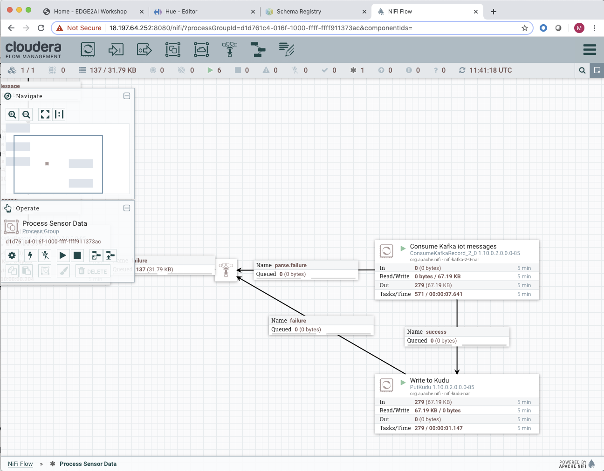

==== ConsumeKafkaRecord_2_0 processor

. We'll add a new flow to the same canvas we were using before (inside the *Process Sensor Data* Process Group). Click on an empty area of the canvas and drag it to the side to give you more space to add new processors.

. Add a *ConsumeKafkaRecord_2_0* processor to the canvas and configure it as shown below:
+
*SETTINGS* tab:
+
[source]
----
Name: Consume Kafka iot messages
----
+
*PROPERTIES* tab:
+
[source]
----
Kafka Brokers:                        edge2ai-1.dim.local:9092
Topic Name(s):                        iot
Topic Name Format:                    names
Record Reader:                        JsonTreeReader - With schema identifier
Record Writer:                        JsonRecordSetWriter
Honor Transactions:                   false
Group ID:                             iot-sensor-consumer
Offset Reset:                         latest
Headers to Add as Attributes (Regex): schema.*
----

. Reuse existing _Funnel_ to the canvas and connect the *Consume Kafka iot messages* to it. When prompted, check the *parse.failure* relationship for this connection:
+
image:images/parse_failure_relationship.png[width=500]

==== PutKudu processor

. Add a *PutKudu* processor to the canvas and configure it as shown below:
+
*SETTINGS* tab:
+
[source]
----
Name: Write to Kudu
----
+
*PROPERTIES* tab:
+
[source]
----
Kudu Masters:     edge2ai-1.dim.local:7051
Table Name:       impala::default.sensors
Record Reader:    JsonTreeReader - With schema identifier
----

. Connect the *Consume Kafka iot message* processor to the *Write to Kudu* one. When prompted, check the *success* relationship for this connection.

. Connect the *Write to Kudu* to the same _Funnel_ you had created above. When prompted, check the *failure* relationship for this connection.

. Double-click on the *Write to Kudu* processor, go to the *SETTINGS* tab, check the "*success*" relationship in the *AUTOMATICALLY TERMINATED RELATIONSHIPS* section. Click *Apply*.

==== Create the Kudu table

NOTE: If you already created this table in a previous workshop, please skip the table creation here.

. Go to the Hue Web UI and login. The first user to login to a Hue installation is automatically created and granted admin privileges in Hue.

. The Hue UI should open with the Impala Query Editor by default. If it doesn't, you can always find it by clicking on *Query button > Editor -> Impala*:
+
image::images/impala_editor.png[width=800]

. First, create the Kudu table. Login into Hue, and in the Impala Query, run this statement:
+
[source,sql]
----
CREATE TABLE sensors_enhanced
(
 sensor_id INT,
 sensor_ts TIMESTAMP,
 sensor_0 DOUBLE,
 sensor_1 DOUBLE,
 sensor_2 DOUBLE,
 sensor_3 DOUBLE,
 sensor_4 DOUBLE,
 sensor_5 DOUBLE,
 sensor_6 DOUBLE,
 sensor_7 DOUBLE,
 sensor_8 DOUBLE,
 sensor_9 DOUBLE,
 sensor_10 DOUBLE,
 sensor_11 DOUBLE,
 is_healthy INT,
 city STRING,
 lat DOUBLE,
 lon DOUBLE,
 PRIMARY KEY (sensor_ID, sensor_ts)
)
PARTITION BY HASH PARTITIONS 16
STORED AS KUDU
TBLPROPERTIES ('kudu.num_tablet_replicas' = '1');
----
+
image::images/create_table.png[width=800]

==== Running the flow

We're ready now to run and test our flow. Follow the steps below:

. Start all the processors in your flow.

. Refresh your NiFi page and you should see messages passing through your flow. The failure queues should have no records queued up.
+
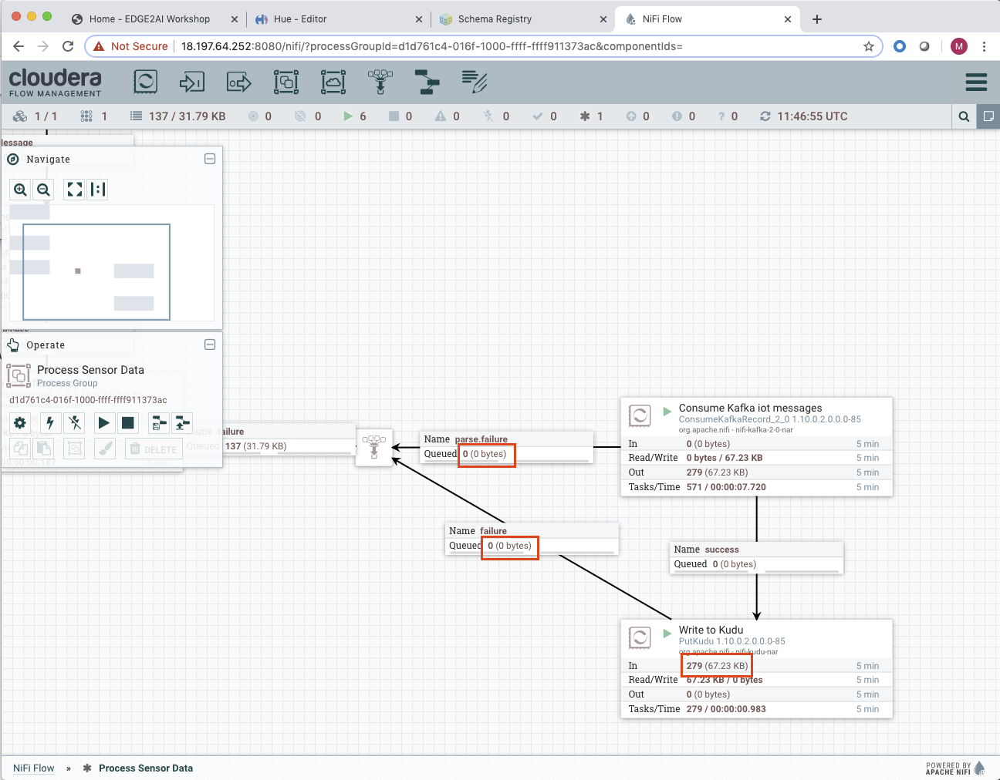

[[lab_6, Lab 6]]
== Lab 6 - Check the data on Kudu

In this lab, you will run some SQL queries using the Impala engine and verify that the Kudu table is being updated as expected.

. Login into Hue and run the following queries in the Impala Query Editor:
+
[source,sql]
----
SELECT count(*)
FROM sensors;
----
+
[source,sql]
----
SELECT *
FROM sensors
ORDER by sensor_ts DESC
LIMIT 100;
----
+
. Run the queries a few times \and verify that the number of sensor readings are increasing as the data is ingested into the Kudu table. This allows you to build real-time reports for fast action.
+
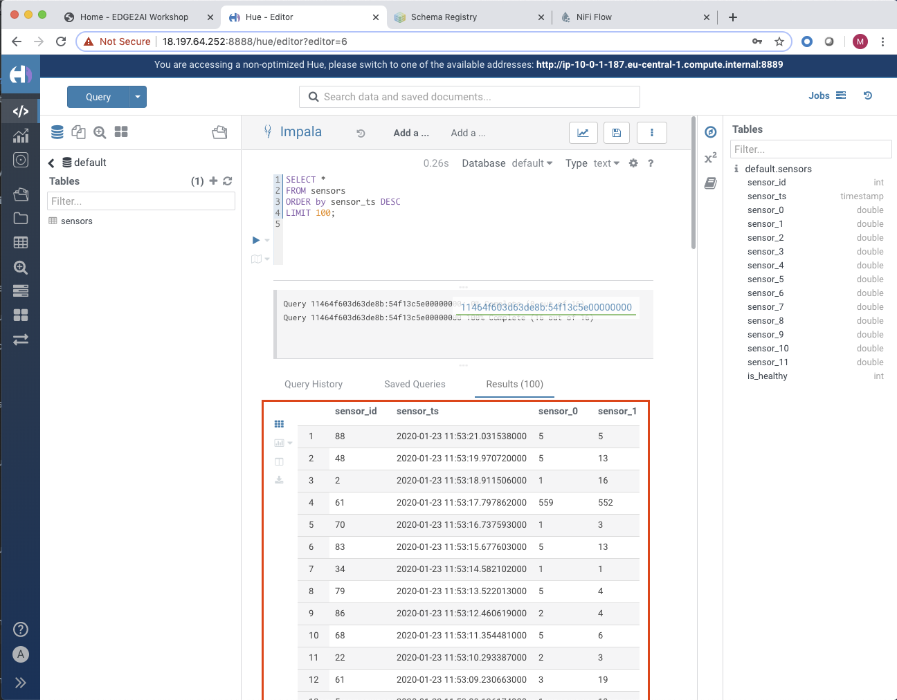

[[lab_7, Lab 7]]
== Lab 7 - Apache Flink- your friend for streaming use cases
* click here for the next Lab: link:streaming_flink.adoc[Streams Processing with Flink]
