= Streams Replication

NOTE: This lab assumes that the link:streaming.adoc[From Edge to Streams Processing] has been completed. If you haven't, please ask your instructor to set your cluster state for you.

In this workshop you will use Streams Replication Manager (SRM) to replicate Kafka topics across clusters.

The labs in this workshop will require two clusters so that we can configure replication between them. If you were assigned two clusters by your instructor, you can perform all the configuration yourself. Otherwise, please pair up with another workshop attended and work together to configure replication between your individual clusters.

We will refer to the two clusters as *Cluster A* and *Cluster B*, throughout the labs and will use the aliases `cluster_a` and `cluster_b`, respectively, throughout the exercises. These aliases can be changed to suit your needs/preferences (e.g. you could use `nyc` and `paris`, as long as you maintain consistency across all exercises).

While one SRM cluster can replicate both ways, we will implement the best practice for this type of replication, which consists of Remote Reads and Local Writes. Hence, SRM in Cluster A will replicate messages from Cluster B to Cluster A and vice-versa.

Some labs will have to be performed on both clusters while others only apply to one specific cluster. At the beginning of each lab we will specify to which cluster(s) they apply.

== Overview

Throughout this series of labs we will install and configure the Streams Replication Manager (SRM) service to replicate data and configuration between two Kafka clusters.

SRM is comprised of 2 service roles:

*  *Driver role*: This role is responsible for connecting to the specified clusters and performing replication between them. The Driver role can be installed on one or more hosts but since the workshop cluster have a single node we will limit this role to that node only.
* *Service role*: This role consists of a REST API and a Kafka Streams
application to aggregate and expose cluster, topic and consumer group metrics. The Service role can be installed on one host only.

We will also see how to configure the Streams Messaging Manager (SMM) service to monitor the replication that is configured between the two clusters.

Our goal is to have implemented the following bidirectional replication architecture by the end of the workshop:

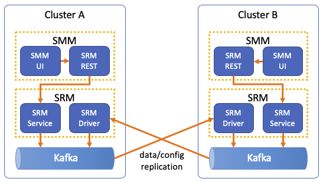

== Labs summary

* *Lab 1* - Install the Streams Replication Manager (SRM) service
* *Lab 2* - Tuning the SRM service
* *Lab 3* - Configure replication monitoring
* *Lab 4* - Enable Kafka Replication with SRM
* *Lab 5* - Failing over consumers

[[lab_1, Lab 1]]
== Lab 1 - Install the *Streams Replication Manager (SRM)* service

NOTE: Run on *both clusters*

. On the Cloudera Manager console, click on the Cloudera logo at the top-left corner to ensure you are at the home page.

. Click on the "three-dots" menu to the right of the *OneNodeCluster* name and select *Add Service*
+
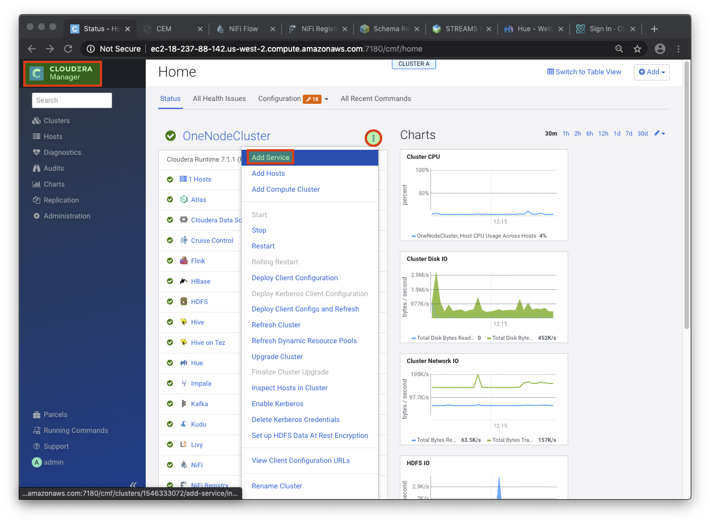

. Select *Streams Replication Manager* and click *Continue*

. On the *Select Dependencies* page, select the row that contains *HDFS, Kafka and ZooKeeper* and then click *Continue*
+
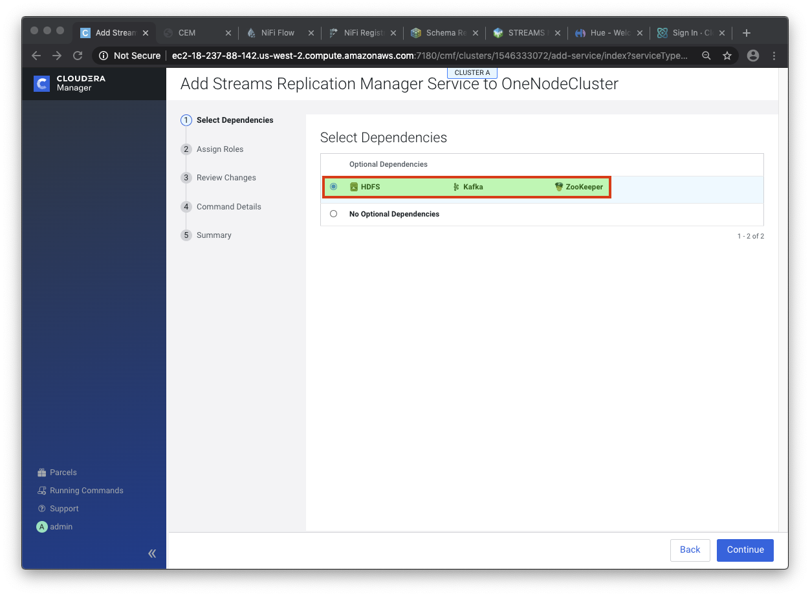

. On the *Assign Roles* page, leave the selected defaults as is and click *Continue*

. On the *Review Changes* page set the following properties:
+
NOTE: Replace the `CLUSTER_A_FQDN` and `CLUSTER_B_FQDN` placeholders in the values below with the fully-qualified domain name for clusters A and B, respectively. You can use the fully-qualified host names you get for your clusters in the workshop landing page.

.. On *_Cluster A only_*:
+
[cols=2,options="header"]
|===
| Property | value
| *Streams Replication Manager Cluster alias* | `cluster_a, cluster_b`
.11+| *Streams Replication Manager's Replication Configs*

(click the "`+`" button to separately add each property on the right)
| `cluster_a.bootstrap.servers=<CLUSTER_A_FQDN>:9092`
| `cluster_b.bootstrap.servers=<CLUSTER_B_FQDN>:9092`
| `cluster_b\->cluster_a.enabled=true`
| `replication.factor=1`
| `heartbeats.topic.replication.factor=1`
| `checkpoints.topic.replication.factor=1`
| `offset-syncs.topic.replication.factor=1`
| `offset.storage.replication.factor=1`
| `config.storage.replication.factor=1`
| `status.storage.replication.factor=1`
| `metrics.topic.replication.factor=1`
| *Streams Replication Manager Driver Target Cluster* | `cluster_a`
| *Streams Replication Manager Service Target Cluster* | `cluster_a`
|===

.. On *_Cluster B only_*:
+
[%autowidth,cols=2,options="header"]
|===
| Property | Value
| *Streams Replication Manager Cluster alias* | `cluster_a, cluster_b`
.11+| *Streams Replication Manager's Replication Configs*

(click the "`+`" button to separately add each property on the right)
| `cluster_a.bootstrap.servers=<CLUSTER_A_FQDN>:9092`
| `cluster_b.bootstrap.servers=<CLUSTER_B_FQDN>:9092`
| `cluster_a\->cluster_b.enabled=true`
| `replication.factor=1`
| `heartbeats.topic.replication.factor=1`
| `checkpoints.topic.replication.factor=1`
| `offset-syncs.topic.replication.factor=1`
| `offset.storage.replication.factor=1`
| `config.storage.replication.factor=1`
| `status.storage.replication.factor=1`
| `metrics.topic.replication.factor=1`
| *Streams Replication Manager Driver Target Cluster* | `cluster_b`
| *Streams Replication Manager Service Target Cluster* | `cluster_b`
|===

. Click *Continue* once all the properties are set correctly

. Wait for the *First Run Command* to finish and click *Continue*

. Click *Finish*

You now have a working Streams Replication Manager service!

[[lab_2, Lab 2]]
== Lab 2 - Tune the *Streams Replication Manager (SRM)* service

NOTE: Run on *both clusters*

The SRM service comes configured with some default refresh intervals that are usually appropriate for production environments. For our labs, though, we want the refresh intervals to be much shorter so that we can run tests and see the results quickly. Let's reconfigure those intervals before we continue.

. On the Cloudera Manager console go to *Clusters > Streams Replication Manager > Configuration*.
. On the search box, type "*interval*" to filter the configuration properties
. Set the following properties:
+
[%autowidth,cols=2,options="header"]
|===
| Property | Value
| *Refresh Topics Interval Seconds* | `30 seconds`
| *Refresh Groups Interval Seconds* | `30 seconds`
| *Sync Topic Configs Interval Seconds* | `30 seconds`
|===

. Click on *Save Changes*

. Click on *Actions > Deploy Client Configuration* and wait for the client configuration deployment to finish.

. Click on *Actions > Restart* and wait for the service restart to finish.

[[lab_3, Lab 3]]
== Lab 3 - Configure replication monitoring

NOTE: Run on *both* clusters

In this lab we will configure Streams Messaging Manager (SMM) to monitor the Kafka replication between both clusters.

. On the Cloudera Manager console go to *Clusters > SMM > Configuration*.
. On the search box, type "*replication*" to filter the configuration properties
. Set the following properties for the service:
+
[%autowidth,cols=2,options="header"]
|===
| Property | value
| *Configure Streams Replication Manager* | `Checked`
| *Streams Replication Manager Rest Protocol* | `http`
| *Streams Replication Manager Rest Host* | `<FQDN_of_SRM_Service_host>`
| *Streams Replication Manager Rest Port* | `6670`
|===

. Click on *Save Changes*

. Click on *Actions > Restart* and wait for the service restart to finish.

. Go to the SMM Web UI (*Clusters > SMM > Streams Messaging Manager Web UI*), and click on the *Cluster Replications* icon (). You should be able to see the monitoring page for the replication on both clusters:
+
On cluster A:
+
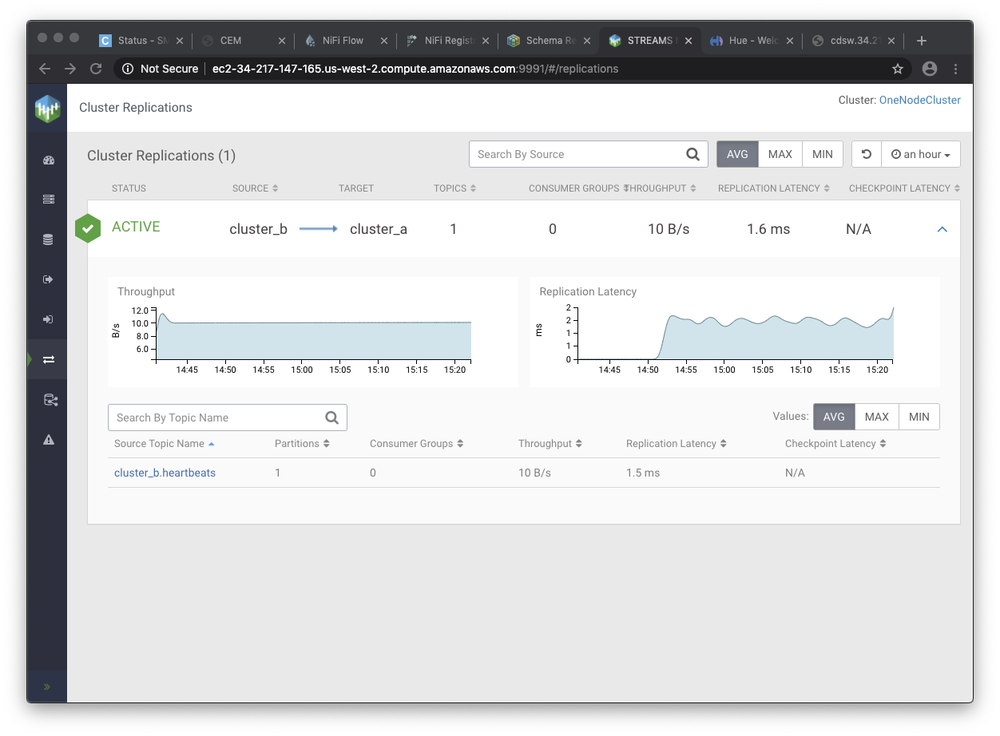
+
On cluster B:
+
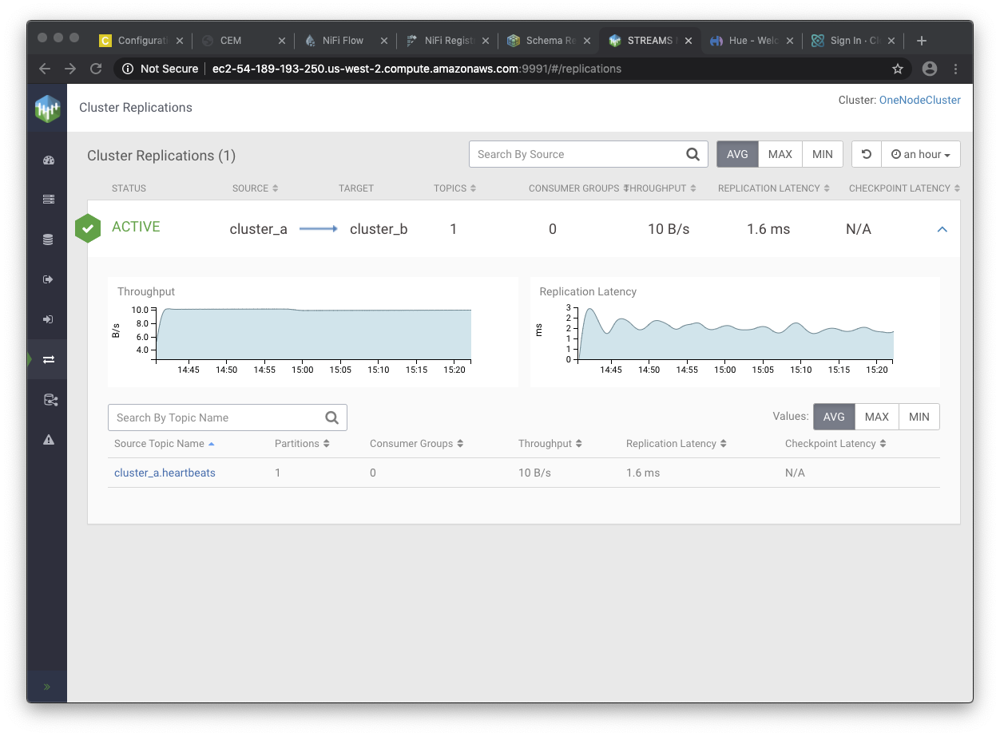

Note that, so far, only the `heartbeats` topic is being replicated. In the next lab we will add more topics to the replication.

TIP: If the replication appears as *INACTIVE* at any point in time, please wait a few seconds and refresh the screen.

[[lab_4, Lab 4]]
== Lab 4 - Enable Kafka Replication with Streams Replication Manager (SRM)

NOTE: Run on the clusters indicated in the steps instructions

In this lab, we will enable Active-Active replication where messages produced in Cluster A are replicated to Cluster B, and messages produced in Cluster B are replicated to Cluster A.

SRM has a _whitelist_ and a _blacklist_ for topics. Only topics that are in the whitelist _but not_ in the blacklist are replicated. The administrator can selectively control which topics to replicate but managing those lists. The same applies to consumer groups offset replication.

. *Cluster A*: To prepare for the activities in this lab, let's first create a new Kafka topic using SMM. On the SMM Web UI, click on the *Topics* icon (image:images/topics_icon.png[width=25])` on the left-hand side menu, then *Add New* button, and add the following properties:
+
[source]
----
Topic Name:     global_iot
Partitions:     5
Availability:   LOW (*)
Cleanup Policy: delete
----
(*) The LOW availability setting above is required because our cluster has a single node.
+
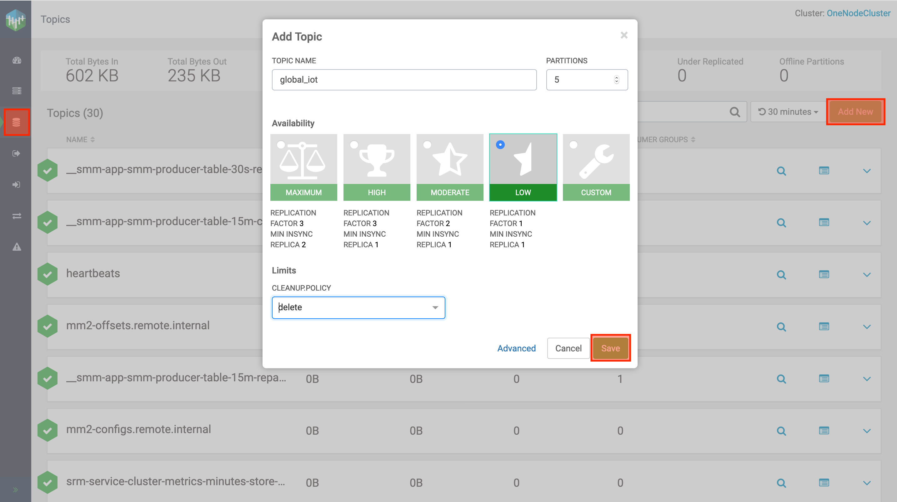

. *Cluster A*: Click *Save* to create the topic

Now, follow the below steps to enable message replication from Cluster *A to B*. These steps should be executed in *Cluster B* _only_.

. *Cluster B*: To initiate the replication of topics we must _whitelist_ them in SRM. SRM supports Regular Expressions for whitelisting/blacklisting topics with a particular pattern. In our case, we would like to replicate only topics that start with the keyword `global`. To do so, SSH into the *Cluster B* host and run the following command:
+
[source]
----
export security_protocol=PLAINTEXT
sudo -E srm-control topics \
  --source cluster_a \
  --target cluster_b \
  --add "global_iot"
----
+
Run the following command to confirm that the whitelist was correctly modified:
+
[source]
----
sudo -E srm-control topics \
  --source cluster_a \
  --target cluster_b \
  --list
----
+
You should see the following output:
+
[source]
----
Current whitelist:
global_iot
Current blacklist:
Done.
----
+
TIP: The whitelist can also be specified as a regular expression, which is helpful when you need to select topics by pattern matching.

. *Cluster B*: Go to the SMM Web UI and check the Cluster Replications page. You should now see that all the topics that match the whitelist appear in the replication:
+
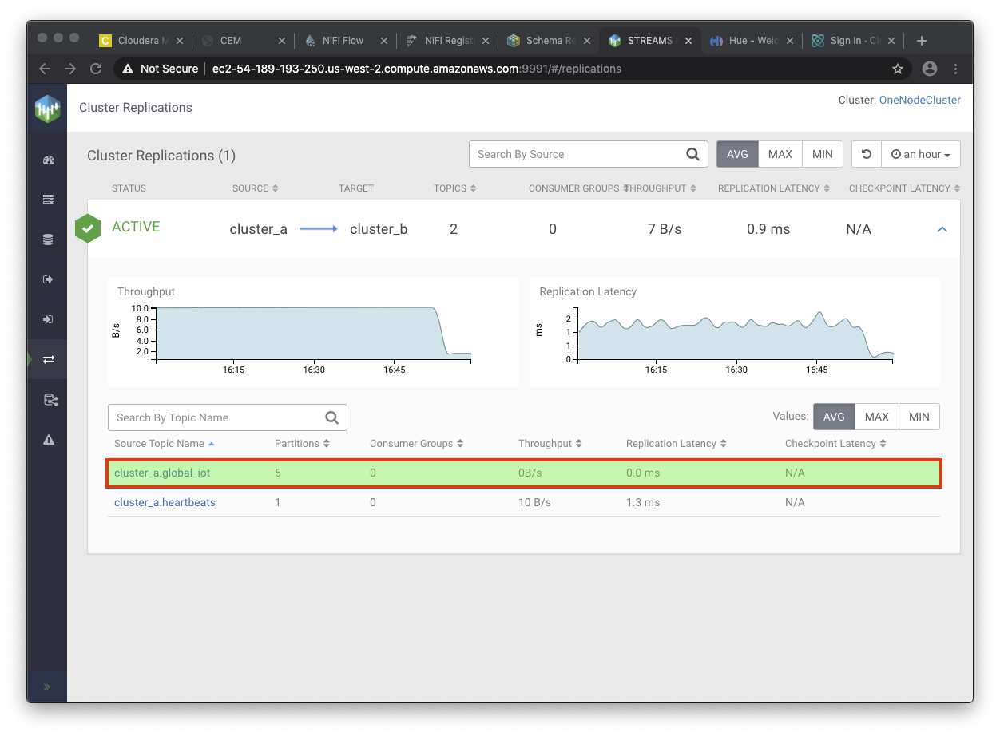

. *Cluster B*: Click on the *Topics* icon (image:images/topics_icon.png[width=25]) and search for all topics containing the string `iot`. You should see a new topic called `cluster_a.global_iot`. Since we haven't produced any data to the source topic yet, the replicated topic is also empty.

. *Cluster A*: To check that the replication is working, we need to start producing data to the `global_iot` Kafka topic in *Cluster A*. The easiest way to do it is to make a small change to our existing NiFi flow:
.. Go to the NiFi canvas on *Cluster A*
.. Enter the *Process Sensor Data* process group
.. Select the *PublishKafkaRecord* processor and *copy & paste* it. This will create a new processor on the canvas.
.. Double-click the new processor to open the configuration
.. On the *SETTINGS* tab, change the *Name* property to "*Publish to Kafka topic: global_iot*"
.. Still on the *SETTINGS* tab, check the *success* property in the *Automatically Terminate Relationships* section
.. On the *PROPERTIES* tab, change the *Topic Name* property to `global_iot`.
... *IMPORTANT*: Ensure there are no leading or trailing spaces in the topic name.
.. Click *Apply*
.. Connect the "*Set Schema Name*" processor to the new Kafka processor.
.. Connect the new Kafka processor to the same "failure" funnel that the original processor is connected to.
... When the connection dialog opens, check the  *failure* relationship and click *ADD*.
+
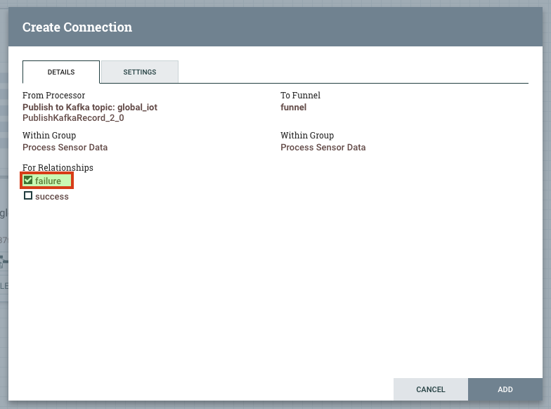
.. Start the new processor.
.. You will now have dual ingest of events to both `iot` and `global_iot` topics. Your flow now should look like the following:
+
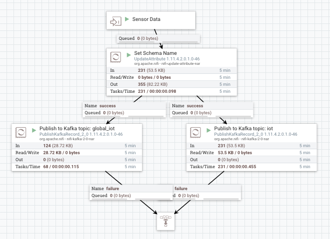
. *Cluster B*: Go to SMM Web UI and check the content of the `cluster_a.global_iot` topic. You should see events being replicated from the Cluster A. After some time, you will see the replicated topic's metrics increasing.
+
Even if the stats haven't yet been updated, try clicking on the magnifying glass icon to view the data. This usually shows up fairly immediately even if the stats haven't been refreshed yet.
+
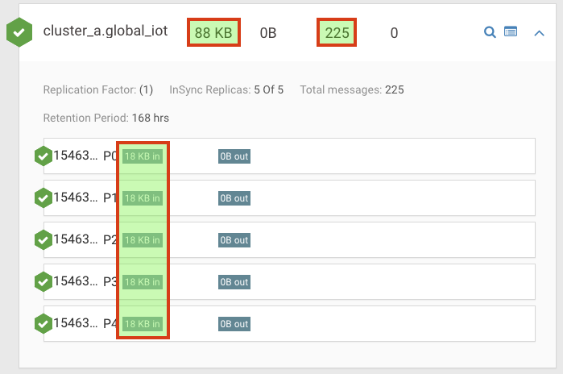
. *Cluster B*: Click on the *Cluster Replications* icon () and check the throughput and latency metrics to make sure that everything is working as expected. You should expect a throughput greater than zero and a latency in the order of milliseconds.
+
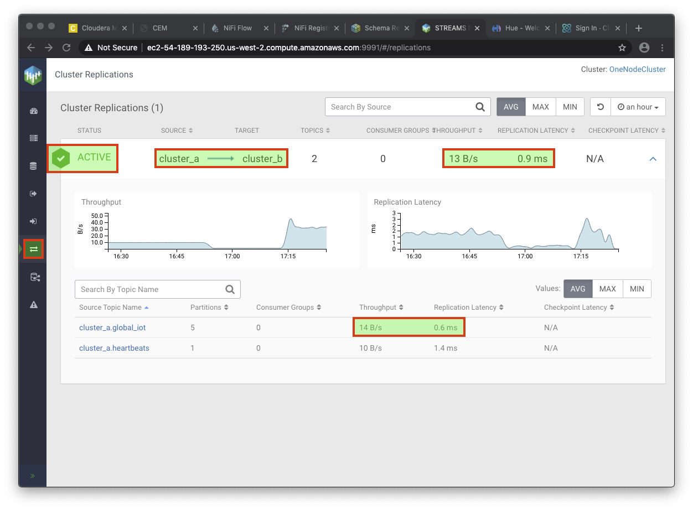

. Now that replication is working in the *A -> B* direction, repeat the same steps in reverse to implement replication in the *B -> A* direction.

IMPORTANT: Please ensure that SRM replication has been set up in both directions before proceeding to the next lab. In the failover lab we'll practice a consumer failover *and* failback, which requires 2-way replication to be working.

[[lab_5, Lab 5]]
== Lab 5 - Failing over consumers

NOTE: Run on the clusters indicated in the steps instructions

One of the great features of SRM is its ability to translate Consumer Group offsets from one cluster to the other so that consumers can be switched over to the remote cluster without losing or duplicating messages. SRM continuously replicates the consumer groups offsets to the remote cluster so that it can perform the translation even when the source cluster is offline.

We can manage the consumer groups for which SRM replicates offset using a whitelist/blacklist mechanism, similar to what is done for topics.

In this lab we will configure consumer groups offset replication for the `global_iot` topic and perform a consumer failover to the remote cluster. To make it more interesting, we will failover two consumers, one using the correct approach for offset translation and the other without being careful about it, so that we can analyze the difference.

NOTE: Throughout this lab's exercises you will be running Kafka consumers on a SSH session. Please run all the exercise commands on the same session, which will make it easier for you to verify and compare the results after failover and failback.

. *Cluster B*: To simplify things for the purpose of this lab, let's whitelist the replication of _all_ consumer groups *from A -> B*, by adding the regexp `.***` to the whitelist. To do so, SSH into the *Cluster B* host and run the following command:
+
IMPORTANT: Note that the commands below are `srm-control groups`, which differ from the `srm-control topics` we ran previously. Please pay attention to the exact commands in the workshop examples since there may be slight differences between them.
+
[source]
----
export security_protocol=PLAINTEXT
sudo -E srm-control groups \
  --source cluster_a \
  --target cluster_b \
  --add ".*"
----
+
Run the following command to confirm that the whitelist was correctly modified:
+
[source]
----
sudo -E srm-control groups \
  --source cluster_a \
  --target cluster_b \
  --list
----
+
You should see the following output:
+
[source]
----
Current whitelist:
.*
Current blacklist:
Done.
----
+
IMPORTANT: Note that the replication of the offsets for whitelisted consumer groups _only happen_ for the topics that are being replicated (according to the _topic_ whitelist). Since we had only whitelisted the topic `global_iot`, only the offsets of that topic will be replicated, even if the consumers read from other topics that are not whitelisted.

. So far we have *already*:
+
--
.. Configured the replication of data from Cluster A -> B, by whitelisting the `global_iot` topic in SRM; *and*
.. Configured the replication of consumer group offsets from Cluster A -> B, by whitelisting all the consumer groups in SRM, in addition of the topic whitelist, as explained previously.
--
These settings allow consumers connected to Cluster A to be successfully failed over to Cluster B. Some time after a failover, though, we may want to fail the consumers to be failed back to Cluster A. For this we must continue to replicate the consumer offsets from Cluster B to Cluster A after the failover.
+
The following configuration enables that replication:

... *Cluster A*: Connect to *Cluster A* and run the following commands:
+
[source]
----
export security_protocol=PLAINTEXT
sudo -E srm-control topics \
  --source cluster_b \
  --target cluster_a \
  --add "cluster_a.global_iot"

sudo -E srm-control groups \
  --source cluster_b \
  --target cluster_a \
  --add ".*"
----

... *Cluster A*: Run the following command to confirm that the whitelists were correctly modified:
+
[source]
----
sudo -E srm-control topics \
  --source cluster_b \
  --target cluster_a \
  --list

sudo -E srm-control groups \
  --source cluster_b \
  --target cluster_a \
  --list
----

... *Cluster A*: You should see the following output:
+
[source]
----
# topics:
Current whitelist:
cluster_a.global_iot
Current blacklist:
Done.

# groups:
Current whitelist:
.*
Current blacklist:
Done.
----

. Open a SSH session to any of the hosts and run the following consumer to start consuming data from the `global_iot` topic on *Cluster A*. This consumer uses a consumer group called `good.failover`:
+
[source]
----
CLUSTER_A_HOST=<CLUSTER_A_HOST_FQDN>
kafka-console-consumer \
  --bootstrap-server $CLUSTER_A_HOST:9092 \
  --whitelist ".*global_iot" \
  --group good.failover | tee good.failover.before
----
+
IMPORTANT: Note that in the command above we specify a Kafka client topic _whitelist_, instead of explicitly providing the topic name. This makes it easier for consumers to fail over and back without having to be reconfigured. Since SRM adds a prefix to the replicated topic, the _whitelist_ option enables us to provide a regular expression that matches both the original topic and the replicated topic. Don't confuse this Kafka client topic _whitelist_ with the SRM topic whitelist we discussed previously; they are used for different purposes.

. Let the consumer read some data from the topic and press CTRL+C after you have a few lines of data shown on your screen. The command above saves the retrieved messages in the `good.failover.before` file.

. Run this other consumer to also consume some data from the `global_iot` topic on *Cluster A*. This consumer uses a different consumer group from the first one, called `bad.failover`:
+
[source]
----
CLUSTER_A_HOST=<CLUSTER_A_HOST_FQDN>
kafka-console-consumer \
  --bootstrap-server $CLUSTER_A_HOST:9092 \
  --whitelist ".*global_iot" \
  --group bad.failover | tee bad.failover.before
----

. Again, let the consumer read some data from the topic and press CTRL+C after you have a few lines of data shown on your screen. This command above saves the retrieved messages in the `bad.failover.before` file.

. *Cluster B*: Open the SMM Web UI, and click on the *Cluster Replications* icon (]). Note that the offsets of the two consumer groups we used are now being replicated by SRM:
+
image::images/consumer_group_replication.png[width=800]

. Let's now first try to fail over a consumer without following the recommended steps for offsets translation. On the same SSH session you were ran the consumers previously, run the `bad.failover` consumer again. This time, though, we will connect to the replicated topic `cluster_a.global_iot` on *Cluster B*.
+
[source]
----
CLUSTER_B_HOST=<CLUSTER_B_HOST_FQDN>
kafka-console-consumer \
  --bootstrap-server $CLUSTER_B_HOST:9092 \
  --whitelist ".*global_iot" \
  --group bad.failover | tee bad.failover.after
----

. As you have done before, let the consumer read some data from the topic and press CTRL+C after you have a few lines of data shown on your screen. This command above saves the retrieved messages in the `bad.failover.after` file.

. Each message saved in the `bad.failover.before` and `bad.failover.after` files above have the timestamp of when they were generated. Since we have approximately 1 message being generated per second, we would like to ensure that no gap between two consecutive messages is much larger than 1 second.
+
To check if the failover occurred correctly, we want to calculate the gap between the largest timestamp read  before the failover and the smallest timestamp read after the failover. If no messages were lost, we should see a gap not much larger than 1 second between those.
+ You can either verify this manually or run the commands below, which will calculate that gap for you:
+
[source]
----
last_msg_before_failover=$(grep -o "[0-9]\{10,\}" bad.failover.before | sort | tail -1)
first_msg_after_failover=$(grep -o "[0-9]\{10,\}" bad.failover.after | sort | head -1)
echo "Gap = $(echo "($first_msg_after_failover-$last_msg_before_failover)/1000000" | bc) second(s)"
----

. You should see an output like the one below, showing a large gap between the messages before and after the failover. The length of the gap will depend on how long you took between the two executions of the `bad.failover` consumer.
+
[source]
----
Gap = 1743 second(s)
----
+
NOTE: In some situations you could get negative values for the gap calculated above. For extra brownie points: in which situations a negative value could occur and what does it mean for the consumer?

. Now that we have seen what a incorrect failover looks like, let's failover the other consumer correctly. Connect to the *Cluster B* host and execute the following command to export the _translated_ offsets of the `good.failover` consumer group. Note that you can execute this command even if Cluster A is unavailable.
+
[source]
----
export security_protocol=PLAINTEXT

sudo -E srm-control offsets \
  --source cluster_a \
  --target cluster_b \
  --group good.failover \
  --export > good.failover.offsets

cat good.failover.offsets
----
+
The `good.failover.offsets` will contain all the _translated_ offsets for all the partitions that the `good.failover` consumer group touched on the source cluster.

. To complete the offset translation, still on the *Cluster B* host, run the command below to import the translated offsets into Kafka:
+
[source]
----
CLUSTER_B_HOST=<CLUSTER_B_HOST_FQDN>
kafka-consumer-groups \
  --bootstrap-server $CLUSTER_B_HOST:9092 \
  --reset-offsets \
  --group good.failover \
  --from-file good.failover.offsets \
  --execute
----
+
You should see an output like the one below:
+
[source]
----
GROUP                          TOPIC                          PARTITION  NEW-OFFSET
good.failover                  cluster_a.global_iot           3          11100
good.failover                  cluster_a.global_iot           4          11099
good.failover                  cluster_a.global_iot           0          11099
good.failover                  cluster_a.global_iot           1          11099
good.failover                  cluster_a.global_iot           2          11098
----

. We are now ready to fail over the `good.failover` consumer group. On the SSH session, run the `good.failover` consumer, connecting to the replicated topic `cluster_a.global_iot` on *Cluster B*.
+
[source]
----
CLUSTER_B_HOST=<CLUSTER_B_HOST_FQDN>
kafka-console-consumer \
  --bootstrap-server $CLUSTER_B_HOST:9092 \
  --whitelist ".*global_iot" \
  --group good.failover | tee good.failover.after
----

. This time you will notice a *lot* of messages read at once when you start the consumer. This happens because the offset where the consumer stopped previously was translated to the new cluster and loaded into Kafka. So, the consumer started reading all the messages from where it had stopped and had accumulated since that happened.

. Press CTRL+C to stop the consumer. The command above saves the retrieved messages in the `good.failover.after` file.

. Let's check the gap between messages during the correct failover. Again, you can do it manually or run the commands below:
+
[source]
----
last_msg_before_failover=$(grep -o "[0-9]\{10,\}" good.failover.before | sort | tail -1)
first_msg_after_failover=$(grep -o "[0-9]\{10,\}" good.failover.after | sort | head -1)
echo "Gap = $(echo "($first_msg_after_failover-$last_msg_before_failover)/1000000" | bc) second(s)"
----

. You should see that the gap is now 1 second, which means that no messages were skipped or lost during the failover:
+
[source]
----
Gap = 1 second(s)
----
+
NOTE: The interval between messages is not _exactly_ 1 second. Sometimes we can see a gap of nearly 2 seconds between adjacent messages.

. The consumer failback works in the same way. Before we fail the consumer back we need to translate the offsets in the reverse direction (from cluster B to cluster A). Run the following commands on *Cluster A* to perform the failback offset translation:
+
[source]
----
export security_protocol=PLAINTEXT

sudo -E srm-control offsets \
  --source cluster_b \
  --target cluster_a \
  --group good.failover \
  --export > good.failback.offsets

cat good.failback.offsets
----
+
The `good.failback.offsets` will contain all the _translated_ offsets for all the partitions that the `good.failover` consumer group touched while running on cluster B.

. To complete the offset translation, still on the *Cluster A* host, run the command below to import the translated offsets into Kafka:
+
[source]
----
CLUSTER_A_HOST=<CLUSTER_A_HOST_FQDN>
kafka-consumer-groups \
  --bootstrap-server $CLUSTER_A_HOST:9092 \
  --reset-offsets \
  --group good.failover \
  --from-file good.failback.offsets \
  --execute
----
+
You should see an output like the one below:
+
[source]
----
GROUP                          TOPIC                          PARTITION  NEW-OFFSET
good.failover                  global_iot                     0          15525
good.failover                  global_iot                     1          15656
good.failover                  global_iot                     2          15587
good.failover                  global_iot                     3          15534
good.failover                  global_iot                     4          15623
----

. We are now ready to fail *back* the `good.failover` consumer group. On the SSH session, run the `good.failover` consumer, connecting *again to the original `global_iot` topic* on *Cluster A*.
+
[source]
----
CLUSTER_A_HOST=<CLUSTER_A_HOST_FQDN>
kafka-console-consumer \
  --bootstrap-server $CLUSTER_A_HOST:9092 \
  --whitelist ".*global_iot" \
  --group good.failover | tee good.failover.after_failback
----

. Press CTRL+C to stop the consumer. The command above saves the retrieved messages in the `good.failover.after_failback` file.

. Let's check the gap between messages during the correct failover. Again, you can do it manually or run the commands below:
+
[source]
----
last_msg_before_failback=$(grep -o "[0-9]\{10,\}" good.failover.after | sort | tail -1)
first_msg_after_failback=$(grep -o "[0-9]\{10,\}" good.failover.after_failback | sort | head -1)
echo "Gap = $(echo "($first_msg_after_failover-$last_msg_before_failover)/1000000" | bc) second(s)"
----

. You should see that the gap is now 1 second, which means that no messages were skipped or lost during the failback:
+
[source]
----
Gap = 1 second(s)
----
+
NOTE: The interval between messages is not _exactly_ 1 second. Sometimes we can see a gap of nearly 2 seconds between adjacent messages, which is normal.

=== Simplifying the whitelists

During this lab we configured the following SRM whitelists:

[%autowidth,cols=".^1,.^1,.^1",options="header"]
|===
|Direction|Type|Whitelist
.2+|A -> B|Topics|`global_iot`
|Groups|`.*`
.2+|B -> A|Topics|`cluster_a.global_iot`
|Groups|`.*`
|===

These whitelists implement data replication in a single direction (A -> B), while replicating consumer group offsets in both directions (A <--> B). If we wanted to also enable data replication in both directions we would have to amend the whitelists as shown below:

[%autowidth,cols=".^1,.^1,.^1",options="header"]
|===
|Direction|Type|Whitelist
.2+|A -> B|Topics|`global_iot`

`cluster_b.global_iot`
|Groups|`.*`
.2+|B -> A|Topics|`global_iot`

`cluster_a.global_iot`
|Groups|`.*`
|===

This seems over-complicated and can be simplifying with the use of regular expressions.
Since all the whitelisted topics end in `global_iot`, we could replace the whitelists above with the following set, which is symmetric and easier to maintain:

[%autowidth,cols=".^1,.^1,.^1",options="header"]
|===
|Direction|Type|Whitelist
.2+|A -> B|Topics|`.*global_iot`
|Groups|`.*`
.2+|B -> A|Topics|`.*global_iot`
|Groups|`.*`
|===
