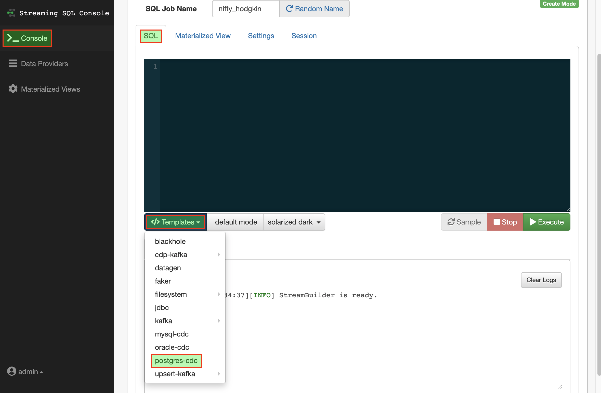
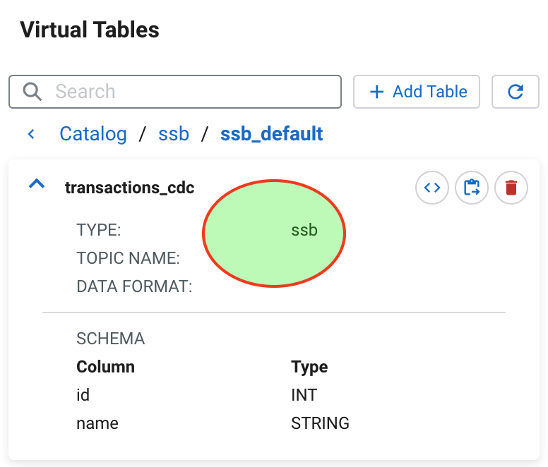
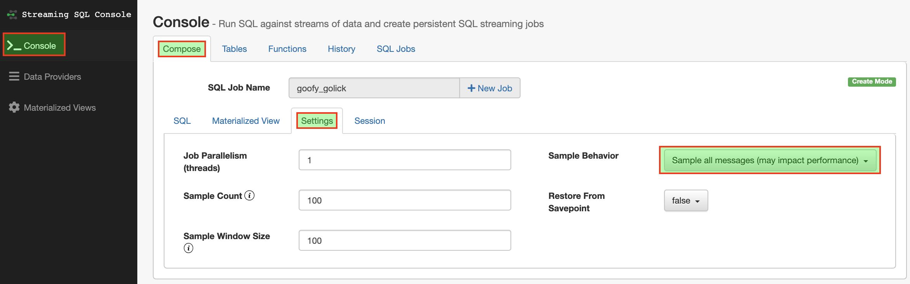
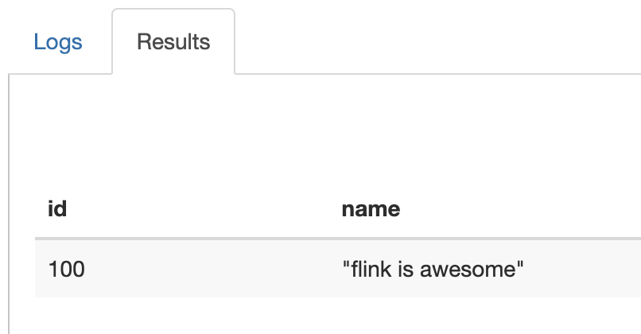
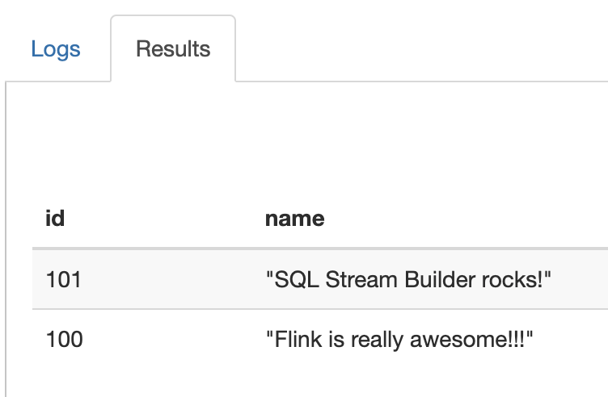
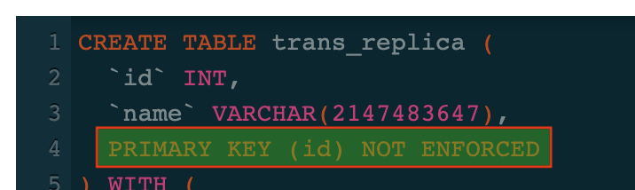
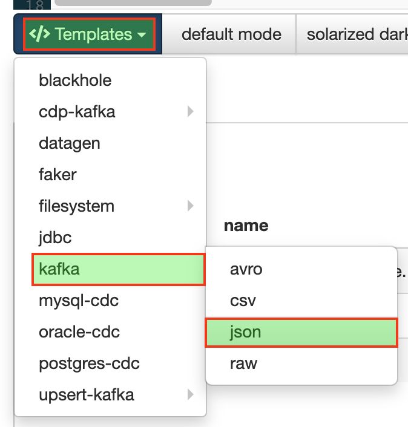
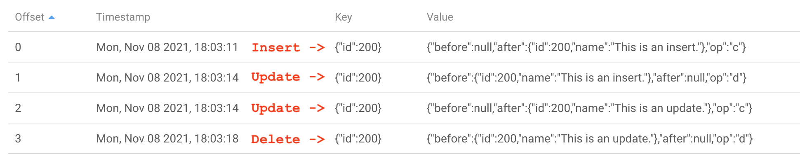

= Change Data Capture (CDC) with Flink/SSB

In this workshop you will use Cloudera *SQL Stream Builder* to capture and process changes coming from the activity in an external database.

== Preparation

To clean your environment and make it ready for the beginning of this lab, please SSH to your cluster host and run the following command:

NOTE: The command below will undo everything done in the cluster in previous workshops.

[source,shell]
----
/tmp/resources/reset-to-lab.sh cdc 1
----

== Introduction

Flink and SQL Stream Builder have builtin support for Change Data Capture (CDC) using Debezium libraries.

Debezium is a CDC tool that can stream changes in real-time from MySQL, PostgreSQL, Oracle, Microsoft SQL Server and many other databases into Kafka.
Debezium provides a unified format schema for changelog and supports to serialize messages using JSON and Apache Avro.

Flink supports to interpret Debezium JSON and Avro messages as INSERT/UPDATE/DELETE messages into Flink SQL system.
This is useful in many cases to leverage this feature, such as

* synchronizing incremental data from databases to other systems
* auditing logs
* real-time materialized views on databases
* temporal join changing history of a database table and so on.

For more information on using Debezium with Flink, please check the link:https://ci.apache.org/projects/flink/flink-docs-master/docs/connectors/table/formats/debezium/[Flink documentation]

=== Database pre-reqs

NOTE: _The details in this section are just for your information_. All this setup has already been completed for the workshop. To start the workshop, skip to the next section.

In this workshop you will capture changelog information from a PostgreSQL database.

The database configuration required for Debezium to work correctly have already been done for you and is out of the scope of the workshop.
This section gives you a glimpse of the preparation steps that have been done for the PostgreSQL database.
For more information and/or guidance for other types of databases, please refer to the Flink and Debezium official documentations.

==== PostgreSQL version

PostgreSQL 10 and above have builtin support for the `pgoutput` decoder that we use in this workshop.
We recommend using one of these versions.

==== Host connectivity

The database administrator must ensure that the Flink jobs are allowed to connect to the PostgreSQL database.
This is done by configuring the `pg_hba.conf` configuration file to allow connections from the hosts where Flink and SSB are running.

The configuration below use wildcards to allow connections from all the hosts to all the databases as `cdc_user`.
This can be made more specific to selected databases and hosts, as needed.

[source]
----
#    DATABASE  USER  ADDRESS     METHOD
host all       all   0.0.0.0/0  md5
----

==== Database configuration

The PostgreSQL database server must also be configured to enable logical data replication and tuned to support the required amount of Debezium connections to replication slots.

The configuration below is the simple `postgresql.conf` configuration that was used as a preparation for this workshop.
For a real world use case, please consult the PostgreSQL and Debezium documentation and configure the database according to the expected load.

[source]
----
wal_level = logical
max_wal_senders = 10
max_replication_slots = 10
----

==== Database privileges

Before Flink/Debezium can connect to a PostgreSQL database to collect changelog data, it is necessary:

* to grant the proper permissions to the user provided to Debezium; and
* create the necessary publications and replication slots in the database(s) from which the changelogs will be captured.

If the user provided to Flink/Debezium is a database _superuser_, the Debezium connector will take care of creating the required publications and replication slots.
This is the easier way to get started but also can create security concerns due to the elevated privileges given to Flink/Debezium.

The command below creates the `cdc_user` user/role as a _superuser_:

[source,sql]
----
-- Create cdc_user as a superuser
CREATE ROLE cdc_user WITH SUPERUSER CREATEDB CREATEROLE LOGIN ENCRYPTED PASSWORD 'supersecret1';
----

Alternatively, you can ask the database administrator to set the database up so that the Debezium user does not need to be a superuser and only has the privileges to connect and capture changelogs from specific databases.

The commands below creates the `cdc_user` user/role as a _superuser_:

[source,sql]
----
-- Create cdc_user user with only LOGIN and REPLICATION privileges
CREATE ROLE cdc_user WITH REPLICATION LOGIN PASSWORD 'supersecret1';
-- Grant privileges on the cdc_test database to the cdc_user
GRANT CONNECT ON DATABASE cdc_test TO cdc_user;
-- Connect to the cdc_test database
\c cdc_test
-- Create a replication slot named 'flink'
SELECT * FROM pg_create_logical_replication_slot('flink', 'pgoutput',  false);
-- Create a publication named 'dbz_publication' in the cdc_test database
CREATE PUBLICATION dbz_publication FOR ALL TABLES;
-- Grant SELECT privileges on all tables of the cdc_test database to the cdc_user
GRANT SELECT ON ALL TABLES IN SCHEMA public TO cdc_user;
-- Grant SELECT privileges on all *future* tables of the cdc_test database to the cdc_user
ALTER DEFAULT PRIVILEGES IN SCHEMA public GRANT ALL ON TABLES TO cdc_user;
----

As mentioned before, please refer to the official documentation for details about the above. Explaining the commands above is out of the scope of this workshop.

The workshop's PostgreSQL `cdc_test` database has already been set up with the following:

* A publication named `dbz_publication`
* A replication slot named `flink`

== Labs summary

* *Lab 1* - Creating a database table
* *Lab 2* - Creating a PostgreSQL CDC table in SSB
* *Lab 3* - Capturing table changes
* *Lab 4* - Replicating table changes
* *Lab 5* - Capturing changelog events

[[lab_1, Lab 1]]
== Lab 1 - Creating a database table

In this workshop you will create a table in the `cdc_test` database, generate some transactions on it and capture and replicated those transactions using Flink/SSB.

Let's start by connecting to PostgreSQL and creating the table.

. Connect to your cluster host using SSH

. Execute the following command to connect to the `cdc_test` database as `cdc_user`. The password for this user is `supersecret1`.
+
[source,shell]
----
psql --host localhost --port 5432 --username cdc_user cdc_test
----
+
When connected you should see the `psql` prompt, with the database name, as shown below:
+
[source]
----
cdc_test=#
----

. Run the following commands to create your test table:
+
[source,sql]
----
CREATE TABLE transactions (
  id INT,
  name TEXT,
  PRIMARY KEY (id)
);

ALTER TABLE transactions REPLICA IDENTITY FULL;
----
+
// TODO: Capture of UPDATE/DELETE events without FULL IDENTITY doesn't yet seem to be supported.
// NOTE: A primary key is typically required to allow `UPDATE` and `DELETE` operations in a table that has been flagged for changelog capture. If the table does not have a primary key you can still allow those operations by modifying the table with this command: `ALTER TABLE <schema>.<table>> REPLICA IDENTITY FULL`. However, this is not as efficient as the primary key.
The `ALTER TABLE ... REPLICA IDENTITY FULL` commands allows the capture of `UPDATE` and `DELETE` transactions for the table. Without this setting, Debezium can only capture `INSERT` events.

. Insert some initial data into your table and select it to verify that it was inserted correctly:
+
[source,sql]
----
INSERT INTO transactions VALUES (100, 'flink is awesome');
SELECT * FROM transactions;
----

. Try a few other `psql` commands:
** `\d` - list all tables in the database
** `\d <table_name>` - describe the table structure

[[lab_2, Lab 2]]
== Lab 2 - Creating a PostgreSQL CDC table in SSB

In this lab you will set up an SSB table to capture the changelog stream for the `transactions` table.

. In the SSB UI, click on *Console* (on the left bar) *> Compose*.

. Click on *Templates > postgres-cdc*
+

+
You will notice that the SQL editor box will be filled with a generic template of a statement to create a table using the `postgres-cdc` connector.
+
In the next steps you will tailor this statement to match the structure of the PostgreSQL's `transaction` table and configure it with the necessary properties.

. The `transactions` table you created in step 1 has two columns: `id`, of type `integer`, and `name`, of type `text`.
+
In the Flink ANSI SQL dialect, the equivalent data types of the ones above are the following:
+
[%autowidth,cols="1a,1a",options="header"]
|====
|PostgreSQL|Flink
|`integer`|`INT`
|`text`|`STRING`
|====
+
Change your `CREATE TABLE` template to rename your SSB table to `transactions_cdc` and match the columns and data types to those of the `transactions` table.
+
After the changes, the beginning of your statement should look like the one below:
+
[source,sql]
----
CREATE TABLE transactions_cdc (
  id   INT,
  name STRING
) WITH (
...
----

. The template has lots of properties inside the `WITH` clause that allow you to configure the table to connect to your database and table.
There are properties that must be specified and others that are optional and are commented out in the template.
+
In this lab you will set all the required properties plus a few of the optional ones.
You can ignore the other optional properties.
+
Set the following required properties in your statement:
+
[source,yaml]
----
connector:     postgres-cdc
hostname:      <CLUSTER_HOSTNAME>
username:      cdc_user
password:      supersecret1
database-name: cdc_test
table-name:    transactions
schema-name:   public
----

. _Uncomment_ and set the following optional properties in your statement.
+
NOTE: Make sure your final statement has all the commas separating the property assignments.
+
[source,yaml]
----
decoding.plugin.name: pgoutput
debezium.publication.name: dbz_publication
debezium.slot.name: flink
----
+
Your final `CREATE TABLE` statement should look like the one below:
+
[source,sql]
----
CREATE TABLE transactions_cdc (
  id   INT,
  name STRING
) WITH (
  'connector' = 'postgres-cdc',
  'hostname' = '<CLUSTER_HOSTNAME>',
  'username' = 'cdc_user',
  'password' = 'supersecret1',
  'database-name' = 'cdc_test',
  'table-name' = 'transactions',
  'schema-name' = 'public',
  'decoding.plugin.name' = 'pgoutput',
  'debezium.publication.name' = 'dbz_publication',
  'debezium.slot.name' = 'flink',
  'debezium.snapshot.mode' = 'initial'
);
----

. Click on the *Execute* button to execute the statement and create the `transactions_cdc` table.

. Click on the *Tables* tab and navigate to the newly created table to verify its details:
+

[[lab_3, Lab 3]]
== Lab 3 - Capturing table changes

The table that you created above receives the stream of changes for the `transactions` table.

As you may have noticed in the `CREATE TABLE` statement above, the table is using the snapshot mode `initial`.
This mode takes a full snapshot of the table contents the first time a query is executed and subsequent runs of the same query can then read only what changed since the previous execution.
There are many other snapshot modes.
For details about the available modes and their behaviour, please consult the link:https://debezium.io/documentation/reference/connectors/postgresql.html[Debezium PostgreSQL connector documentation].

In this lab you will explore the capturing of changelogs in SSB.

. In the *Compose* pane of the SSB UI *Console*, click on the *Settings* tab and select the "*Sample all messages*" sample behavior.
+

+
By default, when you run a query in SSB only a small sample of the selected messages are shown in the UI (one message per second).
This avoids slowing down the UI and causing performance issues for the job.
+
Here, since the volume of data is small and we want to verify that all the changelog messages have been captured you are setting SSB to show all the messages in the UI.

. Click on the *SQL* tab and execute the following query:
+
[source,sql]
----
SELECT *
FROM transactions_cdc
----
+
Since this is the first time the job runs, the PostgreSQL connector will take a full snapshot of the existing table and you should see its content on the Results tab:
+

. Now, try stopping the job and executing it again.
+
What happened? Did you get the initial snapshot data again? Why?
+
When the `initial` snapshot mode is used, Flink keeps track of last changelog processed and stores this information in the job state.
When you stop the job in SSB, it creates a savepoint of the job's state that can be used to resume execution later.
+
By default, though, the savepoint is *not* automatically used when starting a job and every execution of the same query starts from scratch, causing the PostgreSQL connector to take another initial snapshot of the entire table.
+
In the next steps you will enable the use of the savepoint.

. Stop the job.

. Click again on the *Settings* tab and this time set the *Restore From Savepoint* property to `true`.

. Go back to the *SQL* tab and execute the job again.
+
Do you see the initial row again?
You should not, because this job resumed from the same point where the last execution had stopped at and the initial row snapshot had already been read.
+
Since there's no data coming in, you should just see the following line in the *Log* tab with an increasing counter, indicating that the job is running:
+

. Now, while the job executes, connect again to your cluster host via SSH and connect to the PostgreSQL database with the following command:
+
[source,shell]
----
psql --host localhost --port 5432 --username cdc_user cdc_test
----
+
In the `psql` prompt, execute the following commands to insert one more record in the `transactions` table and update the record with id `101`:
+
[source,sql]
----
INSERT INTO transactions
VALUES (101, 'SQL Stream Builder rocks!');

UPDATE transactions
SET name = 'Flink is really awesome!!!'
WHERE id = 100;
----
+
Check the SSB UI and you should now see the new state of the 2 rows that were modified.
+

. Click *Stop* to stop the Flink job.

[[lab_4, Lab 4]]
== Lab 4 - Replicating table changes

In the previous lab you visualized the capture of the changes applied to a database table in SSB.
Now you will create an SSB job to replicate the captured changes to another table.

Since we already have a PostgreSQL database available, we will create the target table in the same database.
Nevertheless, you can replicate the data to any other database accessible via JDBC or via other available Flink/SSB connectors (e.g. Kudu).

. Connect again to the PostgreSQL database in your SSH session and create a new table to receive the replicated data:
+
[source,shell]
----
psql --host localhost --port 5432 --username cdc_user cdc_test
----
+
[source,sql]
----
CREATE TABLE trans_replica (
  id INT,
  name TEXT,
  PRIMARY KEY (id)
);
----

. In the SSB UI, open the SQL Editor and type the following command, _but do not execute it yet_:
+
[source,sql]
----
INSERT INTO trans_replica
SELECT *
FROM transactions_cdc
----

. Click on *Templates > jdbc*. This will add the template for a JDBC table in the SQL editor.
+
Note that SSB matches the structure of the table being created to the result of the query you typed in the previous step!
+
image:images/cdc/jdbc-template.png[width=200]

. The `CREATE TABLE` template, though, does not have a primary key specified and this required to allow updates and deletes.
+
Add the `PRIMARY KEY (id) NOT ENFORCED` clause to the statement, as shown below.
Notice that a comma is required in between the `name` column spec and the `PRIMARY KEY` clause.
+

. Specify the following properties for the table (the remaining ones can be removed from the editor):
+
[source,yaml]
----
connector:  jdbc
url:        jdbc:postgresql://<CLUSTER_HOSTNAME>:5432/cdc_test
table-name: trans_replica
username:   cdc_user
password:   supersecret1
driver:     org.postgresql.Driver
----

. Once the table properties are configured, click *Execute* to launch the job.
+
The table will be created and the `INSERT ... SELECT ...` statement will start to execute to replica the data from the `transactions` to the `trans_replica` table.

. Back in the SSH session, in the `psql` prompt, execute the following statements to generate activity on the `transactions` table and verify that the change were successfully replicated to the `trans_replica` one.
+
[source,sql]
----
-- Check the contents of both tables - they should be the same
SELECT * FROM transactions;
SELECT * FROM trans_replica;

-- Generate activity on transactions (INSERT, UPDATE, DELETE)
INSERT INTO transactions VALUES (103, 'Live long and replicate with SSB and Flink.');
UPDATE transactions SET name = 'Flink is *REALLY* awesome!!!' where id = 100;
DELETE FROM transactions WHERE id = 101;

-- Check the contents of both tables - they should still be the same!
SELECT * FROM transactions;
SELECT * FROM trans_replica;
----

. Click *Stop* to stop the Flink job.

[[lab_5, Lab 5]]
== Lab 5 - Capturing changelog events

It is also possible to using SSB/Debezium to capture changelog events (`INSERT`, `UPDATE`, and `DELETE`).
This exposes additional metadata to the stream like the type of operation being performed on the table and the before and after values of the changed columns.

This type of information can be important for use cases that analize how the data is changing, rather than simply looking at the latest state of it.

In this lab you will create an SSB job that reads the changelog from the source database and publishes it to a topic in Kafka, with the additional metadata information provided by Debezium.

. In the SSB UI, open the SQL Editor and type the following command, _but do not execute it yet_:
+
[source,sql]
----
INSERT INTO trans_changelog
SELECT *
FROM transactions_cdc
----

. Click on *Templates > jdbc*. This will add the template for a JDBC table in the SQL editor.
+
Note that SSB matches the structure of the table being created to the result of the query you typed in the previous step!
+

. Specify the following properties for the table (the remaining ones can be removed from the editor):
+
[source,yaml]
----
connector:                    kafka
properties.bootstrap.servers: <CLUSTER_HOSTNAME>:9092
topic:                        trans_changelog
key.format:                   json
key.fields:                   id
value.format:                 debezium-json
----

. Once the table properties are configured, click *Execute* to launch the job.
+
The table will be created and the `INSERT ... SELECT ...` statement will start to execute to replica the changelog from the `transactions` table to the `trans_changelog` topic in Kafka.

. Back in the SSH session, in the `psql` prompt, execute the following statements to generate activity on the `transactions` table.
+
[source,sql]
----
INSERT INTO transactions VALUES (200, 'This is an insert.');
UPDATE transactions SET name = 'This is an update.' WHERE id = 200;
DELETE FROM transactions WHERE id = 200;
----

. You will use the Streams Messaging Manager (SMM) UI to check the contents written to the `trans_changelog` topic.
+
Navigate to the SMM UI: *Cloudera Manager > Clusters > SMM > Streams Messaging Manager Web UI*.

. In the SMM UI, click on the *Topics* icon () on the left-hand bar.

. Type "trans_changelog" in the search box to filter that topic and click on the magnifier glass icon () for the topic to look at the topic's contents:
+

+
From the screnshot above you can notice the following:

* `INSERT` operations generate a single changelog event with `op=c` (for **C**reate). The `before` value is `null` for this event, since the data didn't exist beforehand. The `after` value is the data being inserted.
* `UPDATE` operations are translated by Debezium into a `DELETE` event (`op=d`) followed by an `INSERT` event (`op=c`). The `before` value of the `DELETE` event is the record state before the update, while the `after` value of the `INSERT` event is the state after the update.
* `INSERT` operations generate a single changelog event with `op=d`. The `after` value is `null` since the data is no more after the operation completes.

== Conclusion

In this workshop you learned how to use SQL Stream Builder (SSB), Flink and a Debezium-based PostgreSQL connector (`postgres-cdc`) to extract changelog data from a relational database and use it in different ways in SSB.

