= Creating Dashboards with Cloudera Data Viz

In this workshop you will create a simple interactive real-time dashboard to visualize sensor data that is being stored in Kudu.

The data you will use is the sensor data collected and processed in previous workshops (see Preparation below).

== Preparation

This workshop builds upon the content developed in the link:workshop_edge.adoc[Edge] and link:workshop_nifi.adoc[Nifi] workshops.

To clean your environment and make it ready for the beginning of this lab, please SSH to your cluster host and run the following command:

NOTE: The command below will undo everything done in the cluster in previous workshops.

[source,shell]
----
/tmp/resources/reset-to-lab.sh dataviz 1
----

== Labs summary

* *Lab 1* - Navigate to Cloudera Data Visualization
* *Lab 2* - Creating a new connection
* *Lab 3* - Exploring the data
* *Lab 4* - Creating a dashboard
* *Lab 5* - Adding a chart

[[lab_1, Lab 1]]
== Lab 1 - Navigate to Cloudera Data Visualization

This lab shows you how to navigate to Cloudera Data Visualization (DataViz) page.

If you are in a guided workshop you may already been given the link to the DataViz page.
If that's the case, feel free to skip to the next lab.
//[source,sql]
//----
//SELECT microseconds_add(from_unixtime(cast(cast(sensor_ts as bigint)/1000000 as bigint),"yyyy-MM-dd HH:mm:ss"),cast(right(sensor_ts,6) as INT))
//FROM sensors;
//----

. Open CDP Data Visualization and log in
+
CDP Data Visualization can be accessed through the Cloudera Data Science Workbench (CDSW). Follow the navigation steps below if you don't know how to get there:
+
.. In Cloudera Manager, click on *Clusters > Cloudera Data Science Workbench*.
.. On the CDSW page, click on the *CDSW Web UI* link.
.. Log on to CDSW.
.. On the CDSW page, click on *Applications* and then on the "Viz Server Application", which has been previously set up for the workshop.
+
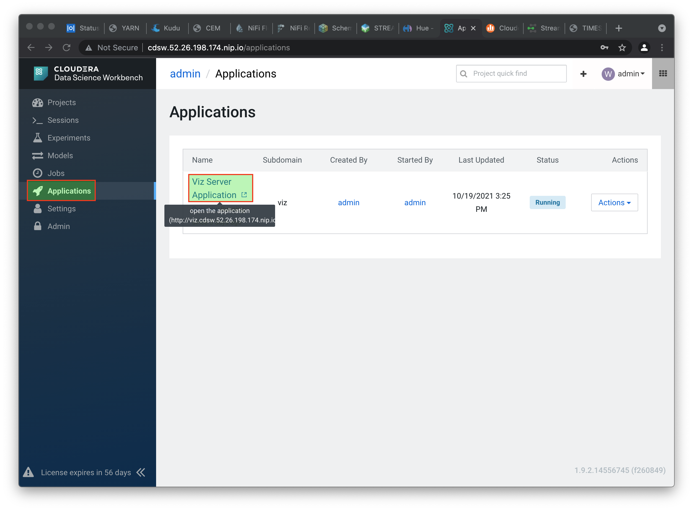
.. Log in to the Cloudera Data Visualization application. After logging in you should see the application home page:
+
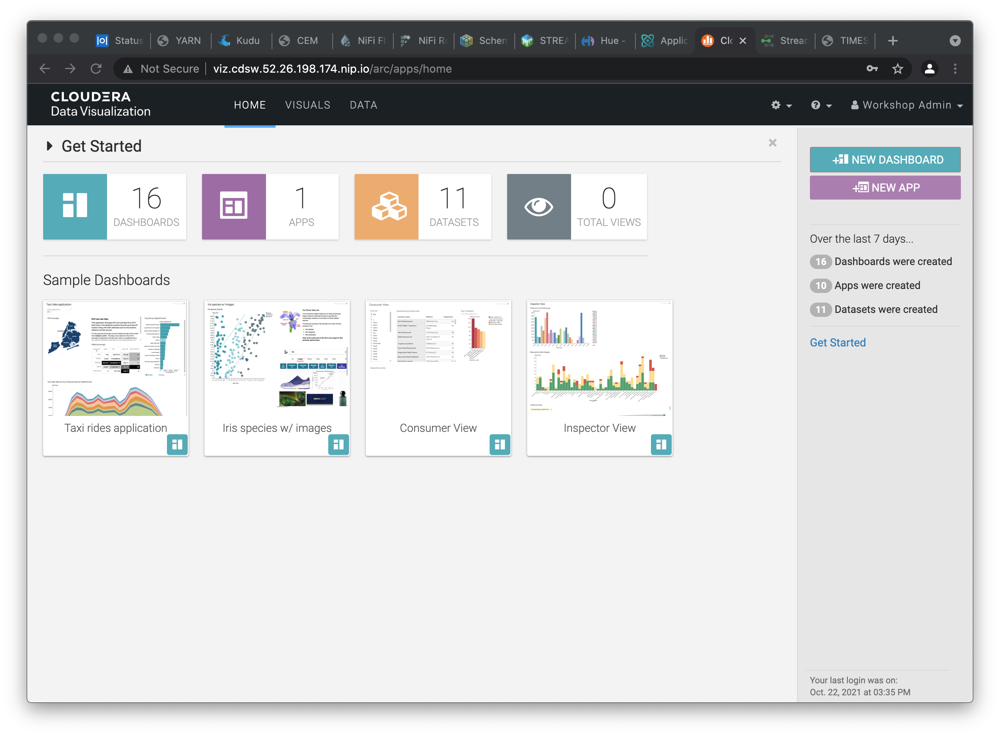

[[lab_2, Lab 2]]
== Lab 2 - Creating a new connection

Kudu is purely a storage engine and does not provide a SQL interface for querying. SQL access to Kudu is done through an Impala engine, which is what you will use in this workshop.
You will set up a new connection to the Impala engine to use for your dashboard queries.

. Select the *Data* tab and click on *NEW CONNECTION*.
+
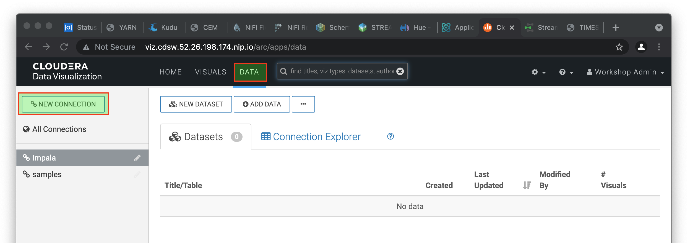

. At the top of the form, set the following properties:
+
[source,yaml]
----
Connection type: Impala
Connection name: Local Impala
----

. In the *Basic* tab set the following:
+
[source,yaml]
----
Hostname: <CLUSTER_HOSTNAME> (something like: cdp.x.x.x.x.nip.io)
Port #:   21050
Username: [leave blank]
Password: [leave blank]
----
+
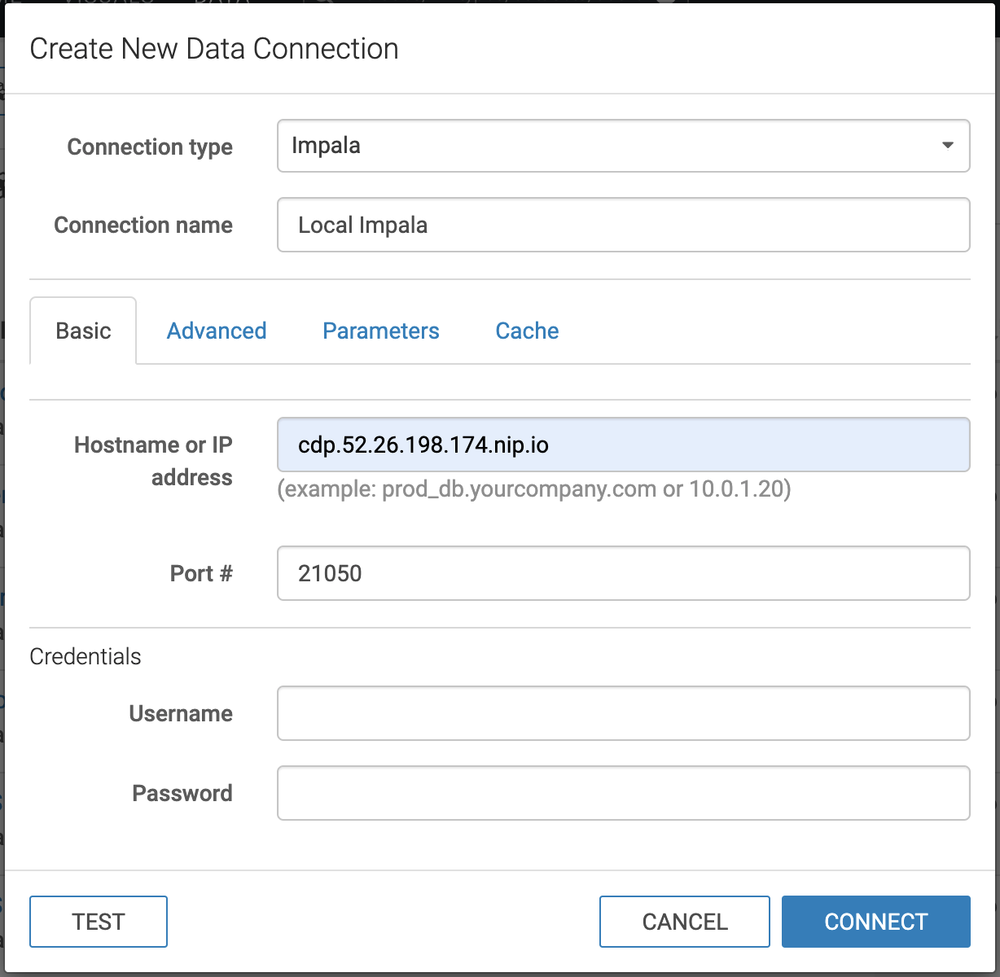

. In the *Advanced* tab set the following:
+
[source,yaml]
----
Connection mode:     Binary
Socket type:         Normal
Authentication mode: NoSasl
----

. Click on *TEST* to test the connection.
+
You should see "Connection Verified", as shown below.
+
image::images/dataviz/new-connection-advanced.png[width=500]

. Click on *CONNECT*.

[[lab_3, Lab 3]]
== Lab 3 - Exploring the data

Cloudera Data Visualization provides a Data Explorer tool that enables you to explore, transform and create views of the data to suit your needs.
In this lab you will look at the data available in Kudu and prepare it for your dashboard.

. Select the newly created *Local Impala* connection, which you can see on the left-hand pane.

. Select the *Connection Explorer* tab, then the *default* database and finally the *sensors* table. A preview with sample data will be loaded.
+
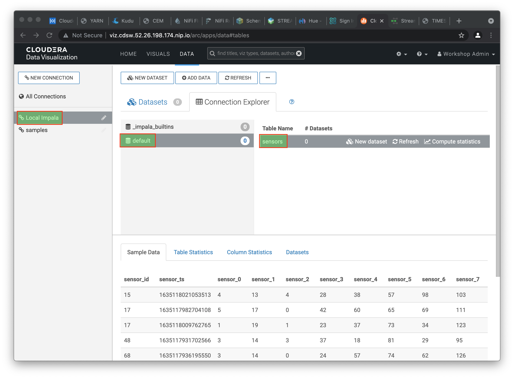
+
You can see in the data sample that the `sensor_ts` column contains the timestamp in microseconds.
For your dashboard you need to convert these values into seconds instead.
In the next steps you will create a new dataset and make the necessary data adjustments.

. Click on the *New dataset* option _besides the *sensor* table_. Name the dataset "sensor data"
+
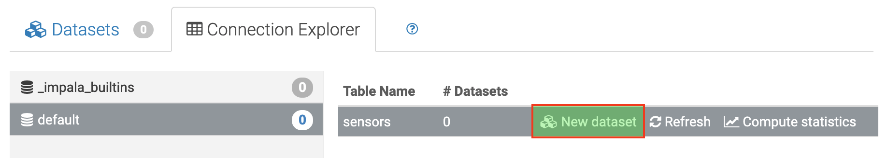
+
A new dataset will be created and displayed under the Datasets tab:
+
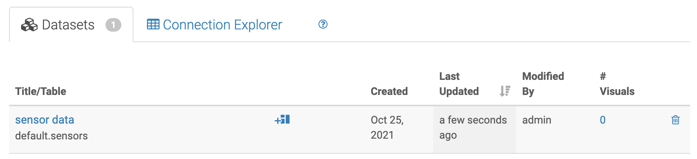

. Click on the dataset to open it and select the *Fields* tab. You will notice that DataViz didn't automatically detect any dimension for the dataset.
+
Since the `sensor_ts` column is of a numeric type, and not a date/time, which is indicated by the `#` icon besides the field name, it was classified as a _measure_ rather than a _dimension_. You will fix in the next steps.
+
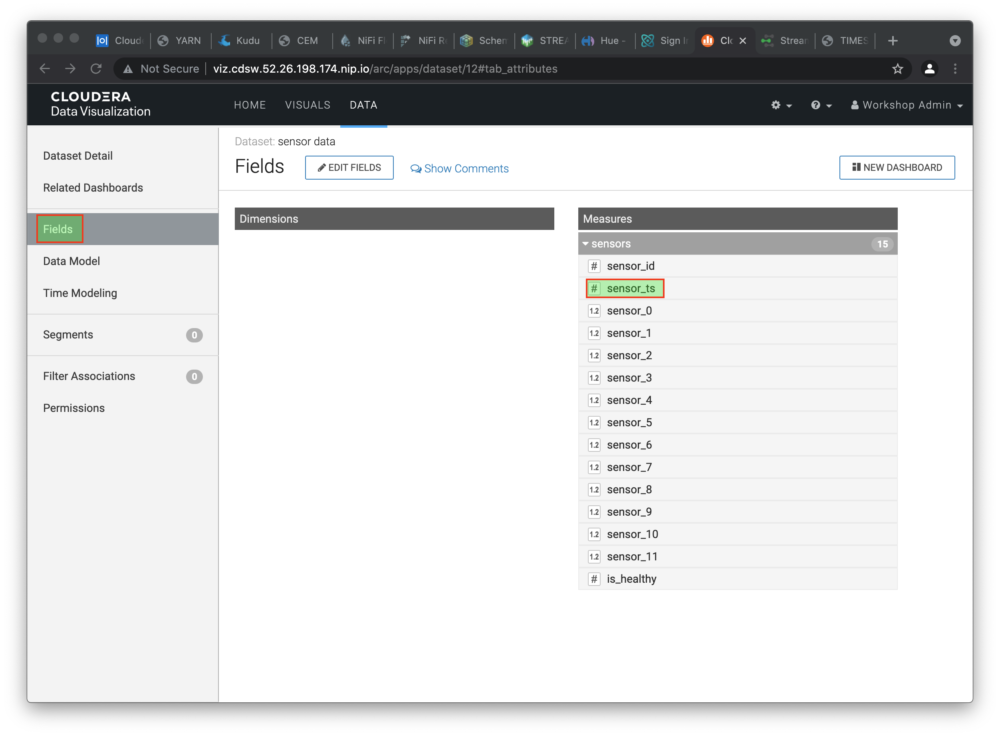

. You need to convert the numeric fields from microseconds to seconds and convert it to a `TIMESTAMP` data type. In order to do this, click on the *EDIT FIELDS* button.
+
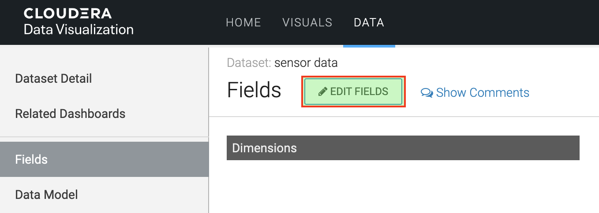

. In the *Measures* list, find the `sensor_ts` measure, open its drop-down menu and click on *Clone*. A new measure `Copy of sensor_ts` will appear.
+
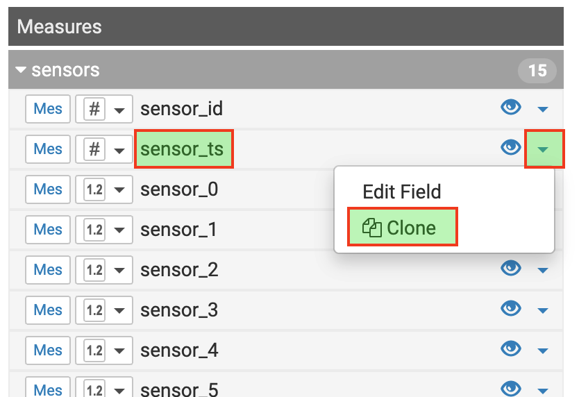

. Open the drop-down menu for this new measure, and select *Edit field*.
+
image::images/dataviz/edit-measure.png[width=300]

. In the *Edit Field Parameters* window, change the following:
.. In the *Basic Settings* tab:
+
[source,yaml]
----
Display Name: sensor_timestamp
Category:     Dimension
----

.. In the *Expression* tab, enter the following expression:
+
[source,sql]
----
microseconds_add(to_timestamp(cast([sensor_ts]/1000000 as bigint)), [sensor_ts] % 1000000)
----

.. Validate the expression by clicking on *VALIDATE EXPRESSION*.
.. Click *APPLY* to save the changes
+
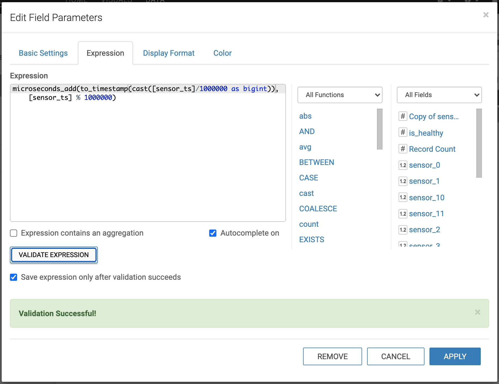

. You will notice that the category (`Dim`), data type (calendar icon) and field name were updated.
The field still shows up in the *Measure* category, though.
+
image::images/dataviz/updated-field-category.png[width=300]
+
This is just refresh issue. Click on the *REFRESH* button at the top and you should see the `sensor_timestamp` field "jump" to the *Dimensions* category.
+
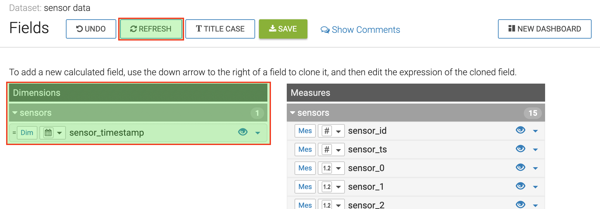

. The `sensor_id` field is also a dimension and needs to be moved to the correct category.
+
To do this, find the `sensor_id` field under the *Measures* category and click on the 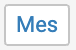 icon to toggle it to 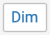.
Click on the *REFRESH* button again and you should see the following structure for your dataset:
+
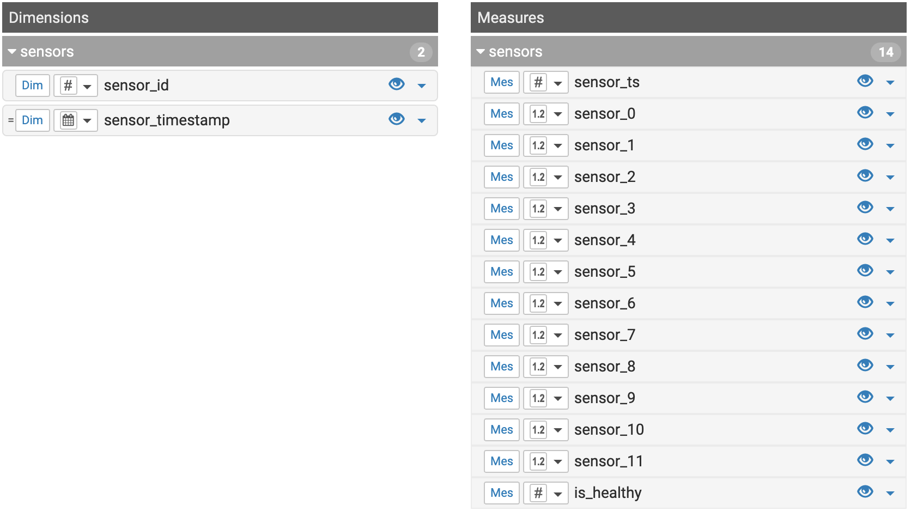

. Save you changes by clicking the green *Save* button.

You have just created a dataset to feed your dashboard and performed the necesssary adjustments for your data source.
In the next lab you will create the dashboard from it.

[[lab_4, Lab 4]]
== Lab 4 - Creating a dashboard

You have everything ready now to start building your dashboard. Let's jump straight into it:

. On your dataset page, click on the *NEW DASHBOARD* button.
+
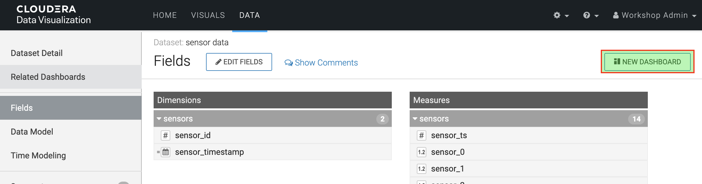

. Since we initiated the dashboard creation from the dataset page, will you notice that the dashboard is already created by default with a "table visual" displaying all fields of the dataset.
+
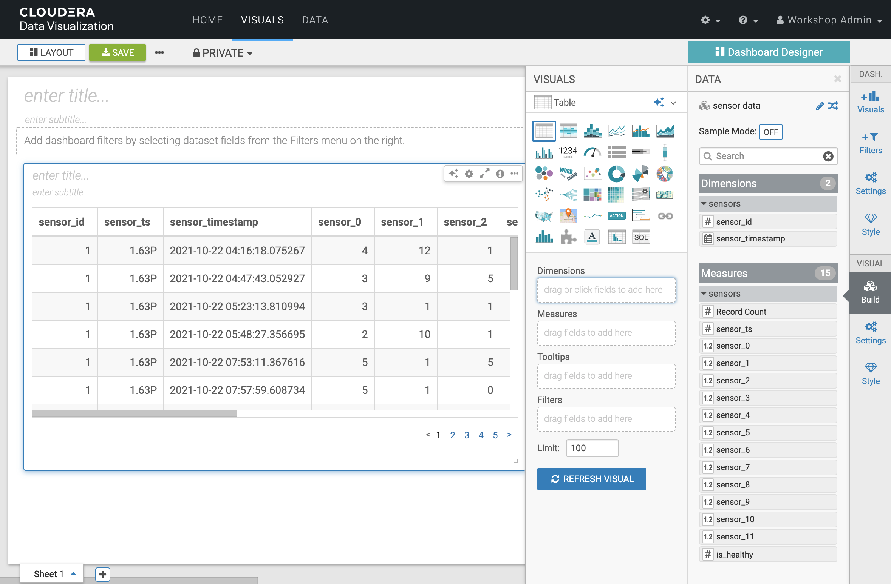

. Click on the table visual to ensure it is selected (you see a blue border around the visual when it is selected). With the table visual selected, click on the *Build* tab on the right.

. Click on the *Measures* input box to select it. Then click on the fields `sensor_0` and `sensor_1` from the *Measures* list. These fields will be added to the *Measures* input box.
+
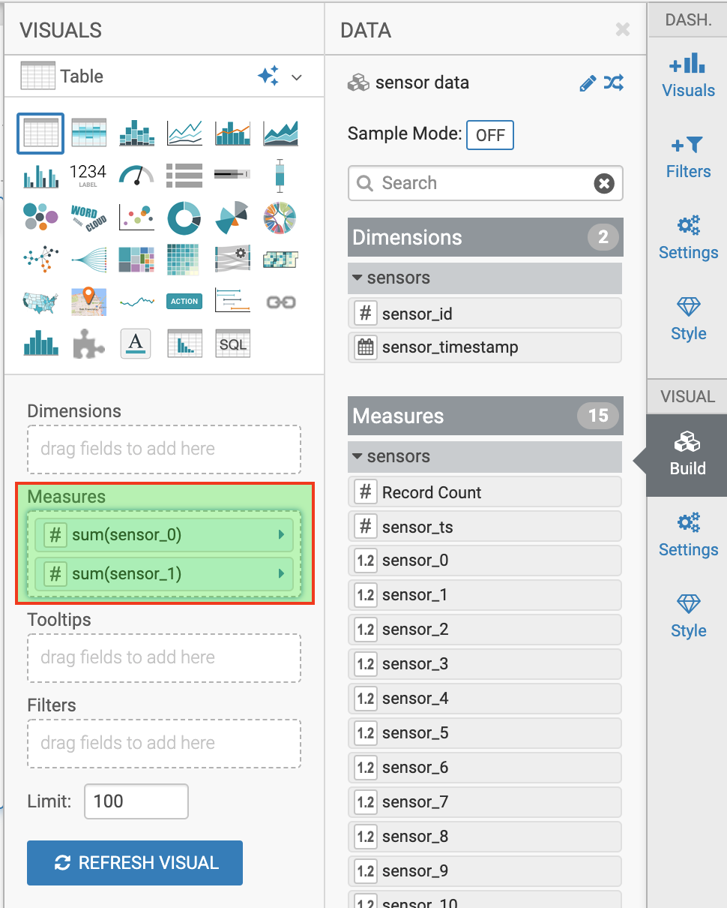

. The measures are added, by default, with the `sum()` aggregation. Change it to `avg()` by selecting each one of the newly added measures and selecting *Aggregates > Average*. _Ensure this is done for both measures_.
+
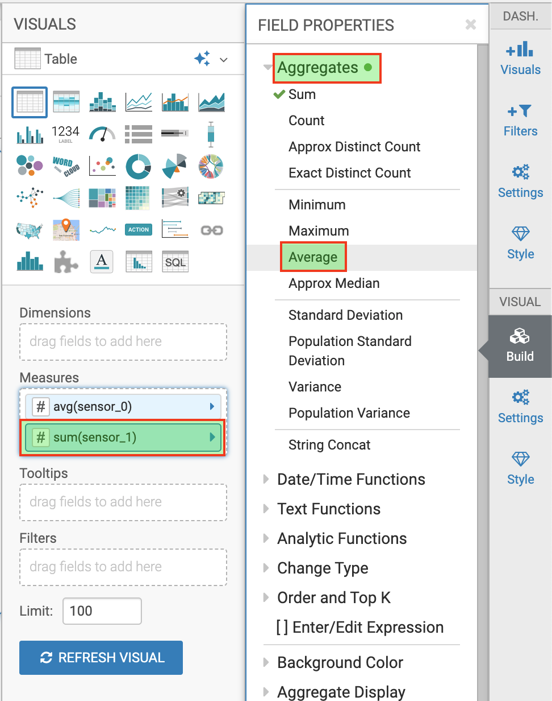

. Click on the *Dimensions* input box to select it. Then click on the fields `sensor_timestamp` and `sensor_id` from the *Dimensions* list. These fields will be added to the *Dimensions* input box.

. Highlight `sensor_timestamp` field in the *Measures* input box and select *Order and Top K > Descending*. This will show the values in the table visual in descending order with the newest sensor readings on top.
+
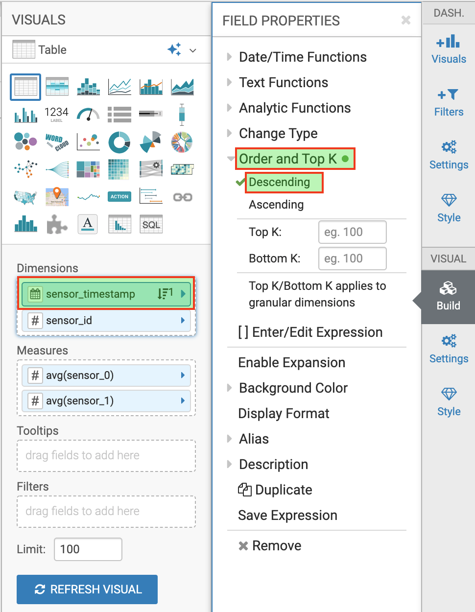

. Click on *Refresh visual* to update the visual with the latest changes.

. Finally, select the *Settings* tab on the right of the screen and change the value for *Auto-refresh period (sec)* to `5`.
+
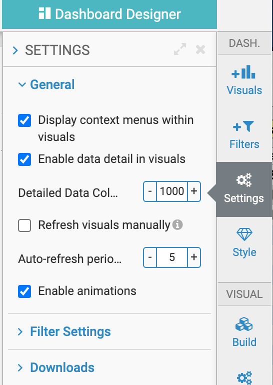

. Click on the *Save* button at the top of the dashboard to save the changes and click *View* to enter view/publish mode.
This is what your dashboard consumers will see: the sensor reading coming in through the streaming pipeline, displayed in a real-time dashboard, updating automatically.
+
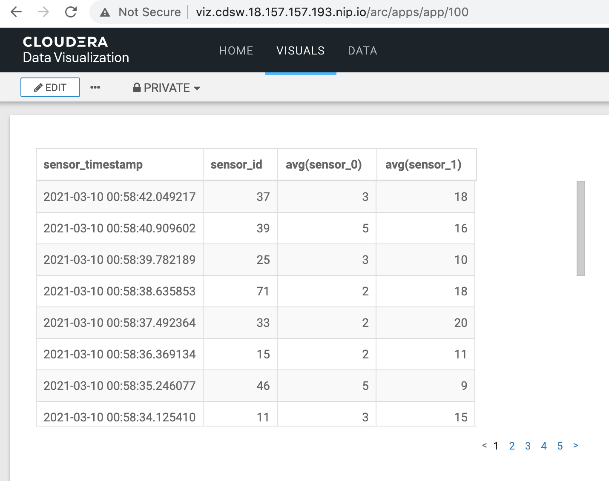

[[lab_5, Lab 5]]
== Lab 5 - Adding a chart

Dashboards are usually synonym with graphs and charts.
Cloudera Data Visualization comes with a myriad of charts types to help visualize your data.
In this lab you'll add a simple bar chart to your dashboard to make it more interesting.

. On the view mode dashboard above, click on the *EDIT* button to go back into editing mode.

. Click on the *Visuals* tab on the right. Ensure the *Local Impala* connection and the *sensor data* dataset are selected and click on the *NEW VISUAL* button.
+
image::images/dataviz/add-visuals.png[width=300]

. On the *Visuals* tab, select the *Scatter* visual type:
+
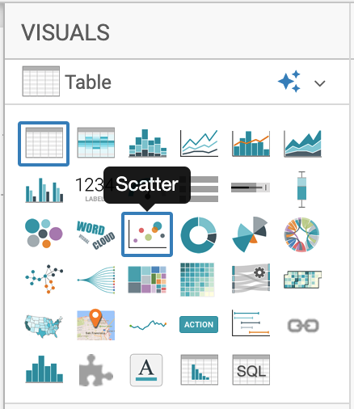

. Based on what you learned in the previous lab, enter the following properties:
+
[source,yaml]
----
X Axis:  sensor_id
Y Axis:  avg(sensor_0)
Colors:  sensor_id
Size:    avg(sensor_0)
Filters: sensor_timestamp
----

. Click on the `sensor_timestamp` filter to select it and then click on *[] Enter/Edit Expression*.
+
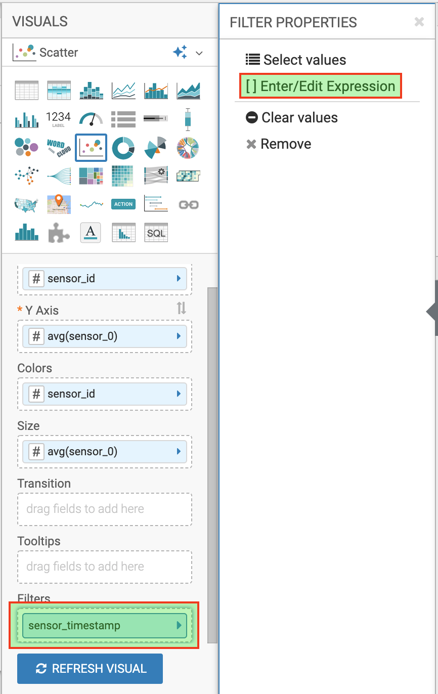

. Enter the following expression in the *Enter/Edit Expression* window to limit the data shown in the chart to the last minute of data received.
This will create a chart over a rolling window of 1 minute.
+
[source,sql]
----
[sensor_timestamp] > seconds_sub(now(), 60)
----

. Validate the expression and click *Save*.

. Click on *VISUAL > Style* on the right-hand tab, and select a colorful palette in the *Colors* section.
+
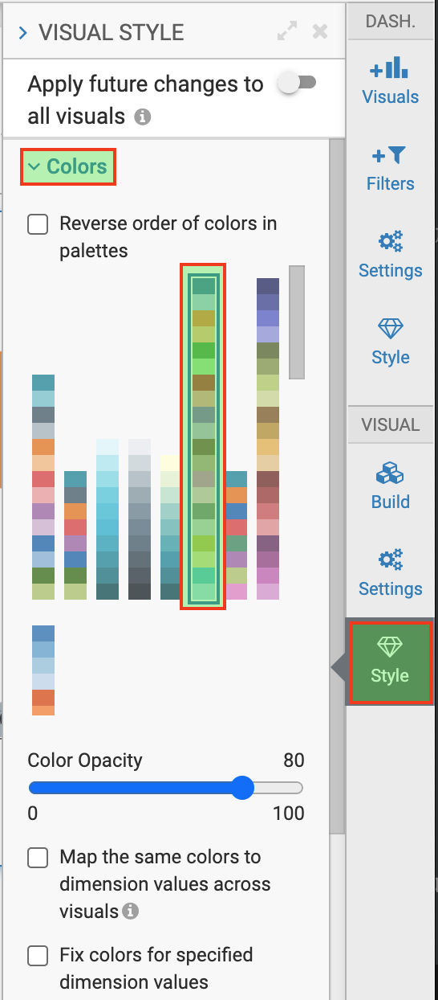

. Click on *VISUAL > Settings* on the right-hand tab, and set the *Y Axis Scale* to `log10` in the *Axes* section.
+
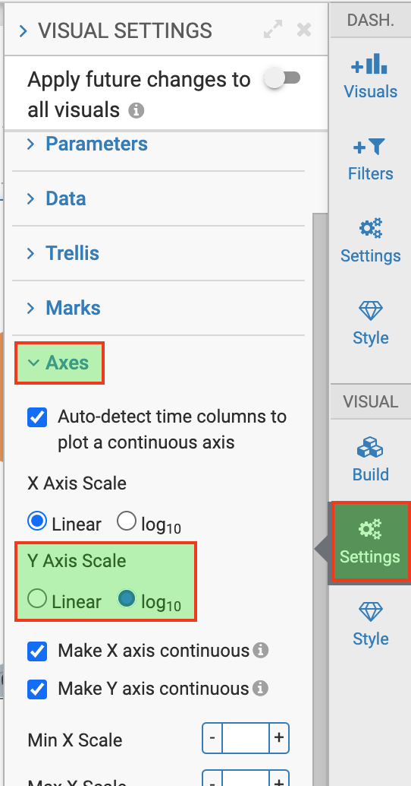

. Expand the *Marks* section and set the *Legend style* to `None`.
+
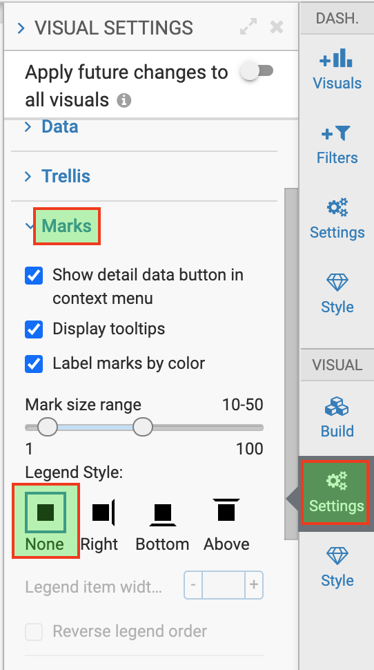

. Click on the 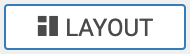 button, at the top of the Dashboard Designer to arrange the visuals in your dashboard.
Drag the two visuals in the diagram to position them as you would like. Once you are done, click on *APPLY LAYOUT*.
+
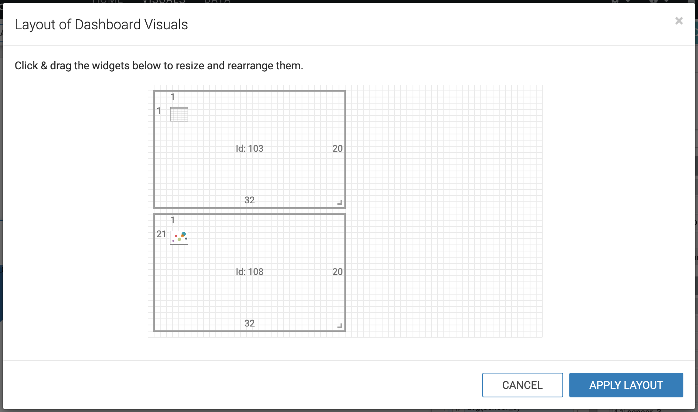

. Click on the *Save* buttons to save the changes to your dashboard and then click on *View* to switch to the view mode and check your real-time dashboard in action:

+
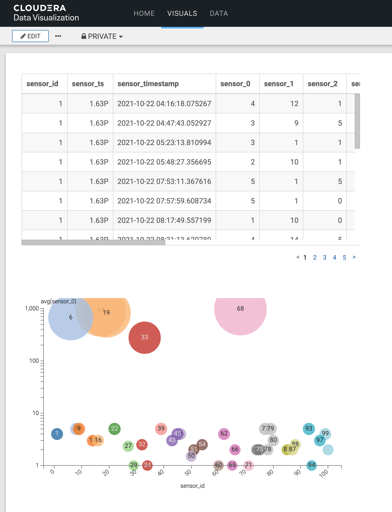
