= Ingesting data from the edge

In this workshop you'll use MiNiFi to capture data from the edge and forward it to NiFi.

== Preparation

To clean your environment and reset to the beginning of this lab, please SSH to your cluster host and run the following command:

NOTE: The command below will undo everything done in the cluster in previous workshops.

[source,shell]
----
/tmp/resources/reset-to-lab.sh edge 1
----

== Labs summary

* *Lab 1* - Run a simulator on Apache NiFi to send IoT sensors data to a MQTT broker.
* *Lab 2* - Create a flow to collect data from the MQTT broker using Cloudera Edge Flow Manager and publish it to a MiNiFi agent.
* *Lab 3* - Use the Edge Flow Manager to update existing edge flows and perform additional processing on the edge

[[lab_1, Lab 1]]
== Lab 1 - Apache NiFi: setup machine sensors simulator 

In this lab you will run a simple Python script that simulates IoT sensor data from some hypothetical machines, and send the data to a MQTT broker (link:https://mosquitto.org/[mosquitto]). The MQTT broker plays the role of a gateway that is connected to many and different type of sensors through the "mqtt" protocol. Your cluster comes with an embedded MQTT broker that the simulation script publishes to. For convenience, we will use NiFi to run the script rather than Shell commands.

. Go to Apache NiFi and add a Processor (ExecuteProcess) to the canvas.
+
image::images/edge/simulate1.png[width=800]

. Right-click the processor, select *Configure* (or, alternatively, just double-click the processor). On the *PROPERTIES* tab, set the properties shown below to run our Python simulate script.
+
[source,yaml]
----
Command:           python3
Command Arguments: /opt/demo/simulate.py
----
+
image::images/edge/simulate2.png[width=500]

. In the *SCHEDULING* tab, set to *Run Schedule: 1 sec*
+
Alternatively, you could set that to other time intervals: 1 sec, 30 sec, 1 min, etc...
+
image::images/edge/runSimulator1or30.png[width=500]

. In the *SETTINGS* tab:
.. Check the "*success*" relationship in the *AUTOMATICALLY TERMINATED RELATIONSHIPS* section
.. Set the processor name to "*Generate Test Data*"
.. Click *Apply*.
+
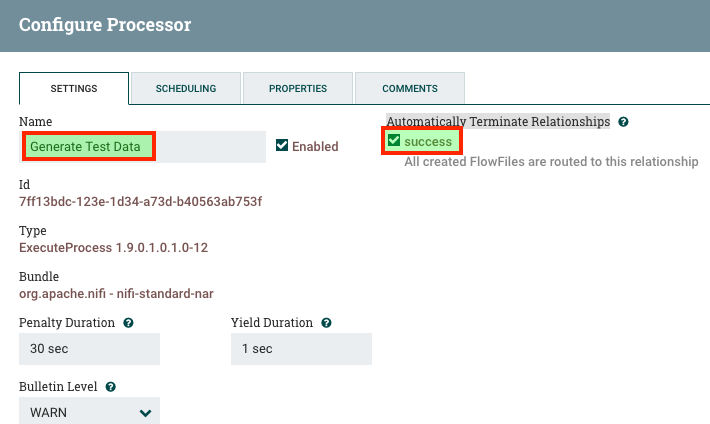

. You can then right-click to *Start* this simulator runner.
+
image::images/edge/nifiDemoStart.png[width=400]

. Right-click and select *Stop* after a few seconds and look at the *provenance*. You'll see that it has run a number of times and produced results.
+
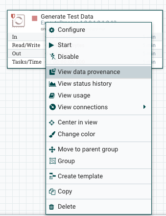
+
image::images/edge/NiFiDataProvenance.png[width=800]

[[lab_2, Lab2]]
== Lab 2 - Configuring Edge Flow Management

Cloudera Edge Flow Management (EFM) gives you a visual overview of all MiNiFi agents in your environment, and allows you to update the flow configuration for each one, with versioning control thanks to the **NiFi Registry** integration. In this lab, you will create the MiNiFi flow and publish it for the MiNiFi agent to pick it up.

. Open the EFM Web UI at http://<public_dns>:10088/efm/ui/ and select the Dashboard tab (image:images/edge/dashboard_icon.png[width=30])

. Click on the *EVENTS* header and verify that your EFM server is receiving heartbeats from the MiNiFi agent. Click on the info icon on a heartbeat record to see the details of the heartbeat.
+
image::images/edge/cem_heartbeats.png[width=800]

. Select the **Flow Designer** tab (). To build a dataflow, select the desired class (`iot-1`) from the table and click *OPEN*.  Alternatively, you can double-click on the desired class.

. Add a _ConsumeMQTT_ Processor to the canvas, by dragging the processor icon to the canvas, selecting the _ConsumeMQTT_ processor type and clicking on the *Add* button. Once the processor is on the canvas, double-click it and configure it with below settings:
+
[source,yaml]
----
Broker URI:     tcp://<CLUSTER_HOSTNAME>:1883
Client ID:      minifi-iot
Topic Filter:   iot/#
Max Queue Size: 60
----
+
image::images/edge/add_consumer_mqtt.png[width=800]
+
And ensure you scroll down on the properties page to set the *Topic Filter* and *Max Queue Size*:
+
image::images/edge/add_consumer_mqtt_2.png[width=800]

. Add a _Remote Process Group_ (RPG) to the canvas and configure it as follows:
+
[source,yaml]
----
URL:                http://<CLUSTER_HOSTNAME>:8080/nifi
Transport Protocol: HTTP
----
+
image::images/edge/add_rpg.png[width=800]

. At this point you need to connect the ConsumerMQTT processor to the RPG. For this, you first need to add an Input Port to the remote NiFi server.
.. Open the NiFi Web UI at `\http://<public_dns>:8080/nifi/`
.. Drag an _Input Port_ to the canvas.
.. When prompted for its name, call it something like "from Gateway" and click *ADD*.
+
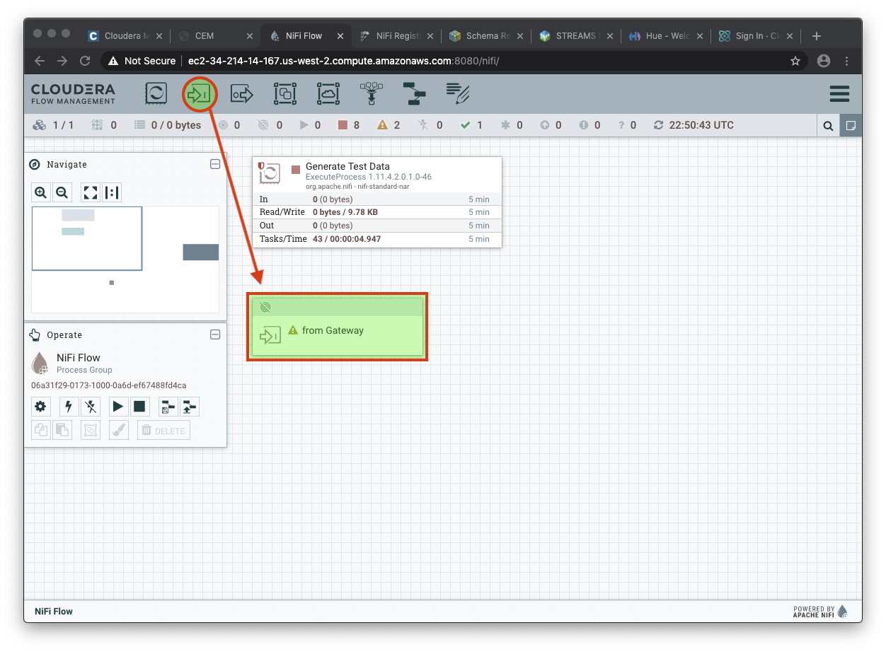

. To terminate the NiFI _Input Port_ let's, for now, add a _Funnel_ to the canvas...
+
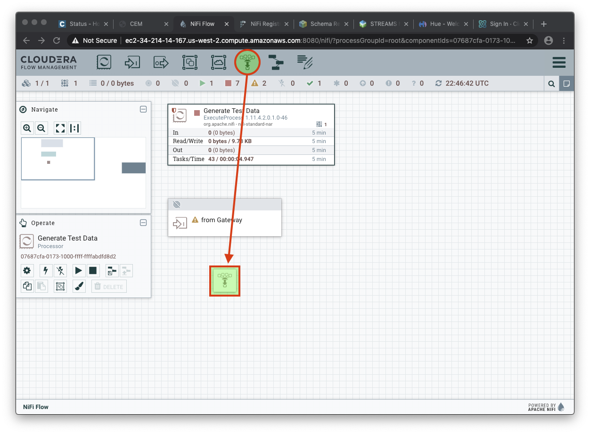

. ... and setup a connection from the Input Port to it. To setup a connection, hover the mouse over the Input Port until an arrow symbol is shown in the center. Click on the arrow, drag it and drop it on the Funnel to connect the two elements.
+
image::images/edge/connecting.png[width=800]

. Right-click on the Input Port and start it. Alternatively, click on the Input Port to select it and then press the start ("play") button on the Operate panel:
+
image::images/edge/operate_panel.png[width=300]

. You will need the ID of the _Input Port_ to complete the connection of the _ConsumeMQTT_ processor to the RPG (NiFi). Double-click on the _Input Port_ and copy its ID.
+
image::images/edge/input_port_id.png[width=800]

. Back to the Flow Designer, connect the ConsumeMQTT processor to the RPG. The connection requires an ID and you can paste here the ID you copied from the Input Port. *Make sure that there are NO SPACES*!
+
image::images/edge/connect_to_rpg.png[width=800]
+
. Double-click the connection and update the following configuration:
+
[source,yaml]
----
Flowfile Expiration:            60 seconds
Back Pressure Object Threshold: 10000
Connection Name:                Sensor data
----
+
image::images/edge/efm_set_cloude_config.png[width=400]

. The Flow is now complete, but before publishing it, create the Bucket in the _NiFi Registry_ so that all versions of your flows are stored for review and audit. Open the NiFi Registry at `\http://<public_dns>:18080/nifi-registry`, click on the wrench/spanner icon () on the top-right corner on and create a bucket called `IoT` (*ATTENTION*: the bucket name is *CASE-SENSITIVE*).
+
image::images/edge/create_bucket.png[width=800]

. You can now publish the flow for the MiNiFi agent to automatically pick up. Click *Publish*, add a descriptive comment for your changes and click *Apply*.
+
image::images/edge/publish_flow.png[width=800]
+
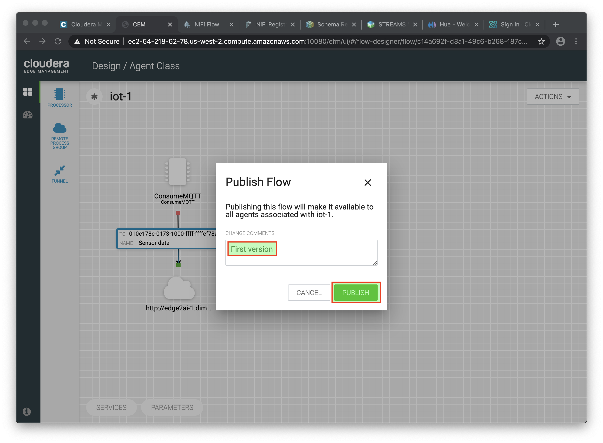

. Go back to the *NiFi Registry* Web UI and click on the *NiFi Registry* name, next to the Cloudera logo. If the flow publishing was successful, you should see the flow's version details in the NiFi Registry.
+
image::images/edge/flow_in_nifi_registry.png[width=800]

. At this point, you can test the edge flow up until NiFi. Start the NiFi simulator (ExecuteProcess processor) again and confirm you can see the messages queued in NiFi.
+
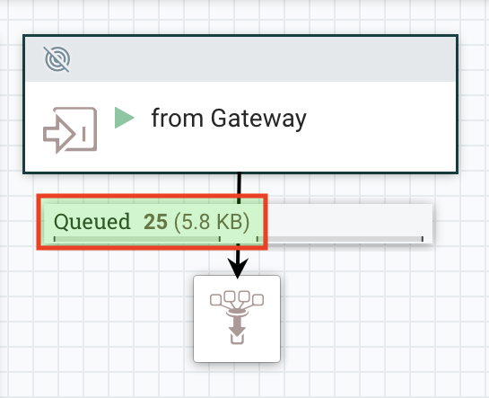

. Right-click on the queue and select *List queue* to see details of the received messages.
+
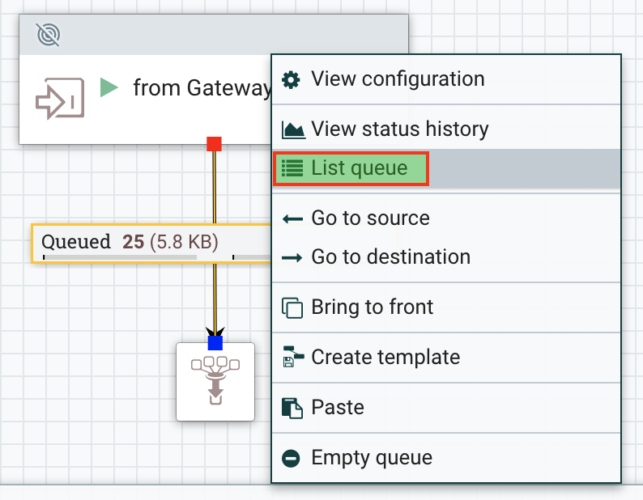

. Experimenting clicking on the *Info*, *_Eye_* and *Provenance* icons for one of the messages to look at the message attributes, contents and provenance details, respectively.
+
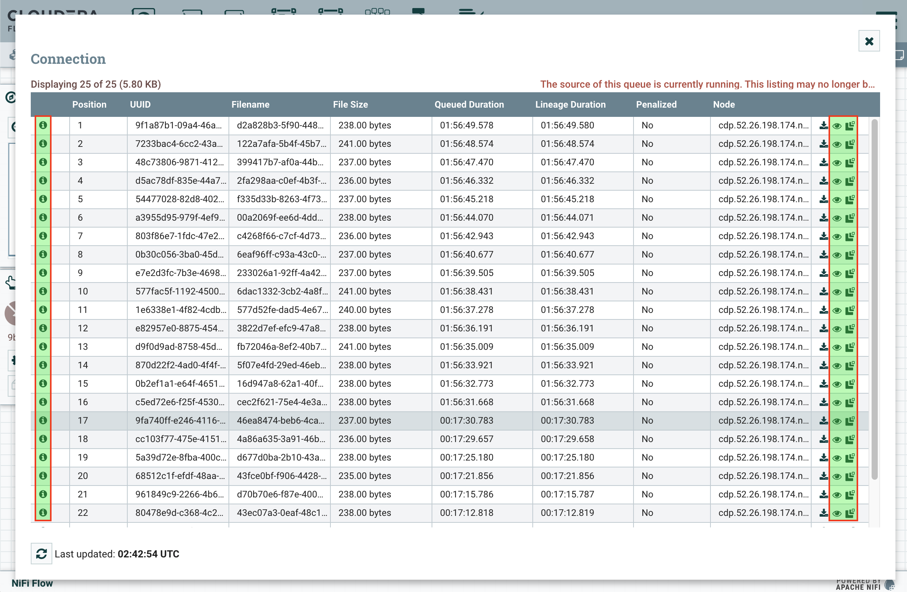

. For example, the sensor readings in each message contain temperature values, that should all range between 0 and 100 Celsius.
If you sample a few of the messages' contents, you should be able to notice that some readings on `sensor_0` and `sensor_1` are reporting some bogus values, as shown below.
We will address this issue in the next section.
+
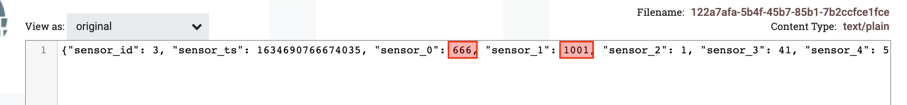

. You can stop the simulator now (Stop the NiFi processor).

[[lab_3, Lab 3]]
== Lab 3 - Update the flow to perform additional processing on the edge

In the previous lab we noticed that some sensors were sending erroneous measurements intermittently.
If we let these measurements be processed by our downstream applications we might have problems with the quality of the output of those applications.

We could filter out the erroneous readings in NiFi.
However, if the volume of problematic data is large we would be wasting network bandwidth to send that data to NiFi in the first place.
What we will do instead is to push additional logic to the edge to identify and filter those problems in place and avoid the overhead of sending them to NiFi.

We've noticed that the problem always happen with the temperatures in measurements `sensor_0` and `sensor_1`, only.
If any of these two temperatures are *greater than 500* we *must discard* the entire sensor reading.
If both of these temperatures are in the normal range (< 500) we can guarantee that all temperatures reported are correct and can be sent to NiFi.

. Go to the CEM Web UI and add a new processor to the canvas. In the Filter box of the dialog that appears, type "JsonPath". Select the _EvaluateJSONPath_ processor and click *Add*.

. Double-click on the new processor and configure it with the following properties:
+
[source,yaml]
----
Processor Name: Extract sensor_0 and sensor1 values
Destination:    flowfile-attribute
----
+
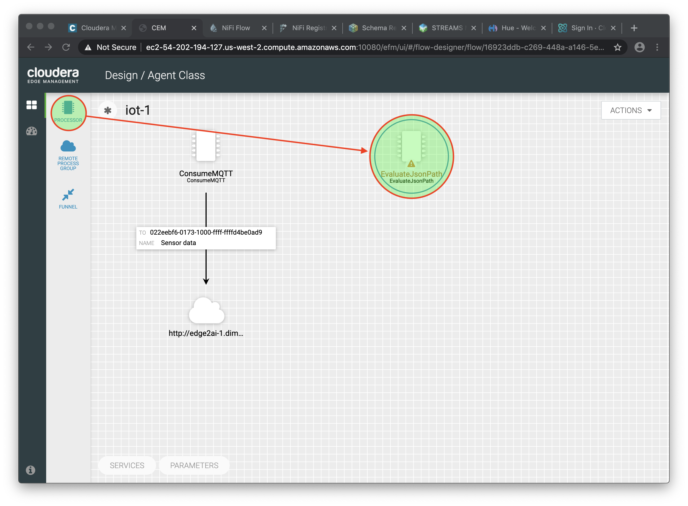

. Click on the *Add Property* button and enter the following properties:
+
[%autowidth,cols="1a,1a",options="header"]
|===
|Property Name|Property Value
|`sensor_0`|`$.sensor_0`
|`sensor_1`|`$.sensor_1`
|===
+
image::images/edge/extract_attributes.png[width=800]

. Click *Apply* to save the processor configuration.

. Drag one more new processor to the canvas. In the Filter box of the dialog that appears, type "Route". Select the _RouteOnAttribute_ processor and click *Add*.
+
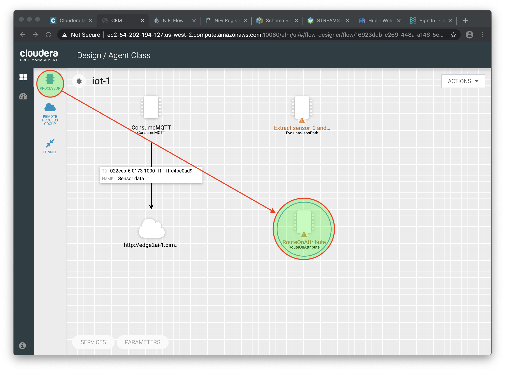

. Double-click on the new processor and configure it with the following properties:
+
[source,yaml]
----
Processor Name: Filter Errors
Route Strategy: Route to Property name
----

. Click on the *Add Property* button and enter the following properties:
+
[%autowidth,cols="1a,1a",options="header"]
|===
|Property Name|Property Value
|`error`|`${sensor_0:ge(500):or(${sensor_1:ge(500)})}`
|===
+
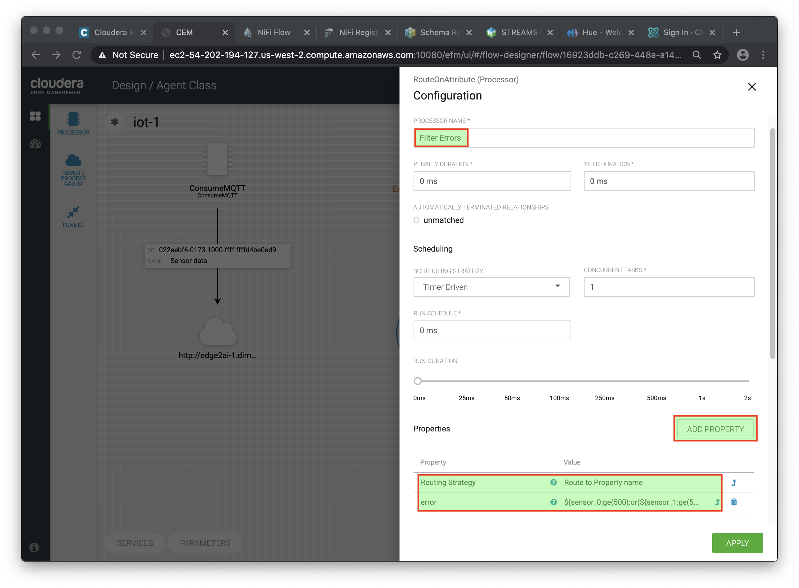

. Click *Apply* to save the processor configuration.

. Reconnect the _ConsumeMQTT_ processor to the _Extract sensor_0 and sensor1 values_ processor:
.. Click on the existing connection between _ConsumeMQTT_ and the _RPG_ to select it.
.. Drag the destination end of the connection to the _Extract sensor_0 and sensor1 values_ processor.
+
image::images/edge/reconnect_consume_mqtt.png[width=800]

. Connect the _Extract sensor_0 and sensor1 values_ to the _Filter errors_ processor. When the *Create Connection* dialog appear, select "*matched*" and click *Create*.
+
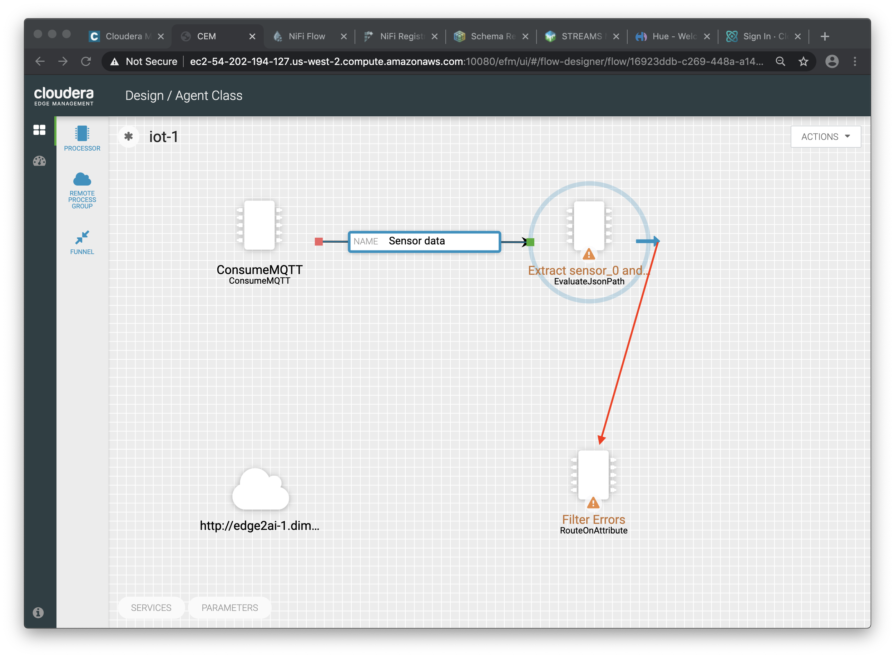
+
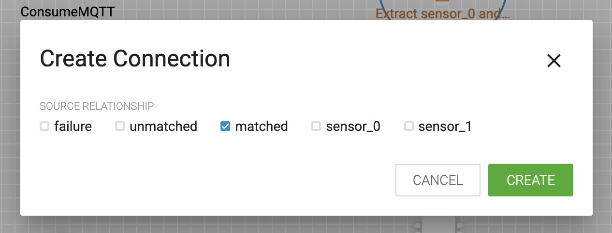

. Double-click the connection, update the following configuration and *Apply* the changes:
+
[source,yaml]
----
Flowfile Expiration:            60 seconds
Back Pressure Object Threshold: 10000
Connection Name:                Extracted attributes
----
+

. Double-click the _Extract sensor_0 and sensor1 values_ and check the following values in the *AUTOMATICALLY TERMINATED RELATIONSHIPS* section and click *Apply*:
** failure
** unmatched
** sensor_0
** sensor_1

+
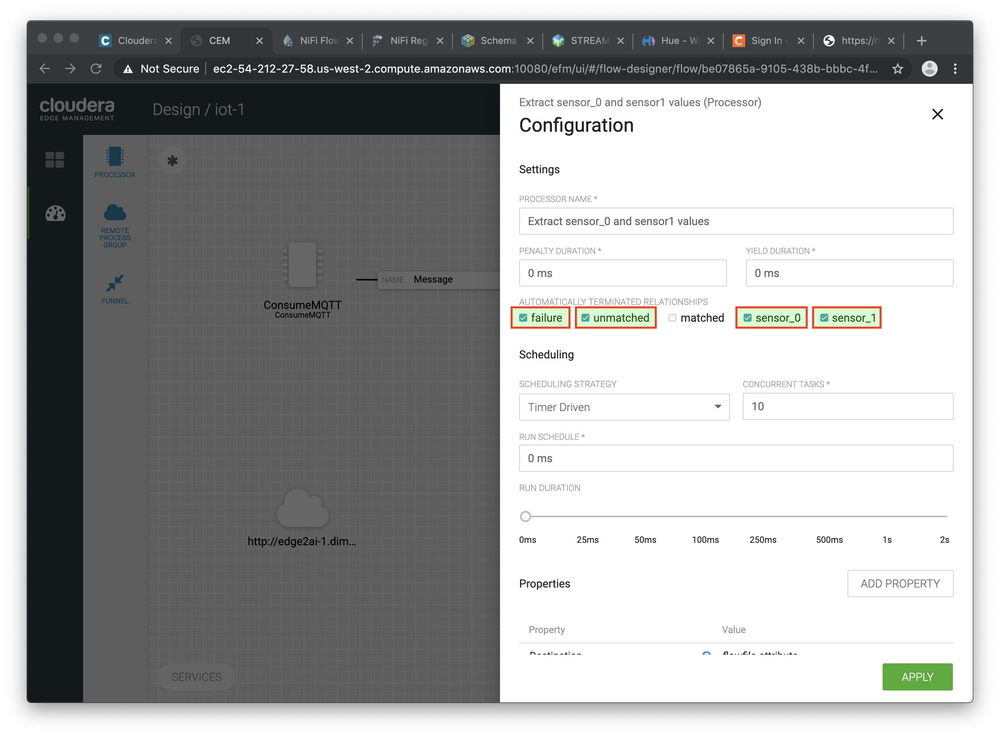

. Before creating the last connection, you will need (again) the ID of the NiFi _Input Port_. Go to the NiFi Web UI , double-click on the "*from Gateway*" _Input Port_ and copy its ID.
+
image::images/edge/input_port_id.png[width=800]

. Back on the CEM Web UI, connect the _Filter errors_ processor to the RPG:
+
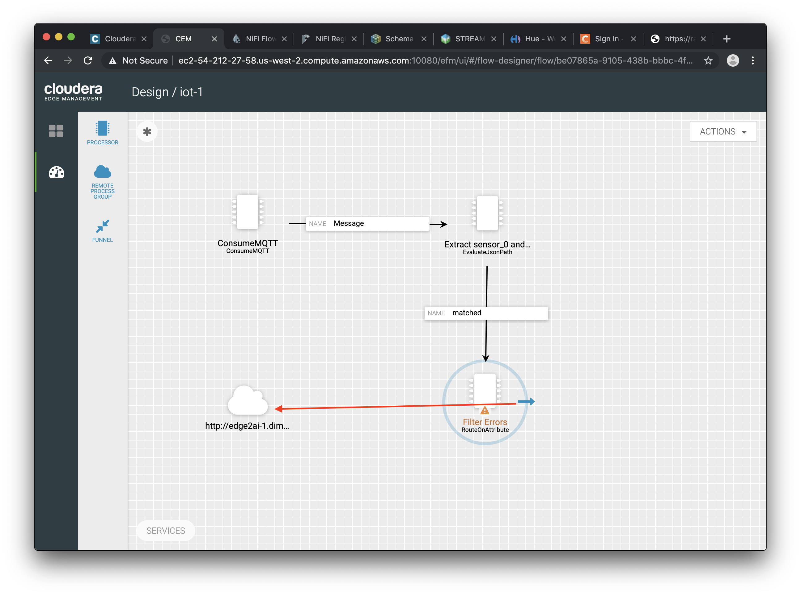

. In the *Create Connection* dialog, check the "*unmatched*" checkbox and enter the copied input port ID, and click on *Create*:
+
image::images/edge/create_last_connection.png[width=500]

. Double-click the connection, update the following configuration and *Apply* the changes:
+
[source,yaml]
----
Flowfile Expiration:            60 seconds
Back Pressure Object Threshold: 10000
Connection Name:                Valid data
----
+

. To ignore the errors, double-click on the _Filter errors_ processor, check the *error* checkbox under the *AUTOMATICALLY TERMINATED RELATIONSHIPS* section and click *Apply*:
+
image::images/edge/terminate_errors.png[width=800]

. Finally, click on *ACTIONS > Publish...* on the CEM canvas, enter a descriptive comment like "Added filtering of erroneous readings" and click *Publish*.

. Start the simulator again.

. Go to the NiFi Web UI and confirm that the data is flowing to NiFi. Examine the messages' contents, as we did before to confirm the problematic readings are gone.

. Stop the simulator once you have verified the data.
