= NiFi and Streams Processing

In this workshop you'll implement a data pipeline to process data previously captured from the edge.
You will use NiFi to ingest this data into Kafka and then consume data from Kafka and write it to Kudu tables.

== Preparation

This workshop builds upon the content developed in the link:workshop_edge.adoc[Edge Workshop].

To clean your environment and reset to the beginning of this lab, please SSH to your cluster host and run the following command:

NOTE: The command below will undo everything done in the cluster in previous workshops.

[source,shell]
----
/tmp/resources/reset-to-lab.sh nifi 1
----

== Labs summary

* *Lab 1* - On Schema Registry, register the schema describing the data generated by the IoT sensors.
* *Lab 2* - On the NiFi cluster, prepare the data and send it to the **Kafka** cluster.
* *Lab 3* - On the *Streams Messaging Manager (SMM)* Web UI, monitor the Kafka cluster and confirm data is being ingested correctly.
* *Lab 4* - Use NiFi to process each record, calling the **Model endpoint** and save results to **Kudu**.
* *Lab 5* - Check the data on Kudu.

[[lab_1, Lab 1]]
== Lab 1 - Registering a schema in Schema Registry

The data produced by the temperature sensors is described by the schema in file `link:https://raw.githubusercontent.com/cloudera-labs/edge2ai-workshop/master/sensor.avsc[sensor.avsc]`. In this lab we will register this schema in Schema Registry so that our flows in NiFi can refer to schema using an unified service. This will also allow us to evolve the schema in the future, if needed, keeping older versions under version control, so that existing flows and flowfiles will continue to work.

. Go to the following URL, which contains the schema definition we'll use for this lab. Select all contents of the page and copy it.
+
`link:https://raw.githubusercontent.com/cloudera-labs/edge2ai-workshop/master/sensor.avsc[https://raw.githubusercontent.com/cloudera-labs/edge2ai-workshop/master/sensor.avsc, window="_blank"]`

. In the Schema Registry Web UI, click the `+` sign to register a new schema.

. Click on a blank area in the *Schema Text* field and paste the contents you copied.

. Complete the schema creation by filling the following properties and save the schema.
+
[source,yaml]
----
Name:          SensorReading
Description:   Schema for the data generated by the IoT sensors
Type:          Avro schema provider
Schema Group:  Kafka
Compatibility: Backward
Evolve:        checked
----
+
image::images/nifi/register_schema.png[width=800]

[[lab_2, Lab 2]]
== Lab 2 - Configuring the NiFi flow and pushing data to Kafka

In this lab, you will create a NiFi flow to receive the data from all gateways and push it to **Kafka**.

=== Creating a Process Group

Before we start building our flow, let's create a Process Group to help organizing the flows in the NiFi canvas and also to enable flow version control.

. Open the NiFi Web UI, create a new Process Group and name it something like *Process Sensor Data*.
+
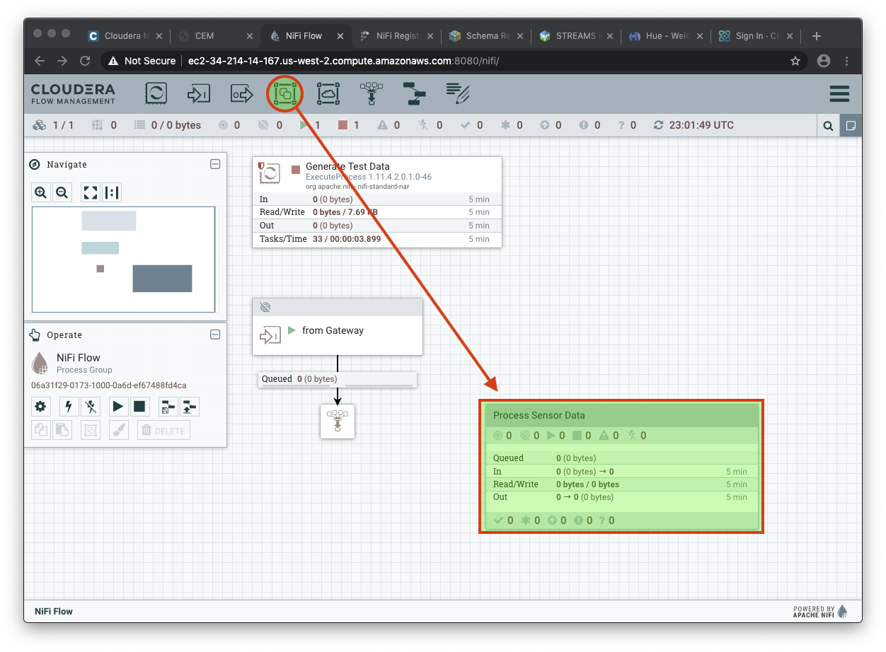

. We want to be able to version control the flows we will add to the Process Group. In order to do that, we first need to connect NiFi to the *NiFi Registry*. On the NiFi global menu, click on "Controller Settings", navigate to the "Registry Clients" tab and add a Registry client with the following URL:
+
[source,yaml]
----
Name: NiFi Registry
URL:  http://<CLUSTER_HOSTNAME>:18080
----
+
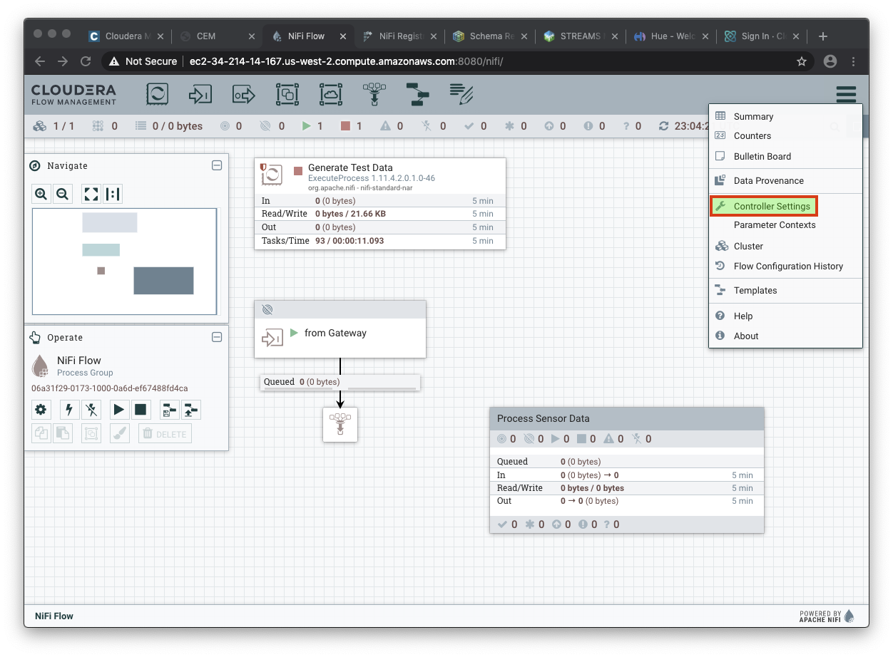
+
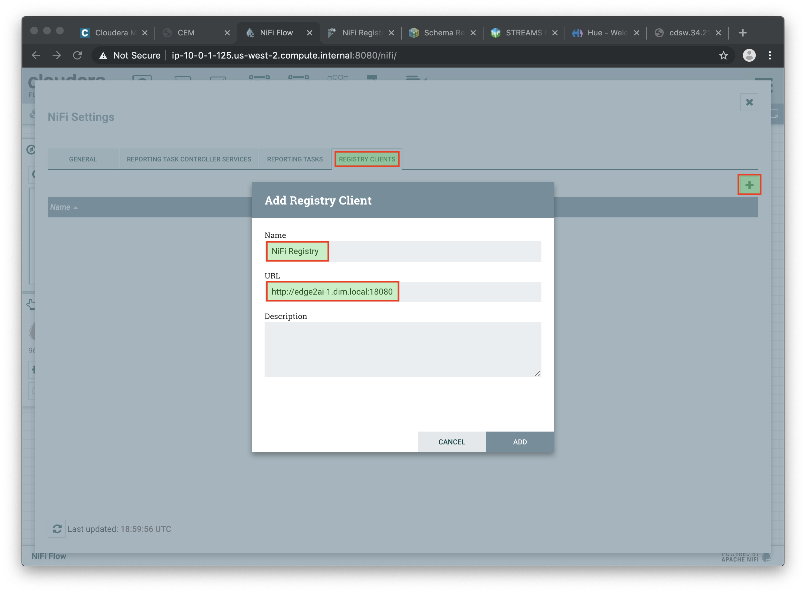

. On the *NiFi Registry* Web UI, add another bucket for storing the Sensor flow we're about to build'. Call it `SensorFlows`:
+
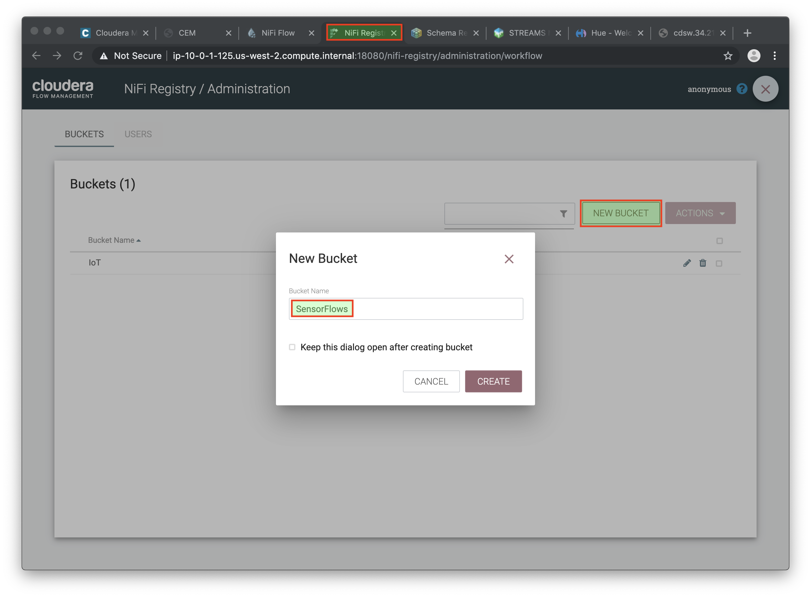

. Back on the *NiFi* Web UI, to enable version control for the Process Group, right-click on it and select *Version > Start version control* and enter the details below. Once you complete, a  will appear on the Process Group, indicating that version control is now enabled for it.
+
[source,yaml]
----
Registry:  NiFi Registry
Bucket:    SensorFlows
Flow Name: SensorProcessGroup
----

. Let's also enable processors in this Process Group to use schemas stored in Schema Registry. Right-click on the Process Group, select *Configure* and navigate to the *Controller Services* tab. Click the *`+`* icon and add a *HortonworksSchemaRegistry* service. After the service is added, click on the service's _cog_ icon (image:images/nifi/cog_icon.png[width=20]), go to the *Properties* tab and configure it with the following *Schema Registry URL* and click *Apply*.
+
[source,yaml]
----
URL: http://<CLUSTER_HOSTNAME>:7788/api/v1
----
+
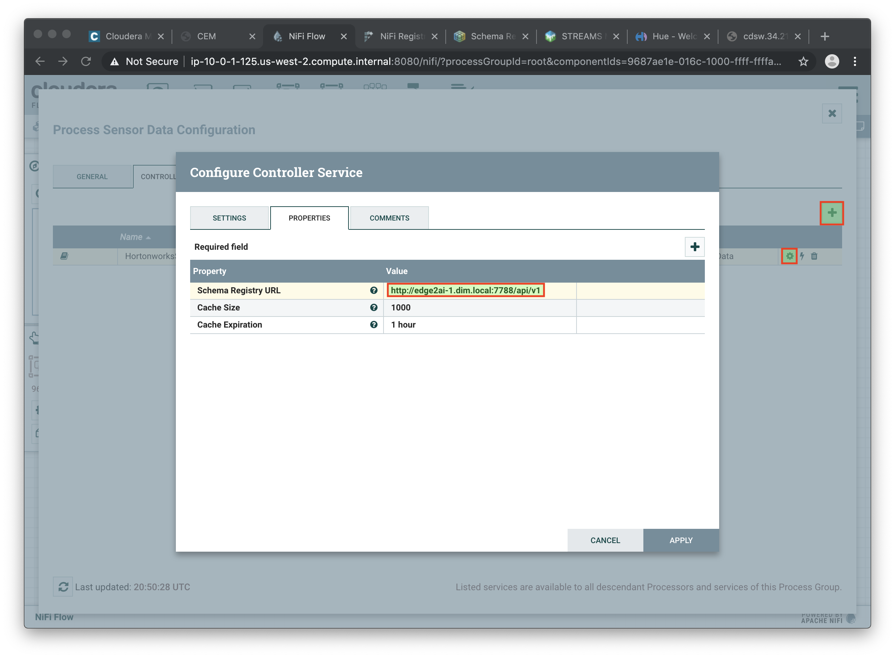

. Click on the _lightning bolt_ icon (image:images/nifi/enable_icon.png[width=20]) to *enable* the *HortonworksSchemaRegistry* Controller Service.

. Still on the *Controller Services* screen, let's add two additional services to handle the reading and writing of JSON records. Click on the  button and add the following two services:
** *`JsonTreeReader`*, with the following properties:
+
[source,yaml]
----
Schema Access Strategy: Use 'Schema Name' Property
Schema Registry:        HortonworksSchemaRegistry
Schema Name:            ${schema.name} -> already set by default!
----

** *`JsonRecordSetWriter`*, with the following properties:
+
[source,yaml]
----
Schema Write Strategy:  HWX Schema Reference Attributes
Schema Access Strategy: Use 'Schema Name' Property
Schema Registry:        HortonworksSchemaRegistry
----

. Enable the *JsonTreeReader* and the *JsonRecordSetWriter* Controller Services you just created, by clicking on their respective _lightning bolt_ icons (image:images/nifi/enable_icon.png[width=20]).
+
image::images/nifi/controller_services.png[width=800]

=== Creating the flow

. Double-click on the newly created process group to expand it.

. Inside the process group, add a new _Input Port_ and name it "Sensor Data". In the *Receive From* field, select *Local connections*.

. We need to tell NiFi which schema should be used to read and write the Sensor data. For this we'll use an _UpdateAttribute_ processor to add an attribute to the FlowFile indicating the schema name.
+
Add an _UpdateAttribute_ processor by dragging the processor icon to the canvas:
+
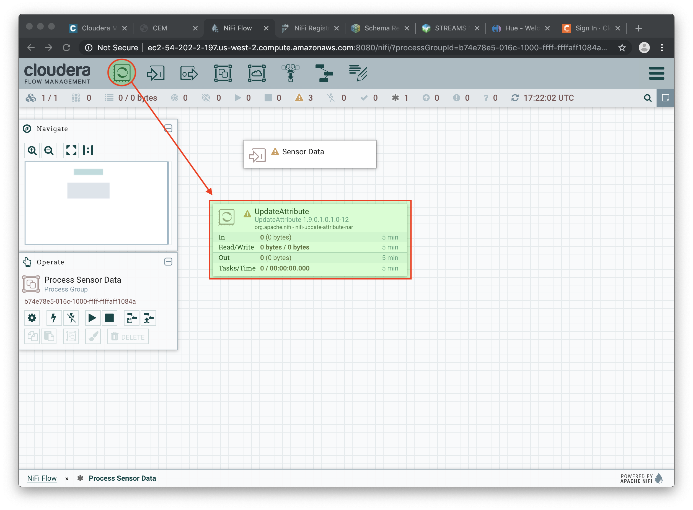

. Double-click the _UpdateAttribute_ processor and configure it as follows:
.. In the _SETTINGS_ tab:
+
[source,yaml]
----
Name: Set Schema Name
----
.. In the _PROPERTIES_ tab, click on the  button and add the following property:
+
[source,yaml]
----
Property Name:  schema.name
Property Value: SensorReading
----
.. Click *Apply*

. Connect the *Sensor Data* input port to the *Set Schema Name* processor.

. Add a _PublishKafkaRecord_2.6_ processor and configure it as follows:
+
*SETTINGS* tab:
+
[source,yaml]
----
Name: Publish to Kafka topic: iot
----
+
*PROPERTIES* tab:
+
[source,yaml]
----
Kafka Brokers:                         <CLUSTER_HOSTNAME>:9092
Topic Name:                            iot
Record Reader:                         JsonTreeReader
Record Writer:                         JsonRecordSetWriter
Use Transactions:                      false
Attributes to Send as Headers (Regex): schema.*
----
+
NOTE: Make sure you use the PublishKafkaRecord_2.6 processor and *not* the PublishKafka_2.6 one

. While still in the _PROPERTIES_ tab of the _PublishKafkaRecord_2.6_ processor, click on the  button and add the following property:
+
[source,yaml]
----
Property Name:  client.id
Property Value: nifi-sensor-data
----
+
Later, this will help us clearly identify who is producing data into the Kafka topic.

. Connect the *Set Schema Name* processor to the *Publish to Kafka topic: iot* processor.

. Add a new _Funnel_ to the canvas and connect the PublishKafkaRecord processor to it. When the "Create connection" dialog appears, select "*failure*" and click *Add*.
+
image::images/nifi/add_kafka_failure_connection.png[width=600]

. Double-click on the *Publish to Kafka topic: iot* processor, go to the *SETTINGS* tab, check the "*success*" relationship in the *AUTOMATICALLY TERMINATED RELATIONSHIPS* section. Click *Apply*.
+
image::images/nifi/terminate_publishkafka_relationship.png[width=600]

. Start the input port and the two processors. Your canvas should now look like the one below:
+
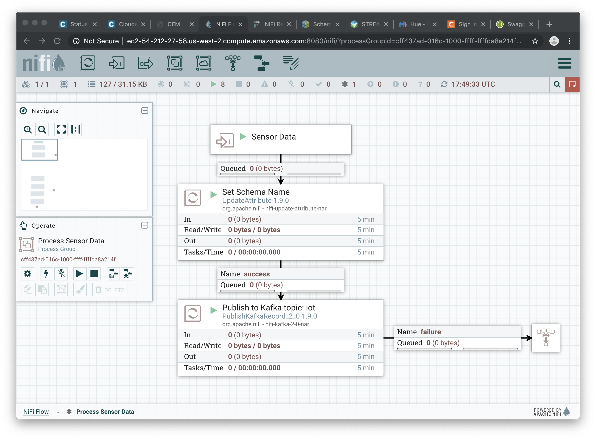

. The only thing that remains to be configured now is to finally connect the "*from Gateway*" Input Port to the flow in the "*Processor Sensor Data*" group. To do that, first go back to the root canvas by clicking on the *NiFi Flow* link on the status bar.
+
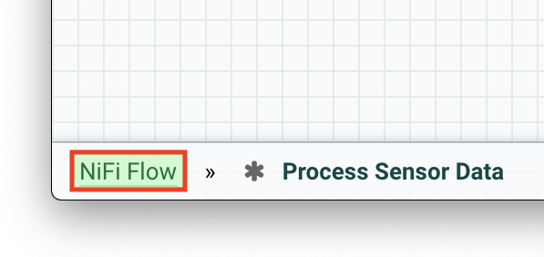

. Connect the Input Port to the *Process Sensor Data* Process Group by dragging the destination of the current connection from the funnel to the Process Group. When prompted, ensure the "To input" fields is set to the *Sensor data* Input Port.
+
image::images/nifi/connect_input.png[width=800]
+
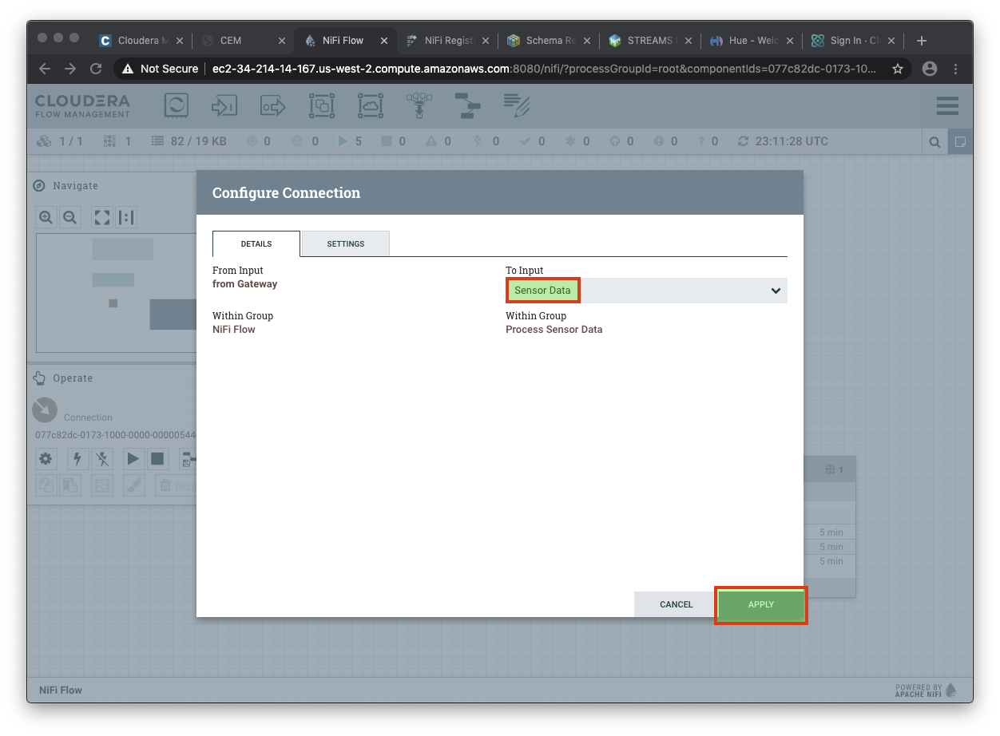

. Refresh the screen (`Ctrl+R` on Linux/Windows; `Cmd+R` on Mac) and you should see that the records that were queued on the "*from Gateway*" Input Port disappeared. They flowed into the *Process Sensor Data* flow. If you expand the Process Group you should see that those records were processed by the _PublishKafkaRecord_ processor and there should be no records queued on the "failure" output queue.
+
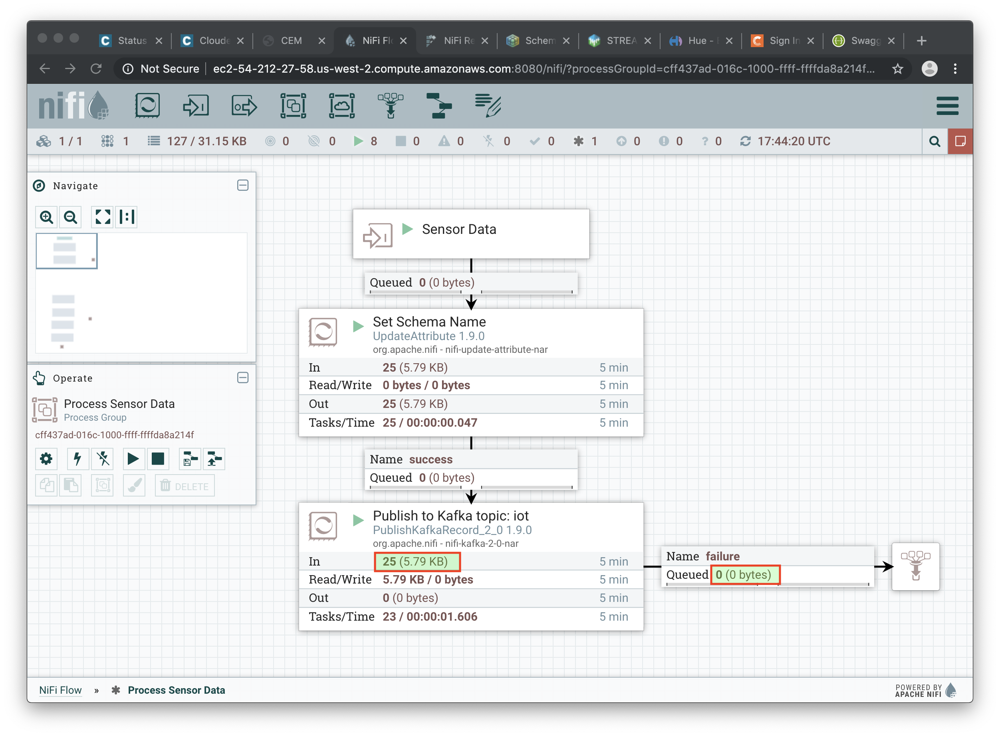
+
At this point, the messages are already in the Kafka topic. You can add more processors as needed to process, split, duplicate or re-route your FlowFiles to all other destinations and processors.

. To complete this Lab, let's commit and version the work we've just done. Go back to the NiFi root canvas, clicking on the "Nifi Flow" breadcrumb. Right-click on the *Process Sensor Data* Process Group and select *Version > Commit local changes*. Enter a descriptive comment and save.

[[lab_3, Lab 3]]
== Lab 3 - Use SMM to confirm that the data is flowing correctly

Now that our NiFi flow is pushing data to Kafka, it would be good to have a confirmation that everything is running as expected. In this lab you will use Streams Messaging Manager (SMM) to check and monitor Kafka.

. Start the *NiFi ExecuteProcess* simulator again and confirm you can see the messages queued in NiFi. Leave it running.

. Go to the Stream Messaging Manager (SMM) Web UI and familiarize yourself with the options there. Notice the filters (blue boxes) at the top of the screen.
+
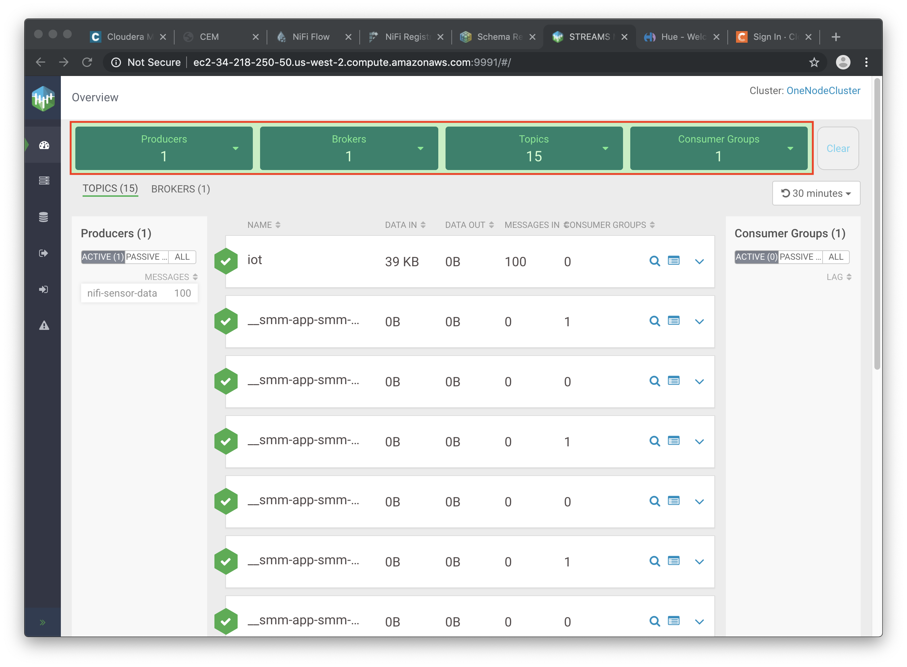

. Click on the *Producers* filter and select only the *`nifi-sensor-data`* producer. This will hide all the irrelevant topics and show only the ones that producer is writing to.

. If you filter by *Topic* instead and select the `iot` topic, you'll be able to see all the *producers* and *consumers* that are writing to and reading from it, respectively. Since we haven't implemented any consumers yet, the consumer list should be empty.

. Click on the topic to explore its details. You can see more details, metrics and the break down per partition. Click on one of the partitions and you'll see additional information and which producers and consumers interact with that partition.
+
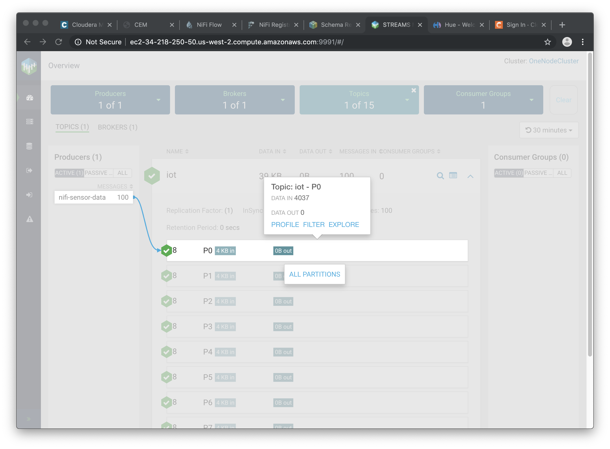

. Click on the *EXPLORE* link to visualize the data in a particular partition. Confirm that there's data in the Kafka topic and it looks like the JSON produced by the sensor simulator.
+
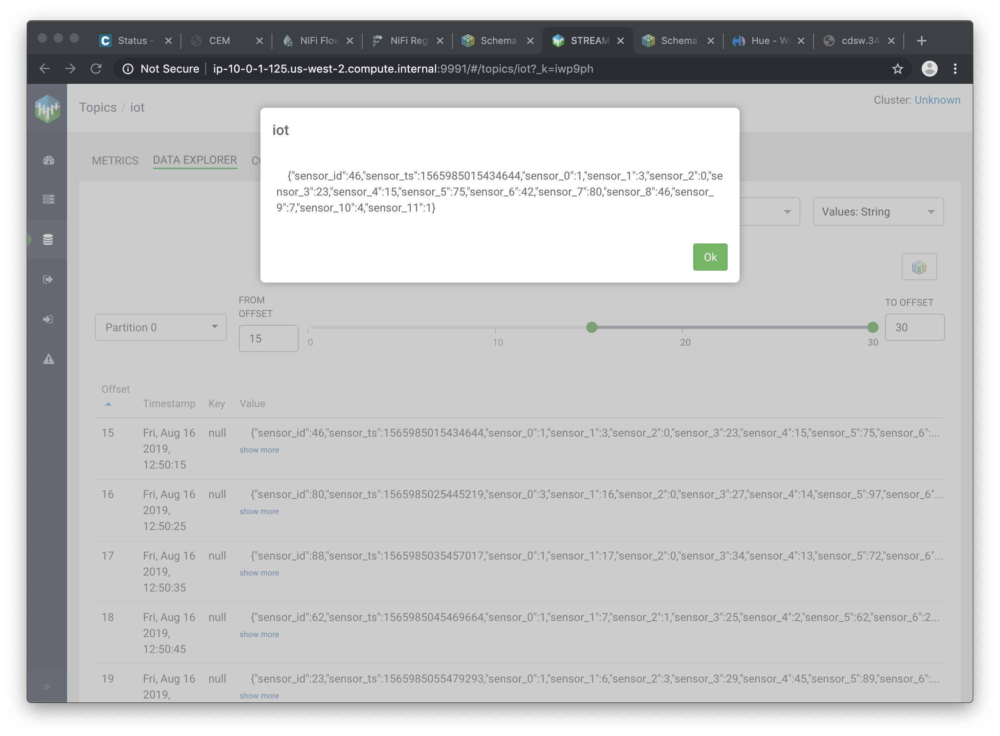

. Stop the *NiFi ExecuteProcess* simulator again.

[[lab_4, Lab 4]]
== Lab 4 - Use NiFi to call the CDSW model endpoint and save to Kudu

In this lab, you will use NiFi to consume the Kafka messages containing the IoT data we ingested in the previous lab, call a CDSW model API endpoint to predict whether the machine where the readings came from is likely to break or not.

In preparation for the workshop we trained and deployed a Machine Learning model on the Cloudera Data Science Workbench (CDSW) running on your cluster. The model API can take a feature vector with the reading for the 12 temperature readings provided by the sensor and predict, based on that vector, if the machine is likely to break or not.

=== CDSW Model API and Access Key

In the flow that you will build in this lab, you will use variables that will be referenced by some processors/controller services:

* The `request.body` property of the *Predict machine health* processor references a variable called `cdsw.access.key`
* The `Authorization` property of the *RestLookupService* controller service references a variable called `cdsw.model.api.key`

These variables specify keys that are necessary to access the Machine learning model running in CDSW.
Follow the steps below to retrieve the keys from CDSW and set variables in NiFi with their values.

. To get the *Access Key*, go to the CDSW Web UI and click on *Models > Iot Prediction Model > Settings*. Copy the Access Key.
+
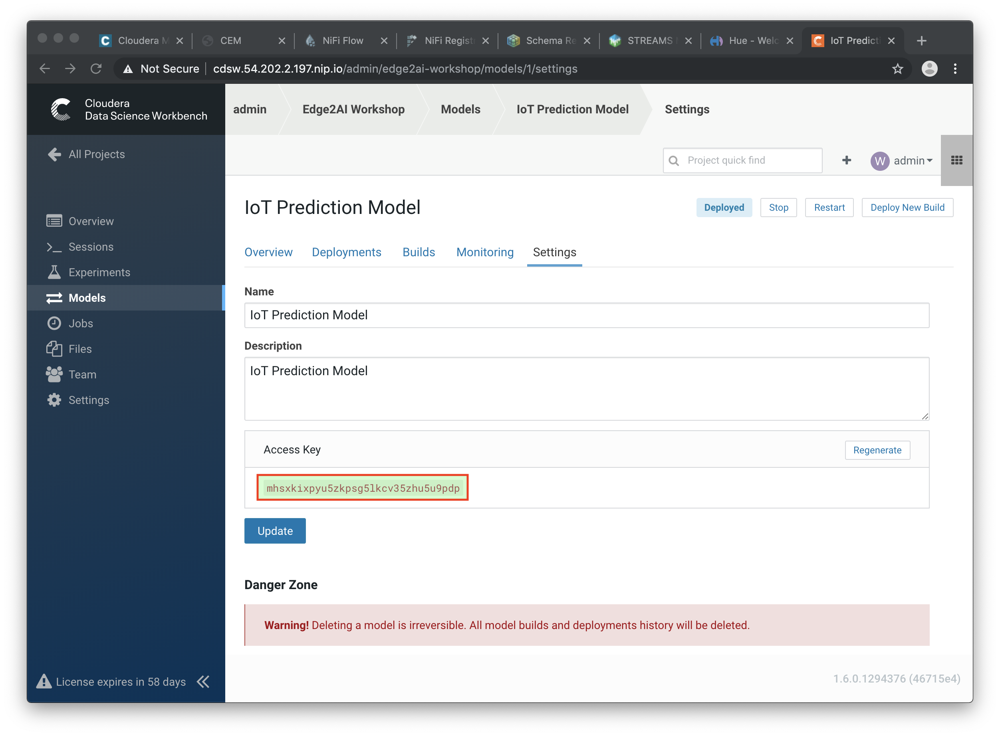

. Go back to the NiFi Web UI, right-click on an empty area of the *Process Sensor Data* canvas, and click on *Variables*.

. Click on the _plus_ button () and add the following variable:

. To get the *Model API Key*, click on the Cloudera Data Science Workbench icon (top left) to go to the home page and then click on *Settings > API Keys > Create Model API Key*.
Copy the Model API Key.
+
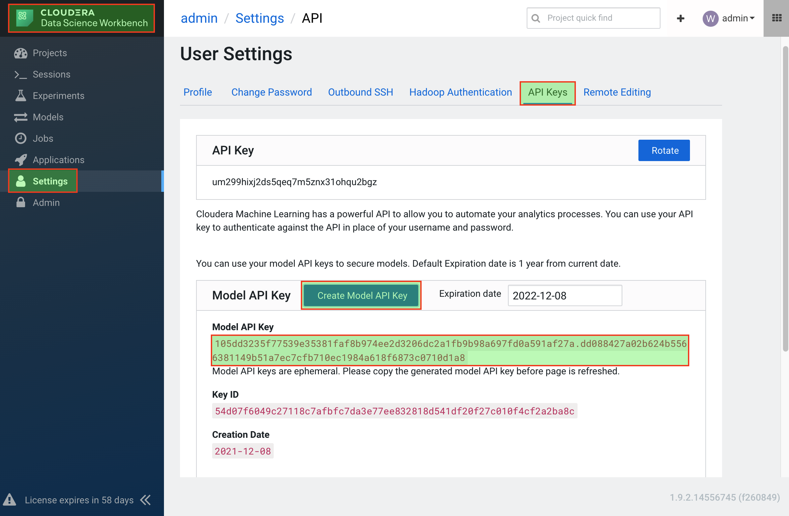

. Go back to the NiFi Web UI, right-click on an empty area of the *Process Sensor Data* canvas, and click on *Variables*.

. Click on the _plus_ button () and add the following variable:
+
[source,yaml]
----
Variable Name:  cdsw.model.api.key
Variable Value: <key copied from CDSW>
----
+
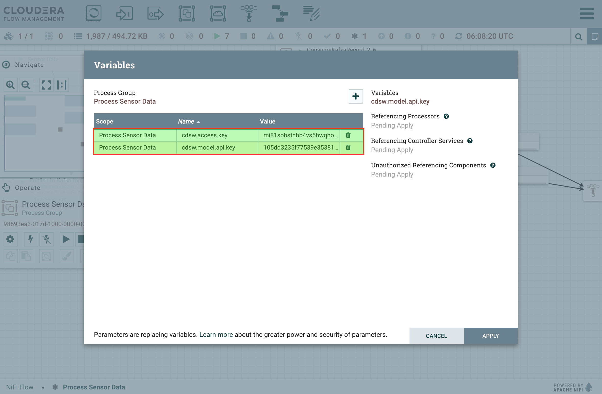

. Click *Apply*

=== Add new Controller Services

When the sensor data was sent to Kafka using the _PublishKafkaRecord_ processor, we chose to attach the schema information in the header of Kafka messages. Now, instead of hard-coding which schema we should use to read the message, we can leverage that metadata to dynamically load the correct schema for each message.

To do this, though, we need to configure a different _JsonTreeReader_ that will use the schema properties in the header, instead of the `${schema.name}` attribute, as we did before.

We'll also add a new _RestLookupService_ controller service to perform the calls to the CDSW model API endpoint.

. If you're not in the *Process Sensor Data* process group, double-click on it to expand it. On the *Operate* panel (left-hand side), click on the _cog_ icon (image:images/nifi/cog_icon.png[width=25]) to access the *Process Sensor Data* process group's configuration page.
+
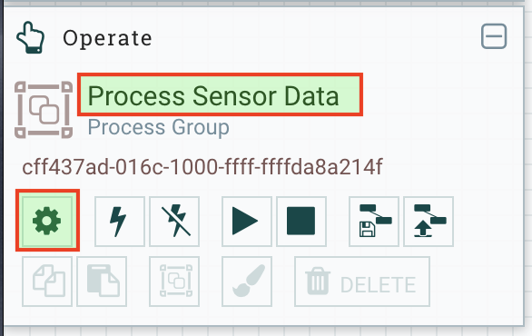

. Click on the _plus_ button (), add a new *JsonTreeReader*, configure it as shown below and click *Apply* when you're done:
+
On the *SETTINGS* tab:
+
[source,yaml]
----
Name: JsonTreeReader - With schema identifier
----
+
On the *PROPERTIES* tab:
+
[source,yaml]
----
Schema Access Strategy: HWX Schema Reference Attributes
Schema Registry:        HortonworksSchemaRegistry
----

. Click on the _lightning bolt_ icon (image:images/nifi/enable_icon.png[width=20]) to *enable* the *JsonTreeReader - With schema identifier* controller service.

. Click again on the _plus_ button (), add a *RestLookupService* controller service, configure it as shown below and click *Apply* when you're done:
+
On the *PROPERTIES* tab:
+
[source,yaml]
----
URL:           http://modelservice.cdsw.<YOUR_CLUSTER_PUBLIC_IP>.nip.io/model
Record Reader: JsonTreeReader
Record Path:   /response
----
+
NOTE: `<YOUR_CLUSTER_PUBLIC_IP>` above must be replaced with your cluster's public IP, *not* DNS name. The final URL should look something like this: `\http://modelservice.cdsw.12.34.56.78.nip.io/model`

. Add one more user-defined property by clicking on the _plus_ button ():
+
[source,yaml]
----
Authorization: Bearer ${cdsw.model.api.key}
----

. Click on the _lightning bolt_ icon (image:images/nifi/enable_icon.png[width=20]) to *enable* the *RestLookupService* controller service.
+
image::images/nifi/additional_controller_services.png[width=800]

. Close the *Process Sensor Data Configuration* page.

=== Create the flow

We'll now create the flow to read the sensor data from Kafka, execute a model prediction for each of them and write the results to Kudu. At the end of this section you flow should look like the one below:

image::images/nifi/from_kafka_to_kudu_flow.png[width=800]

==== ConsumeKafkaRecord_2_6 processor

. We'll add a new flow to the same canvas we were using before (inside the *Process Sensor Data* Process Group). Click on an empty area of the canvas and drag it to the side to give you more space to add new processors.

. Add a *ConsumeKafkaRecord_2_6* processor to the canvas and configure it as shown below:
+
*SETTINGS* tab:
+
[source,yaml]
----
Name: Consume Kafka iot messages
----
+
*PROPERTIES* tab:
+
[source,yaml]
----
Kafka Brokers:                        <CLUSTER_HOSTNAME>:9092
Topic Name(s):                        iot
Topic Name Format:                    names
Record Reader:                        JsonTreeReader - With schema identifier
Record Writer:                        JsonRecordSetWriter
Honor Transactions:                   false
Group ID:                             iot-sensor-consumer
Offset Reset:                         latest
Headers to Add as Attributes (Regex): schema.*
----

. Add a new _Funnel_ to the canvas and connect the *Consume Kafka iot messages* to it. When prompted, check the *parse.failure* relationship for this connection:
+
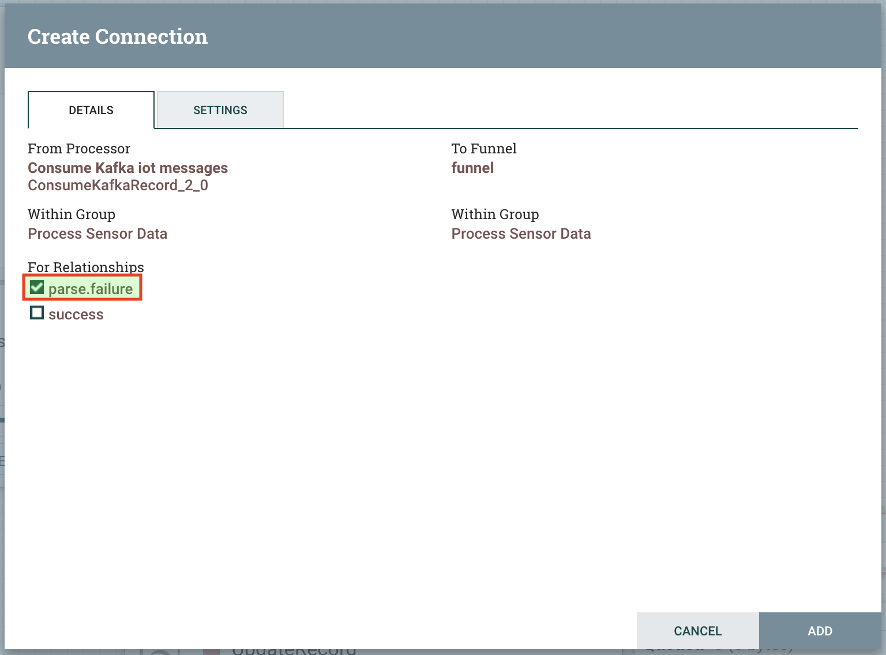

==== LookupRecord processor

. Add a *LookupRecord* processor to the canvas and configure it as shown below:
+
*SETTINGS* tab:
+
[source,yaml]
----
Name: Predict machine health
----
+
*PROPERTIES* tab:
+
[source,yaml]
----
Record Reader:          JsonTreeReader - With schema identifier
Record Writer:          JsonRecordSetWriter
Lookup Service:         RestLookupService
Result RecordPath:      /response
Routing Strategy:       Route to 'success'
Record Result Contents: Insert Entire Record
----

. Add 3 more user-defined properties by clicking on the _plus_ button () for each of them:
+
[source,yaml]
----
mime.type:      toString('application/json', 'UTF-8')
request.body:   concat('{"accessKey":"', '${cdsw.access.key}', '","request":{"feature":"', /sensor_0, ', ', /sensor_1, ', ', /sensor_2, ', ', /sensor_3, ', ', /sensor_4, ', ', /sensor_5, ', ', /sensor_6, ', ', /sensor_7, ', ', /sensor_8, ', ', /sensor_9, ', ', /sensor_10, ', ', /sensor_11, '"}}')
request.method: toString('post', 'UTF-8')
----

. Click *Apply* to save the changes to the *Predict machine health* processor.

. Connect the *Consume Kafka iot messages* processor to the *Predict machine health* one. When prompted, check the *success* relationship for this connection.

. Connect the *Predict machine health* to the same _Funnel_ you had created above. When prompted, check the *failure* relationship for this connection.

==== UpdateRecord processor

. Add a *UpdateRecord* processor to the canvas and configure it as shown below:
+
*SETTINGS* tab:
+
[source,yaml]
----
Name: Update health flag
----
+
*PROPERTIES* tab:
+
[source,yaml]
----
Record Reader:              JsonTreeReader - With schema identifier
Record Writer:              JsonRecordSetWriter
Replacement Value Strategy: Record Path Value
----

. Add one more user-defined propertie by clicking on the _plus_ button ():
+
[source,yaml]
----
/is_healthy: /response/result
----

. Connect the *Predict machine health* processor to the *Update health flag* one. When prompted, check the *success* relationship for this connection.

. Connect the *Update health flag* to the same _Funnel_ you had created above. When prompted, check the *failure* relationship for this connection.

==== Create the Kudu table

In the next section you will configure a _PutKudu_ processor in NiFi to write data to a Kudu table. Before you configure that processor, let's create the Kudu table.

NOTE: If you already created this table in a previous workshop, you can skip the creation steps below.

. Go to the Hue Web UI and login. The first user to login to a Hue installation is automatically created and granted admin privileges in Hue.

. The Hue UI should open with the Impala Query Editor by default. If it doesn't, you can always find it by clicking on *Query button > Editor -> Impala*:
+
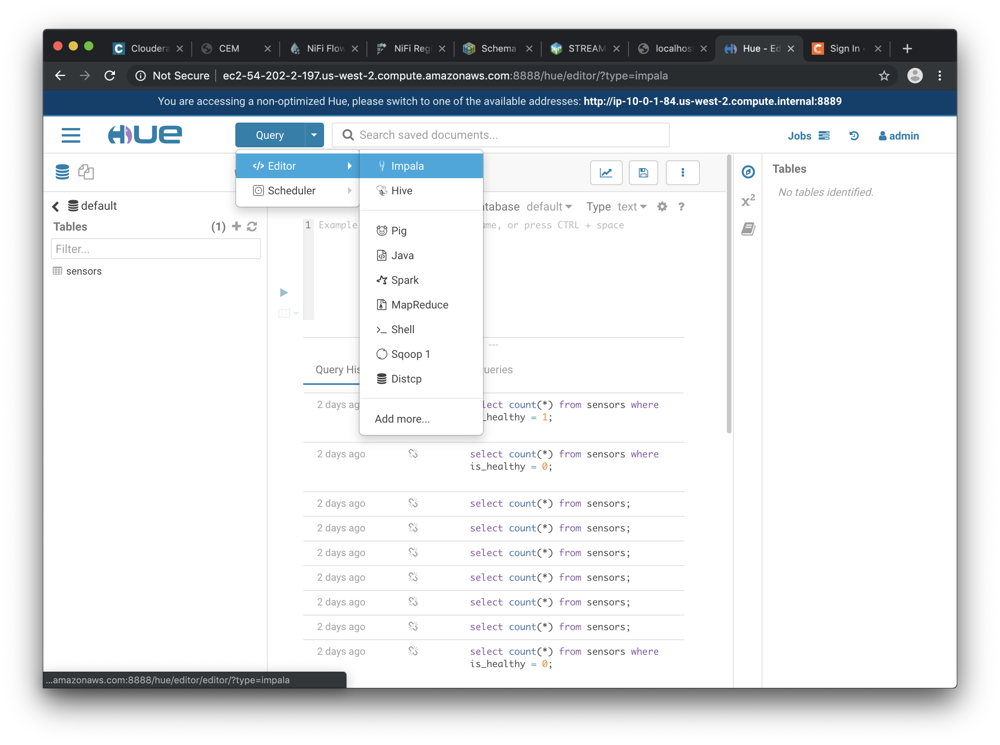

. Create the Kudu table.
+
Log in into Hue, and in the *Impala Query Editor*, run this statement:
+
[source,sql]
----
CREATE TABLE sensors
(
 sensor_id INT,
 sensor_ts BIGINT,
 sensor_0 DOUBLE,
 sensor_1 DOUBLE,
 sensor_2 DOUBLE,
 sensor_3 DOUBLE,
 sensor_4 DOUBLE,
 sensor_5 DOUBLE,
 sensor_6 DOUBLE,
 sensor_7 DOUBLE,
 sensor_8 DOUBLE,
 sensor_9 DOUBLE,
 sensor_10 DOUBLE,
 sensor_11 DOUBLE,
 is_healthy INT,
 PRIMARY KEY (sensor_id, sensor_ts)
)
PARTITION BY HASH PARTITIONS 16
STORED AS KUDU
TBLPROPERTIES ('kudu.num_tablet_replicas' = '1');
----
+
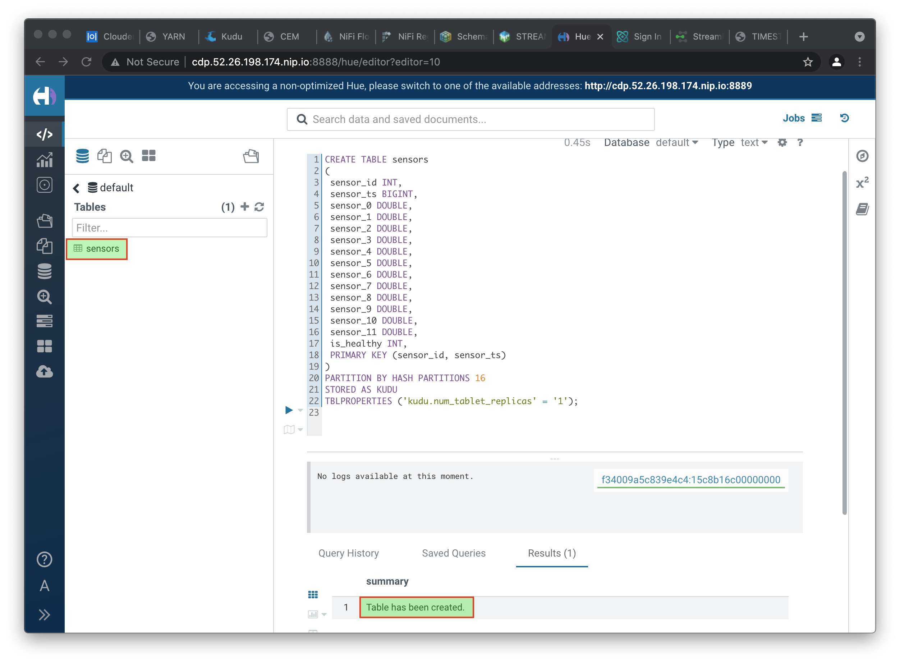

. When you create the `sensors` table in Impala, the name of the backend Kudu table created by Impala can very, depending on the exact version of you CDP cluster.
You need to know the exact name of the table to use in the configuration of the _PutKudu_ processor in the next section.
+
You can find out the name of the Kudu table in Hue's *Table Browser*.
+
Click on the *Table Browser* icon on the left-hand side and navigate to the `default` database. Click on the `sensors` table and open its *Details* tab.
+
Take note of the Kudu table name.
+
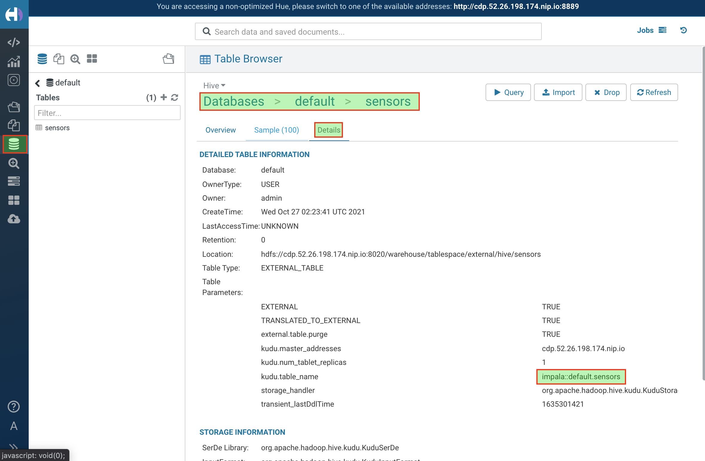

==== PutKudu processor

. Add a *PutKudu* processor to the canvas and configure it as shown below:
+
*SETTINGS* tab:
+
[source,yaml]
----
Name: Write to Kudu
----
+
*PROPERTIES* tab:
+
[source,yaml]
----
Kudu Masters:  <CLUSTER_HOSTNAME>:7051
Table Name:    <KUDU_TABLE_NAME (see previous section)>
Record Reader: JsonTreeReader - With schema identifier
----
+

. Connect the *Update health flag* processor to the *Write to Kudu* one. When prompted, check the *success* relationship for this connection.

. Connect the *Write to Kudu* to the same _Funnel_ you had created above. When prompted, check the *failure* relationship for this connection.

. Double-click on the *Write to Kudu* processor, go to the *SETTINGS* tab, check the "*success*" relationship in the *AUTOMATICALLY TERMINATED RELATIONSHIPS* section. Click *Apply*.

==== Running the flow

We're ready now to run and test our flow. Follow the steps below:

. Start all the processors in your flow.

. Refresh your NiFi page and you should see messages passing through your flow. The failure queues should have no records queued up.
+
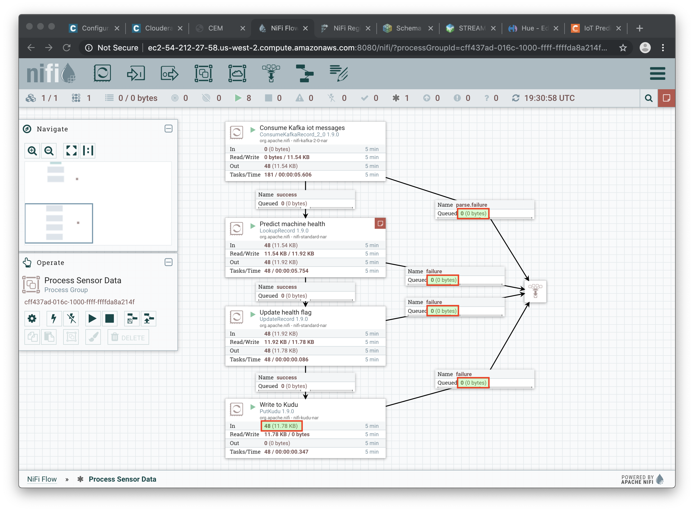

[[lab_5, Lab 5]]
== Lab 5 - Check the data on Kudu

In this lab, you will run some SQL queries using the Impala engine and verify that the Kudu table is being updated as expected.

. Login into Hue and run the following queries in the Impala Query Editor:
+
[source,sql]
----
SELECT count(*)
FROM sensors;
----
+
[source,sql]
----
SELECT *
FROM sensors
ORDER by sensor_ts DESC
LIMIT 100;
----

. Run the queries a few times \and verify that the number of sensor readings are increasing as the data is ingested into the Kudu table. This allows you to build real-time reports for fast action.
+
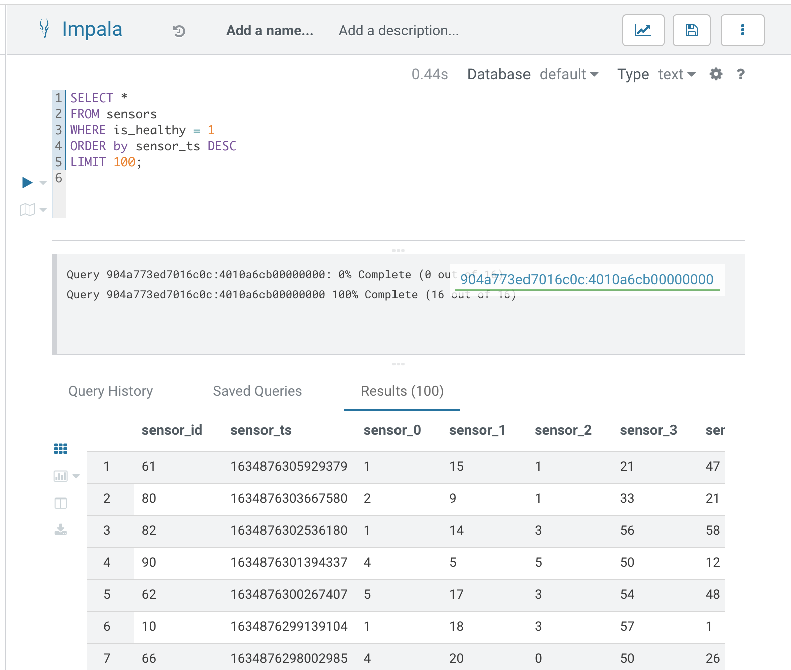

