= Querying streams with SQL

In this workshop you will use Cloudera *SQL Stream Builder* to query and manipulate data streams using SQL language. SQL Stream Builder is a powerful service that enables you to create Flink jobs without having to write Java/Scala code.

You will get data from the `iot_enriched` topic created and populated in previous labs that contains a stream of temperature sensor's data points.

== Preparation

This workshop builds upon the content developed in the link:workshop_edge.adoc[Edge] and link:workshop_nifi.adoc[Nifi] workshops.

To clean your environment and make it ready for the beginning of this lab, please SSH to your cluster host and run the following command:

NOTE: The command below will undo everything done in the cluster in previous workshops.

[source,shell]
----
/tmp/resources/reset-to-lab.sh ssb 1
----

== Labs summary

* *Lab 1* - Create a Data Provider
* *Lab 2* - Create a Table for a topic with JSON messages
* *Lab 3* - Integrate SQL Stream Builder with Schema Registry
* *Lab 4* - Computing and storing aggregation results
* *Lab 5* - Materialized Views

[[lab_1, Lab 1]]
== Lab 1 - Create a Data Provider

Let's start with a straightforward goal: to query the contents of the `iot_enriched` topic using SQL to examine the data that is being streamed.
Albeit simple, this task will show the ease of use and power of SQL Stream Builder (SSB).

Before you can start querying data from Kafka topics you need to register the Kafka clusters as _data sources_ in SSB.

. On the Cloudera Manager console, click on the Cloudera logo at the top-left corner to ensure you are at the home page and then click on the *SQL Stream Builder* service.

. Click on the *SQLStreamBuilder Console* link to open the SSB UI.

. On the logon screen, authenticate with user `admin` and password `supersecret1`.

. You will notice that SSB already has a Kafka cluster registered as a data provider, named `CDP Kafka`. This provider is created automatically for SSB when it is installed on a cluster that also has a Kafka service:
+
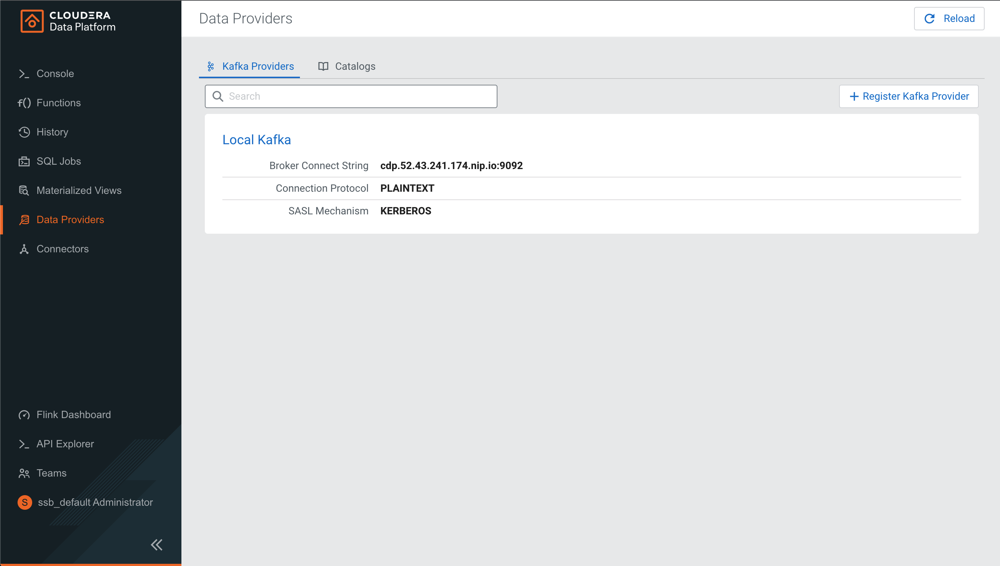

. You can use this screen to add other external Kafka clusters as data providers to SSB. In this lab you'll add a second data provider using a different host name, just to show how simple it is.

. Click on *Register Kafka Provider* and in the *Add Kafka Provider* window, enter the details for your new data source and click *Save changes*.
+
[source,yaml]
----
Name:                           edge2ai-kafka
Brokers:                        <CLUSTER_HOSTNAME>:9092
Connection protocol:            PLAINTEXT
----
+
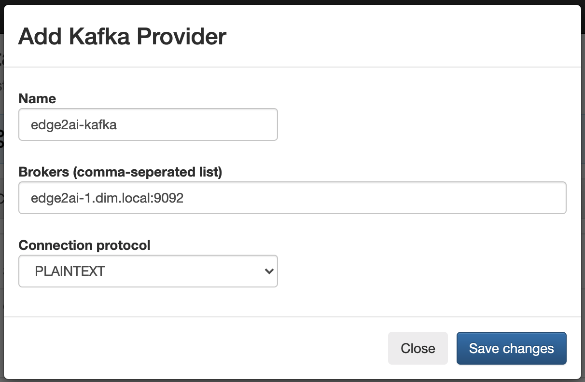

[[lab_2, Lab 2]]
== Lab 2 - Create a Table for a topic with JSON messages

Now you can _map_ the `iot_enriched` topic to a _table_ in SQL Stream Builder.
_Tables_ in SSB are a way to associate a Kafka topic with a schema so that you can use it in your SQL queries.

. To create your first Table, click on *Console* (on the left bar) *> Tables > Add table > Apache Kafka*.
+
image::images/ssb/add-table.png[width=800]

. On the *Kafka* window, enter the following information:
+
[source,yaml]
----
Virtual table name: iot_enriched
Kafka Cluster:      edge2ai-kafka
Topic Name:         iot_enriched
Data Format:        JSON
----
+
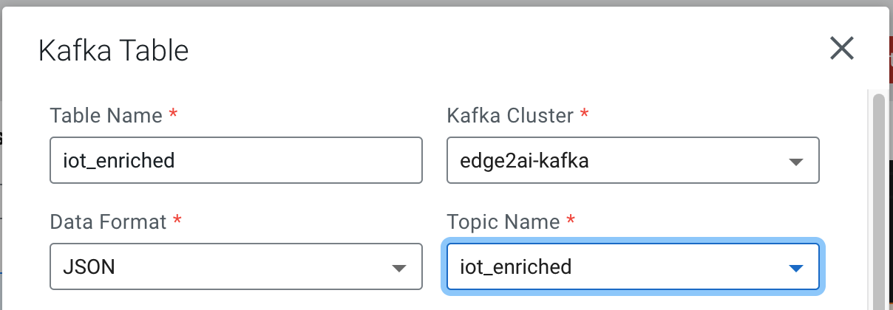

. Ensure the *Schema* tab is selected. Scroll to the bottom of the tab and click *Detect Schema*. SSB will take a sample of the data flowing through the topic and will infer the schema used to parse the content. Alternatively you could also specify the schema in this tab.
+
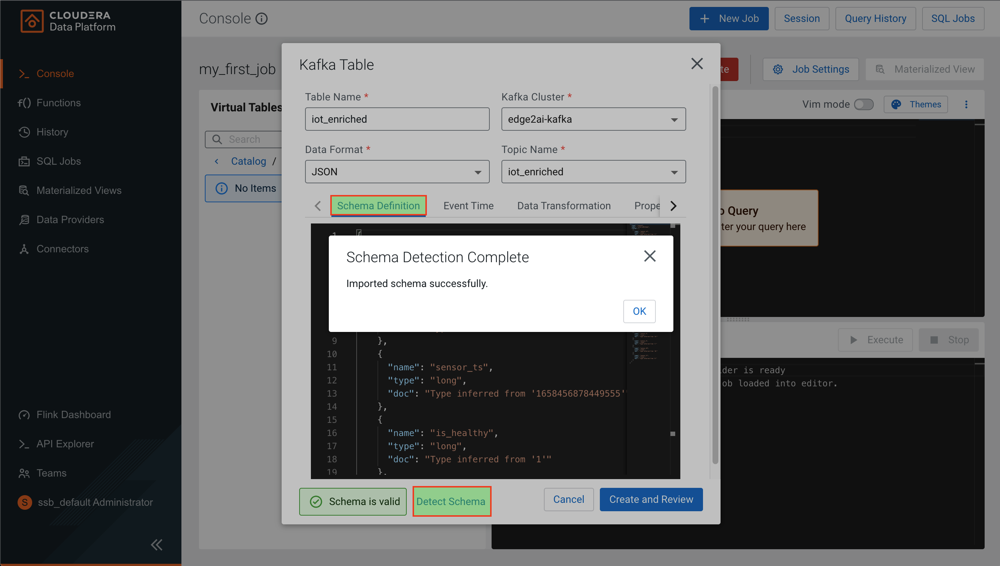

. If you need to manipulate the source data to fix, cleanse or convert some values, you can define transformations for the table.
Transformations are defined in Javascript code.
+
The serialized record read from Kafka is provided to the Javascript code in the `record` variable.
The last command of the transformation code must return the serialized content of the modified record.
+
The data in the `iot_enriched` topic has a timestamp expressed in microseconds.
You will need to convert this field to milliseconds.
Let's write a transformation to perform that conversion for us.
+
Click on the *Transformations* tab and enter the following code in the *Code* field:
+
[source,javascript]
----
// parse the JSON record
var parsedVal = JSON.parse(record.value);
// Convert sensor_ts from micro to milliseconds
parsedVal['sensor_ts'] = Math.round(parsedVal['sensor_ts']/1000);
// serialize output as JSON
JSON.stringify(parsedVal);
----
+
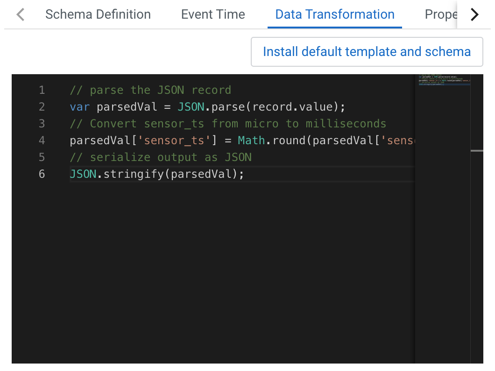

. Now that you have converted the `sensor_ts` field to milliseconds, you can tell SSB to use it as a source for the event time, which is the time that will be used for defining aggregation windows for your queries.
+
To do this, click on the *Event Time* tab and configure the following properties:
+
[source]
----
Use Kafka Timestamps:   Uncheck it
Input Timestamp Column: sensor_ts
Event Time Column:      event_time
Watermark Seconds:      3
----
+
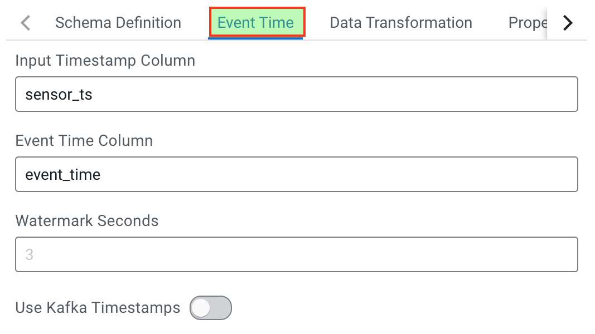
+
This will add the `event_time` column to the table. This column has a `TIMESTAMP ROWTIME` data type and is derived from the value of the `sensor_ts` column.

. Click on the *Properties* tab, enter the following value for the *Consumer Group* property and click *Save changes*.
+
[source,yaml]
----
Consumer Group: ssb-iot-1
----
+
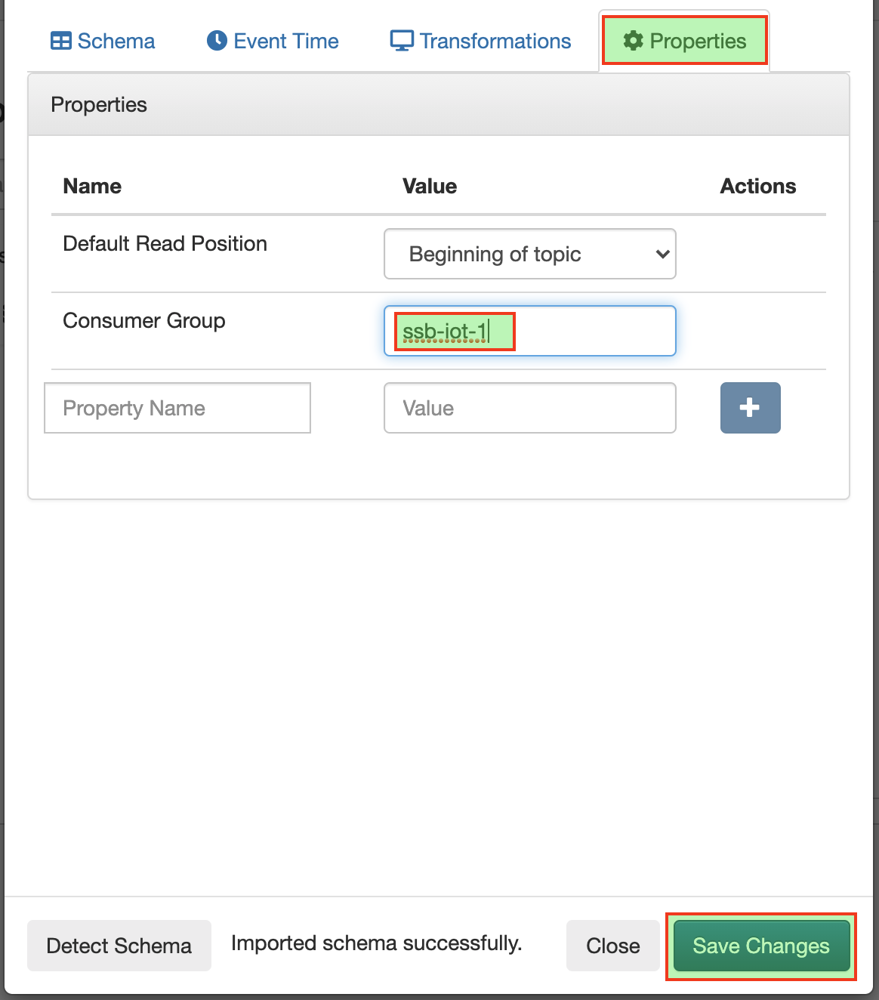
+
NOTE: Setting the *Consumer Group* properties for a virtual table will ensure that if you stop a query and restart it later, the second query execute will continue to read the data from the point where the first query stopped, without skipping data. *However*, if _multiple queries_ use the same virtual table, setting this property will effectively distribute the data across the queries so that each record is only read by a single query. If you want to share a virtual table with multiple distinct queries, ensure that the Consumer Group property is unset.

. Let's query the newly created table to ensure things are working correctly. Click on *>_Console > Compose > SQL* and type the following query:
+
[source,sql]
----
SELECT
  event_time,
  sensor_id,
  sensor_ts,
  is_healthy,
  sensor_0,
  sensor_1
FROM
  iot_enriched
----

. Click on *Execute*. After a few seconds you should see the data from the topic displayed on the *Results* panel:
+
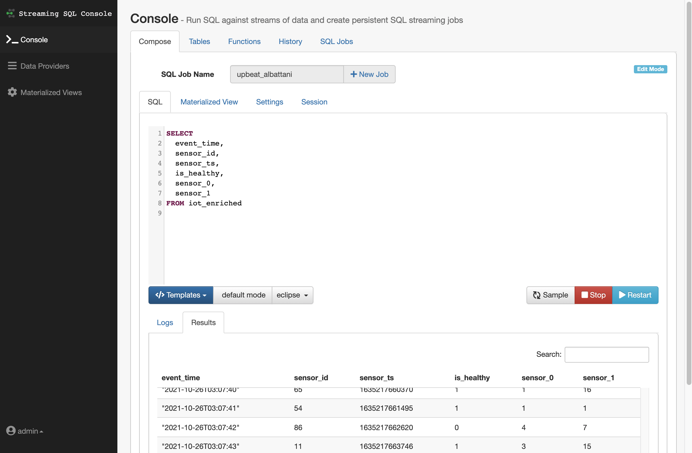

. Click *Stop* to stop the job and release all the cluster resources used by the query.
You can double-check that all queries/jobs have been stopped by clicking on the *SQL Jobs* tab.
If any jobs are still running, you can stop them from that page.

[[lab_3, Lab 3]]
== Lab 3 - Integrate SQL Stream Builder with Schema Registry

The SQL Stream Builder's integration with Schema Registry automatically exposes the schemas stored in the registry as tables in SSB.
The schema names in Schema Registry _must match the corresponding topic names_ in Kafka.

In this lab you will register Schema Registry as a catalog in SSB so that you can automatically read the contents of the `iot_enriched_avro` topic, which is stored in AVRO format.

. Go to the following URL, which contains the schema definition for the data in the `iot_enriched_avro` topic.
Select and copy the contents of the page.
+
`link:https://raw.githubusercontent.com/cloudera-labs/edge2ai-workshop/master/sensor.avsc[https://raw.githubusercontent.com/cloudera-labs/edge2ai-workshop/master/sensor.avsc, window="_blank"]`

. In the Schema Registry Web UI, click the `+` sign to register a new schema.

. Click on a blank area in the *Schema Text* field and paste the contents you copied.

. Complete the schema creation by filling the following properties and save the schema.
+
[source]
----
Name:          iot_enriched_avro
Description:   Schema for the data in the iot_enriched_avro topic
Type:          Avro schema provider
Schema Group:  Kafka
Compatibility: Backward
Evolve:        checked
----
+
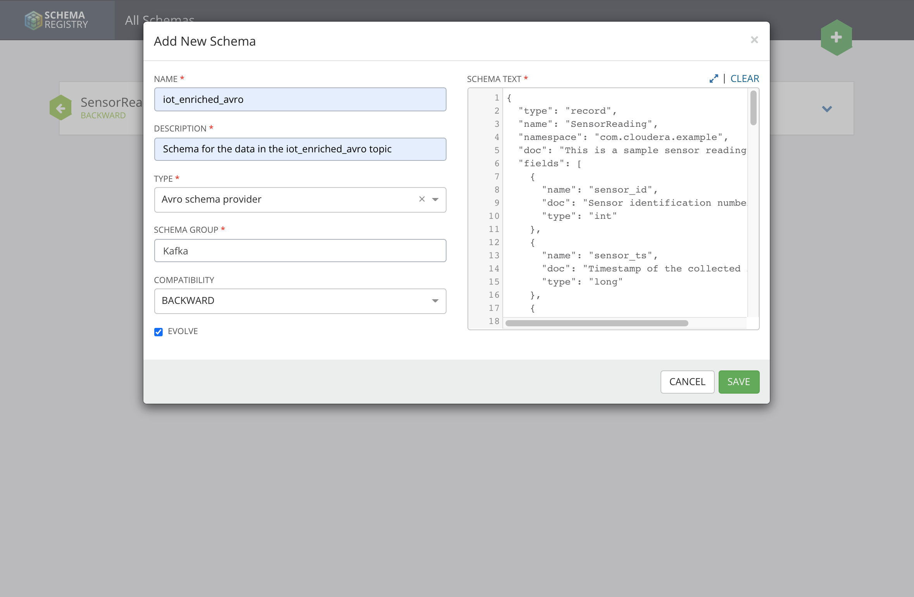

. Back on the SQL Stream Builder page, click on *Data Providers* (on the left bar) *> (+) Register Catalog*.
+
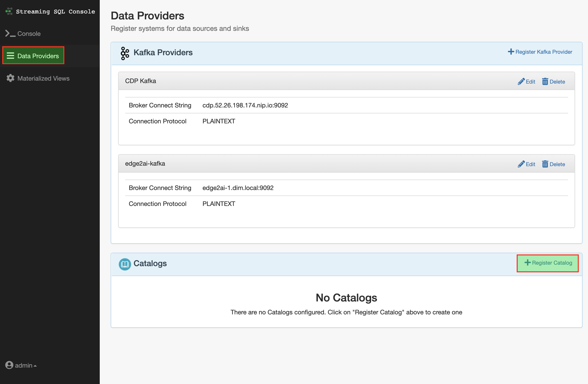

. In the *Add Catalog* screen, enter the following details:
+
[source]
----
Name:                sr
Catalog Type:        Schema Registry
Kafka Cluster:       edge2ai-kafka
Schema Registry URL: http://<CLUSTER_HOSTNAME>:7788/api/v1
Enable TLS:          No
----

. Click on the *Add Filter* button and enter the following configuration for the filter:
+
[source]
----
Database Filter: .*
Table Filter:    iot.*
----

. Click on *Validate*. If the configuration is correct you should see the message "Validation was successful, 1 table found."
+
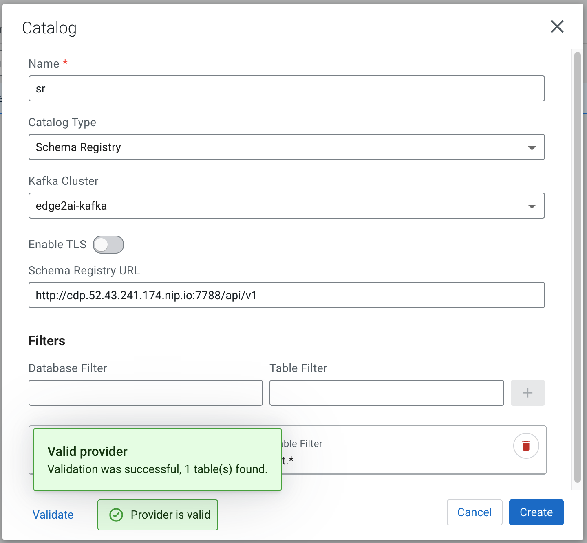

. Click on *Add Tables*.

. On the *Tables* screen you should see now the list of tables that were imported from Schemar Registry.
+
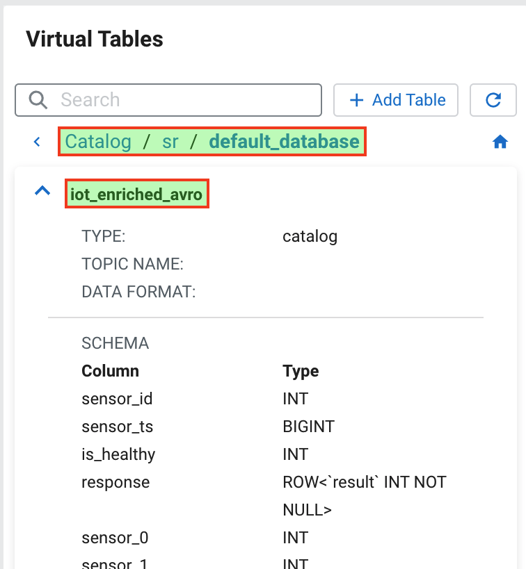

. Query the imported table to ensure it is working correctly.
+
Click on *>_Console > Compose > SQL* and type the following query:
+
[source,sql]
----
SELECT *
FROM `sr`.`default_database`.`iot_enriched_avro`
----

. Click on *Execute*. After a few seconds you should see the data from the topic displayed on the *Results* panel.

. Click *Stop* to stop the job and release all the cluster resources used by the query.
You can double-check that all queries/jobs have been stopped by clicking on the *SQL Jobs* tab.
If any jobs are still running, you can stop them from that page.

[[lab_4, Lab 4]]
== Lab 4 - Computing and storing aggregation results

Now that you have already run a few basic queries and confirmed that your tables are working correctly,
you want to start computing aggregates for your incoming data stream and make the results available
for downstream applications.

SQL Stream Builder's Tables give us the ability to publish/store streaming data to several different services (Kafka, AWS S3, Google GCS, Kudu, HBase, etc...).

In this lab you'll use another Kafka table to publish the results of your aggregation to another Kafka topic.

. Let's first create a topic (`sensor6_stats`) where to publish your aggregation results:
.. Navigate to the SMM UI (*Cloudera Manager > SMM* service *>
Streams Messaging Manager Web UI*).
.. On the SMM UI, click the *Topics* tab ().
.. Click the *Add New* button.
.. Enter the following details for the topic and click *Save* when ready:
... Topic name: `sensor6_stats`
... Partitions: `10`
... Availability: `Low`
... Cleanup Policy: `delete`

. On the SSB UI, click on *Console* (on the left bar) *> Compose > SQL*.

. Enter `Sensor6Stats` for the *SQL Job Name* field.

. In the *SQL* box type the query shown below.
+
This query will compute aggregates over 30-seconds windows that slide forward every second. For a specific sensor value in the record (`sensor_6`) it computes the following aggregations for each window:
+
--
* Number of events received
* Sum of the `sensor_6` value for all the events
* Average of the `sensor_6` value across all the events
* Min and max values of the `sensor_6` field
* Number of events for which the `sensor_6` value exceeds `70`
--
+
[source,sql]
----
INSERT INTO sensor6stats
SELECT
  sensor_id as device_id,
  HOP_END(event_time, INTERVAL '1' SECOND, INTERVAL '30' SECOND) as windowEnd,
  count(*) as sensorCount,
  sum(sensor_6) as sensorSum,
  avg(cast(sensor_6 as float)) as sensorAverage,
  min(sensor_6) as sensorMin,
  max(sensor_6) as sensorMax,
  sum(case when sensor_6 > 70 then 1 else 0 end) as sensorGreaterThan60
FROM iot_enriched
GROUP BY
  sensor_id,
  HOP(event_time, INTERVAL '1' SECOND, INTERVAL '30' SECOND)
----
+
image::images/ssb/sql-aggregation.png[width=800]

. Before you can execute this query, though, the `sensor6stats` table must be created in SSB, mapping it to the `sensor6_stats` Kafka topic.
+
Since we want the topic format to be JSON, click on *Templates > cdp-kafka > JSON*.
+
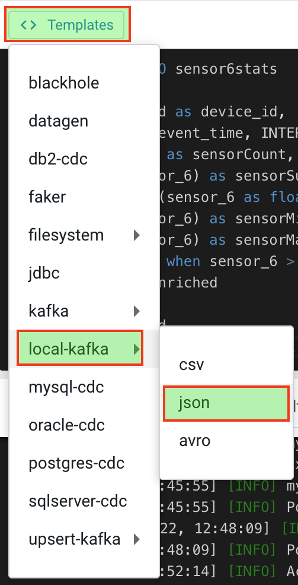
+
This will prepend a `CREATE TABLE` DDL to the SQL script to create a table that matches the structure of your query!
+
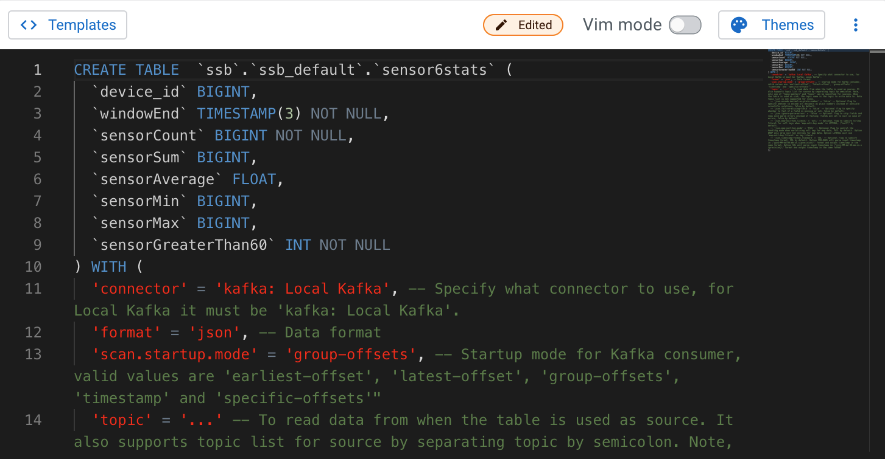

. Most of the table properties are already filled in for you. But there's one you must edit before you execute the statement: the `topic` property.
+
Edit the DDL statement and replace the `...` value of the `topic` property with the actual topic name: `sensor6_stats`.
+
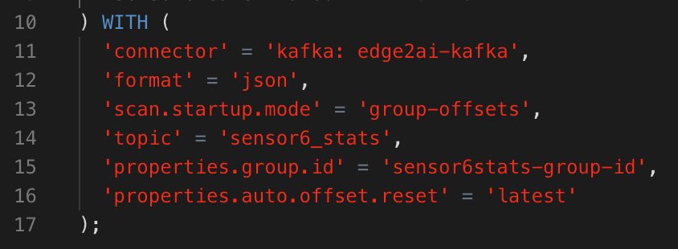

. Click *Execute*.

. Scroll to the bottom of the page and you will see the log messages generated by your query execution.
+
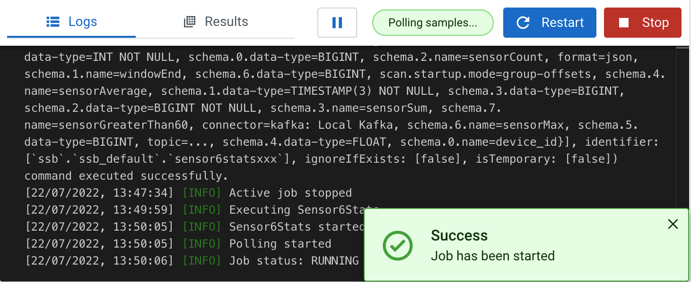

. After a few seconds the SQL Console will start showing the results of your aggregation query.
+
Note that the data displayed on the screen is only a sample of the data returned by the query, not the full data.
+
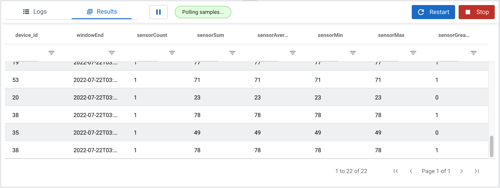

. Check the job execution details and logs by clicking on *Console* (on the left bar) *> SQL Jobs* tab. Explore the options on this screen:
+
--
.. Click on the `Sensor6Stats` job.
.. Click on the *Details* tab to see job details.
.. Click on the *Log* tab to see log messages generated by the job execution.
--
+
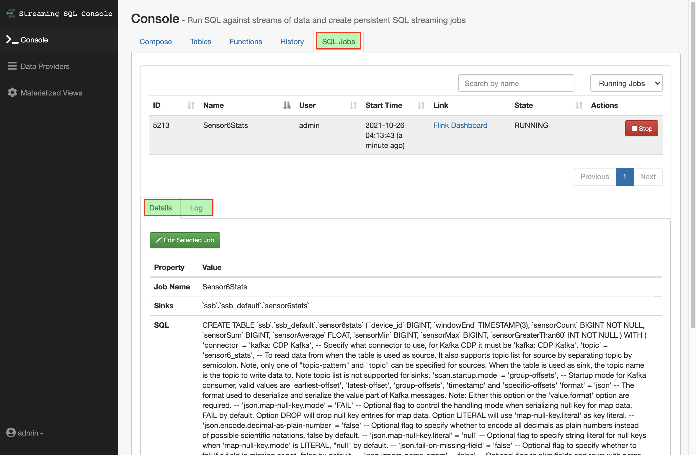

. Click on the *Flink Dashboard* link to open the job's page on the dashboard. Navigate the dashboard pages to explore details and metrics of the job execution.
+
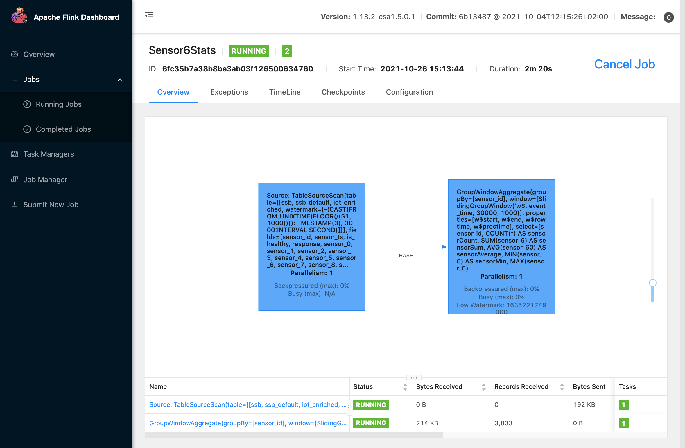

. Let's query the `sensor6_stats` topic to examine the data that is being written to it.
You already created the `sensor6stats` table and mapped it to that topic in a previous step, using the `CREATE TABLE` DDL.
+
Now you only need to query the same table.
+
Back in the SSB UI, click on *New job* to clear the SQL Compose field.
+
NOTE: The `Sensor6Stats` job will continue to run in the background. You can monitor and manage it through the *SQL Jobs* page.
+
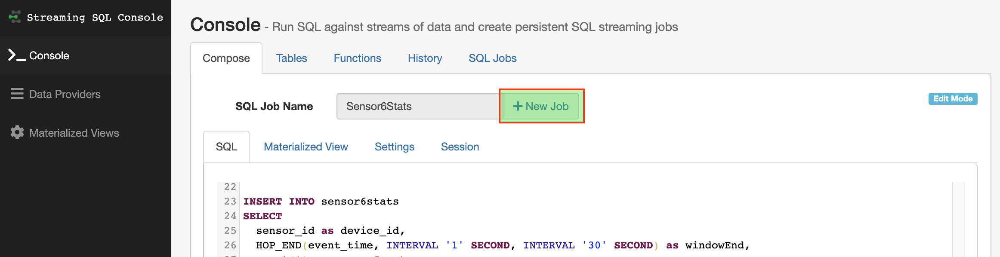

. Enter the following query in the SQL field and execute it:
+
[source,sql]
----
SELECT *
FROM sensor6stats
----

. After a few seconds you should see the contents of the `sensor6_stats` topic displayed on the screen:
+
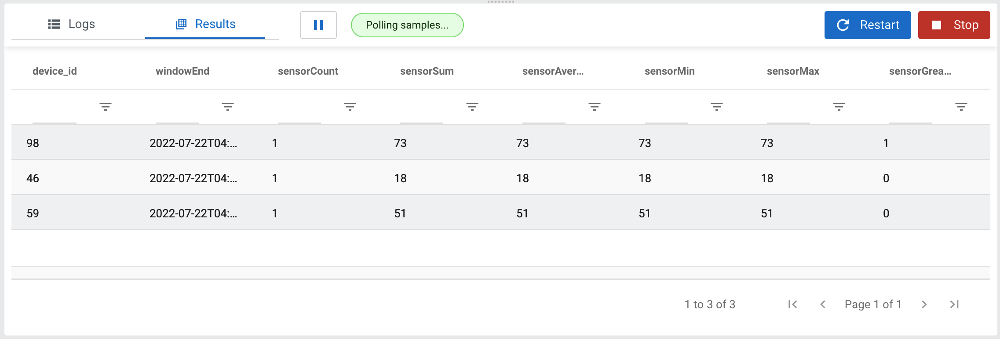

. You will need to leave the `Sensor6Stats` job running to use it in the next lab. Make sure you stop all other jobs to release cluster resources.
+
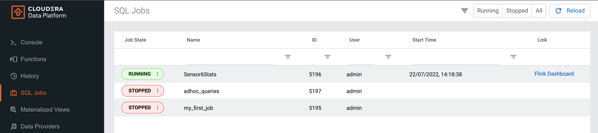

[[lab_5, Lab 5]]
== Lab 5 - Materialized Views

SQL Stream Builder can also take keyed snapshots of the data stream and make that available through a REST interface in the form of Materialized Views.
In this lab you'll create and query Materialized Views (MV).

You will define MVs on top of the query you created in the previous lab. Make sure that query is running before executing the steps below.

. On the *Console_ > SQL Jobs* tab, verify that the `Sensor6Stats` job is running. Select the job and click on the *Edit Selected Job* button.
+
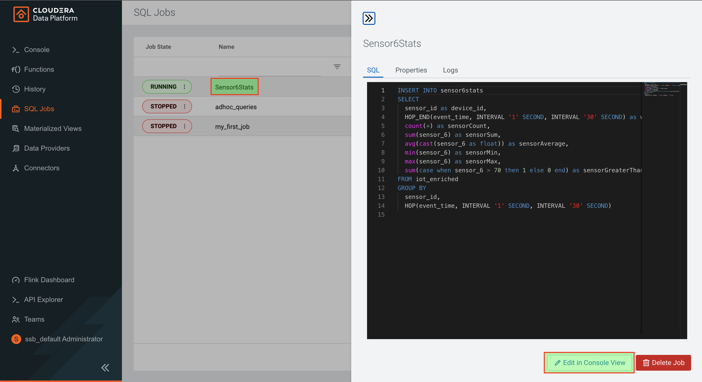

. In order to add Materialized Views to a query the job needs to be stopped.
On the job page, click the *Stop* button to pause the job.
+
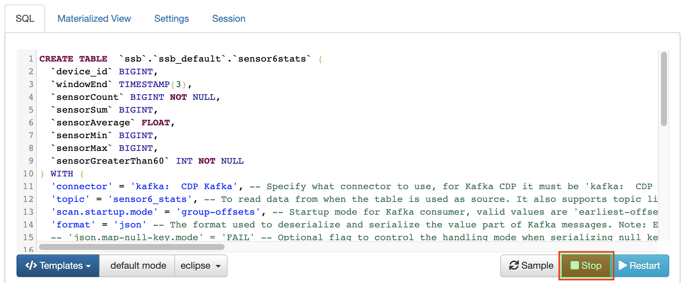

. Since you already created the `sensor6stats` table in the first execution of this job, you will not need the `CREATE TABLE` statement anymore.
In fact, if you try to run the job again with the `CREATE TABLE` statement in it, it will fail since the table already exists.
+
Edit the SQL Compose field to remove the entire `CREATE TABLE` statement.
The only thing left in that field should be the actual `INSERT ... SELECT` statement, as shown below:
+
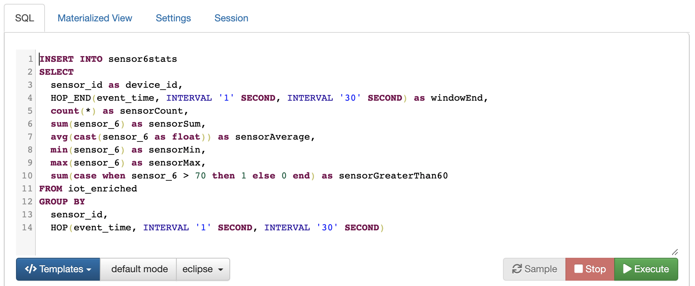

. Click on the *Materialized View* tab and set the following properties:
+
[source,python]
----
Materialized View:     Enabled
Primary Key:           device_id
Retention:             300
Ignore NULLs:          Yes
----
+
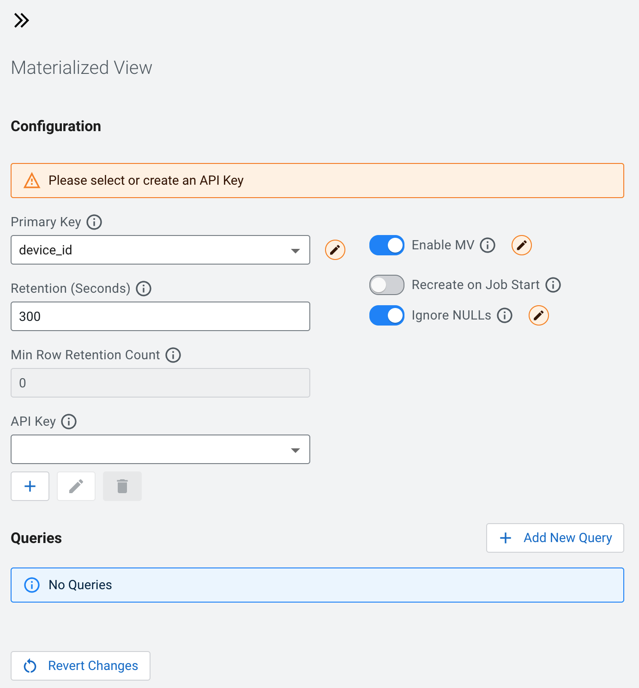

. To create a MV you need to have an API Key.
The API key is the information given to clients so that they can access the MVs.
If you have multiple MVs and want them to be accessed by different clients you can have multiple API keys to control access to the different MVs.
+
If you have already created an API Key in SSB you can select it from the drop-down list.
Otherwise, create one on the spot by clicking on the *Add API Key* button shown above.
Use `ssb-lab` as the Key Name.

. Click *Add Query* to create a new MV.
You will create a view that shows all the devices for which `sensor6` has had at least 1 reading above 60 in the last recorded 30-second window.
For this, enter the following parameters in the MV Query Configuration page:
+
[source,python]
----
URL Pattern:   above60
Query Builder: <click "Select All" to add all columns>
Filters:       sensorGreatThan60  greater  0
----
+
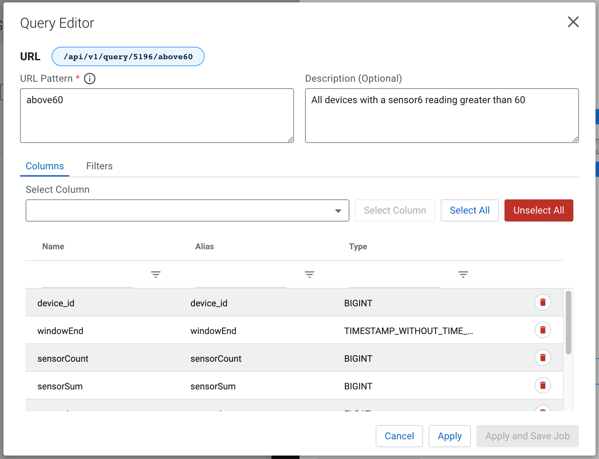

. Click *Save Changes*.

. Go back to the *SQL* tab and click on *Execute* to start the job.

. On the *Materialized Views* tab, copy the new MV URL that's shown on the screen and open it in a new browser tab (or simply click on the URL link).
You will see the content of the MV current snapshot.
+
If you refresh the page a few times you will notice that the MV snapshot is updated as new data points are coming through the stream.
+
SSB keeps the last state of the data for each value of the defined primary key.
+
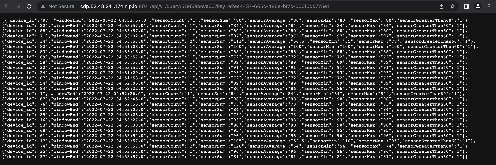

==== Materialized View with parameters

The MV you created above takes no parameters; it always returns the full content of the MV when you call the REST endpoint.
It is possible to specify parameters for a MV so that you can filter the contents at query time.

In this section you will create a new MV that allows filtering by specifying a range for the `sensorAverage` column.

. First, stop the job again so that you can add another MV.

. On the *Materialized Views* tab, click on the *Add Query* button to create a new MV, enter the following parameter and click *Save Changes*.
+
[source,python]
----
URL Pattern:   above60withRange/{lowerTemp}/{upperTemp}
Query Builder: <click "Select All" to add all columns>
Filters:       sensorGreatThan60  greater           0
               AND
               sensorAverage      greater or equal  {lowerTemp}
               AND
               sensorAverage      less or equal     {upperTemp}
----
+
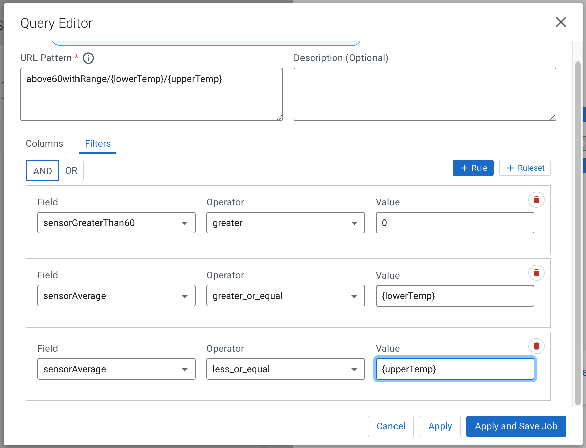

. You will notice that the new URL for this MV has placeholders for the `{lowerTemp}` and `{upperTemp}` parameters:
+
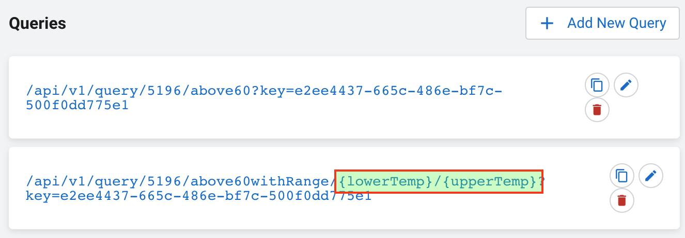

. Go back to the *SQL* tab and execute the job again.

. Click on the *Materialize Views* tab, and click on the link for the MV that you just created.
+
Since there are parameters in this MV's URL, instead of redirecting you directly to another browser tab, SSB ask for the parameters values first.
Enter the lower and upper bounds for the temperature range you want to query, and press *Go*:
+
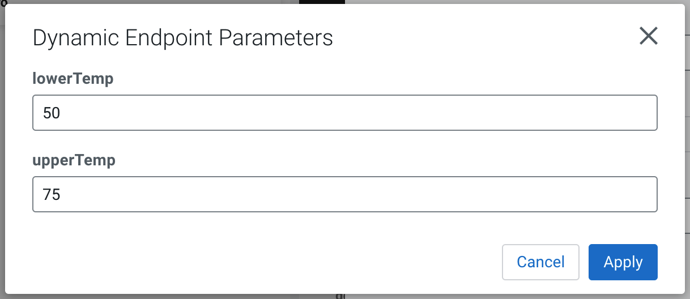

. Verify that the values of the `sensorAverage` field in the MV must all be within the range you specified.

. Try changing the value range to verify that the filter is working as expected.

. Once you have finished the lab, click on the *SQL Jobs* tab and stop all your jobs to release cluster resources.

== Conclusion

You have now taken data from one topic, calculated aggregated results and written these to another topic.
In order to validate that this was successful you have selected the result with an independent select query.
Finally, you created Materialized Views for one of your jobs and queried those views through their REST endpoints.

